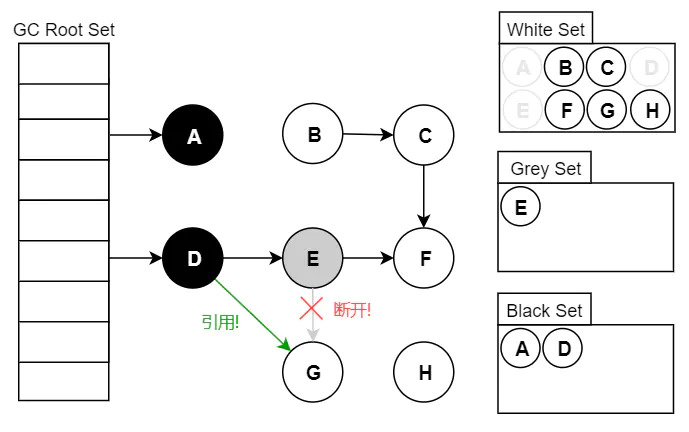
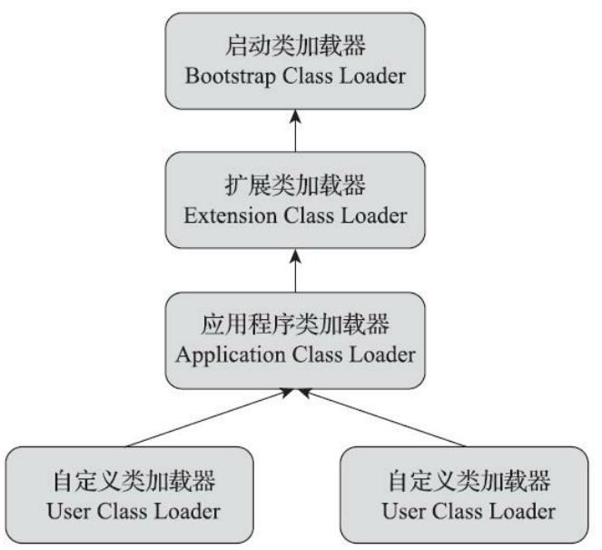
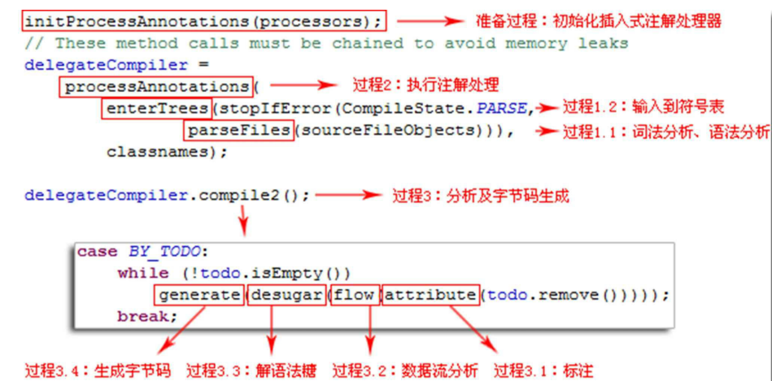

+ JVM文档：https://docs.oracle.com/javase/specs/index.html

# 基本

+ 对象头：
  
  + 
  
+ 字符串常量池：https://blog.csdn.net/soonfly/article/details/70147205

  + 在 HotSpotVM 里实现的 string-pool 功能的是一个 StringTable 类，它是一个 Hash 表，默认值大小长度是 1009 ；这个 StringTable 在每个 HotSpot-VM 的实例中只有一份，被所有的类共享。字符串常量由一个一个字符组成，放在了 StringTable 上。在 JDK6 中，StringTable 的长度是固定的，长度就是 1009，因此如果放入 String Pool 中的 String 非常多，就会造成 hash 冲突，导致链表过长，当调用 String#intern() 时会需要到链表上一个一个找，从而导致性能大幅度下降。在 JDK7 中，StringTable 的长度可以通过参数指定：-XX:StringTableSize=66666。

  + new String都是在堆上创建字符串对象。当调用 intern() 方法时，编译器会将字符串添加到常量池中（stringTable维护），并返回指向该常量的引用

  + 通过字面量赋值创建字符串（如：String str=”twm”）时，会先在常量池中查找是否存在相同的字符串，若存在，则将栈中的引用直接指向该字符串；若不存在，则在常量池中生成一个字符串，再将栈中的引用指向该字符串

  + 常量字符串的“+”操作，编译阶段直接会合成为一个字符串。如string str=”JA”+”VA”，在编译阶段会直接合并成语句String str=”JAVA”，于是会去常量池中查找是否存在”JAVA”,从而进行创建或引用

  + 对于final字段，编译期直接进行了常量替换（而对于非final字段则是在运行期进行赋值处理的）

  + 常量字符串和变量拼接时（如：String str3=baseStr + “01”;）会调用stringBuilder.append()在堆上创建新的对象

  + JDK 1.7后，intern方法还是会先去查询常量池中是否有已经存在，如果存在，则返回常量池中的引用，这一点与之前没有区别，区别在于，如果在常量池找不到对应的字符串，则不会再将字符串拷贝到常量池，而只是在常量池中生成一个对原字符串的引用。简单的说，就是往常量池放的东西变了：原来在常量池中找不到时，复制一个副本放到常量池，1.7后则是将在堆上的地址引用复制到常量池。 

  + ```java
    有了对以上的知识的了解，我们现在再来看常见的面试或笔试题就很简单了：
    // Q：下列程序的输出结果：
    String s1 = “abc”;
    String s2 = “abc”;
    System.out.println(s1 == s2);
    // A：true，均指向常量池中对象。
    
    // Q：下列程序的输出结果：
    String s1 = new String(“abc”);
    String s2 = new String(“abc”);
    System.out.println(s1 == s2);
    // A：false，两个引用指向堆中的不同对象。
    
    // Q：下列程序的输出结果：
    String s1 = “abc”;
    String s2 = “a”;
    String s3 = “bc”;
    String s4 = s2 + s3;
    System.out.println(s1 == s4);
    // A：false，因为s2+s3实际上是使用StringBuilder.append来完成，会生成不同的对象。
    
    // Q：下列程序的输出结果：
    String s1 = “abc”;
    final String s2 = “a”;
    final String s3 = “bc”;
    String s4 = s2 + s3;
    System.out.println(s1 == s4);
    // A：true，因为final变量在编译后会直接替换成对应的值，所以实际上等于s4=”a”+”bc”，而这种情况下，编译器会直接合并为s4=”abc”，所以最终s1==s4。
    
    // Q：下列程序的输出结果：
    String s = new String(“abc”);
    String s1 = “abc”;
    String s2 = new String(“abc”);
    System.out.println(s == s1.intern());
    System.out.println(s == s2.intern());
    System.out.println(s1 == s2.intern());
    // A：false，false，true。
    ```
    
  + 同时由于Java class文件常量池的规定，String的长度必须小于2^16-1，否则无法完成编译，但是对于运行时字符串的长度只要不超过int的范围就行。

    ```shell
    # 字符串类型在常量池中的定义
    CONSTANT_String_info {
        u1 tag;
        u2 string_index;
    }
    
    CONSTANT_Utf8_info {
        u1 tag;
        u2 length; # 这个length限制了String的大小，class常量池中一个u2代表2个字节。
        u1 bytes[length];
    }
    ```

    

+ `<clinit>`和`<linit>`方法区别：`<clinit>`发生在类初始化阶段，由编译器自动生成，会**进行静态代码块的语句，以及类静态成员变量的赋值**。`<linit>`发生在对象初始化阶段，会进行**类非类静态次元变量的赋值**。

# Java内存区域

## 运行时数据区域


### 程序计数器

+ 线程私有
+ 程序计数器是⼀块᫾⼩的内存空间，可以看作是当前线程所执⾏的字节码的⾏号指示器。字节码解释器⼯作时通过改变这个计数器的值来选取下⼀条需要执⾏的字节码指令，分⽀、循环、跳转、异常处理、线程恢复等功能都需要依赖这个计数器来完成。
+ 另外，为了线程切换后能恢复到正确的执⾏位置，每条线程都需要有⼀个独⽴的程序计数器，各线程之间计数器互不影响，独⽴存储，我们称这类内存区域为“线程私有”的内存
+ 如果执行的是虚拟机字节码，则计数器记录的是指令的地址；如果是Native方法，则为空
+ 程序计数器是唯一一个不会出现`OutOfMemoryError`的内存区域

## Java虚拟机栈

+ 线程私有
+ Java虚拟机栈描述的是Java方法执行的内存模型。每个方法执行的同时会创建一个栈帧（⽽每个栈帧中都拥有：局部变量表、操作数栈、动态链接、⽅法出⼝信息。）。对于我们来说，主要关注的stack栈内存，就是虚拟机栈中局部变量表部分。
+ Java虚拟机栈也是线程私有的，它的生命周期与线程相同（随线程而生，随线程而灭）
+ 异常：
  + 如果线程请求的栈深度大于虚拟机所允许的深度，将抛出`StackOverflowError`异常；
  + 如果虚拟机栈可以动态扩展，如果扩展时无法申请到足够的内存，就会抛出`OutOfMemoryError`异常

## 本地方法栈

+ 线程私有
+ 本地方法栈和Java虚拟机栈类似，区别在于本地方法栈是为Native方法服务
+ 会抛出`StackOverflowError`和`OutOfMemoryError`

## Java堆

+ 线程共享
+ Java堆是被所有线程共享的一块内存区域，在虚拟机启动的时候创建。唯一的目的是用来存放对象实例，Java⼏乎所有的对象实例以及数组都在这⾥分
  配内存
+ Java堆可以处于物理上不连续的内存空间中，但是逻辑上它应该被看作是连续的
+ Java对可以通过-Xmx，-Xms设定
+ JDK7及之前堆中分为：新生代、老年代、永久代三个部分。而在8及其之后被元空间取代了。
+ 异常：
  + `OutOfMemoryError: GC Overhead Limit Exceeded `： 当JVM花太多时间执⾏垃圾回收并且只能回收很少的堆空间时，就会发⽣此错误。
  + ` java.lang.OutOfMemoryError: Java heap space` :假如在创建新的对象时, 堆内存中的空间不⾜以存放新创建的对象, 就会引发 java.lang.OutOfMemoryError: Java heap space 错误。(和本机物理内存⽆关，和你配置的内存⼤⼩有关！)

## 方法区

+ 线程共享
+ 用于存储已被虚拟机加载的类型信息、常量、静态变量、即时编译器编译后的代码缓存等数据。虽然 Java 虚拟机规范把⽅法区描述为堆的⼀个逻辑部分，但是它却有⼀个别名叫做 Non-Heap（⾮堆），⽬的应该是与 Java 堆区分开来。
+ 《Java 虚拟机规范》只是规定了有⽅法区这么个概念和它的作⽤，并没有规定如何去实现它。那么，在不同的 JVM 上⽅法区的实现肯定是不同的了。 ⽅法区和永久代的关系很像Java 中接⼝和类的关系，类实现了接⼝，⽽永久代就是 HotSpot 虚拟机对虚拟机规范中⽅法区的⼀种实现⽅式。 也就是说，永久代是 HotSpot 的概念，⽅法区是 Java 虚拟机规范中的定义，是⼀种规范，⽽永久代是⼀种实现，⼀个是标准⼀个是实现，其他的虚拟机实现并没有永久代这⼀说法。
+ JDK8以后方法区移动到了直接内存。
  + 类型信息移动到了本地内存（包括运行时常量池）
  + 常量和静态变量移动到了Java堆。

### 运行时常量池

+ 用于存放编译期生成的各种字面量和符号引用，这部分内容在类加载后存放到方法区的运行时常量池中。方法区中的一部分
+ 方法区取消后的运行时常量池：
  + JDK1.7之前运⾏时常量池逻辑包含字符串常量池存放在⽅法区, 此时hotspot虚拟机对⽅法区的实现为永久代
  + JDK1.7 字符串常量池被从⽅法区拿到了堆中, 这⾥没有提到运⾏时常量池,也就是说字符串常量池被单独拿到堆,运⾏时常量池剩下的东⻄还在⽅法区, 也就是hotspot中的永久代 。
  + JDK1.8 hotspot移除了永久代⽤元空间(Metaspace)取⽽代之, 这时候字符串常量池还在堆, 运⾏时常量池还在⽅法区, 只不过⽅法区的实现从永久代变成了元空间(Metaspace)
+ 常量池不一定只有编译器才能产生，运行期间也可以将常量放入池中

## 元空间

+ 元空间并不在虚拟机中，而是使用本地内存。因此，默认情况下，元空间的大小仅受本地内存限制

+ MetaSpace 主要由 Klass Metaspace 和 NoKlass Metaspace 两大部分组成。
  + **Klass MetaSpace：** 就是用来存 Klass 的，就是 Class 文件在 JVM 里的运行时数据结构，这部分默认放在 Compressed Class Pointer Space 中，是一块连续的内存区域，紧接着 Heap。Compressed Class Pointer Space 不是必须有的，如果设置了 `-XX:-UseCompressedClassPointers`，或者 `-Xmx` 设置大于 32 G，就不会有这块内存，这种情况下 Klass 都会存在 NoKlass Metaspace 里。
  + **NoKlass MetaSpace：** 专门来存 Klass 相关的其他的内容，比如 Method，ConstantPool 等，可以由多块不连续的内存组成。虽然叫做 NoKlass Metaspace，但是也其实可以存 Klass 的内容，上面已经提到了对应场景。

## 直接内存

+ 直接内存并不是虚拟机运⾏时数据区的⼀部分，也不是虚拟机规范中定义的内存区域，但是这部分内存也被频繁地使⽤。⽽且也可能导致` OutOfMemoryError` 错误出现。
+ JDK1.4 中新加⼊的 NIO(New Input/Output) 类，引⼊了⼀种基于通道（Channel） 与缓存区（Buffer） 的 I/O ⽅式，它可以直接使⽤ Native 函数库直接分配堆外内存，然后通过⼀个存储在 Java 堆中的 DirectByteBuffer 对象作为这块内存的引⽤进⾏操作。这样就能在⼀些场景中显著提⾼性能，因为避免了在 Java 堆和 Native 堆之间来回复制数据。
+ 本机直接内存的分配不会受到 Java 堆的限制，但是，既然是内存就会受到本机总内存⼤⼩以及处理器寻址空间的限制。

# HotSpot虚拟机对象

## 对象的创建

+ 当虚拟机遇到new时，首先检查这个指令的参数是否能在常量池中定位到一个类的符号引用，并且检查引用代表的类是否已经被加载、解析和初始化过。如果没有那么先执行类加载的过程
+ 为对象分配空间，两种分配方式：指针碰撞和空闲列表，由Java堆是否规整决定，Java堆是否规整取决于垃圾收集器是否带有空间压缩的能力。在内存分配的时候也有可能出现并发线程不安全（给对象A分配内存，指针还没来得及修改，对象B又同时使用原来的指针来分配内存）。有两种及解决方案。采用CAS来分配或给某个线程一小块内存（本地线程分配缓冲，Thread Local Allocation Buffer）让其在自己的内存中分配。是否使用TLAB通过-XX：+/-UseTLAB来设定
  + 分配方式
    + 指针碰撞：
    +  适用场景：堆内存规整的情况下
      +  分配方式：分配一段连续的空间。相当于操作系统的静态重定位。
      +  GC收集器：Serial、ParNew
    + 空闲列表：
      +  使用场景：堆内存不规整的情况下
      +  分配方式：维护一个列表记录那些内存块可用，找到一块足够大的空间划分给对象实例，并更新列表上的记录。相当于操作系统的动态重定位。
      +  GC收集器：CMS
  + 线程安全保证：
    + CAS：采用CAS进行分配
    + TLAB（Thread Local Allocation Buffer：线程本地分配缓存）：为每一个线程预先在Eden分配一块内存，分配内存时，首先在TLAB中分配，如果满了的话，再使用CAS进行内存分配。
+ 将内存空间（不包括对象头）都初始化为零。保证对象在Java中不用赋值初始化就可以直接使用
+ 对对象头进行设置。
+ 此时虚拟机的对象创建已经结束了，接着调用构造函数。初始化对象。

## 对象的访问

+ 主流虚拟机的访问方式有使用句柄和直接指针两种：
  + 句柄访问：Java堆中会划分出一块内存作为句柄池。reference中存储的就是对象的句柄地址，句柄中包含了对象实例数据与类型数据各自具体的地址信息。相当于操作系统的间接寻址
    + 
  + 直接指针：reference中存储的直接就是对象地址。相当于操作系统的直接寻址
    + 
  + 这两种对象访问方式各有优势。使用句柄来访问的最大好处是 reference 中存储的是稳定的句柄 地址,在对象被移动时只会改变句柄中的实例数据指针,而 reference 本身不需要修改。使用直 接指针访问方式最大的好处就是速度快,它节省了一次指针定位的时间开销。

## 对象的大小

+ 对象的大小在JDK8中可以通过`ObjectSizeCalculator`来获取。
+ 对象头空间占用：
  + 在32位系统下，存放Class指针的空间大小是4字节，MarkWord是4字节，对象头为8字节。
  + 在64位系统下，存放Class指针的空间大小是8字节，MarkWord是8字节，对象头为16字节。
  + 在64位开启指针压缩的情况下 -XX:+UseCompressedOops，存放Class指针的空间大小是4字节，MarkWord是8字节，对象头为12字节。
  + 如果对象是数组，那么额外增加4个字节（开启指针压缩）或8字节（关闭指针压缩）
  + 如果对象大小不是8的整数会调整到8的整数。

```java
// 64位下
Object o = new Object();
char[] chars1 = new char[0];
char[] chars2 = new char[1];
System.out.println(RamUsageEstimator.sizeOf(o));
System.out.println(RamUsageEstimator.sizeOf(chars1));
System.out.println(RamUsageEstimator.sizeOf(chars2));
// 开启指针压缩
16 // 4字节指针 + 8字节MarkWord + 填充
16 // 4字节指针 + 8字节Markword + 4字节数组指针
24 // 4字节指针 + 8字节Markword + 4字节数组指针 + 1 * char字节大小 + 填充
// 关闭指针压缩
16 // 8字节指针 + 8字节Markword
24 // 8字节指针 + 8字节Markword + 8字节数组指针
32 // 8字节指针 + 8字节Markword + 8字节数组指针 + 1 * char字节大小 + 填充
```

## 对象的结构

+ 在JVM中，对象在内存中分为三块区域：
  + 对象头：
    + MarkWord（标记字段）
    + Klass Point（类型指针）：对象指向它类元数据的指针，虚拟机通过这个指针来确定这个对象是那个类的实例。
  + 实例数据：主要存放类的数据信息，父类信息
  + 对齐填充：用于字节对齐。

# 垃圾收集器与内存分配策略

+ 方法区的回收：方法区的回收条件比较可靠，性价比也低，所以并不要求在方法区中实现垃圾收集。
  + 方法区垃圾回收主要回收：废弃的常量和不再使用的类型。后者的条件比较苛刻。
+ 大量使用反射、动态代理、GCLib等字节码框架，动态生成JSP以及OSGi之类频繁自定义类加载器的场景中，通常需要Java虚拟机具备类型卸载的能力，以保证不会对方法区造成过大的内存压力。
+ `System.gc()`方法执行的是Full GC

## 引用

+ 强引用：指代码中的引用赋值（`Object obj = new Object()`），**<u>只要强引用还存在，垃圾回收器就不会回收被引用的对象</u>**
+ 软引用：还有用，但非必需的 对象。被软引用关联的对象，**<u>在系统要发出内存溢出异常前，会被回收</u>**。使用SoftReference来实现软引用
+ 弱引用：非必须的对象。**<u>只能生存到下一次垃圾回收时</u>**。使用WeakReference实现弱引用。
  + ThreadLocal的Entry使用了弱引用。Entry是`ThreadLocal`和`value`的一个节点。其中`ThreadLocal`，即`key`是弱引用。当ThreadLocal使用完成后，被置为null的时候，如果Entry中的key是强引用。那么在ThreadLocalMap中，始终有一个强应用关联到`ThreadLocal`对象。导致ThreadLocal无法被释放。使用弱引用可以解决这个问题。但是会出现value的内存泄漏。使用remove来释放。
+ 虚引用：最弱的引用，目的是为了能在**<u>这个对象被垃圾收集器回收时收到一个系统通知</u>**。使用PhantomReference实现。**必须配合引用队列一起使用**
  + 当垃圾回收器准备回收一个对象时，如果发现它还有虚引用，就会在垃圾回收后，将这个虚引用加入引用队列，在其关联的虚引用出队前，不会彻底销毁该对象。 所以可以通过检查引用队列中是否有相应的虚引用来判断对象是否已经被回收了。
  + 它允许你知道具体何时其引用的对象从内存中移除。
  + 虚引用可以避免很多析构时的问题。
  + jdk中直接内存的回收就用到虚引用，由于jvm自动内存管理的范围是堆内存，而直接内存是在堆内存之外（其实是内存映射文件，自行去理解虚拟内存空间的相关概念），所以**直接内存的分配和回收都是由Unsafe类去操作**，java在申请一块直接内存之后，会在堆内存分配一个对象保存这个堆外内存的引用，这个对象被垃圾收集器管理，一旦这个对象被回收，相应的用户线程会收到通知并对直接内存进行清理工作。
    + Java堆外内存的管理使用的是Cleaner类。当某个被Cleaner引用的对象将被回收时，JVM垃圾收集器会将此对象的引用放入到对象引用中的pending链表中，等待Reference-Handler进行相关处理。其中，Reference-Handler为一个拥有最高优先级的守护线程，会循环不断的处理pending链表中的对象引用，执行Cleaner的clean方法进行相关清理工作。

## 判断对象死亡

+ 引用计数算法：在对象中添加一个引用计数器，每当有一个地方引用它时，计数器就加一；当引用失效的时候，计数器就减一。当计数器为零的对象就是不可能再被使用的。**<u>Java未使用</u>**
  + 缺陷：如果存在循环引用，A对象引用B，B对象引用A，那么引用计数算法就无法回收它们
+ 可达性分析算法：通过一系列的"GC Roots"根对象作为起始节点，从这些节点根据引用关系向下搜索，搜索路径称为"引用链"，如果某个对象到GC Roots间没有任何引用链相连，那么此对象就是不可能再被使用的，此对象为不可达对象。
  + 如果对象被判定为不可达对象，会经历**<u>两次标记</u>**：
    + 如果对象不可达，那么会被第一次标记。
    + 如果对象在finalize方法中，也没有和引用链上任何一个对象建立关联，那么就会被第二次标记。然后被回收
      + 如果**<u>对象没有覆盖finalize方法或已经被虚拟机调用过</u>**，那么就**<u>不会执行finalize</u>**方法
      + 执行finalize方法，会将对象放在一个F-Queue队列中，并由一条虚拟机自动建立的、低调度优先级的线程执行finalize方法。但是**<u>只保证触发方法运行，并不保证一定会等待其运行结束</u>**。
      + finalize运行代价高，不确定性大，无法保证各个对象的调用顺序，**<u>因此不要使用</u>**
  + GC root：
    + 在虚拟机栈（栈帧中的本地变量表）中引用的对象，譬如各个线程被调用的方法堆栈中使用到的参数、局部变量、临时变量等
    + 在方法区中类静态属性引用的对象，比如Java类的引用类型静态变量
    + 在方法区中常量引用的对象，譬如字符串常量池中的引用
    + 在本地方法栈中JNI（Java的Native方法）引用的对象
    + Java虚拟机内部的引用，如基本数据类型对应的Class对象，一些常驻的异常对象等，还有系统类加载器
    + 所有被同步锁（synchronized）持有的对象
    + 反应Java虚拟机内部情况的JMXBean、JVMTI中注册的回调、本地代码缓存等。

## 虚拟机分代

+ https://blog.csdn.net/weixin_43258908/article/details/89098607
+ 新生代：位于Java堆中，新生代又分为一个Eden空间和一个FromSurvivor和ToSurvivor。比例为8：1：1。
+ 老年代：位于Java堆中，老年代和新生代的比例为1：2。可以使用参数`-XX:NewRatio`来指定
+ 永久代：JVM方法区。存放了一些被虚拟机加载的类信息（包括动态生成的类）的静态文件，不容易被回收，同时会容易溢出
  + 存在问题：
    + 字符串在永久代，容易出现性能问题以及内存溢出
    + 类及方法的信息等比较难确定其大小，因此对于永久代的大小指定比较困难，太小容易出现永久代溢出，太大则容易导致老年代溢出。
    + 永久代会为 GC 带来不必要的复杂度，并且回收效率偏低
+ 元空间（Metaspace）：存储类的元数据信息。位于本地内存

## 垃圾收集算法

+ 收集器应该将Java堆划分出不同的区域，然后将回收的对象跟具年龄分配到不同的区域之中存储
+ 年龄计算：Hotspot遍历所有对象时，按照年龄从小到大对其所占用的大小进行累积，当累积的某个年龄大小超过了survivor区的一半时，取这个年龄和MaxTenuringThreshold中更小的一个值，作为新的晋升年龄阈值。默认年龄为15岁。超过年龄的会被放入到老年代中。
+ 大部分虚拟机会将Java堆 分为新生代和老年代，在新生代中，每次垃圾收集时候少量存活的对象会放到老年代中存放
+ 新生代有一个全局数据结构（记忆集，Remembered Set），把老年代划分为若干小块，标识出老年代那一块内存会存在跨代引用，发生Minor GC时，只有包含跨代引用的小块内存里的对象才会被加入到GC Roots进行扫描

### 分代理论

+ 弱分代（Weak Generational Hypothesis）：绝大多数对象都是朝生夕灭的
+ 强分代（Strong Generational Hypothesis）：熬过越多次垃圾收集的对象就越难消亡
+ 跨代引用假说（Intergenerational Reference Hypothesis）：跨代引用相对于同代引用只占少数
  + 存在相互引用关系的两个对象倾向于同时生存或同时消亡

### GC

+ Partial GC：指目标不是完整收集整个Java堆的垃圾收集器
  + 新生代收集（Minor GC/Young GC）：指目标只是新生代的垃圾收集
  + 老年代收集（Major GC/Old GC）：指目标只是老年代的垃圾收集
  + 混合收集（Mixed GC）：指目标收集整个新生代以及部分老年代的垃圾收集
+ 整堆收集（Full GC）：收集整个Java堆和方法区的垃圾收集
+ GC时机：
  + Full GC：
    + 调用`System.gc();`
    + 老年代满了
    + 堆外内存满了
    + GC担保失败

### 三色标记法

+ 将对象划分为三种颜色：
  + 白色：还没有搜索过的对象（白色对象会被当成垃圾对象） 
  + 灰色：正在搜索的对象 
  + 黑色：搜索完成的对象（不会当成垃圾对象，不会被GC） 
+ 问题：
  + 多标：
    + 如果在灰色对象还在遍历的时候和黑色对象断开了连接，那么就会导致多标。那么这些对象将会存活，本轮GC不会清除这部分内存。这些垃圾被称为**浮动垃圾**，这些浮动垃圾会在下一回合的清理中被回收清除。
  + 漏标：
    + 条件：
      + 灰色对象 断开了 白色对象的引用（直接或间接的引用）；即灰色对象 原来成员变量的引用 发生了变化。
      + 黑色对象 重新引用了 该白色对象；即黑色对象 成员变量增加了 新的引用。
    + 解决方案：为了将这些漏标的对象标记，会进行重新标记，来标记这部分变化的对象。重新标记是需要STW的。
      + 增量更新（Incremental Update）：破坏第一个条件，插入引用时，将插入的引用记录下来，然后再扫描一次。**记录添加的引用**。
      + 原始快照（Snap shot At The Beginning，SATB）：破坏第二个条件，将要删除引用关系时，将引用记录下来，扫描结束后，再扫描一次。**记录删除的引用**。
        + SATB会创建一个对象图，相当于堆的逻辑快照，从而确保并发标记阶段所有的垃圾对象都能通过快照被鉴别出来。当赋值语句发生时，应用将会改变了它的对象图，那么JVM需要记录被覆盖的对象。因此写前栅栏会在引用变更前，将值记录在SATB日志或缓冲区中。每个线程都会独占一个SATB缓冲区，初始有256条记录空间。当空间用尽时，线程会分配新的SATB缓冲区继续使用，而原有的缓冲去则加入全局列表中。最终在并发标记阶段，并发标记线程(Concurrent Marking Threads)在标记的同时，还会定期检查和处理全局缓冲区列表的记录，然后根据标记位图分片的标记位，扫描引用字段来更新RSet。此过程又称为并发标记/SATB写前栅栏。
  + 写屏障和Rset：
    + 写前屏障和原始快照：
      + 即将执行一段赋值语句时，等式左侧对象将修改引用到另一个对象，那么等式左侧对象原先引用的对象所在分区将因此丧失一个引用，那么JVM就需要在赋值语句生效之前，记录丧失引用的对象。JVM并不会立即维护RSet，而是通过批量处理，在将来RSet更新(见SATB)。
    + 写后屏障和增量更新：
      + 当执行一段赋值语句后，等式右侧对象获取了左侧对象的引用，那么等式右侧对象所在分区的RSet也应该得到更新。同样为了降低开销，写后栅栏发生后，RSet也不会立即更新，同样只是记录此次更新日志，在将来批量处理
  + 收集器解决漏标：
    + CMS：写屏障 + 增量更新
    + G1：写屏障 + SATB
    + ZGC：读屏障




### 收集算法

+ 标记-清除算法：标记出所有需要回收的对象，标记完成后，统一回收掉所有被标记的对象，也可以反过来
  + 缺点：
    + 执行效率不稳定：如果包含大量对象，而且大部分是需要回收的，那么标记和清除的效率会降低
    + 内存空间碎片化：标记、清除后会产生大量不连续的内存碎片
+ 标记-复制算法：将内存容量划分为大小相等的两块，每次只使用其中的一块，当一块内存用完后，就将还存活的对象复制到另外一块上面，然后把已使用的内存一次清理掉。
  + 缺点：
    + 空间浪费
  + 改进：把新生代划分为较大的Eden空间和两块较小的Survivor空间。每次分配内存只使用Eden和其中一块Survivor（虚拟机默认比例为8:1:1）。垃圾收集时，将存活的对象复制到另外一块Survivor空间上，然后清理掉Eden和已经使用过的Survivor空间。如果另外一块空间不足以容纳存活的对象，就依赖其他内存（老年代）进行分配担保。
    + 为什么要两个survivor：可以保证其中一个survivor非空且无碎片，如果只有一个的话，当survivor中的进入老年代或被清除后会产生内存碎片。
+ 标记-整理算法：标记过程和标记清除算法一样，后续清理将所有存活的对象都向内存空间一端移动，然后直接清理掉边界以外的内存。
  + 缺点：
    + 如果每次回收都有大量对象存活会降低效率 
    + 对象移动必须全局暂停应用程序才能进行

### 垃圾收集算法细节

https://blog.csdn.net/weixin_43696529/article/details/104884514#t17

+ 根节点枚举：所有的收集器在根节点枚举的时候都要暂停用户线程。在HotSpot中，会使用一组OopMap的数据结构在直接得到那些地方存放着对象的引用，在类加载完成的时候，HotSpot就会把对象内什么偏移量上是什么类型的数据计算出来，在即时编译中，也会在特定的位置记录下栈里和寄存器里那些位置是引用
  + OopMap：它记录对象引用 (OOP) 在 Java 堆栈上的位置。它的主要目的是在 Java 堆栈上找到 GC 根，并在对象在堆内移动时更新引用。
  +  一个线程意味着一个栈，一个栈由多个栈帧组成，一个栈帧对应着一个方法，一个方法里面可能有多个安全点。 gc 发生时，程序首先运行到最近的一个安全点停下来，然后更新自己的 OopMap ，记下栈上哪些位置代表着引用。枚举根节点时，递归遍历每个栈帧的 OopMap ，通过栈中记录的被引用对象的内存地址，即可找到这些对象（GC Roots）。 所以说一个方法可能有多个OopMap，每一个的记录的也只仅限于自己的那一段代码。
+ 安全点：用户程序只能在到达安全点的时候才能暂停进行垃圾收集，安全点的选择是以"是否具有让程序长时间执行的特征"为标准选定的，即选择的是长时间执行的指令。为了让程序运行到安全点然后停下来有两种方案：抢断式中断和主动式中断
  + 抢断式中断：发生垃圾收集时，首先把用户线程全部中断，如果发现有用户线程中断的地方不在安全点上，就恢复这条线程的执行，直到跑到安全点上。**<u>现在的虚拟机几乎没有采用抢断式中断的</u>**。
  + 主动式中断：当垃圾收集需要中断线程时，不直接对线程操作，只是单独的设置一个标记位，各个线不停地主动去轮询这个标志，一旦发现中断标志位真时就在自己最近的安全点上主动中断挂起。
    + HotSpot使用内存保护陷阱的方式（使得线程产生一个自陷信号，然后再预先注册的异常处理器中挂起线程实现等待），把轮询操作精简至只有一条汇编指令。
+ 安全区域：安全区域指能确保在某一段代码片段之中，引用关系不会发生变化。在安全区域中任意地方开始垃圾收集都是安全的
  + 当线程执行到安全区域里的代码时，首先会标识自己已经进入了安全区域，指示垃圾收集时不必管这些已经声明自己在安全区域内的线程。当线程要离开安全区域时，会检测是否已经完成了根节点的枚举。如果没完成就一直等待
+ 记忆集和卡表：
  + 记忆集：一种用于记录从非收集区域指向收集区域的指针集合的抽象数据结构。用于解决对象跨代引用带来的问题。收集器只需要判断一块非收集区域是否存在有指向了收集区域的指针就可以了。并不需要直到全部细节。
    + 记忆集可以使用：字长精度（精确到机器字长）、对象精度（精确到一个对象）、卡精度（精确到一块内存区域）
    + 卡精度（卡表）：记忆集的常用实现形式。维护了一个字节数组`CARD_TABLE[this addredd >>9]=0`，每一个元素对应着其标识的内存区域中一块特定大小的内存页（卡页，通常式2的N次幂）。只要存在跨代指针，就将值标识为1，称为元素变脏。
      + 写屏障：为了防止在卡表赋值的时候变脏，使用了写屏障来进行保护。可看做在虚拟机层面对“引用类型字段赋值”动作的AOP切面，在赋值时产生一个环形通知。赋值前后都属于写屏障，赋值前称为“写前屏障（Pre-Write Barrier）”，赋值后称为“写后屏障（Post-Write Barrier）”。
      + 伪共享：如果多线程他修改相互独立的变量时，这些变量正好共享同一个缓存行，会彼此影响，导致性能降低。
        + 多线程环境下卡表会出现伪共享的问题。可以使用`-XX:+UseCondCardMark`来决定是否开启卡表更新的条件判断。开启会增加一次额外判断开销，但是能避免伪共享的问题。
        + https://blog.csdn.net/weixin_43696529/article/details/104884373+
        + https://blog.csdn.net/qq_27028561/article/details/78398097?utm_medium=distribute.pc_relevant.none-task-blog-BlogCommendFromMachineLearnPai2-2.control&dist_request_id=ff6807ec-c191-43f7-8b7a-fd9a36af6554&depth_1-utm_source=distribute.pc_relevant.none-task-blog-BlogCommendFromMachineLearnPai2-2.control
+ 并发的可达性分析：
  + 在进行可达性分析算法时，**<u>必须全程冻结用户线程的运行</u>**。否则会出现两种后果：把原本消亡的对象错误的标记为存活，或把原本存活的对象标记为消亡。
  + 当一下两个条件同时满足时会把原本存活的对象标记为消亡：
    + 赋值器插入了一条或多条从存活对象到还没被扫描对象的引用。
    + 赋值器删除了全部被扫描过但是没扫描完的对象到还没被扫描对象的引用。
  + 解决方案有增量更新和原始快照两种：
    + 增量更新（Incremental Update）：破坏第一个条件，插入引用时，将插入的引用记录下来，然后再扫描一次。**记录添加的引用**。
    + 原始快照（Snap shot At The Beginning，SATB）：破坏第二个条件，将要删除引用关系时，将引用记录下来，扫描结束后，再扫描一次。**记录删除的引用**。

## 垃圾收集器（G1待整理）

### Serial收集器

+ Serial收集器：单线程工作的收集器，只会使用一个处理器或一条收集线程去完成垃圾收集工作。**<u>新生代使用标记-复制算法，老年代使用标记-整理算法</u>**
  + 缺点：收集垃圾时，必须暂替其他所有工作线程，直到收集结束
  + 优点：消耗的额外内存小、没有线程交互的开销
  

### ParNew收集器

+ ParNew收集器：Serial收集器的多线程版本，目前不推荐使用。**<u>新生代使用标记-复制算法，老年代使用标记-整理算法</u>**

### Parallel Scavenge收集器

+ Parallel Scavenge收集器：目标是使得程序达到一个可控的吞吐量（$$吞吐量=\frac{运行用户代码时间}{运行用户代码时间+运行垃圾收集时间}$$）。**<u>新生代使用标记-复制算法，老年代使用标记整理算法</u>**
  
  + 可以通过`-XX:MaxGCPauseMillis`控制最大垃圾收集停顿时间（垃圾收集停顿时间缩短是以牺牲吞吐量和新生带空间为代价换取的），`-XX:GCTimeRatio`设置吞吐量大小，`-XX:UseAdaptiveSizePolicy`激活后就不需要人工指定新生代大小（-Xmn）、Eden和Surivor比例（-XX:SurvivorRatio）、晋升老年代对象大小（-XX:PretenureSizeThreshold）等细节参数。

### CMS收集器

+ CMS（Concurrent Mark Sweep）收集器：一种以获取最短回收停顿时间为目标的收集器。**<u>基于分代理论</u>**。**<u>使用标记-清除算法</u>**
  + 流程：
    + 初始标记：标记GC Roots能直接关联到的对象，速度很快，会停顿
    + 并发标记：从GC Roots能直接关联的对象开始遍历整个对象图。耗时较长，不会停顿。
    + 重新标记：修正并发标记期间，由于用户程序运行时导致标记变动的对象的标记记录。会停顿
    + 并发清除：清除标记标记阶段判断已经死亡的对象
  + 缺点：
    + CMS收集器对处理器资源敏感
    + 无法清除浮动垃圾：有可能出现"Concurrent Mode Failure"导致另一次Full GC的产生。使得虚拟器冻结用户线程的执行，启用Serial Old收集器来重新进行老年代的垃圾收集
      + 浮动垃圾：出现在标记过程结束以后的垃圾对象
    + 会产生大量空间碎片
    + 并发回收时，会占用CPU资源：
      + 在并发回收阶段，CMS会占用一部分的用户线程，降低程序的吞吐量。默认的回收线程是：`（CPU核心数 + 3）/ 4`
    + 并发失败：并发回收的时候用户线程还在继续运行，所以必须提供足够的内存空间给还在运行的线程使用。当预留的内存无法满足回收期间分配对象的需要就会触发STW，使用Serial Old来重新进行老年代回收。

### G1收集器

#### 相关文章

+ https://cloud.tencent.com/developer/article/1459638
+ https://www.infoq.com/articles/tuning-tips-G1-GC/

+ https://blog.csdn.net/g6U8W7p06dCO99fQ3/article/details/104666303

+ https://blog.csdn.net/coderlius/article/details/79272773

+ http://cs.williams.edu/~dbarowy/cs334s18/assets/p37-detlefs.pdf（G1收集器论文）

+ https://www.infoq.com/articles/G1-One-Garbage-Collector-To-Rule-Them-All/

#### 基本

+ G1收集器将Java堆划分成多个大小相等的独立区域（Region），每一个Region可以扮演新生代的Eden空间、Survivor空间、老年代空间和Humongous空间（用于存储超过Region容量3/4的对象，如果超级大的对象会被放在N个连续的HumongousRegion中，如果没有找到合适大小的就触发Full GC）。收集器能根据不同角色的Region采用不同的策略去处理

  + 对于Region，取值范围在1MB - 32MB之间，默认的Region数量为2048
+ G1收集器的停顿预测模型是以衰减均值为理论基础来实现的，G1收集器会跟踪各个Region里垃圾堆积的"价值大小"，然后维护一个优先级列表，根据设置的允许收集停顿时间收集优先级高的区域。
+ G1的收集都是STW的，但年轻代和老年代的收集界限比较模糊，采用了混合(mixed)收集的方式。即每次收集既可能只收集年轻代分区(年轻代收集)，也可能在收集年轻代的同时，包含部分老年代分区(混合收集)。
+ 整个年轻代内存会在初始空间-XX:G1NewSizePercent(默认整堆5%)与最大空间-XX:G1MaxNewSizePercent(默认60%)之间动态变化，且由参数目标暂停时间-XX:MaxGCPauseMillis(默认200ms)、需要扩缩容的大小以及分区的已记忆集合(RSet)计算得到。当然，G1依然可以设置固定的年轻代大小(参数-XX:NewRatio、-Xmn)，但同时暂停目标将失去意义。

#### RSet

+ 由于存在跨Region引用，所以G1收集器每个Region维护了一个自己的记忆集。由于每个Region都要维护，所以会相对来说消耗内存。（实际上，如果一个分区确定要扫描，那么无需记忆集也能得到引用关系，所以最后可能只有老年代有Rset）

  + 对于年轻代的Region，它的Rset只保存了来自老年代的引用。因为年轻代是针对所有Region的。**（年轻代垃圾回收是完全暂停的，虽然部分过程是并行，但暂停和并行并不冲突）**
  + G1收集器的Rset不会立即更新，而是只会记录一个日志，然后在将来批量更新。
  + G1收集器每个Region拥有一个Rset，Rset的粒度分为三个级别，稀疏、细粒度和粗粒度。G1收集器将每个Region分为512Byte的卡页。G1收集器的记忆集使用了point-in（即，记录了那些分区引用了当前分区中的对象），这样可以减少很多无效的扫描。由于引用当前分区对象的数量不确定，所以根据数量RSet有三种不同的数据结构。https://blog.csdn.net/qq_15965621/article/details/107899419
    + [Rset源码](https://blog.csdn.net/a860MHz/article/details/97276211)
    + 稀疏：直接记录引用当前对象的卡片索引，具体是一个哈希表。key是引用了当前region的region，value是当前region被引用的卡页（数组）。
    + 细粒度：一个bitmap，每一位对应当前region的一个卡页，如果card被引用了，就将对应的bit位设置为1。同时还维护了一个Region对当前Region中card的索引数量。
    + 粗粒度：只记录引用情况，具体是一个bitmap，每一位代表一个region，如果为1相应的region有指向当前region的对象。
    + 
  + 

#### G1收集器的缓冲

+ TLAB（Tread Local Allocation Buffer）：线程本地分配缓冲，线程独占，用于单个线程的对象创建
+ GCLAB：每个GC线程同样可以独占一个本地缓冲区(GCLAB)用来转移对象，每次回收会将对象复制到Suvivor空间或老年代空间
+ PLAB（Promotion Local Allocation Buffer）：当对象从新生代晋升到老年代的时候，GC线程会独占此区域进行操作。

#### CSet收集集合：

+ 收集集合记录了每次GC回收时的一系列分区，在GC回收后，CSet中的分区都会被释放（一些对象被回收，存活的对象分配到空闲分区里），无论是年轻代收集，还是混合收集，工作的机制都是一致的。当老年代到达了阈值过后（老年代占堆比，`-XX:InitiatingHeapOccupancyPercent`设置，默认为45%），G1会开始着手进行老年代的收集。G1收集器的老年代收集是夹杂在年轻代收集里的，在接下来几次年轻代收集，将会有老年代的分区加入CSet，即触发混合收集。

+ G1维护了两个名为TAMS（Top at Mark Start）的指针，把Region中一部分空间划分出来用于并发回收过程中新对象的分配。即**<u>新分配的对象地址都要在这两个指针位置以上（划分的空间），并且不会被纳入回收范围</u>**。注：**<u>如果内存回收速度赶不上内存分配速度也会Full GC</u>**。

#### 收集流程

+ YoungGC流程：

  + 根扫描
  + 更新RS，处理dirty card队列更新RS
  + 处理RS，检测从年轻代指向老年代的对象
  + 对象拷贝，拷贝存活的对象到survivor/old区域
  + 处理引用队列，软引用，弱引用，虚引用处理
  
+ Mix GC详细垃圾回收流程：

  + 初始标记：标记能直接可达的根对象，此时**需要STW**
  + 根分区扫描：在初始标记结束后，年轻代收集也完成了对象复制到Survivor的工作，所有新复制到 Survivor 分区的对象，需要找出哪些对象存在对老年代对象的引用，这些被扫描的Survivor分区称为根分区。根分区扫描必须在下一轮年轻代垃圾收集启动完成前完成。
  + 并发标记：和应用进程并发执行，并发标记线程数通过`-XX:ConcGCThreads`设置（默认为GC线程数/4）。在并发标记的过程中可能会又触发几次年轻代收集。
    + 在这一阶段会处理Previous/Next标记位图，扫描标记对象的引用字段。同时，并发标记线程还会定期检查和处理STAB全局缓冲区列表的记录，更新对象引用信息。
    + 参数-XX:+ClassUnloadingWithConcurrentMark会开启一个优化，如果一个类不可达(不是对象不可达)，则在重新标记阶段，这个类就会被直接卸载。
  + 存活数据计算：存活数据计算(Live Data Accounting)是标记操作的附加产物，只要一个对象被标记，同时会被计算字节数，并计入分区空间。只有NTAMS以下的对象会被标记和计算，在标记周期的最后，Next位图将被清空，等待下次标记周期。
  + 重新标记：处理剩下的SATB日志缓冲区和所有更新，找出所有未被访问的存活对象，同时安全完成存活数据计算。同时，引用处理也是重新标记阶段的一部分，所有重度使用引用对象(弱引用、软引用、虚引用、最终引用)的应用都会在引用处理上产生开销。**需要STW**
  + 清除：紧挨着重新标记阶段的清除(Clean )阶段也是STW的。Previous/Next标记位图、以及PTAMS/NTAMS，都会在清除阶段交换角色。**需要STW**
    + RSet梳理，启发式算法会根据活跃度和RSet尺寸对分区定义不同等级，同时RSet数理也有助于发现无用的引用。参数-XX:+PrintAdaptiveSizePolicy可以开启打印启发式算法决策细节；
    + 识别所有空闲分区，即发现无存活对象的分区。该分区可在清除阶段直接回收，无需等待下次收集周期
    + 整理堆分区，为混合收集周期识别回收收益高(基于释放空间和暂停目标)的老年代分区集合

+ G1收集器的回收过程是可以多线程执行的，但是不能与用户线程并发。

+ 步骤：
  + 初始标记：标记GC Roots能直接关联到的对象，并且修改TAMS指针的值。会停顿
  + 并发标记：进行可达性分析，找出要回收的对象，扫描结束后，重新处理SATB记录下的在并发时有引用变动的对象。不会停顿
  + 最终标记：处理并发阶段结束后遗留下来少量的SATB（原始快照）记录。会停顿
  + 筛选回收：根据期望的停顿时间，选择多个Region构成回收集，然后将存活的对象复制到空的Region中，清理掉整个旧Region的全部空间。会停顿

+ 并发标记细节：

  

  + G1收集器维护了两个TAMS（ previous TAMS 和 next TAMS）和两个BitMap（previous Bitmap和next Bitmap）。在初始标记后会初始化next Bitmap，在clean up阶段会用当前的next bitmap替换previous Bitmap。（此处的previous Bitmap相当于一个快照）
    + 在bottom到previousTAMS中的对象是上一次标记的对象，具体的存活信息通过previous Bitmap记录。
    + 在pTAMS到nextTAMS是上一轮中新分配的对象。
    + previousTAMS到nextTAMS是这一轮需要被标记的对象。
    + nextTAMS到top是这一轮并发标记时分配的对象。
    + 
  + 在并发标记过程中，用户线程分配的对象必须在两个TAMS之上。

+ 参数

  + `-XX:G1HeapRegionSize`：设置Region的大小。取值为1MB-32MB，且为2的N次幂
  + `-XX:MaxGCPauseMillis`：允许停顿时间，默认为200ms

#### Concurrence Refinement Thread（同步优化线程）

+ 这个线程主要用来处理代间引用之间的关系用的。当赋值语句发生后，G1通过Writer Barrier技术，跟G1自己的筛选算法，筛选出此次索引赋值是否是跨区（Region）之间的引用。如果是跨区索引赋值，在线程的内存缓冲区写一条log，一旦日志缓冲区写满，就重新起一块缓冲重新写，而原有的缓冲区则进入全局缓冲区。Concurrence Refinement Thread 扫描全局缓冲区的日志，根据日志更新各个区（Region）的RSet。这块逻辑跟后面讲到的SATB技术十分相似，但又不同SATB技术主要更新的是存活对象的位图。
+ Concurrence Refinement Thread（同步优化线程） 可通过 -XX:G1ConcRefinementThreads (默认等于-XX:ParellelGCThreads)设置。如果发现全局缓冲区日志积累较多，G1会调用更多的线程来出来缓冲区日志，甚至会调用App Thread 来处理，造成应用任务堵塞，所以必须要尽量避免这样的现象出现。可以通过阈值-X:G1ConcRefinementGreenZone/-XX:G1ConcRefinementYellowZone/-XX:G1ConcRefinementRedZone 这三个参数来设置G1调用线程的数量来处理全局缓存的积累的日志。

### Shenandoah收集器

### ZGC收集器

# 类文件结构

## Class类文件的结构


+ 任何一个Class文件都对应着唯一的一个类或接口的定义信息，但类或接口并不一定都得定义在文件里。
+ Class文件采用类似C语言结构体的伪结构来存储数据，只有两种数据类型：**<u>"无符号数"和"表"</u>**。如果同一个类型多个数据时，会使用一个前置的容量计数器加若干个连续的数据项的形式组成集合。
  + 无符号数属于基本数据类型。**<u>以u1、u2、u4、u8来分别表示1个字节、2个字节、4个字节和8个字节的无符号数</u>**
  + 表是由多个无符号数或其他表作为数据项构成的复合数据类型。常用"info"作为结尾。
+ Class没有任何分隔符号，所以那个字节代表什么含义，长度是多少，先后顺序如何，全部都是不允许改变的。
+ Class前四个字节是**魔数**，标识了Class文件，后四个字节是Class文件的**版本号**。5，6字节是次版本号，7，8字节是主版本号
+ **常量池**：在版本号后，是Class文件结构中和其他项目关联最多的数据，通常也是占用Class文件空间最大的数据项目之一，也是Class文件中出现的第一个表类型数据项目
  + **常量池入口需要u2类型的数据表示常量池容量的数值。从1开始计数**。如果后面某些指向常量池的索引值的数据在特定情况下需要表达"不引用任何一个常量池项目"的含义，可以把索引值设置为0来表示。
  + 常量池主要存放两大常量：字面量（Literal）和符号引用（Symbolic References）
    + 字面量：比较接近Java的常量概念，如文本字符串、被声明为final的常量值等
    + 符号引用：属于编译原理方面的概念
      + 被模块导出或开放的包（Package）
      + 类和接口的全限定名（Fully Qualified Name）
      + 字段的名称和描述符（Descriptor）
      + 方法的名称和描述符
      + 方法句柄和方法类型（Method Handle、Method Type、Invoke Dynamic）
      + 动态调用点和动态常量（Dynamicall-Computed Call Site、Dynamically-Computed Constant）
+ **访问标志**：用于识别一些类或接口层次的访问信息（是 类还是接口，是否是public，是否是abstract，如果是类是否是final）。
+ **索引集合**：都是u2类型，用于记录指向常量池中的常量。
  + 类索引（this_class）：一个u2类型数据
  + 父类索引（super_class）：一个u2类型数据（由于Java不支持多继承，并且所有类的默认父类是Object，**<u>所以除了Object以外，所有类的父类索引都不为0</u>**）
  + 接口索引（interfaces）：一个u2的数据 和一组u2类型数据的集合

+ **字段表集合**：一个u2的fileds_count和一组fileds_info

  + 组成：

    + | 类型           | 名称                                     | 数量             |
      | -------------- | ---------------------------------------- | ---------------- |
      | u2             | access_flags：访问标志                   | 1                |
      | u2             | name_index：名字在常量表中的索引         | 1                |
      | u2             | descriptor_index：描述符在常量池中的索引 | 1                |
      | u2             | attributes_count                         | 1                |
      | attribute_info | attributes                               | attributes_count |

    + 描述符表示的是类型。
      + 含义：**B（byte），C（char），D（double），F（float），I（int），J（long），S（short），Z（boolean），V（void），L（对象）**
      + **如果要表示数组就在前加个[**

+ **方法表集合**：一个u2的methods_count和一组methods_info。

+ **属性表集合**：预定义属性参考书（P231）

## 字节码指令

+ Java虚拟机的指令是一个u1长度的数字，Java大多数指令都不包含操作数，只有一个操作码，指令参数都存放在操作数栈中。

+ 执行流程：

  + ```java
    do{
        自动计算PC寄存器的值加1;
        根据PC寄存器指示的位置，从字节码流中取出操作码;
        if(字节码存在操作数){
            从字节码流中取出操作数;
        }
        执行操作码定义的操作
    } while (字节码流长度 > 0);
    ```

  + 指令分类：其中T为类型。（i：int、l：long、s：short、b：byte、c：char、f：float、d：double、a：reference）。boolean类型、byte类型、char类型和short类型大部分操作都是使用int类型完成的
  
    + **加载和存储指令**：其中尖括号结尾的代表一组指令。操作数隐含在指令之中。
      + 将一个局部变量加载到操作栈：iload、iload\_\<n>、lload、lload\_\<n>、fload、fload\_\<n>、dload、
        dload\_\<n>、aload、aload\_\<n>
      + 将一个数值从操作数栈存储到局部变量表（尖括号表示局部变量表index）：istore、istore\_\<n>、lstore、lstore\_\<n>、fstore、
      fstore\_\<n>、dstore、dstore\_\<n>、astore、astore\_\<n>
      + 将一个常量加载到操作数栈：bipush、sipush、ldc、ldc\_w、ldc2\_w、aconst\_null、iconst\_m1、
      iconst\_\<i>、lconst\_\<l>、fconst\_\<f>、dconst\_\<d>
      + 扩充局部变量表的访问索引的指令：wide
    + **运算指令**：除了除法和求余出现0以外，其他都不允许抛出RuntimeException。处理浮点数运算时，必须完全支持"非正规浮点数值"和"逐级下溢"。long比较时是带符号比较，浮点数比较时是无符号比较。
      + 加法指令：iadd、ladd、fadd、dadd
      + 减法指令：isub、lsub、fsub、dsub
      + 乘法指令：imul、lmul、fmul、dmul
      + 除法指令：idiv、ldiv、fdiv、ddiv
      + 求余指令：irem、lrem、frem、drem
      + 取反指令：ineg、lneg、fneg、dneg
      + 位移指令：ishl、ishr、iushr、lshl、lshr、lushr
      + 按位或指令：ior、lor
      + 按位与指令：iand、land
      + 按位异或指令：ixor、lxor
      + 局部变量自增指令：iinc
      + 比较指令：dcmpg、dcmpl、fcmpg、fcmpl、lcmp
    + **类型转换指令**：宽化类型转换Java虚拟机直接支持，窄化类型转换时必须使用转换指令完成。
      + long转int：如果长处表示范围就丢弃最低位N字节以外的内容。**丢高位**
      + 浮点数转int或long时：
        + 如果是NaN，则为0
        + 如果不是无穷大就向0舍入，如果不能表示就丢弃
      + double转float：向最接近舍入
        + 如果是NaN则转换成NaN
        + 如果太小，则为float的正负0，如果太大则为float的无穷大
      + i2b、i2c、i2s、l2i、f2i、f2l、d2i、d2l和d2f。
    + **对象创建和访问指令**：
      + 创建类实例的指令：new
      + 创建数组的指令：newarray、anewarray、multianewarray
      + 访问类字段（static字段，或者称为类变量）和实例字段（非static字段，或者称为实例变量）的
      指令：getfield、putfield、getstatic、putstatic
      + 把一个数组元素加载到操作数栈的指令：baload、caload、saload、iaload、laload、faload、
      daload、aaload
      + 将一个操作数栈的值储存到数组元素中的指令：bastore、castore、sastore、iastore、fastore、
      dastore、aastore
      + 取数组长度的指令：arraylength
      + 检查类实例类型的指令：instanceof、checkcast
    + **操作数栈管理指令**：
      + 将操作数栈的栈顶一个或两个元素出栈：pop、pop2
      + 复制栈顶一个或两个数值并将复制值或双份的复制值重新压入栈顶：dup、dup2、dup_x1、
      dup2_x1、dup_x2、dup2_x2
      + 将栈最顶端的两个数值互换：swap
    + **控制转移指令**：Java虚拟机中有专门的指令集用于处理int和reference类型的条件分支比较操作，也有专门指令来检测null值
      + 条件分支：ifeq、iflt、ifle、ifne、ifgt、ifge、ifnull、ifnonnull、if_icmpeq、if_icmpne、if_icmplt、
        if_icmpgt、if_icmple、if_icmpge、if_acmpeq和if_acmpne
      + 复合条件分支：tableswitch、lookupswitch
      + 无条件分支：goto、goto_w、jsr、jsr_w、ret
    + **方法调用和返回指令**：方法调用指令和数据类型无关，方法返回指令是根据返回值的类型区分的
      + invokevirtual指令：用于调用对象的实例方法，根据对象的实际类型进行分派（虚方法分派），这也是Java语言中最常见的方法分派方式。
      + invokeinterface指令：用于调用接口方法，它会在运行时搜索一个实现了这个接口方法的对象，找出适合的方法进行调用。
      + invokespecial指令：用于调用一些需要特殊处理的实例方法，包括实例初始化方法、私有方法和父类方法。
      + invokestatic指令：用于调用类静态方法（static方法）。
      + invokedynamic指令：用于在运行时动态解析出调用点限定符所引用的方法。并执行该方法。前面四条调用指令的分派逻辑都固化在Java虚拟机内部，用户无法改变，而invokedynamic指令的分派逻辑是由用户所设定的引导方法决定的。
    + **异常处理指令**：现在没有了，使用异常表来完成
    + **同步指令**：每条monitorenter都必须有对应的monitorexit指令，无论是正常结束还是异常结束
      + monitorenter
      + monitorexit

# 类加载机制

+ 类加载时机：
  + 类的生命周期：加载、验证、准备、解析、初始化、使用、卸载
    + 其中加载、验证、准备、初始化、卸载的顺序是固定的。解析不一定
    + 当遇到以下六种情况必须对类进行初始化，除此之外所有引用类型的方式都不会触发初始化：
      + 遇到new、getstatic、putstatic或invokestatic这四条字节码指令时候（使用new、读取或设置一个类型的静态字段（final修饰、已在编译器把结果放入常量池的静态字段除外）、调用一个类型的静态方法）
      + 使用反射进行反射调用的时候
      + 初始化类发现父类还没有被初始化的时候
      + 虚拟器启动的时，会优先初始化主类
      + MethodHandle实例最后的解析结果为REF_getStatic、REF_putStatic、REF_invokeStatic、REF_newInvokeSpecial四种类型的方法句柄，并且这个方法句柄对应的类没有进行过初始化，则需要先触发其初始化
      + 当一个接口实现了默认方法，接口实现类初始化之前接口会被初始化
    + 被动引用：
      + 通过子类引用父类的静态字段，不会导致子类初始化
      + `SuperClass[] sca = new  SuperClass[10]`不会触发SuperClass初始化，但是会触发LSuperClass初始化
      + 编译阶段会存入调用类的常量池中，本质上没有直接引用到定义常量的类，因此不会触发定义常量的类的初始化
    + <u>**当一个类在初始化时，要求父类全部已经完成初始化，但是对于接口来说，只有用到了接口中的内容时才会触发接口的初始化**</u>
+ Class.forName和ClassLoader.loadClass区别：
  + Class.forName会执行加载、准备、初始化阶段
  + ClassLoader.loadClass只会执行加载阶段

## 类加载过程

### 加载

+ 在加载阶段需要完成三件事：
  + 通过一个类的全限定类名来获取定义此类的二进制字节流
  + 将这个字节流所代表的静态存储结构转化为方法区的运行时数据结构
  + 在内存中生成一个代表这个类的java.lang.Class对象，作为方法区这个类的各种数据的访问入口。
+ 数组类本身不通过类加载器创建，是由Java虚拟机直接在内存中动态构造出来的，但是数组的元素类型最终还是要靠类加载器来完成加载。
  + 如果数组的组件类型（Component Type，指的是数组去掉一个维度的类型，注意和前面的元素类型区分开来）是引用类型，那就递归采用本节中定义的加载过程去加载这个组件类型，数组C将被标识在加载该组件类型的类加载器的类名称空间上（一个类型必须与类加载器一起确定唯一性）。
  + 如果数组的组件类型不是引用类型（例如int[]数组的组件类型为int），Java虚拟机将会把数组C标记为与引导类加载器关联。
  + 数组类的可访问性与它的组件类型的可访问性一致，如果组件类型不是引用类型，它的数组类的可访问性将默认为public，可被所有的类和接口访问到。
+ 加载阶段和连接阶段的部分动作是交叉进行的。

### 验证

+ 验证阶段可以防止Java虚拟机被恶意代码攻击。
+ 验证的内容：文件格式验证、元数据验证、字节码验证和符号引用验证
  + 文件格式验证：验证Class字节流是否符合Class文件格式的规范，并且能被当前版本的虚拟机处理
  + 元数据验证：对字节码描述的信息进行语义分析，保证描述符合Java语言规范的要求
  + 字节码验证：通过数据流分析和控制流分析，确定程序语义是合法的、符合逻辑的 。对类的方法体（Class文件中的Code属性）进行校验分析，确保被校验类的方法在运行时不会做出危害虚拟机安全的行为。
    + 字节码通过了验证也不能保证它一定就是安全的
    + 停机问题：不能通过程序准确的检查出程序是否能在有限的时间结束运行。
    + 在JDK1.6以后Class中Code属性的属性表中增加了一项"StackMapTable"的新属性，描述了方法体所有的基本块（Basic Block，指按照控制流拆分的代码块）开始时本地变量表和操作栈应有的状态。字节码验证期间**<u>只需要检查StackMapTable属性中的记录是否合法即可</u>**。
  + 符号引用验证：发生在虚拟机将符号转化为直接引用的时候，在连接的第三阶段解析阶段发生。对类自身以外的各类信息进行匹配性校验
    + 如果无法通过符号引用验证，则会抛出一个`IncompatibleClassChangeError`的子类异常。

### 准备

+ 为类中定义的**<u>静态变量</u>**分配内存并设置类变量初始值的阶段
  + 实例变量并不在准备阶段初始化，实例变量将会在对象实例化时随着对象一起分配在Java堆中。
  + 初始值通常指默认值，如0或null之类的。final除外。

### 解析

+ Java虚拟机将常量池中的符号引用替换为直接引用（**被加载到方法区进行存储**）的过程。
  + 符号引用：以一组符号来描述所引用的目标，定义在Class文件中
  + 直接引用：可以直接指向目标的指针、相对偏移量或是一个能间接定位到目标的句柄。同一个符号引用在不同的虚拟机实例上翻译出来的直接引用一般不同
+ 除了invokedynamic指令以外，虚拟机可以对第一次结果进行缓存。并把变量表示为已解析状态。如果第一次解析失败了，其他指令对这个符号的解析请求也应该收到同样的异常，即使被成功加载进虚拟机内存。

### 初始化

+ 执行**类构造器\<clinit>()方法**的过程
  + \<clinit>()方法是由所有类静态变量的赋值动作和静态代码块（static{}）中的语句合并产生的。（**即类中变量默认值和静态代码块在类初始化的时候就执行了，因此只会执行一次**）同时，**静态语句块只能访问到它之前定义的变量**。
  + **子类的\<cinit>方法执行前，父类的\<clinit>()方法已经执行完毕；执行接口的\<clinit>方法不需要先执行父接口的\<clinit>方法，实现类也不需要先执行接口的\<clinit>方法**
  + 如果一个类没有静态语句块也没有对变量的赋值操作，那么编译器可以不为这个类生成\<clinit>()方法
  + **当线程执行类的\<clinit>方法时，是同步加锁了的**。因此如果消耗时间过长可能会导致其他线程被阻塞。

## 类加载器

+ 一个类的唯一性是通过类和加载它的类加载器一起确定的。

+ 如果同一个Class文件被不同的类加载器加载，那么这两个类必定不相等。

  + ```java
    /**
     * 类加载器与instanceof关键字演示
     *
     * @author zzm
     */
    public class ClassLoaderTest {
        public static void main(String[] args) throws Exception {
            ClassLoader myLoader = new ClassLoader() {
                @Override
                public Class<?> loadClass(String name) throws ClassNotFoundException {
                    try {
                        String fileName = name.substring(name.lastIndexOf(".") + 1)+".class";
                        InputStream is = getClass().getResourceAsStream(fileName);
                        if (is == null) {
                            return super.loadClass(name);
                        }
                        byte[] b = new byte[is.available()];
                        is.read(b);
                        return defineClass(name, b, 0, b.length);
                    } catch (IOException e) {
                        throw new ClassNotFoundException(name);
                    }
                }
            };
            Object obj = myLoader.loadClass("org.fenixsoft.classloading.ClassLoaderTest").newInstance();
            System.out.println(obj.getClass());
            System.out.println(obj instanceof org.fenixsoft.classloading.ClassLoaderTest);
        }
    }
    ```

### 系统类加载器

+ 启动类加载器（Bootstrap Class Loader）：负责加载放在`<JAVA_HOME>\lib`，或者被`-Xbootclasspath`参数指定路径存放的**能被Java虚拟机识别的**类文件。（如果不符合类库即使放在lib目录中也不会被加载）
+ 扩展类加载器（Extension Class Loader）：负责加载`<JAVA_HOME>\lib\ext`目录中或者`java.ext.dirs`系统变量所指定的路径中的类库。
+ 应用程序类加载器（Application  Class Loader）：由`ClassLoader.getSystemClassLoader()`方法返回。负责加载用户类路径上所有的类库。
+ 

### 双亲委派模型

https://blog.csdn.net/qq_32679835/article/details/92848424#t13

+ 如果一个类加载器收到了类加载的请求，不会自己尝试加载这个类，而是把这个请求交给父类加载器去完成，每一个层次的类加载器都是如此，所有的加载请求最终都应该传送到最顶层的启动类加载器中，只有当父加载器反馈自己无法完成这个加载请求时，子类加载器才会尝试自己去完成加载。
+ 双亲委派模型使得Java中的类随着类加载器一起具备了一种带有优先级的层次关系。
+ 实现原理：先检查类型是否被加载，如果没被加载，有父加载器则委托给父加载器加载。如果没父加载器则使用启动类加载器加载。（类似变形的责任链）
+ 
+ 优点：
  + 采用双亲委派模式的是好处是Java类随着它的类加载器一起具备了一种带有优先级的层次关系，通过这种层级关可以避免类的重复加载，当父亲已经加载了该类时，就没有必要子ClassLoader再加载一次。
  + 考虑到安全因素，java核心api中定义类型不会被随意替换，可以防止核心API库被随意篡改。
+ 缺点：
+ 破坏：
  + 第一次破坏：第一次模型的破坏就是指在jdk1.2之前，因为此时还没有引入双亲委托模型，用户在自定义类加载器的时候需要去重写loadclass(),因为虚拟在进行类加载的时候会调用加载器的私有方法loadClassInternal()，而这个方法的唯一逻辑就是去调用自己的loadClass()。jdk1.2之后就不提倡用户去重写loadclass（）（包含双亲委派的代码），类加载逻辑写到findclass（）中，保证新写出的类符合双亲委托模型。
  + 第二次破坏：Java 提供了很多服务提供者接口（Service Provider Interface，SPI），允许第三方为这些接口提供实现。常见的 SPI 有 JDBC、JCE、JNDI、JAXP 和 JBI 等。其中接口是Java核心库提供的，由启动类加载器提供，而实现类通过System ClassLoader加载。解决方案：线程上下文类加载器（TCCL）。线程上下文类加载器破坏了双亲委派模型。https://blog.csdn.net/yangcheng33/article/details/52631940
    + 当高层提供了统一接口让低层去实现，同时又要是在高层加载（或实例化）低层的类时，必须通过线程上下文类加载器来帮助高层的ClassLoader找到并加载该类。
    + 当使用本类托管类加载，然而加载本类的ClassLoader未知时，为了隔离不同的调用者，可以取调用者各自的线程上下文类加载器代为托管。
  + 第三次破坏：由于用户对程序的动态性的追求导致的，动态性指：代码热替换、模块热部署等，其中OSGitHub实现的模块化热部署关键在于自定义的类加载器机制的实现，每一个模块都有一个自己的类加载器，当需要更换模块的时候，就把模块连同类加载器一起更换。

# 虚拟机字节码执行引擎

## 栈帧结构

+ 用于支持虚拟机进行方法调用和方法执行的数据结构，是虚拟机运行时数据区中的虚拟机栈的栈元素。
+ 栈帧中存储了方法的局部变量表、操作数栈、动态链接和方法返回地址等信息。
+ 对执行引擎来讲，在活动线程中，只有位于栈顶的方法才是在运行的，被称为"当前栈帧"，和这个栈帧所关联的方法被称为"当前方法"。执行引擎所运行的所有字节码指令都只针对当前栈帧进行操作。

### 局部变量表

+ 一组变量值的存储空间，用于**存放方法和方法内部定义的局部变量**。

+ 在被编译成Class文件时，Code属性中`max_locals`数据项中就确定了方法所需分配的局部变量表的最大容量

+ 局部变量表的最小单位是变量槽。
  + 变量槽的长度可以随着处理器、操作系统或虚拟机实现的不同而发生变化。
  + 每个变量槽都应该能存放一个boolean、byte、char、short、int、float、reference或returnAddress类型的数据。
    + 对于reference需要通过这个引用做到两件事情
      + 根据引用直接或间接地查找到对象在Java堆中存放的起始地址或索引
      + 根据引用直接或间接地查找到对象所属数据类型在方法区中的存储的类型类型信息。
  + 对于64位数据类型（long和double），虚拟机会使用高位对齐的方式为其分配两个连续的变量槽空间。
  
+ Java虚拟机通过索引定位使用局部变量表，索引值的范围从0开始。（64位数据会占用两个索引位）

+ 如果执行的是实例方法，那么**局部变量表中0位索引的变量槽默认是用于传递方法所属对象实例的应用（this）**，其余参数按照参数表顺序排列。再根据方法体内部定义的变量顺序和作用域分配其余变量槽

+ 局部变量表是可重用的，如果当前字节码PC计数器的值已超出了某个变量的作用域（方法已经执行到变量的作用域以外），那么这个变量对应的变量槽就可以交给其他变量来重用。**<u>变量槽的复用会影响GC</u>**。
  
  + ```java
    /**
         * -verbose:gc打印GC日志
         */
    // 不会被GC，没有超出placeholder的作用域
    public static void GC1(){
        byte[] placeholder = new byte[64 * 1024 * 1024];
        System.gc();
    }
    // 不会被GC变量槽还存有对placeholder数组对象的引用
    public static void GC2(){
        {
            byte[] placeholder = new byte[64 * 1024 * 1024];
        }
        System.gc();
    }
    // 会被GC，此时a = 0 复用了placeholder。导致了局部变量表中没有关于placeholder的引用
    public static void GC3(){
        {
            byte[] placeholder = new byte[64 * 1024 * 1024];
        }
        int a = 0;
        System.gc();
    }
    ```
  
+ 类的变量会有两次赋值过程，即使没有赋值也会有初始值。但是对于**<u>局部变量没有初始值是完全不能使用的</u>**。

### 操作数栈

+ 在被编译成Class文件时，Code属性中`max_stacks`数据项中就确定了方法所需分配的操作数栈最大深度。**方法执行的任何时候操作数栈的深度都不会超过设定的最大值**。
+ 32位数据占用栈容量为1，64位占用栈容量为2
+ 操作数栈中的元素必须与字节码指令的序列严格匹配。
+ 大多数虚拟机处理两个帧栈时会让下面栈帧的部分操作数栈和上面栈帧的部分局部变量表重叠在一起。可以节约空间，同时在方法调用的时候可以直接共用一部分数据。无需额外的参数复制传递。
  + 

### 动态链接

+ 每个帧栈都包含一个指向运行时常量池中该栈帧所属方法的引用
+ 静态解析和动态解析
  + 静态解析：符号引用在类加载阶段或第一次使用时就被转化为直接引用
  + 动态解析：每一次运行期都转化为直接引用

### 方法返回地址

+ 一般来说，方法正常退出时，主调方法的PC计数器的值就可以做为返回地址，栈帧中很可能保存这个计数器值。方法异常退出时，返回地址是要通过异常处理器来确定的，帧栈中一般就不会保存这部分信息。
+ 方法退出可能的操作有：
  + 恢复上层方法的局部变量表和操作数栈。
  + 把返回值压入调用者栈帧的操作数栈中。
  + 调整PC计数器的值以指向方法调用指令后面的一条指令。

## 方法调用

+ 方法调用阶段的唯一任务就是确定被调用方法的版本，并不等同于方法中的代码被执行。
+ 方法调用字节码指令：
  + invokestatic：调用静态方法
  + invokespecial：调用实例构造器方法（`<init>()`）方法、私有方法和父类中的方法
  + invokevirtual：用于调用所有的虚方法
  + invokeinterface：用于调用接口方法，会在运行时再确定一个实现该接口的对象
  + invokedynamic：先在运行时动态解析出调用点限定符所引用的方法，然后再执行该方法。
+ 静态方法、私有方法、实例构造器、父类方法、final修饰方法（invokevirtual调用），这五类方法都会在类加载的时候就可以把符号引用解析为该方法的直接引用。被称为"非虚方法"。其他的方法被称为"虚方法"
+ `Human man = new Man()`其中Human为变量的**静态类型（外观类型）**，后面的Man为变量的**实际类型（运行时类型）**

### 解析调用

+ 方法在程序真正运行之前就有一个可确定的调用版本，并且这个方法的调用版本在运行期不可变的。（**调用目标在程序写好、编译器进行编译的那一刻就确定下来**）。这类方法的调用被称为解析。
+ 解析调用的方法有：**<u>静态方法、私有方法、实例构造器、父类方法、final修饰方法</u>**

### 分派调用

#### 静态分派

+ 静态分派：依赖静态类型来决定方法执行版本的分派动作。典型的引用表现是方法的重载。

+ 虚拟机在重载时是通过参数的静态类型而不是实际类型作为判断依据的，静态类型在编译期可知，所以在编译阶段，Javac编译器就根据参数的静态类型决定了会使用那个重载版本。但是很多情况下这个重载版本不是"唯一"的，Java虚拟机只能确定一个"更适合"的版本

  + ```java
    import java.io.Serializable;
    
    public class App {
        // 第六个执行
        public static void sayHello(Object arg) {
            System.out.println("hello Object");
        }
        // 第二个执行
        public static void sayHello(int arg) {
            System.out.println("hello int");
        }
        // 第三个执行
        public static void sayHello(long arg) {
            System.out.println("hello long");
        }
        // 第四个执行
        public static void sayHello(Character arg) {
            System.out.println("hello Character");
        }
        // 第一个执行
        public static void sayHello(char arg) {
            System.out.println("hello char");
        }
        // 第七个执行
        public static void sayHello(char... arg) {
            System.out.println("hello char ...");
        }
        // 第五个执行
        public static void sayHello(Serializable arg) {
            System.out.println("hello Serializable");
        }
    
        public static void main(String[] args) {
            sayHello('a');
        }
    }
    ```

#### 动态分派

+ 动态分派：在运行期根据实际类型确定方法执行版本。典型的引用表现是方法的重写

+ invokevirtual：将常量池中方法的符号引用解析到直接引用上，然后根据方法接收者的实际类型来选择方法版本

  + 解析过程：
    + 找到操作数栈顶的第一个元素所指向的对象的实际类型，记作C
    + 如果在类型C中找到与常量中的描述符和简单名称都相符的方法，则进行访问权限校验，如果通过则返回方法的直接引用，查找过程结束；不通过则返回IllegalAccessError异常
    + 否则，按照继承关系从下往上依次对C的各个父类进行第二步的搜索和验证过程
    + 如果始终没有找到合适的方法，则抛出AbstractMethodError异常。

+ 字段永远不参与多态。当子类声明了和父类同名的字段时，虽然在子类的内存中两个字段都会存在，但是子类的字段会屏蔽掉父类的同名字段。

  + ```java
    public class App {
        static class Father {
            public int money = 1;
            public Father() {
                money = 2;
                showMeTheMoney();
            }
            public void showMeTheMoney() {
                System.out.println("I am Father, i have $" + money);
            }
        }
        static class Son extends Father {
            public int money = 3;
            public Son() {
                money = 4;
                showMeTheMoney();
            }
            @Override
            public void showMeTheMoney() {
                System.out.println("I am Son, i have $" + money);
            }
        }
    
        /**
         * 执行结果为：
         * I am Son, i have $0
         * I am Son, i have $4
         * This gay has $2
         *
         */
        public static void main(String[] args) {
            Father gay = new Son();
            System.out.println("This gay has $" + gay.money);
        }
    }
    ```

#### 单分派和多分派

+ 根据分派基于多少种宗量，可以将分派划分为单分派和多分派两种

  + 单分派：根据一个宗量对目标方法进行选择。对于单分派，根据方法的接收者来选择调用的方法。
  + 双分派：根据多于一个宗量对目标方法进行选择。对于双分派，根据方法的接收者和参数列表选择调用的方法

+ Java是一门单分派语言，但是可以通过访问者模式实现多分派。

+ Java单分派：

  + ```java
    public class App {
    
        public static void main(String[] args) {
            Role role =new MyRole();
            MyRole myRole = new MyRole();
            Father father = new Son();
            father.say(role);
            father.say(myRole);
    
        }
    }
    
    interface Role {
    
    }
    
    class MyRole implements Role {
    
    }
    
    
    
    class Father {
        public void say(Role role) {
            System.out.println("father role");
        }
        public void say(MyRole role){
            System.out.println("father myRole");
        }
    }
    
    class Son extends Father {
        @Override
        public void say(MyRole role) {
            System.out.println("son myRole");
        }
    }
    ```

+ 访问者模式实现双分派：

  + ```java
    
    public class App {
    
        public static void main(String[] args) {
            Role role =new VisitorRole();
            Father father = new Son();
            role.accept(father);
    
    
        }
    }
    
    interface Role {
        void accept(Father father);
    }
    
    
    /**
     * 使用访问者模式实现双分派
     */
    class VisitorRole implements Role{
        @Override
        public void accept(Father father){
            father.say(this);
        }
    }
    
    
    
    class Father {
        public void say(Role role) {
            System.out.println("father role");
        }
        public void say(VisitorRole role){
            System.out.println("father visitorRole");
        }
    }
    
    class Son extends Father {
        @Override
        public void say(VisitorRole role) {
            System.out.println("son visitorRole");
        }
    }
    
    ```

### 动态分派实现

+ 由于Java动态分派执行非常频繁，为了提高性能，一般会为类型在方法区建立一个**虚方法表（Virtual Method Table 或 vtable）用于invokevirtual**字节码和一个**接口方法表（Interface Method Table 或 itable）用于invokeinterface**字节码。使用索引来代替元数据查找以提高性能。
+ 除了虚方法表以外，为了提高性能还会使用**继承关系分析（Class Hierarchy Analysis，CHA）、守护内联（Guarded Inlining）、内联缓存（Inline Cache）**等多种非稳定的激进优化来争取更大的性能空间。
+ 虚方法表：
  + 虚方法表中存放了各个方法的实际入口地址。
    + 如果某个方法在子类没有被重写，那子类的虚方法表中的地址入口和父类相同方法的地址入口是一致的。
    + 如果子类中重写了这个方法，子类虚方法表中的地址也会被替换为指向子类实现版本的入口地址。
    + 具有相同签名的方法，在子类、父类的虚方法表中都应该有一样的索引序号
    + 虚方法表一般在类加载的连接阶段进行初始化。

## 动态类型语言支持

### invoke包

+ 方法句柄使用：

  + ```java
    import java.io.FileInputStream;
    import java.io.FileNotFoundException;
    import java.io.InputStream;
    import java.lang.invoke.MethodHandle;
    import java.lang.invoke.MethodHandles;
    import java.lang.invoke.MethodType;
    import java.lang.reflect.Field;
    import java.nio.channels.AsynchronousChannel;
    import java.nio.channels.AsynchronousFileChannel;
    
    public class App {
    
        public static void main(String[] args) {
            Son son = new Son();
            son.print();
        }
    }
    
    class GrandFather {
        public void print() {
            System.out.println("I am grandfather");
        }
    }
    
    class Father extends GrandFather {
        @Override
        public void print() {
            System.out.println("I am fater");
        }
    }
    
    class Son extends Father {
        @Override
        public void print() {
    //        System.out.println("I am son");
            /**
             * 通过代码实现调用Grandfather的print方法
             * 此代码1.7之后失效，因为要保证findSpecial查找方法版本时受到约束
             */
    /*        MethodType methodType = MethodType.methodType(void.class);
            try {
                MethodHandle methodHandle = MethodHandles.lookup().findSpecial(GrandFather.class, "print", methodType, getClass());
                methodHandle.invoke(this);
            } catch (Throwable throwable) {
                throwable.printStackTrace();
            }*/
            try {
                MethodType methodType = MethodType.methodType(void.class);
                Field field = MethodHandles.Lookup.class.getDeclaredField("IMPL_LOOKUP");
                field.setAccessible(true);
                MethodHandle methodHandle = ((MethodHandles.Lookup) field.get(null)).findSpecial(GrandFather.class, "print", methodType, getClass());
                methodHandle.invoke(this);
            } catch (Throwable e) {
    
            }
        }
    }
    ```

  + 

### invokedynamic指令

+ invokedynamic指令和MethodHandle机制和作用是一样的。把如何查找目标方法的决定权从虚拟机转嫁到具体用户代码之中
+ 每一处含有invokedynamic指令的位置被称作动态调用点。指令的第一个参数是`CONSTANT_InvokeDynamic_info`常量。包含引导方法（Bootstrap Method）、方法类型（MethodType）和名称。根据常量中提供的信息，虚拟机可以找到并执行引导方法，获得一个CallSite对象，最终调用到要执行的目标方法上。
  + 引导方法：有固定的参数，并且返回`java.lang.invoke.CallSite`对象，代表了真正要执行的目标方法调用。

## 字节码解释执行引擎

+ 编译原理编译过程：在执行前先对程序源码进行词法分析和语法分析处理，把源码转化为抽象语法树（Abstract Syntax Tree）。
+ 
+ **Javac编译器输出的字节码指令流，基本上（部分字节码指令会带有参数）是一种基于栈的指令集架构，字节码指令流里面的指令大部分都是零地址指令**。
+ 实际的虚拟机实现会有一定的出入，如HotSpot虚拟机有很多"fast_"开头的非标准字节码指令用于合并、替换、输入的字节码来提高解释执行性能。

### 基于栈的指令集

+ 优点：
  + 可移植性强
  + 使用栈架构的指令集，用户程序不会直接用到这些寄存器（通用寄存器），可以由虚拟机实现来自行决定把一些访问最频繁的数据（程序计数器、栈顶缓存等）放到寄存器中以获取尽量好的性能
  + 代码相对紧凑
  + 编译器实现简单
+ 缺点：
  + 执行速度相对来说会慢一点（解释执行时）。
  + 完成相同功能所需要指令数量一般比寄存器架构更多。
  + 栈实现在内存中，频繁的栈访问意味着频繁的内存访问。

# JMM内存模型

+ Java内存模型的主要目的是定义程序中各种变量的访问规则，即关注在虚拟机中把变量值存储到内存和从内存中取出变量值这些底层细节。
+ 所有的变量都存储在主内存中，每个线程由自己的工作内存，工作内存中保存了被该线程使用的变量的副本（**包括对象的引用、对象中某个在线程中访问到的字段，并不会复制整个对象**），线程对变量的所有操作必须在工作内存中进行，而不能直接读写主内存中的数据。
+ **<u>volatile仍然会对变量进行拷贝</u>**
+ Java内存模型对于64位数据double和long如果没有被volatile修饰，那么读写操作可以划分为两次32位数据的操作（虚拟机决定），这意味着对数据的读写操作非原子的，可能导致读写变量出现脏值

## Java内存模型的操作

+ Java内存模型的原子操作（操作都是原子的）：
  + lock（锁定）：作用于主内存的变量，把一个变量标识为一条线程独占状态
  + unlock（解锁）：作用于主内存的变量，把一个处于锁定状态的变量释放出来，释放后的变量才可以被其他线程锁定
  + read（读取）：作用于主内存的变量，把一个变量的值从主内存传输到线程的工作内存中，以便随后的load动作使用
  + load（载入）：作用于工作内存的变量，把read操作从主内存中得到的变量值放入工作内存的变量副本中
  + use（使用）：作用于工作内存的变量，把工作内存中的一个变量的值传递给执行引擎，每当虚拟机遇到一个需要使用变量的值的字节码指令时将会执行这个操作
  + assign（赋值）：作用于工作内存的变量，把一个从执行引擎接收的值赋给工作内存的变量，每当虚拟机遇到一个给变量赋值的字节码指令时执行这个操作
  + store（存储）：作用于工作内存的变量，把工作内存中一个变量的值传送到主内存中，以便随后的write操作使用
  + write（写入）：作用于主内存的变量，把store操作从工作内存中得到的变量的值放入主内存的变量中。
+ Java内存模型对原子操作的要求：
  + 不允许read和load、store和write操作之一单独出现，即**不允许一个变量从主内存读取了但工作内存不接受，或者工作内存发起回写了但主内存不接受的情况出现**。
  + ·不允许一个线程丢弃它最近的assign操作，**即变量在工作内存中改变了之后必须把该变化同步回主内存**。
  + 不允许一个线程无原因地**（没有发生过任何assign操作）把数据从线程的工作内存同步回主内存中**
  + 一个新的变量只能在主内存中“诞生”，**不允许在工作内存中直接使用一个未被初始化（load或assign）的变量**，换句话说就是对一个变量实施use、store操作之前，必须先执行assign和load操作。
  + **一个变量在同一个时刻只允许一条线程对其进行lock操作，但lock操作可以被同一条线程重复执行多次，多次执行lock后，只有执行相同次数的unlock操作，变量才会被解锁**。
  + 如果**对一个变量执行lock操作，那将会清空工作内存中此变量的值**，在执行引擎使用这个变量前，需要重新执行load或assign操作以初始化变量的值。
  + 如果一个变量事先**没有被lock操作锁定，那就不允许对它执行unlock操作，也不允许去unlock一个被其他线程锁定的变量**。
  + 对一个**变量执行unlock操作之前，必须先把此变量同步回主内存中**（执行store、write操作）。
+ Java内存模型对volatile的特殊要求：**T表示一个线程，V和W分别表示两个volatile型变量**
  + 只有当线程T对变量V执行的前一个动作是load的时候，线程T才能对变量V执行use动作；并且，只有当线程T对变量V执行的后一个动作是use的时候，线程T才能对变量V执行load动作。线程T对变量V的use动作可以认为是和线程T对变量V的load、read动作相关联的，必须连续且一起出现。**每次使用V前都必须先从主内存刷新最新的值，用于保证能看见其他线程对变量V所做的修改（use和load必须连续）**
  + 只有当线程T对变量V执行的前一个动作是assign的时候，线程T才能对变量V执行store动作；并且，只有当线程T对变量V执行的后一个动作是store的时候，线程T才能对变量V执行assign动作。线程T对变量V的assign动作可以认为是和线程T对变量V的store、write动作相关联的，必须连续且一起出现。**每次修改V后都必须立刻同步回主内存中，用于保证其他线程可以看到自己对变量V所做的修改（assign和store必须连续）**。
  + 假定动作A是线程T对变量V实施的use或assign动作，假定动作F是和动作A相关联的load或store动作，假定动作P是和动作F相应的对变量V的read或write动作；与此类似，假定动作B是线程T对变量W实施的use或assign动作，假定动作G是和动作B相关联的load或store动作，假定动作Q是和动作G相应的对变量W的read或write动作。如果A先于B，那么P先于Q。**这条规则要求volatile修饰的变量不会被指令重排序优化，从而保证代码的执行顺序与程序的顺序相同**。

## 先行发生原则

+ 定义了两项操作之间的偏序关系，如果两个操作之间的关系不存在先行发生关系，那么虚拟机就可以对他们随意的进行重排序
  + 程序次序规则：在一个线程内，按照控制流顺序，书写在前面的操作先行发生于书写在后面的操作。（要考虑分支循环等结构，不是指代码顺序）
  + 管程锁定规则：一个unlock操作 先行发生于后面对**同一个锁**的lokc操作（"后面"指时间上的先后）
  + volatile变量规则：对一个volatile变量的写操作先行发生于后面对这个变量的读操作
  + 线程启动规则：Thread对象的start()方法先行发生于此线程的每一个动作
  + 线程终止规则：线程中所有操作先行发生于对此线程的终止检测，
  + 线程中断规则：堆线程interrupt方法的调用先行发生于被中断线程的代码检测到中断事件的发生。
  + 对象终结规则：一个对象的初始化完成（构造函数执行结束）先行发生于它的finalize()方法的开始
  + 传递性：如果操作A先行发生于操作B，操作B先行发生于操作C，那么操作A先行发生于操作C。
+ 时间先后顺序与先行发生原则之间基本没有因果关系（指令重排），衡量并发安全问题时，一切以先行发生原则为准。

## 线程

### 线程的实现

+ 内核级线程：直接由操作系统内核支持的线程，内核通过操纵调度器对线程进行调度，并且负责将线程的任务映射到各个处理器上。

  + 通常程序不会直接使用内核线程，而会使用轻量级进程（内核线程的接口），轻量级进程和内核线程有1:1的对应关系
    + 优点：
      + 每个轻量级进程都是一个独立的调度单元，即使一个被阻塞了也不会影响进程的正常工作
    + 缺点：
      + 基于内核线程实现，各种操作都需要进行系统调用，代价高，需要在用户态和内核态来回切换
      + 每个轻量级进程都要有一个内核线程支持，会消耗内核资源
  + 内核线程的调度成本主要来自用户态和内核态的状态转换，而两种状态转换的主要开销来自响应中断、保护和恢复执行现场的成本。

+ 用户级线程：广义上只要不是内核级线程都是用户级线程的一种，狭义上指完全建立在用户空间的线程库上，系统内核不能感知到用户线程的存在及如何实现的

  + 优点：
    + 不需要切换内核态，速度快消耗低

  + 缺点：
    + 实现困难

+ 混合实现：使用内核提供的线程调度功能及处理器映射，用户线程的系统调用要通过轻量级线程来完成。

### Java线程的实现

+ Java虚拟机规范并没有对线程如何实现进行要求
  + HotSpot虚拟机每一个Java线程直接映射到一个操作系统元素线程来实现的，而且中间没有额外的间接结构，因此HotSpot使用线程优先级的时候要注意，防止饥饿死锁

### 线程调度

+ 线程调度分为协同式线程调度和抢占式线程调度。
  + 协同式线程调度：线程执行时间由程序本身控制，线程把工作执行完后，主动通知系统切换到另一个线程上去。
  + 抢占式线程：每个线程由系统来分配执行时间，线程的切换不由线程本身决定。如Java中的yield方法。Java的线程调度使用的是抢占式调度。

# 前端编译优化

## Javac

+ Java编译器并非一个个地编译Java文件，而是将所有编译单元的语法树顶级节点输入到待处理列表后再进行编译，各个文件之间能够互相提供符号信息。
+ Javac编译过程：
  + 准备过程：初始化插入式注解处理器
  + 解析与填充符号表过程
    + 词法、语法分析。将源代码的字符流转变为标记集合，构造出抽象语法树。
    + 填充符号表。产生符号地址和符号信息
  + 插入式注解处理器的注解处理过程：插入式注解处理器的执行阶段。
  + 分析与字节码生成过程
    + 标注检查，对语法的静态信息进行检查
    + 数据流及控制流分析。对程序动态运行过程进行检查。
    + 解语法糖。将简化代码编写的语法糖还原为原有的形式
    + 字节码生成。将前面各个步骤所生成的信息转化成字节码
  + 
  + 

### 解析与填充符号表

+ 词法、语法分析：词法语法分析后，就不会对源代码进行操作了，后续的操作都建立在抽象语法树上
  + 词法分析：将源代码的字符流转变为标记集合的过程
    + 单个字符是程序编写的最小元素，但**标记才是编译时的最小元素**。变量名、关键字、字面量、运算符都可以作为标记。
    + 词法分析由`com.sun.tools.javac.parser.Scanner`实现
  + 语法分析：根据标记序列构造抽象语法树的过程。
    + 抽象语法树（Abstract Syntax Three）是一种用来描述程序代码语法结构的树形表示方式，每个节点都代表程序代码中的一个语法结构（Syntax Construct），如：包、类型、修饰符、运算符、接口、返回值、代码注释
    + 语法分析由`com.sun.tools.javac.parser.Parser`类实现，抽象语法树是以`com.sum.tools.javac.tree.JCTree`类表示的
+ 填充符号表：符号表（Symbol Table）是由一组符号地址和符号信息构成的数据结构。符号表中所登记的信息在编译的不同阶段都要用到。
  + 填充符号表的过程由`com.sun.tools.javac.comp.Enter`类实现，产出物是一个待处理的列表，包含了每一个编译单元的抽象语法树的顶级节点以及package-info.java的顶级节点
  + 如果类没有提供默认的构造方法在此阶段，编译器会在此阶段添加一个没有参数的默认构造方法

### 注解处理器

+ JDk6后添加，处理插入式注解。如Lombok
+ 可以对代码中的特定注解进行处理，从而影响到前端编译器的工作过程。
+ 插入式注解处理器相当于一组编译器的插件，可以对抽象语法树中的任意元素进行操作。如果在处理期间对语法树进行过修改，编译器将回到解析及填充符号表的过程重新处理，知道所有插入式注解处理器都没有再对语法树进行修改为止。
+ 插入式注解处理器的初始化过程式在`initProcessAnnotations()`方法中完成的，而执行过程是在`processAnnotations()`方法中完成的。这个方法会判断是否还有新的注解处理器需要执行，如果由的话通过`com.sun.tools.javac.processing.JavacProcessingEnvironment`类的`doProcessing()`方法来生成一个新的JavaCompiler对象进行后续步骤的处理。

### 语义分析与字节码生成

+ 语义分析：主要任务是对结构上正确的源程序进行上下文相关性质的检查。（语法分析生成的抽象语法树无法保证源程序的语义是符合逻辑的。）标注检查和数据及控制流分析的目的基本上是一致的，但是校验范围会有一定的区别。（**IDE的红线标注的错误提示，绝大部分是源于语义分析阶段的检查结果**）
  + 标注检查：检查变量使用前是否已被声明、变量与赋值之间的数据类型是否匹配。同时还会进行常量折叠优化（`int a = 1 + 3`优化成`int a = 3`）
    + 标注检查的实现类是`com.sum.tools.javac.comp.Attr`类和`com.sum.tools.javac.comp.Check`类，使用`attribute()`方法完成
+ 数据及控制流分析：对程序上下文逻辑更进一步的验证。可以检查出诸如程序局部变量在使用前是否有赋值、方法的每条路径是否有返回值、是否所有的受查异常都被正确处理了等问题。
  + 数据及控制流分析具体使用`com.sum.tools.javac.comp.Flow`类来完成，使用`flow()`方法
  + 带final的方法和不带final的方法编译出来的字节码都是一模一样的，因为局部变量和类的字段存储是有区别的。所以访问标志final不可能会被保留下来，甚至可能变量的名称都无法保留下来。**变量的不变性仅仅由Javac编译器在编译期间来保障**。
+ 解语法糖：
  + 解语法糖使用`com.sum.tools.javac.comp.TransTypes`类和`com.sum.tools.javac.comp.Lower`类完成，使用`desugar()`方法触发
+ 字节码生成：字节码生成阶段不仅是把前面各个步骤所生成的信息转化成字节码指令写到磁盘中，编译器还进行了少量的代码添加和转换工作。
  + 字节码生成使用`com.sum.tools.javac.jvm.Gen`类来完成
  + 其中`<inti>()`方法和`<clinit>()`方法是在这个阶段被添加到语法树之中的。同时把字符串的加操作替换成StringBuffer或StringBuilder的append操作也是在这个阶段完成的
  + 完成了语法树的遍历和调整之后，就会把填充了所有所需信息的符号表教导`com.sun.tools.javac.jvm.ClassWriter`类的手上，由`writeClass()`方法输出字节码

## Java语法糖

+ Java的语法糖
  + 泛型
  + 自动装箱、自动拆箱
  + 循环遍历
  + 变长参数
  + 条件编译
  + 内部类、枚举类
  + 断言语句
  + 数值字面量
  + 枚举字符串switch支持
  + try中定义和关闭资源
  + Lambda表达式

### 泛型

+ Java选择的泛型叫"类型擦除式泛型"，C#选择的泛型是"具体化式泛型"

  + 类型擦除式泛型会降低程序的性能

    + Java的集合类使用的泛型，如果插入基本数据类型，那么会有频繁的拆箱和装箱过程。

    + 集合类List转Array由于无法在运行期获得泛型的类型，还需要多传入一个参数表示当前的类型

    + 不符合面向对象思想，下面代码第一个无法通过编译，第二个某些前端编译器能通过编译（Java虚拟机规范没严格要求）。但是第二个通过编译相当于返回值参与重载了，不符合面向对象思想

      + 

        ```java
        public class GenericTypes {
        	public static void method(List<String> list) {
        		System.out.println("invoke method(List<String> list)");
        	}
        	public static void method(List<Integer> list) {
        		System.out.println("invoke method(List<Integer> list)");
        	}
        }
        
        public class GenericTypes {
        	public static String method(List<String> list) {
        		System.out.println("invoke method(List<String> list)");
        		return "";
        	}
        public static int method(List<Integer> list) {
        		System.out.println("invoke method(List<Integer> list)");
        		return 1;
        	}
        public static void main(String[] args) {
        		method(new ArrayList<String>());
        		method(new ArrayList<Integer>());
        	}
        }
        ```

      + 

  + 类型擦除式泛型唯一的优点就是只要在Javac编译器上做出改进，不需要改动字节码或虚拟机，就可以直接运行在Java5上（泛型Java5引入）

+ Java中的泛型只在源程序代码中存在，在编译后的字节码文件中，全部泛型都被替换为原来的裸类型（Raw Type），并且在相应的地方插入了强制转型代码。

+ 类型擦除：

  + ```java
    // 源代码（擦除前）
    public static void main(String[] args) {
    	Map<String, String> map = new HashMap<String, String>();
    	map.put("hello", "你好");
    	map.put("how are you?", "吃了没？");
    	System.out.println(map.get("hello"));
    	System.out.println(map.get("how are you?"));
    }
    // 反编译（擦除后）
    public static void main(String[] args) {
    	Map map = new HashMap();
    	map.put("hello", "你好");
    	map.put("how are you?", "吃了没？");
    	System.out.println((String) map.get("hello"));
    	System.out.println((String) map.get("how are you?"));
    }
    ```


### 自动装箱、拆箱和遍历循环

+ ```java
  public static void main(String[] args) {
  	List<Integer> list = Arrays.asList(1, 2, 3, 4);
  	int sum = 0;
  	for (int i : list) {
  		sum += i;
  	}
  	System.out.println(sum);
  }
  
  public static void main(String[] args) {
  	List list = Arrays.asList( new Integer[] {
  	Integer.valueOf(1),
  	Integer.valueOf(2),
  	Integer.valueOf(3),
  	Integer.valueOf(4) });
  	int sum = 0;
  	for (Iterator localIterator = list.iterator(); localIterator.hasNext(); ) {
  		int i = ((Integer)localIterator.next()).intValue();
  		sum += i;
  	}
  	System.out.println(sum);
  }
  ```

+ ```java
  public static void main(String[] args) {
      Integer a = 1;
      Integer b = 2;
      Integer c = 3;
      Integer d = 3;
      Integer e = 321;
      Integer f = 321;
      Long g = 3L;
      System.out.println(c == d);
      System.out.println(e == f);
      System.out.println(c == (a + b));
      System.out.println(c.equals(a + b));
      System.out.println(g == (a + b));
      System.out.println(g.equals(a + b));
  }
  ```

+ **<u>包装类的"=="不遇到算术运算的情况下不会自动拆箱，并且equals()方法不处理类型转换</u>**。

+ 包装类编译后会编程valueOf来拆箱。对于Integer valueOf方法，如果在-128到127之间会使用IntegerCache，它们使用valueOf的时候会返回同一个IntegerCache引用。所以==结果是相等的，对于不是此范围内的则是两个对象，不相等。

# 后端编译优化

## 逃逸分析

+ 分析对象动态作用域：不逃逸 -> 方法逃逸 -> 线程逃逸
  + 方法逃逸：当一个对象在方法里面被定义过后，可能被外部方法引用，
  + 线程逃逸：当一个对象被定义后，可能会被外部线程访问到。
+ 如果对象不会逃逸，或逃逸的程度比较低，则可能为这个对象实例采用不同程度的优化：
  + 栈上分配：如果确定一个对象不会逃逸出线程之外，那么可以让对象在栈上分配内存。
  + 标量替换：如果确定一个对象不会逃逸出方法外，并且这个对象可以被拆散，执行时候就可以不去创建这个对象，而改为直接创建对象的若干个被这个方法使用的成员变量来代替。
  + 同步消除：如果确定一个对象不会逃逸出线程，那么这个变量的读写不会有竞争，对这个变量实施的同步措施也可以安全的消除。
    + 标量：Java中原始数据类型，不能再分解的数据类型，如int、long、reference
    + 聚合量：可以继续分解的数据类型

# 类加载及执行子系统实际使用

## Java Web服务器

+ 一般的服务器都实现了自定义类加载器
+ 需要解决问题：
  + 部署在同一个服务器上的两个Web应用程序使用的Java类库可以实现相互隔离（对于不同版本而言）
  + 部署在同一个服务器上的两个Web应用程序使用的Java类库可以实现相互共享（对于同一个版本而言，可以减少内存压力）
  +  尽可能保证自身安全不受部署的Web引用影响
  + 需要支持HotSwap功能
+ Web服务器一般提供几个有着不同含义的ClassPath路径供用户存放第三方类库，路径一般会以"lib"或"classes"同名。不同路径的类库通常会有一个相应的自定义类加载器去加载放在里面的Java类库。

### Tomcat

+ Tomcat提供四组目录用于存放类库：
  + `/common`目录：类库可以被Tomcat和所有的Web应用程序共同使用
  + `/server`目录：类库可被Tomcat使用，对所有的Web应用程序都不可见
  + `/shared`目录：类库可以被所有的Web应用程序共同使用，但对Tomcat自己不可见
  + `/WebApp/WEB-INF`目录：仅可以被该Web应用程序使用，对Tomcat和其他Web应用程序都不可见。
  + 

## 字节码生成和动态代理

+ 动态代理使用`Proxy::newProxyInstance()`方法。

  + newProxyInstance方法会进行：验证、优化、缓存、同步、生成字节码、显示类加载等操作。
  + 然后通过`generateProxyClass`方法生成字节码（根据Class文件的格式规范去拼装字节码）

+ 在Main方法中添加下面代码可以查看动态代理生成的字节码：

  + ```java
    System.getProperties().put("sun.misc.ProxyGenerator.saveGeneratedFiles","true"); // 输出JDK动态代理的代理类。
    System.setProperty(DebuggingClassWriter.DEBUG_LOCATION_PROPERTY, "输出路径"); // 输出CGLIB动态代理的代理类。
    
    ```

# 调优

## 常见参数

+ `-Xms`：初始堆内存
+ `-Xmx`：最大堆内存
+ `-Xmn`：年轻代内存
+ 开启jmx监控：
  + ` -Dfile.encoding=utf-8 -jar -Djava.rmi.server.hostname=hostname  -Dcom.sun.management.jmxremote -Dcom.sun.management.jmxremote.port=8000  -Dcom.sun.management.jmxremote.authenticate=false  -Dcom.sun.management.jmxremote.ssl=false`

## 问题排查

### 频繁出现Full GC问题排查

+ https://tech.meituan.com/2020/11/12/java-9-cms-gc.html

+ 判断GC核心标准：

  + 延迟
  + 吞吐量

+ GC Cause：通过CG Cause可以直观的看到什么原因导致的GC以及GC花费的时间。

  ```java
  const char* GCCause::to_string(GCCause::Cause cause) {
    switch (cause) {
      case _java_lang_system_gc:
        return "System.gc()";
  
      case _full_gc_alot:
        return "FullGCAlot";
  
      case _scavenge_alot:
        return "ScavengeAlot";
  
      case _allocation_profiler:
        return "Allocation Profiler";
  
      case _jvmti_force_gc:
        return "JvmtiEnv ForceGarbageCollection";
  
      case _gc_locker:
        return "GCLocker Initiated GC";
  
      case _heap_inspection:
        return "Heap Inspection Initiated GC";
  
      case _heap_dump:
        return "Heap Dump Initiated GC";
  
      case _wb_young_gc:
        return "WhiteBox Initiated Young GC";
  
      case _wb_conc_mark:
        return "WhiteBox Initiated Concurrent Mark";
  
      case _wb_full_gc:
        return "WhiteBox Initiated Full GC";
  
      case _no_gc:
        return "No GC";
  
      case _allocation_failure:
        return "Allocation Failure";
  
      case _tenured_generation_full:
        return "Tenured Generation Full";
  
      case _metadata_GC_threshold:
        return "Metadata GC Threshold";
  
      case _metadata_GC_clear_soft_refs:
        return "Metadata GC Clear Soft References";
  
      case _cms_generation_full:
        return "CMS Generation Full";
  
      case _cms_initial_mark:
        return "CMS Initial Mark";
  
      case _cms_final_remark:
        return "CMS Final Remark";
  
      case _cms_concurrent_mark:
        return "CMS Concurrent Mark";
  
      case _old_generation_expanded_on_last_scavenge:
        return "Old Generation Expanded On Last Scavenge";
  
      case _old_generation_too_full_to_scavenge:
        return "Old Generation Too Full To Scavenge";
  
      case _adaptive_size_policy:
        return "Ergonomics";
  
      case _g1_inc_collection_pause:
        return "G1 Evacuation Pause";
  
      case _g1_humongous_allocation:
        return "G1 Humongous Allocation";
  
      case _dcmd_gc_run:
        return "Diagnostic Command";
  
      case _last_gc_cause:
        return "ILLEGAL VALUE - last gc cause - ILLEGAL VALUE";
  
      default:
        return "unknown GCCause";
    }
    ShouldNotReachHere();
  }
  ```

+ 重点关注的GC Cause：

  + **System.gc()：** 手动触发GC操作。
  + **CMS：** CMS GC 在执行过程中的一些动作，重点关注 CMS Initial Mark 和 CMS Final Remark 两个 STW 阶段。
  + **Promotion Failure：** Old 区没有足够的空间分配给 Young 区晋升的对象（即使总可用内存足够大）。
  + **Concurrent Mode Failure：** CMS GC 运行期间，Old 区预留的空间不足以分配给新的对象，此时收集器会发生退化，严重影响 GC 性能，下面的一个案例即为这种场景。
  + **GCLocker Initiated GC：** 如果线程执行在 JNI 临界区时，刚好需要进行 GC，此时 GC Locker 将会阻止 GC 的发生，同时阻止其他线程进入 JNI 临界区，直到最后一个线程退出临界区时触发一次 GC。

+ 判断是否是GC引发的问题：判断是 GC 导致的故障，还是系统本身引发 GC 问题。GC 耗时增大、线程 Block 增多、慢查询增多、CPU 负载高

  + **时序分析：** 先发生的事件是根因的概率更大，通过监控手段分析各个指标的异常时间点，还原事件时间线，如先观察到 CPU 负载高（要有足够的时间 Gap），那么整个问题影响链就可能是：CPU 负载高 -> 慢查询增多 -> GC 耗时增大 -> 线程Block增多 -> RT 上涨。
  + **概率分析：** 使用统计概率学，结合历史问题的经验进行推断，由近到远按类型分析，如过往慢查的问题比较多，那么整个问题影响链就可能是：慢查询增多 -> GC 耗时增大 -> CPU 负载高 -> 线程 Block 增多 -> RT上涨。
  + **实验分析：** 通过故障演练等方式对问题现场进行模拟，触发其中部分条件（一个或多个），观察是否会发生问题，如只触发线程 Block 就会发生问题，那么整个问题影响链就可能是：线程Block增多 -> CPU 负载高 -> 慢查询增多 -> GC 耗时增大 -> RT 上涨。
  + **反证分析：** 对其中某一表象进行反证分析，即判断表象的发不发生跟结果是否有相关性，例如我们从整个集群的角度观察到某些节点慢查和 CPU 都正常，但也出了问题，那么整个问题影响链就可能是：GC 耗时增大 -> 线程 Block 增多 -> RT 上涨。

+ 常见GC问题：

  + 动态扩容导致的GC
    + 服务器刚刚启动的时候，由于动态扩容会导致GC。常因为`Allocation Failure`引起，且在 GC 日志中会观察到经历一次 GC ，堆内各个空间的大小会被调整。
    + 原因：在 JVM 的参数中 `-Xms` 和 `-Xmx` 设置的不一致，在初始化时只会初始 `-Xms` 大小的空间存储信息，每当空间不够用时再向操作系统申请，这样的话必然要进行一次 GC。
    + 解决：尽量**将成对出现的空间大小配置参数设置成固定的**，如 `-Xms` 和 `-Xmx`，`-XX:MaxNewSize` 和 `-XX:NewSize`，`-XX:MetaSpaceSize` 和 `-XX:MaxMetaSpaceSize` 等。
  + 调用`System.gc`导致的GC
    + `System.gc`导致的GC可以通过`-XX:+DisableExplicitGC`禁用掉解决。
    + 解决：使用好`System.gc`，如果关闭了的话可能会导致内存泄漏
  + MetaSpace 区 OOM

### 频繁出现OOM问题排查

+ 启动时候配置参数：
  + `-XX:HeapDumpOnOutOfMemoryError`参数，当发生OOM的时候会导出Dump文件。
  + `-XX:HeapDumpPath=path`参数，指定发生OOM导出的Dump文件的路径。
+ 根据OOM的提示判断是那一块导致的OOM：
  + 堆：寻找大对象
  + 元空间/永久代：寻找Class对象
+ 根据出问题的地方拿到一条GC引用链。查看当前对象是如何被GC引用的。

### 出现内存泄漏排查

+ 内存泄漏（Memory Leak）是指程序中已动态分配的堆内存由于某种原因程序未释放或无法释放，造成系统内存的浪费，导致程序运行速度减慢甚至系统崩溃等严重后果。

### Java程序死了怎么排查

# 代码

## <span id="手动实现Java动态热部署">手动实现Java动态热部署</span>

```java
package hotswap;

/**
 * 为了多次载入执行类而加入的加载器
 * 把defineClass方法开放出来，只有外部显式调用的时候才会使用到loadByte方法
 * 由虚拟机调用时，仍然按照原有的双亲委派规则使用loadClass方法进行类加载
 *
 * @author zzm
 */
public class HotSwapClassLoader extends ClassLoader {
    public HotSwapClassLoader() {
        super(HotSwapClassLoader.class.getClassLoader());
    }

    public Class loadByte(byte[] classByte) {
        return defineClass(null, classByte, 0, classByte.length);
    }
    
}

package hotswap;

/**
 * Bytes数组处理工具
 *
 * @author
 */
public class ByteUtils {
    public static int bytes2Int(byte[] b, int start, int len) {
        int sum = 0;
        int end = start + len;
        for (int i = start; i < end; i++) {
            int n = ((int) b[i]) & 0xff;
            n <<= (--len) * 8;
            sum = n + sum;
        }
        return sum;
    }

    public static byte[] int2Bytes(int value, int len) {
        byte[] b = new byte[len];
        for (int i = 0; i < len; i++) {
            b[len - i - 1] = (byte) ((value >> 8 * i) & 0xff);
        }
        return b;
    }

    public static String bytes2String(byte[] b, int start, int len) {
        return new String(b, start, len);
    }

    public static byte[] string2Bytes(String str) {
        return str.getBytes();
    }

    public static byte[] bytesReplace(byte[] originalBytes, int offset, int len, byte[] replaceBytes) {
        byte[] newBytes = new byte[originalBytes.length + (replaceBytes.length - len)];
        System.arraycopy(originalBytes, 0, newBytes, 0, offset);
        System.arraycopy(replaceBytes, 0, newBytes, offset, replaceBytes.length);
        System.arraycopy(originalBytes, offset + len, newBytes, offset + replaceBytes.length, originalBytes.length - offset - len);
        return newBytes;
    }
}


package hotswap;

/**
 * 修改Class文件，暂时只提供修改常量池常量的功能
 *
 * @author zzm
 */
public class ClassModifier {
    /**
     * Class文件中常量池的起始偏移
     */
    private static final int CONSTANT_POOL_COUNT_INDEX = 8;
    /**
     * CONSTANT_Utf8_info常量的tag标志
     */
    private static final int CONSTANT_Utf8_info = 1;
    /**
     * 常量池中11种常量所占的长度，CONSTANT_Utf8_info型常量除外，因为它不是定长的
     */
    private static final int[] CONSTANT_ITEM_LENGTH = {-1, -1, -1, 5, 5, 9, 9, 3, 3, 5, 5, 5, 5};
    private static final int u1 = 1;
    private static final int u2 = 2;
    private byte[] classByte;

    public ClassModifier(byte[] classByte) {
        this.classByte = classByte;
    }

    /**
     * 修改常量池中CONSTANT_Utf8_info常量的内容
     *
     * @param oldStr 修改前的字符串
     * @param newStr 修改后的字符串
     * @return 修改结果
     */
    public byte[] modifyUTF8Constant(String oldStr, String newStr) {
        //获取常量池的长度
        int cpc = getConstantPoolCount();
        // u2为常量池长度
        int offset = CONSTANT_POOL_COUNT_INDEX + u2;
        for (int i = 0; i < cpc; i++) {
            // 获取单个tag
            int tag = ByteUtils.bytes2Int(classByte, offset, u1);
            if (tag == CONSTANT_Utf8_info) {
                // 如果tag是utf8类型，则获取字符长度
                int len = ByteUtils.bytes2Int(classByte, offset + u1, u2);
                // offset往后移u1+u2两位
                offset += (u1 + u2);
                // 获取字符的值
                String str = ByteUtils.bytes2String(classByte, offset, len);
                if (str.equalsIgnoreCase(oldStr)) {
                    // 如果找到了目标类，即java.lang.System
                    byte[] strBytes = ByteUtils.string2Bytes(newStr);
                    byte[] strLen = ByteUtils.int2Bytes(newStr.length(), u2);
                    // 将本来的utf8长度换成新的utf8长度
                    classByte = ByteUtils.bytesReplace(classByte, offset - u2, u2, strLen);
                    // 将本来的字符串替换为新的字符串
                    classByte = ByteUtils.bytesReplace(classByte, offset, len, strBytes);
                    return classByte;
                } else {
                    // 如果没找到目标类则跳过
                    offset += len;
                }
            } else {
                offset += CONSTANT_ITEM_LENGTH[tag];
            }
        }
        return classByte;
    }

    /**
     * 获取常量池中常量的数量
     *
     * @return 常量池数量
     */
    public int getConstantPoolCount() {
        return ByteUtils.bytes2Int(classByte, CONSTANT_POOL_COUNT_INDEX, u2);
    }
}


package hotswap;

import java.io.ByteArrayOutputStream;
import java.io.InputStream;
import java.io.PrintStream;

/**
 * 为Javaclass劫持java.lang.System提供支持
 * 除了out和err外，其余的都直接转发给System处理
 *
 * @author zzm
 */
public class HackSystem {
    public final static InputStream in = System.in;
    private static ByteArrayOutputStream buffer = new ByteArrayOutputStream();
    public final static PrintStream out = new PrintStream(buffer);
    public final static PrintStream err = out;

    public static String getBufferString() {
        return buffer.toString();
    }

    public static void clearBuffer() {
        buffer.reset();
    }

    public static void setSecurityManager(final SecurityManager s) {
        System.setSecurityManager(s);
    }

    public static SecurityManager getSecurityManager() {
        return System.getSecurityManager();
    }

    public static long currentTimeMillis() {
        return System.currentTimeMillis();
    }

    public static void arraycopy(Object src, int srcPos, Object dest, int destPos, int length) {
        System.arraycopy(src, srcPos, dest, destPos, length);
    }

    public static int identityHashCode(Object x) {
        return System.identityHashCode(x);
    }
// 下面所有的方法都与java.lang.System的名称一样
// 实现都是字节转调System的对应方法
// 因版面原因，省略了其他方法
}


package hotswap;

import java.lang.reflect.Method;

/**
 * Javaclass执行工具 * * @author zzm
 */
public class JavaclassExecuter {
    /**
     * 执行外部传过来的代表一个Java类的Byte数组<br> * 将输入类的byte数组中代表java.lang.System的CONSTANT_Utf8_info常量修改为劫持后的HackSystem类 * 执行方法为该类的static main(String[] args)方法，输出结果为该类向System.out/err输出的信息 * @param classByte 代表一个Java类的Byte数组 * @return 执行结果
     */
    public static String execute(byte[] classByte) {
        HackSystem.clearBuffer();
        ClassModifier cm = new ClassModifier(classByte);
        byte[] modiBytes = cm.modifyUTF8Constant("java/lang/System", "hotswap/HackSystem");
        HotSwapClassLoader loader = new HotSwapClassLoader();
        Class clazz = loader.loadByte(modiBytes);
        try {
            Method method = clazz.getMethod("hotSwapStaticMethod");
            method.invoke(null);

        } catch (Throwable e){
            e.printStackTrace(HackSystem.out);
        }
        return HackSystem.getBufferString();
    }
}
```

