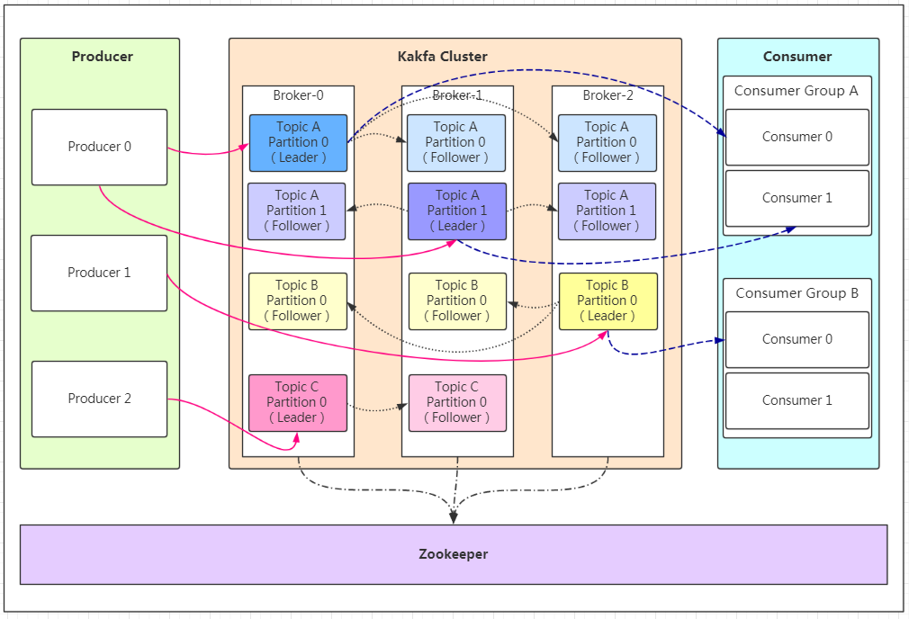
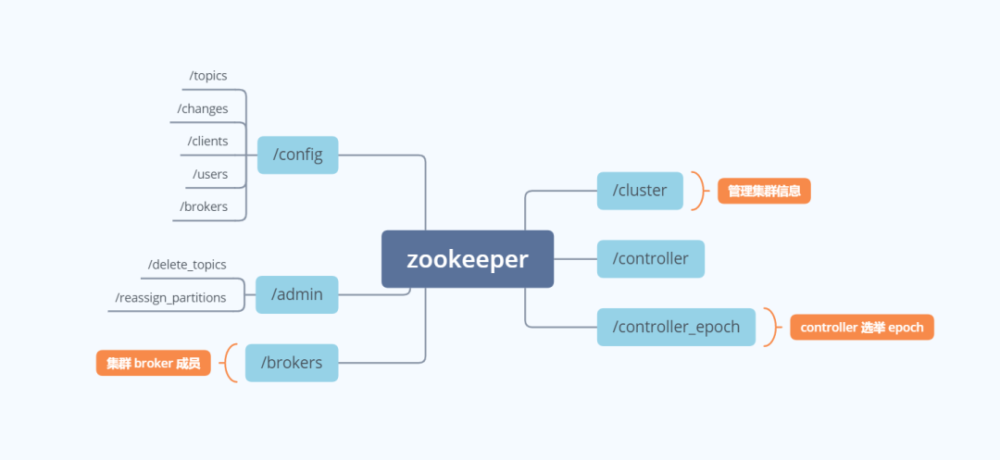

# 基本

+ kafka使用拉取的方式消费数据，通过建立长轮询的模式来拉取。
  + 消费者去Broker拉消息，同时定义了一个超时时间，如果有消息的话就马上返回，如果没有消息的话就等待直到超时。然后重新发起拉消息请求。
  + 优点：
    + 降低了Broker的压力
    + 使得消费者端更为灵活

# 架构

+ 生产者**Producer**：发布消息的对象称之为话题生产者(Kafka topic producer)
+ 消费者**Consumer**：订阅消息并处理发布的消息的种子的对象称之为话题消费者(consumers)
  + 消费者可以通过设置消息位移（offset）来控制自己想要获取的数据，比如可以从头读取，最新数据读取，重读读取等功能
+ 话题**Topic**(具体的队列)： Kafka将消息种子(Feed)分门别类， 每一类的消息称之为话题(Topic)。
+ 代理**Broker**：已发布的消息保存在一组服务器中，称之为Kafka集群。集群中的每一个服务器都是一个代理(Broker)。**即一个Broker就是一台服务器**
+ **Partition**(分区)：为了提高一个队列(topic)的吞吐量，Kafka会把topic进行分区(Partition)。Topic由一个或多个partition（分区）组成，生产者的消息可以指定或者由系统根据算法分配到指定分区。
  + 其中每个partition中的消息是有序的，但相互之间的顺序就不能保证了，若Topic有多个partition，生产者的消息可以指定或者由系统根据算法分配到指定分区，若你需要所有消息都是有序的，那么你最好只用一个分区。
+ 副本Replication：Kafka保证数据高可用的一种方式，同一个分区的数据可以在多个Broker中存在副本，通常只有主副本对外提供读写服务，当broker发生崩溃后，kafka会重新选择新的主副本对外提供服务。

# 副本

+ 

# Zookeeper

+ 注：目前kafka准备移除zookeeper

# 消息存储

+ Kafka通过分段的方式将Log分为多个LogSegment，一个LogSegment对应磁盘上一个日志文件和索引文件，其中日志文件用来记录消息，索引文件用来保存消息的索引。
+ 查找消息：
  + 索引文件是以上一个文件的最后一个offset进行命名的，所以可以通过二分查找根据offset快速定位到指定的索引文件。
  + 找到索引文件后，根据 offset 进行定位，找到索引文件中的符合范围的索引。（kafka 采用稀疏索引的方式来提高查找性能）
  + 得到 position 以后，再到对应的 log 文件中，从 position出开始查找 offset 对应的消息，将每条消息的 offset 与目标 offset 进行比较，直到找到消息

# 高效

+ 顺序写磁盘。Kafka顺序读写磁盘可以省去寻道和旋转的时间。
+ 使用零拷贝技术。
+ 批量发送：Kafka允许进行批量发送消息，producter发送消息的时候，可以将消息缓存在本地，等到了固定条件发送到 Kafka 。
+ 数据压缩：Producer可以通过GZIP或Snappy格式对消息集合进行压缩。压缩的好处就是减少传输的数据量，减轻对网络传输的压力。

# 消费端丢失数据

+ 如果消费者自动提交了offset，但是实际上还没有进行处理这个消息服务就挂掉了，此时这条消息会被丢失。
+ 可以使用手动提交的方式进行处理。

# 丢失数据

https://www.cnblogs.com/wuzhenzhao/p/10143946.html

+ Kafka的每个topic都可以分为多个Partition，并且多个 partition 会均匀分布在集群的各个节点下。虽然这种方式能够有效的对数据进行分片，但是对于每个partition 来说，都是单点的，当其中一个 partition 不可用的时候，那么这部分消息就没办法消费。所以 kafka 为了提高 partition 的可靠性而提供了副本的概念（Replica）,通过副本机制来实现冗余备份。每个分区可以有多个副本，并且在副本集合中会存在一个leader 的副本，所有的读写请求都是由 leader 副本来进行处理。剩余的其他副本都做为 follower 副本，follower 副本 会 从 leader 副 本 同 步 消 息 日 志 。 这 个 有 点 类 似zookeeper 中 leader 和 follower 的概念，但是具体的时间方式还是有比较大的差异。所以我们可以认为，副本集会存在一主多从的关系。一般情况下，同一个分区的多个副本会被均匀分配到集群中的不同 broker 上，当 leader 副本所在的 broker 出现故障后，可以重新选举新的 leader 副本继续对外提供服务。通过这样的副本机制来提高 kafka 集群的可用性。

+ 当Kafka的某个broker宕机，然后重新选举partition的leader，如果此时follower还有一些数据没有同步，此时leader挂了就会丢失一些数据。
+ 解决方案：
  + 修改参数：
    + 给 topic 设置 `replication.factor` 参数：这个值必须大于 1，要求每个 partition 必须有至少 2 个副本。
    + 在 Kafka 服务端设置 `min.insync.replicas` 参数：这个值必须大于 1，这个是要求一个 leader 至少感知到有至少一个 follower 还跟自己保持联系
    + 在 producer 端设置 `acks=all`：这个是要求每条数据，必须是写入所有 replica 之后，才能认为是写成功了。
    + 在 producer 端设置 `retries=MAX`（很大很大很大的一个值，无限次重试的意思）：这个是要求一旦写入失败，就无限重试，卡在这里了。

# 保证高可用

+ 在kafka 0.8以后提供了ha机制，也就是replica（复制品）副本机制，每个partition的数据会同步到其他机器上，形成多个副本，所有副本会选择一个leader出来，生产和消费只和这个leader打交道。

# 保证消息有序

+ 使用单个分区保证有序性。
+ 使用自定义key来保证有序性。