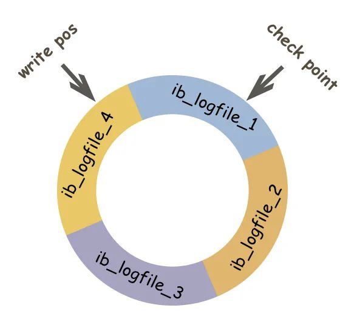
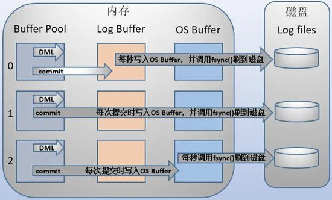
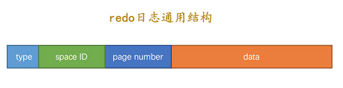
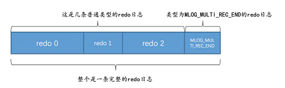
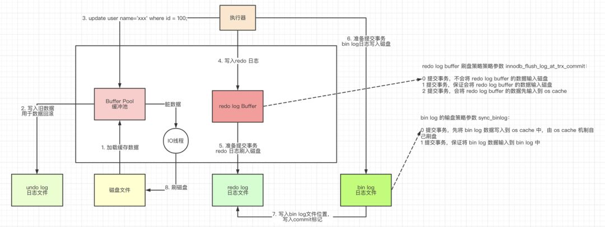
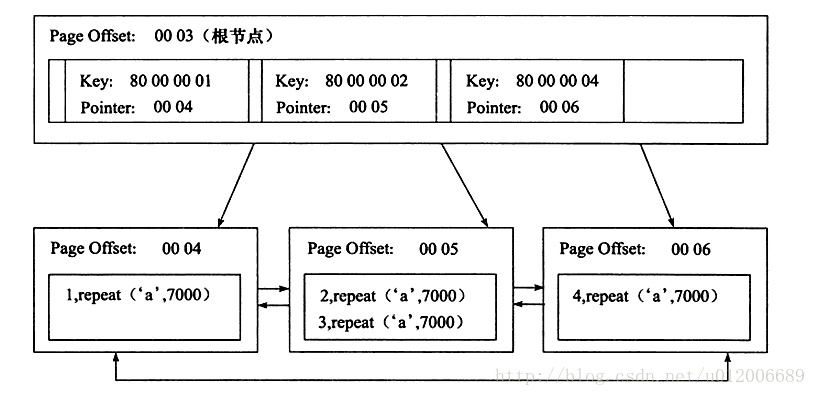
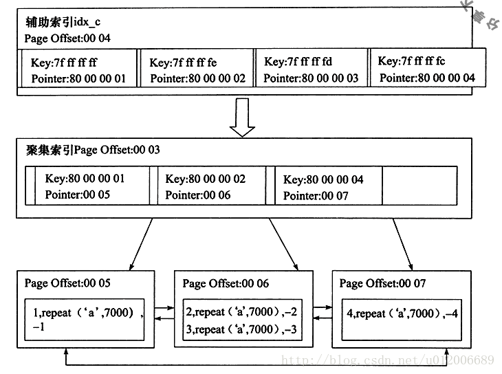
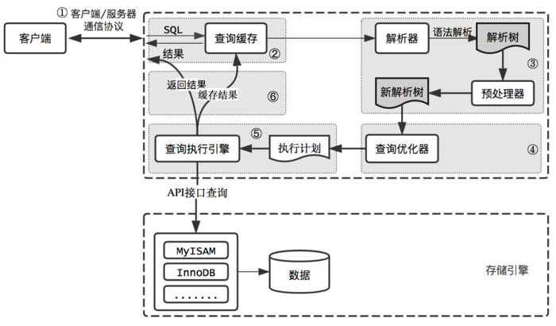
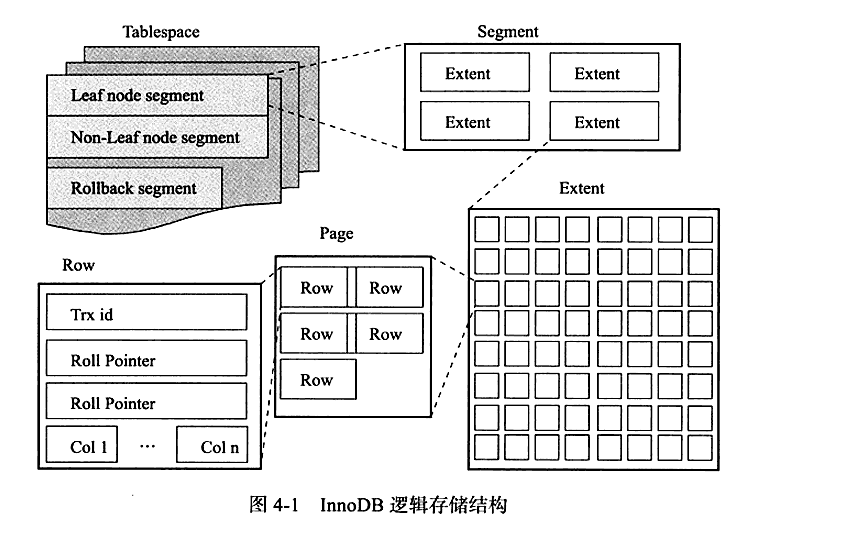

# 其他

+ union和union all：
  + Union，对两个结果集进行并集操作，不包括重复行，同时进行默认规则的排序；
  + Union All，对两个结果集进行并集操作，包括重复行，不进行排序；
+ select count：在InnoDB中，处理select count(*)和select count(1)的操作方式相同，两者性能没有差别。（[参考](https://dev.mysql.com/doc/refman/8.0/en/aggregate-functions.html#function_count)）
  + select count(*)：返回所有行数，包括null
  + select count(id)：返回所有行数，不包括null
  + select count(1)：返回所有行数，包括null

# 基本数据类型

+ INT：4字节
+ TINTINT：1字节
+ BIGINT：8字节
+ FLOAT与DOUBLE
+ DATE：3字节
+ DATETIME：8字节
+ TIMESTAMP：8字节
+ CHAR：0-255字节，定长字符串
+ VARCHAR：0-65536字节，变长字符串
+ TEXT：0-65535字节，长文本数据
+ char 类型和 varchar 类型的区别：
  + char(n) 若存入字符数小于n，则以空格补于其后，查询之时再将空格去掉。所以char类型存储的字符串末尾不能有空格，varchar不限于此
  + char(n) 固定长度，char(4)不管是存入几个字符，都将占用4个字节，varchar是存入的实际字符数+1个字节（n<=255）或2个字节(n>255)，所以varchar(4),存入3个字符将占用4个字节
  + char类型的字符串检索速度要比varchar类型的快

# 为什么使用B+树

+ 虽然哈希索引是O(1)，树索引是O(log(n))，但SQL有很多“有序”需求，故数据库使用树型索引
+ 很适合磁盘存储，能够充分利用局部性原理，磁盘预读
  + **局部性原理**：软件设计要尽量遵循“数据读取集中”与“使用到一个数据，大概率会使用其附近的数据”，这样磁盘预读能充分提高磁盘IO
  + **数据预读**：磁盘读写并不是按需读取，而是按页预读，一次会读一页的数据，每次加载更多的数据，以便未来减少磁盘IO
+ 很低的树高度，能够存储大量数据，同时能有效的减少IO操作。
+ 索引本身占用的内存很小
+ 能够很好的支持单点查询，范围查询，有序性查询
+ 查询效率稳定
+ B+树存放数据数计算（https://blog.csdn.net/csdnlijingran/article/details/102309593）
+ 不用B树的原因是因为B树不支持范围查找，B+树的范围查找只需要遍历叶子节点就行，而B树则需要中序遍历

# MVCC

+ MVCC（Multi-Version Concurrency Control）多版本并发控制，MVCC 是一种并发控制的方法，一般在数据库管理系统中，实现对数据库的并发访问，它在不同的数据库引擎中有不同的实现。MySQL中MVCC只能在**Repeatable Read（读可重复读）、Read Committed（读可提交）**这两个隔离级别下工作。
  + 读提交总是读取数据的最新行，而不是复合当前事务版本的数据行
  + 序列化会对所有的读取操作加锁
+ 在MVCC中，删除语句并不会导致要删除的记录真正被删除，而是在丢弃相应的undo log时，才会删除相应的行及索引记录。
+ 数据库隐藏字段：
  + DB_TRX_ID：6byte，最近修改(修改/插入)事务ID：记录创建这条记录/最后一次修改该记录的事务ID
  + DB_ROLL_PTR：7byte，回滚指针，指向这条记录的上一个版本（存储于rollback segment里）
  + DB_ROW_ID：6byte，隐含的自增ID（隐藏主键），如果数据表没有主键，InnoDB会自动以DB_ROW_ID产生一个聚簇索引

## undo log

+ 与redo log相反，undo log是为回滚而用，具体内容就是copy事务前的数据库内容（行）到undo buffer，在适合的时间把undo buffer中的内容刷新到磁盘。undo buffer与redo buffer一样，也是环形缓冲，但当缓冲满的时候，undo buffer中的内容会也会被刷新到磁盘；与redo log不同的是，磁盘上不存在单独的undo log文件，所有的undo log均存放在主ibd数据文件中（表空间），即使客户端设置了每表一个数据文件也是如此。
+ 存储着老版本的数据，会存在着一条版本链。同时undo log的插槽的数量根据`InnoDB`页面大小而有所不同 。一般是`InnoDB页面大小 / 16`
+ undo log是采用段(segment)的方式来记录的，每个undo操作在记录的时候占用一个undo log segment
+ **undo log**也会产生redo log**，因为undo log**也要实现持久性保护。
+ 对于insert，产生的undo日志可以直接删除，归为`insert_undo_log`，而对于update、delete等需要维护多版本的产生的undo日志被归为`update_undo`
  + insert undo log : 事务对insert新记录时产生的undolog, 只在事务回滚时需要, 并且在事务提交后就可以立即丢弃。
  + update undo log : 事务对记录进行delete和update操作时产生的undo log, 不仅在事务回滚时需要, 一致性读也需要，所以不能随便删除，只有当数据库所使用的快照中不涉及该日志记录，对应的回滚日志才会被purge线程删除。
+ undo log维护：
  + delete：对于要删除的并不会真正的删除，而是打上一个delete flag，将其标记为删除，最终的删除操作是由purge线程来完成的。
  + update：判断是否为主键列
    + 如果是不是主键列，反向记录如何update的
    + 如果是主键列，先删除该行，再插入一行目标行。
  + insert：直接插入行。

## ReadView（快照）

+ 详解：https://cloud.tencent.com/developer/article/1507810
+ 当前读和快照读：
  + 当前读：像select lock in share mode(共享锁), select for update ; update, insert ,delete(排他锁)这些操作都是一种当前读，为什么叫当前读？就是它读取的是记录的最新版本，读取时还要保证其他并发事务不能修改当前记录，会对读取的记录进行加锁
  + 像不加锁的select操作就是快照读，即不加锁的非阻塞读；快照读的前提是隔离级别不是串行级别，串行级别下的快照读会退化成当前读；之所以出现快照读的情况，是基于提高并发性能的考虑，快照读的实现是基于多版本并发控制，即MVCC,可以认为MVCC是行锁的一个变种，但它在很多情况下，避免了加锁操作，降低了开销；既然是基于多版本，即快照读可能读到的并不一定是数据的最新版本，而有可能是之前的历史版本（**在可重复读的隔离级别下普通读是快照读**）
+ 生成时机：
  + 在可重复读隔离级别中，会在开启事务后的第一个读操作后创建一个快照，在同一个事务中多次读取，返回的数据是一样的。
  + 在读提交的隔离级别中，事务的每一条select语句都会创建一个快照。
+ undo log中的每条记录记录了最后一次修改记录的事务的ID。
+ read view是基于undo log实现的，由以下部分组成
  + m_ids，当前有哪些事务正在执行，且还没有提交，这些事务的 id 就会存在这里；
  + min_trx_id，是指 m_ids 里最小的值；
  + max_trx_id，是指下一个要生成的事务 id。下一个要生成的事务 id 肯定比现在所有事务的 id 都大；
  + creator_trx_id，每开启一个事务都会生成一个 ReadView，而 creator_trx_id 就是这个开启的事务的 id。
+ 访问规则：
  + [undo log实现的快照](https://blog.csdn.net/qq_37286668/article/details/111609379)
  + 如果被访问版本的`trx_id`属性值与`ReadView`中的`creator_trx_id`值相同，意味着当前事务在访问它自己修改过的记录，所以该版本可以被当前事务访问。
  + 如果被访问版本的`trx_id`属性值小于`ReadView`中的`min_trx_id`值，表明生成该版本的事务在当前事务生成`ReadView`前已经提交，所以该版本可以被当前事务访问。
  + 如果被访问版本的`trx_id`属性值大于或等于`ReadView`中的`max_trx_id`值，表明生成该版本的事务在当前事务生成`ReadView`后才开启，所以该版本不可以被当前事务访问。
  + 如果被访问版本的`trx_id`属性值在`ReadView`的`min_trx_id`和`max_trx_id`之间，那就需要判断一下`trx_id`属性值是不是在`m_ids`列表中，如果在，说明创建`ReadView`时生成该版本的事务还是活跃的，该版本不可以被访问；如果不在，说明创建`ReadView`时生成该版本的事务已经被提交，该版本可以被访问。
  + 如果某个版本的数据对当前事务不可见的话，那就顺着版本链找到下一个版本的数据，继续按照上边的步骤判断可见性，依此类推，直到版本链中的最后一个版本，如果最后一个版本也不可见的话，那么就意味着该条记录对该事务不可见，查询结果就不包含该记录。-
+ Innodb在快照读的情况下并没有完全避免幻读，但是在当前读的情况下避免了不可重复读和幻读。

https://blog.csdn.net/SnailMann/article/details/94724197

https://zhuanlan.zhihu.com/p/166152616

# Log

+ https://cloud.tencent.com/developer/article/1679325

## bin log

+ binlog是属于MySQL Server层面的，又称为归档日志，属于逻辑日志，是以二进制的形式记录的是这个语句的原始逻辑，依靠binlog是没有crash-safe能力的。

### 作用

+ 复制：Mysql主从同步的时候，是使用的binlog实现的
+ 恢复数据：通过使用`mysqlbinlog`工具来恢复数据。

### 刷盘时机

+ `mysql`通过`sync_binlog`参数控制`biglog`的刷盘时机，取值范围是`0-N`：
  + 0：不去强制要求，由系统自行判断何时写入磁盘；
  + 1：每次`commit`的时候都要将`binlog`写入磁盘；默认值
  + N：每N个事务，才会将`binlog`写入磁盘。

### 三种日志数据格式

+ row：仅保存记录被修改的细节，不记录sql语句。新版的MySql默认是row格式
  + 优点：能非常清晰的记录下每行数据的修改细节，不需要记录上下文相关信息，因此不会发生某些特定情况下的存储过程、函数或者触发器的调用触发无法被正确复制的问题，任何情况都可以被复制，且能加快从库重放日志的效率，保证从库数据的一致性
  + 缺点：由于所有的执行的语句在日志中都将以每行记录的修改细节来记录，因此，可能会产生大量的日志内容，干扰内容也较多。比如一条 update 语句，如修改多条记录，则 binlog 中每一条修改都会有记录，这样造成 binlog 日志量会很大，特别是当执行alter table之类的语句的时候，由于表结构修改，每条记录都发生改变，那么该表每一条记录都会记录到日志中，实际等于重建了表。
+ statement：会以Sql语句的格式记录修改的数据
  + 优点：只需要记录执行语句的细节和上下文环境，避免了记录每一行的变化，在一些修改记录较多的情况下相比 Row 格式能大大减少 binlog 日志量，节约 IO，提高性能。
  + 为了保证 sql 语句能在 slave 上正确执行，必须记录上下文信息，以保证所有语句能在 slave 得到和在 master 端执行时候相同的结果。在主从复制的时候可能会受到存储过程等因素的影响。
+ mixed：两种模式的混合。

## redo log

+ redo log就是保存执行的SQL语句到一个指定的Log文件，当Mysql执行recovery时重新执行redo log记录的SQL操作即可。当客户端执行每条SQL（更新语句）时，redo log会被首先写入log buffer；当客户端执行COMMIT命令时，log buffer中的内容会被视情况刷新到磁盘。redo log在磁盘上作为一个独立的文件存在，即Innodb的log文件。并且大小是固定的。满了就从头开始写。
+ 重做日志分为两部分：redo log buffer 和 redo log file
+ redolog是**先写日志在写数据**（WAL：WriteAheadLogging）。

### 作用

+ 用于当数据库或者系统崩溃的时候进行恢复。即`crash-safe`

### 记录形式

+ 在redo log中会有一个日志的序列号，LSN（Log Sequence Number）其代表的是日志序列号。在 InnoDB存储引擎中,LSN占用8字节,并且单调递增。
+ 在redo log中存在两个指针，一个`check point`，一个`write pos`。并且redo log是循环写入的，也就是说redo log实际上是一个循环队列
  + 在`check point`到`write pos`之间的是还没有刷盘的数据
  + 在`write pos`到`check point`之间的是空的部分（或没有用的数据）。写入时候会推动`write pos`写入到这一部分。



### 崩溃恢复

+ 启动`innodb`的时候，不管上次是正常关闭还是异常关闭，总是会进行恢复操作。因为`redo log`记录的是数据页的物理变化，因此恢复的时候速度比逻辑日志(如`binlog`)要快很多。重启`innodb`时，首先会检查磁盘中数据页的`LSN`，如果数据页的`LSN`小于日志中的`LSN`，则会从`checkpoint`开始恢复。还有一种情况，在宕机前正处于`checkpoint`的刷盘过程，且数据页的刷盘进度超过了日志页的刷盘进度，此时会出现数据页中记录的`LSN`大于日志中的`LSN`，这时超出日志进度的部分将不会重做，因为这本身就表示已经做过的事情，无需再重做。

+ 如果在更新或写入数据的过程中，机器出现崩溃。那么在机器在重启后，MySQL会首先去验证redo log的完整性，如果redo log中没有prepare状态的记录，则记录是完整的，就日记提交。如果redolog中存在prepare记录，那么就去验证这条redolog对应的binlog记录，如果这条binlog是完整的，那么完整提交redo log，否则执行回滚逻辑。

+ 崩溃恢复时的判断规则。

  1. 如果redo log里面的事务是完整的， 也就是已经有了commit标识， 则直接提交；
  2. 如果redo log里面的事务只有完整的prepare， 则判断对应的事务binlog是否存在并完整：
     - 如果是， 则提交事务；
     - 否则， 回滚事务。

  - 如果碰到既有prepare、 又有commit的redo log， 就直接提交；
  - 如果碰到只有prepare、 而没有commit的redo log， 就拿着XID去binlog找对应的事务。

+ 单靠redo log是无法做到`crash-safe`的，必须要结合bin log一起实现。

### 刷盘时机

+ log buffer空间不足时 当前写入log buffer的redo日志量已经占满了log buffer总容量的大约一半左右，就需要把这些日志刷新到磁盘上。
+ 事务提交时 在事务提交时可以不把修改过的Buffer Pool页面刷新到磁盘，但为了保证持久性，必 须要把修改这些页面对应的redo日志刷新到磁盘。
+ 后台线程不停的刷刷刷 后台有一个线程，大约每秒都会刷新一次log buffer中的redo日志到磁盘。
+ 正常关闭服务器时
+ 做所谓的checkpoint 时

### 写入机制

+ Innodb提供了`innodb_flush_log_at_trx_commit`参数来对redo log的写入提供策略。rodo log buffer的写入首先是先将其写入os的缓冲中，然后再写入到磁盘中。
  + 0时：每次事务提交只是把redo log留在redo log buffer中。依靠Innodb的主线程每秒执行一次刷盘。当MySql宕机的时候，可能会导致内存的数据全部丢失。**即每秒写入`os buffer`然后调用`fsync`写入磁盘中。**
  + 1时：每次提交事务时，必须把redo log从内存中写入到磁盘文件中去。**即每次提交事务时，写入`os buffer`然后调用`fsync`写入磁盘中。**
  + 2时：提交事务时，将日志写到对应的os cache中去，交给操作系统将日志刷到磁盘中去。**即每次提交时，写入`os buffer`等待系统进行`fsync`刷盘。**



### 结构（待完善）

+ redo log日志每一条操作对应一个redo log日志，多个redo log日志对应一条完整的redo log日志，并且这些日志会被存放在redo log block中。redo log刷盘实际上是将redo log block写入到磁盘中的过程。在log文件中，前2048个字节（前四个桶）是用来处理一些管理信息的，后面开始的桶才是实际上存储redo log的。所以循环使用也是从2048个字节开始的。


+ 
+ 


## 数据更新流程（两阶段提交）

+ `update T set c=c+1 where ID=2;`
+ 执行器先找引擎取 ID=2 这一行。ID 是主键，引擎直接用树搜索找到这一行。如果 ID=2 这一行所在的数据页本来就在内存中，就直接返回给执行器；否则，需要先从磁盘读入内存，然后再返回。
+ 执行器拿到引擎给的行数据，把这个值加上 1，比如原来是 N，现在就是 N+1，得到新的一行数据，再调用引擎接口写入这行新数据。
+ 引擎将这行新数据更新到内存中，同时将这个更新操作记录到 redo log 里面，此时 redo log 处于 prepare 状态。然后告知执行器执行完成了，随时可以提交事务。
+ 执行器生成这个操作的 binlog，并把 binlog 写入磁盘。
+ 执行器调用引擎的提交事务接口，引擎把刚刚写入的 redo log 改成提交（commit）状态，更新完成。



# Innodb结构


## 内存结构

### Buffer Pool

+ 主内存中的一个区域，用于缓存Innodb的表和索引数据。Buffer Pool使用了LRU算法的变体，会将很少使用的数据从缓存中老化。
+ Buffer Pool使用链表的形式来管理页。
+ Buffer Pool中有5/8的空间作为年轻代，3/8的空间作为老年代。当Innodb将页面读入缓冲池时，首先会将其插入缓冲池的老年代的头部，如果对页面进行访问将会使得页面变年轻（进入年轻代）。这样可以保证被预读的没用的数据可以提早的消失。

### Change Buffer

https://dev.mysql.com/doc/refman/5.7/en/innodb-change-buffer.html

+ change buffer在5.5之前叫做insert buffer
+ 当二级索引页不在缓冲池中时，change buffer将会缓冲这些更改，当索引页通过其他操作加载到缓冲池（Buffer Pool）时，会将更改进行合并。
+ 由于二级缓存不是唯一的，并且不是连续分布的，通过change buffer的合并可以减少大量的没必要的IO操作。如果受影响的行数比较多的时候，合并change buffer可能会消耗很多的时间，可能会导致硬盘的查询速度下降，甚至服务器重启之后，合并缓冲区的操作仍然可能会发生。
+ 如果索引或主键包含降序索引列，则辅助索引不支持更改缓冲。
+ change buffer只支持二级索引，不支持其他的索引。

### Adaptive Hash Index

+ 自适应哈希索引，Innodb存储引擎会监控对表上二级索引的查找，如果发现某二级索引被频繁访问，二级索引成为热数据，建立哈希索引可以带来速度的提升。

### Log Buffer

+ 日志缓冲区，通过`innodb_log_buffer_size`变量定义，默认大小为16M

## 磁盘结构

+ 直接参考文档：https://dev.mysql.com/doc/refman/5.7/en/innodb-on-disk-structures.html

### 系统表空间

#### Innodb数据字典

+ `InnoDB`数据字典由包含元数据的用于跟踪对象的如表，索引，和表中的列的内部系统表。元数据实际上位于`InnoDB`系统表空间中。由于历史原因，数据字典元数据在某种程度上与`InnoDB`表元数据文件（`.frm`文件）中存储的信息重叠 。

#### change buffer


#### 重做日志

+ 默认情况下，InnoDB存储引擎的数据目录下会有两个名为`ib_logfile0`和`ib_logfile1`的文件。
+ InnoDB使用redo log来恢复不完整的事务写入的数据。

#### 双写缓冲（doublewrite buffer）

+ 双写缓冲是一个存储区，在该区域中，在InnoDB将数据写入到对应的位置之前，会先将数据刷新到双写缓冲区中，然后再将数据刷新到对应的位置。如果操作系统在将数据写入到对应的位置之前时挂掉了的话，那么就可以从双写缓冲中恢复数据。

# 主从同步


# 数据库引擎

+ MyISAM：
  + 不支持主外键
  + 不支持事务
  + 使用表锁，即使操作一条记录也会锁住整个表，不适合高并发操作
  + 只缓存索引，不缓存真实数据
  + MyISAM的索引与行记录是分开存储的（.myi索引文件和.myd数据文件），叫做非聚集索引（UnClustered Index）。
+ InnoDB
  + 使用行锁，操作时只锁住某一行，不会对其他行有影响
  + 缓存索引，同时缓存真实数据，对内存要求较高
  + Innodb的数据文件按主建聚集（.idb文件）
+ InnoDB的主键索引与行记录是存储在一起的，故叫做聚集索引（Clustered Index）：
  
+ Archive
  + 将数据压缩后进行存储，适合存储大量的独立的,作为历史记录的数据，能进行插入和查询操做
+ BlackHole
+ CSV：
  + 基于CSV格式文件存储数据(应用于跨平台的数据交换)
+ Memory
  + 内存存储引擎，拥有极高的插入，更新和查询速度，但是数据可能会消失
+ MRG_MyISAM：
  + 将多个表联合成一个表使用，在超大规模数据存储时很有用
+ Performance_Schema

# 优化

## 索引条件下推（ICP）

+ 索引条件下推是索引从表中检索行的一种优化，使用了索引下推，extra会出现`Using index condition`。在Mysql5.7版本以后出现的索引条件下推。
  + 如果不使用索引下推，那么存储引擎会先遍历索引，然后去基表中定位所需要的行，并返回给Mysql服务器，然后服务器根据where条件过滤。
  + 如果使用索引下推，如果where部分的列可以使用索引中的列来过滤，那么mysql就会将这一部分条件下推到存储引擎，存储引擎使用索引条目来计算已推入的索引条件，只有满足这个条件，才从表中读取行。从而减少存储引擎访问表的次数和mysql服务器访问存储引擎的次数
+ 条件：
  + ICP用于 range， ref， eq_ref，和 ref_or_null访问方法时，有一个需要访问的全部表行。
  + ICP可用于InnoDB 和MyISAM表，包括分区表InnoDB和 MyISAM表。
  + 对于`InnoDB`表，ICP仅用于二级索引。ICP的目标是减少全行读取次数，从而减少I / O操作。对于 `InnoDB`聚集索引，完整的记录已被读入`InnoDB` 缓冲区。在这种情况下使用ICP不会减少I / O。
  + 在虚拟生成的列上创建的二级索引不支持ICP。`InnoDB` 支持虚拟生成的列上的二级索引。
  + 不能将引用子查询的条件下推。
  + 涉及存储功能的条件不能下推。存储引擎无法调用存储的功能。
  + 触发条件不能下推。

## 索引合并（Index_merge）

+ 在where中如果涉及多个字段，他们之间进行AND或OR，那么可能会使用Index_merge进行优化，对多个索引分别进行条件扫描，然后对它们各自的结果进行合并。（也就是说使用OR也有可能会走索引）

## Hash Join

+ 在Mysql8.0.18引入。以前如果没有索引进行连接的时候使用的是对内外表双重循环遍历。引入HashJoin后就能利用哈希来进行优化。HashJoin针对的是equal-join场景的优化。
+ HashJoin首先会在遍历外表的时候同时建立一个哈希表，然后在遍历内表的时候就可以通过哈希表来进行连接优化，这样就不需要双重遍历。

# 事务四大特性

+ 原子性(Atomicity): 事务是最小的执行单位,不允许分割。事务的原子性确保动作要么全部完成,要么完全不起作用;
  + Mysql的原子性是通过undo log实现的。每次在有写命令的时候，会先向undolog中写入一份，如果中间发生了故障，就可以通过uodolog进行回滚。
+ 一致性(Consistency): 执行事务前后,数据保持一致,多个事务对同一个数据读取的结果是相同的;
+ 隔离性(Isolation): 并发访问数据库时,一个用户的事务不被其他事务所干扰,各并发事务之间数据库是独立的;
  + Mysql的隔离性是通过MVCC（读提交和可重复度隔离级别下）和锁（序列化级别下）实现的。
+ 持久性(Durability): 一个事务被提交之后。它对数据库中数据的改变是持久的,即使数据库发生故障也不应该对其有任何影响。
  + Mysql的持久性是通过redo log和bin log实现的。

# 事务并发问题

+  脏读(Dirty read): 当一个事务正在访问数据并且对数据进行了修改,而这种修改还没有提 交到数据库中,这时另外一个事务也访问了这个数据,然后使用了这个数据。因为这个数据 是还没有提交的数据,那么另外一个事务读到的这个数据是“脏数据”,依据“脏数据”所做的 操作可能是不正确的。**一改一读**

+ 丢失修改(Lost to modify): 指在一个事务读取一个数据时,另外一个事务也访问了该数 据,那么在第一个事务中修改了这个数据后,第二个事务也修改了这个数据。这样第一个事 务内的修改结果就被丢失,因此称为丢失修改。 例如:事务1读取某表中的数据A=20,事 务2也读取A=20,事务1修改A=A-1,事务2也修改A=A-1,最终结果A=19,事务1的修改被丢失。**两个改**

+ 不可重复读(Unrepeatableread): 指在一个事务内多次读同一数据。在这个事务还没有结 束时,另一个事务也访问该数据。那么,在第一个事务中的两次读数据之间,由于第二个事 务的修改导致第一个事务两次读取的数据可能不太一样。这就发生了在一个事务内两次读到 的数据是不一样的情况,因此称为不可重复读。**一改一读**

+ 幻读(Phantom read): 幻读与不可重复读类似。它发生在一个事务(T1)读取了几行数 据,接着另一个并发事务(T2)插入了一些数据时。在随后的查询中,第一个事务(T1) 就会发现多了一些原本不存在的记录,就好像发生了幻觉一样,所以称为幻读。**一改一读**

  + 不可重复读的重点是修改比如多次读取一条记录发现其中某些列的值被修改,幻读的重点在于新增或者删除比如多次读取一条记录发现记录增多或减少了。
  + 幻读的问题存在是因为新增或者更新操作，这时如果进行范围查询的时候（加锁查询），会出现不一致的问题


# 隔离级别

+ **READ-UNCOMMITTED(读取未提交):** 最低的隔离级别,允许读取尚未提交的数据变更, 可能会导致脏读、幻读或不可重复读。
+ **READ-COMMITTED(读取已提交):** 允许读取并发事务已经提交的数据,可以阻止脏读,但 是幻读或不可重复读仍有可能发生。
  + 对于读提交，由于不会使用间隙锁，所以会导致幻读的产生。
+ **REPEATABLE-READ(可重复读):** 对同一字段的多次读取结果都是一致的,除非数据是被 本身事务自己所修改,可以阻止脏读和不可重复读,但幻读仍有可能发生。
  + **在可重复读的隔离界别时，在同一个事务中多次读取，返回的数据是一样的**。
+ **SERIALIZABLE(可串行化):** 最高的隔离级别,完全服从ACID的隔离级别。所有的事务依 次逐个执行,这样事务之间就完全不可能产生干扰,也就是说,该级别可以防止脏读、不可 重复读以及幻读。

# 范式

**第一范式（1NF）：**所谓第一范式（1NF）是指在关系模型中，对于添加的一个规范要求，所有的域都应该是原子性的，即数据库表的每一列都是不可分割的原子数据项，而不能是集合，数组，记录等非原子数据项。即实体中的某个属性有多个值时，必须拆分为不同的属性。在符合第一范式（1NF）表中的每个域值只能是实体的一个属性或一个属性的一部分。简而言之，第一范式就是无重复的域。

**第二范式（2NF）**：在1NF的基础上，非码属性必须完全依赖于候选码（在1NF基础上消除非主属性对主码的部分函数依赖）。要求实体的属性完全依赖于主关键字。所谓完全依赖是指不能存在仅依赖主关键字一部分的属性，如果存在，那么这个属性和主关键字的这一部分应该分离出来形成一个新的实体，新实体与原实体之间是一对多的关系。为实现区分通常需要为表加上一个列，以存储各个实例的唯一标识。简而言之，第二范式就是在第一范式的基础上属性完全依赖于主键。

**第三范式（3NF）**：在2NF基础上，任何非主属性不依赖于其它非主属性（在2NF基础上消除传递依赖）。

**巴斯-科德范式（BCNF）**：巴斯-科德范式（BCNF）是第三范式（3NF）的一个子集，即满足巴斯-科德范式（BCNF）必须满足第三范式（3NF）。通常情况下，巴斯-科德范式被认为没有新的设计规范加入，只是对第二范式与第三范式中设计规范要求更强，因而被认为是修正第三范式，也就是说，它事实上是对第三范式的修正，使数据库冗余度更小。这也是BCNF不被称为第四范式的原因。某些书上，根据范式要求的递增性将其称之为第四范式是不规范，也是更让人不容易理解的地方。而真正的第四范式，则是在设计规范中添加了对多值及依赖的要求。

# 索引

+ 参考：https://blog.csdn.net/q6627666/article/details/104405461
+ https://blog.csdn.net/jeffsmish/article/details/78509042

## 基本

+ 一般来说，索引本身也很大，不可能全部存储在内存中，因此索引往往以索引文件的形式存储的磁盘上。这样的话，索引查找过程中就要产生磁盘 I/O 消耗，相对于内存存取，I/O 存取的消耗要高几个数量级，所以评价一个数据结构作为索引的优劣最重要的指标就是在查找过程中磁盘 I/O 操作次数的渐进复杂度。换句话说，索引的结构组织要尽量减少查找过程中磁盘 I/O 的存取次数。为了达到这个目的，磁盘按需读取，要求每次都会预读的长度一般为页的整数倍。而且数据库系统将一个节点的大小设为等于一个页，这样每个节点只需要一次 I/O 就可以完全载入。每次新建节点时，直接申请一个页的空间，这样就保证一个节点物理上也存储在一个页里，加之计算机存储分配都是按页对齐的，就实现了一个 node 只需一次 I/O。并把 B-tree 中的 m 值设的非常大，就会让树的高度降低，有利于一次完全载入。

+ 优点：
  + **提高数据检索的效率**，降低数据库的IO成本
  + 通过索引列对数据进行排序，**降低数据排序的成本**，降低了CPU的消耗
+ 缺点：
  + 虽然索引大大提高了查询速度，同时却**会降低更新表的速度**，如对表进行INSERT、UPDATE和DELETE。因为更新表时，MySQL不仅要保存数据，还要保存一下索引文件每次更新添加了索引列的字段，都会调整因为更新所带来的键值变化后的索引信息
  + 实际上索引也是一张表，该表保存了主键与索引字段，并指向实体表的记录，所以**索引列也是要占用空间的**

## 索引失效

+ 当where语句中包含or时，可能会导致索引失效
+ 当where使用了负向查询的时候，可能会导致索引失效`如：Not， !=，Not in，not like`等
+ 当对索引列进行运算的时候会导致索引失效：`select * from table where id + 1 = 10`
+ 使用like通配符的时候可能会导致索引失效，不满足最左匹配原则
+ 当索引字段为null的时候，使用`is null`或`is not null`可能会导致索引失效
+ 联合索引未满足最左原则
+ 如果使用了不同字符集也会导致索引失效。

## 索引建立技巧

+ 前缀索引：可以使用前缀索引定义字符串的一部分作为索引，可以减少索引使用的空间，但是可能会需要增加额外的扫描次数。
  + 建立方法：`ALTER TABLE table_name ADD KEY(column_name(prefix_length));`
  + 使用前缀索引无法使用索引覆盖进行优化，需要回表查询
  + 参考：https://www.cnblogs.com/studyzy/p/4310653.html
+ 倒叙存储：对于存储如身份证信息之类的字段的时候，由于后六位的区分度较高，可以将身份证都倒叙存储。便于建立前缀索引。
+ 哈希字段存储：对于一些比较长的字段（如：url），直接对其进行建立索引比较消耗空间，可以对其使用哈希。然后对哈希建立索引，可以加快查询速度

## 聚簇索引

+ 概念：聚簇索引的顺序就是数据的物理存储顺序
+ 聚集索引就是按照每张表的主键构造一棵B+树，同时叶子节点中存放的即为整张表的行记录数据。
+ 聚集索引的叶子节点称为数据页，每个数据页通过一个双向链表来进行链接，而且数据页按照主键的顺序进行排列。
+ 如果定义了主键，InnoDB会自动使用主键来创建聚集索引。如果没有定义主键，InnoDB会选择一个唯一的非空索引代替主键。如果没有唯一的非空索引，InnoDB会隐式定义一个主键来作为聚集索引。
+ 

## 辅助索引（非聚簇索引）

+ 按照每张表创建的索引列（非主键列的其他列，被搜索的列）创建一棵B+树，叶子节点并不包含行记录的所有数据，只包含键值和书签，书签用来告诉InnoDB存储引擎在哪里可以找到行数据，一张表可以有可以有多个辅助索引。**要先在辅助索引中找到键值，再根据键值去聚集索引中找到整行数据**。
+ 

### 索引覆盖

+ InnoDB支持覆盖索引，即从辅助索引中就可以得到查询的记录，而不需要查询聚集索引中的记录。
+ 如果辅助索引中有需要查询的所有字段，那么就可以直接利用辅助索引获取到所有的信息，而不需要在通过聚集索引回表查询。提高效率

### 联合索引

+ 对表上的多个列进行索引，在Mysql中，**联合索引最多可以包含16列**。
+ 情况：
  + 只有Where：遵循最左原则，条件必须有左边的字段，才会使用到索引。如果中间断开了都不会用到后面的索引
  + group by或order by：也是遵循最左原则。

### 实例

+ ```
  假设某个表有一个联合索引（c1,c2,c3,c4）以下选项哪些字段使用了该索引：
  A where c1=x and c2=x and c4>x and c3=x // 使用了四个索引，MySql会在查询的时候优化将c3调整到c4前面去
  B where c1=x and c2=x and c4=x order by c3 // 使用了c1，c2索引。
  C where c1=x and c4= x group by c3,c2 // 只有c1使用了索引。使用group by 一般先生成临时文件，再进行排序，但是字段顺序为c2，c3时，并没有用临时表进行排序，而是利用索引排序好的；当group by字段为c3，c2时，由于与索引字段顺序不一致，所以分组和排序并没有利用到索引。
  D where c1=? and c5=? order by c2,c3 // 只有c1使用了索引。order by 和group by 类似，字段顺序与索引一致时，会使用索引排序；字段顺序与索引不一致时，不使用索引。
  E where c1=? and c2=? and c5=? order by c2,c3 // c1，c2使用了索引字段
  ```

## 全文索引


https://blog.csdn.net/qq_37113604/article/details/88973260

## 稠密索引和稀疏索引

+ 稠密索引：在密集索引中，数据库中的每个搜索键值都有一个索引记录。这样可以加快搜索速度，但需要更多空间来存储索引记录本身。索引记录包含搜索键值和指向磁盘上实际记录的指针。
+ 稀疏索引： 在稀疏索引中，不会为每个搜索关键字创建索引记录。此处的索引记录包含搜索键和指向磁盘上数据的实际指针。要搜索记录，我们首先按索引记录进行操作，然后到达数据的实际位置。如果我们要寻找的数据不是我们通过遵循索引直接到达的位置，那么系统将开始顺序搜索，直到找到所需的数据为止。

# 锁

## 数据库封锁

+ 封锁是普遍采用的一种并发控制手段，封锁可以避免并发操作出现的问题。所谓封锁就是某事务在执行操作前，先对此对象加上自己的锁。加锁后其他事务对此对象的操作就受到了规定的限制。事务结束后再释放锁。锁的基本类型有两种：
  + 排它锁
  + 共享锁
+ 数据库中使用三级封锁协议来执行并发控制：
  + 一级封锁协议：事务 A 在修改某一数据项前，必须先对其加上自己的排他锁，直到事务结束前才能释放之。事务结束包括正常结束和非正常结束(回滚)。该协议可解决丢失更新，不保证读脏、可重复读
  + 二级封锁协议：一级封锁协议；任一事务在读取某数据前(不修改)，必须先对其加共享锁，读完即可释放共享锁。该协议可防止更新丢失和读脏，不保证可重复读
  + 三级封锁协议：一级封锁协议；任一事务在读取某数据前(不修改)，必须先对其加共享锁，事务结束才释放共享锁。该协议可防止更新丢失、读脏、不可重复读等一致性问题

## 两阶段锁协议

+ 两阶段锁协议：在同一个事务内，会对涉及到的所有数据都进行加锁，然后在事务结束时后对所有的数据进行解锁。使用两阶段锁可以保证事务的隔离性（如果事务是良构的且是两阶段的，那么任何一个合法的调度都是隔离的。）。

  + 第一阶段是获得封锁，也称为扩展阶段；
  + 第二阶段是释放封锁，也称为收缩阶段。
+ 在事务中只有提交或回滚才是解锁阶段，其余阶段为加锁阶段。

## Mysql中的锁

+ https://zhuanlan.zhihu.com/p/29150809/

+ https://dev.mysql.com/doc/refman/8.0/en/innodb-locking.html#innodb-gap-locks

+ 锁：

  + S锁：允许当前持有该锁的事务读取行。共享锁（读锁）
  + X锁：允许当前持有该锁的事务更新或删除行。排它锁
  + IX锁：意向排它锁。
  + IS锁：意向共享锁。

+ 行锁：开销大，加锁慢；会出现死锁；锁定粒度最小，发生锁冲突的概率最低，并发度也最高。
  
  + InnoDB的行锁是通过锁住索引实现的，**即只有通过索引条件检索数据，InnoDB才会使用行锁，否者会使用表锁**
  + Mysql的行锁是对索引加锁而不是索引记录，即使访问不同行的记录只要使用了相同的索引，就会出现锁冲突
  + 当表有多个索引时，不同的事务可以使用不同的索引锁定不同的行
  + 不论是主键索引、唯一索引或普通索引。都会使用行锁来对数据加锁
  
+ 表锁：开销小，加锁快；不会出现死锁；锁定粒度大，发生锁冲突的概率最高，并发度最低。
  + 这些存储引擎通过总是一次性同时获取所有需要的锁以及总是按相同的顺序获取表锁来避免死锁。
  + 表级锁更适合于以查询为主，并发用户少，只有少量按索引条件更新数据的应用，如Web 应用
  + 在 InnoDB 中，除单个 SQL 组成的事务外，锁是逐步获得的，这就决定了在 InnoDB 中发生死锁是可能的。
  + 即使使用了索引，Mysql如果认为全表扫描的效率更高也不会使用索引，这时候InnoDB会使用表锁而不是行锁。
  
+ 意向锁：`InnoDB`支持*多种粒度锁定*，允许行锁和表锁并存。为了使在多个粒度级别上的锁定变得切实可行，Innodb会使用意向锁锁定，意向锁是表锁，指示事务稍后对表中的行需要哪种类型的锁（共享锁或排他锁）。

  + 当事务A对一个表进行了行锁定，如果另外一个事务B要对表进行表锁定，会检测事务A的意向锁，而不是一行行的去检测A的行锁。
  + 约定：
    + 事务获取共享锁之前，需要先获取IS锁，或者更高级别的锁。
    + 事物获取排他锁之前，需要先获取IX锁。
  + https://juejin.cn/post/6844903666332368909

+ 间隙锁：

  + 间隙锁定是对索引记录之间的间隙的锁定，或者是对第一个或最后一个索引记录之前的间隙的锁定。例如，`SELECT c1 FROM t WHERE c1 BETWEEN 10 and 20 FOR UPDATE;`防止其他事务将value`15`插入column中`t.c1`，无论该列 中是否已有这样的值，因为该范围中所有现有值之间的间隙都是锁定的。

  + 间隙可能跨越单个索引值，多个索引值，甚至为空。

  + 对于使用唯一索引来锁定唯一行来锁定行的语句，不需要间隙锁定。（这不包括搜索条件仅包含多列唯一索引的某些列的情况；在这种情况下，会发生间隙锁定。）但是如果没有建立唯一索引的话就会使用间隙锁

    + ```sql
      SELECT * FROM child WHERE id = 100;
      ```

    + 上列语句，如果id是唯一主键就使用行锁，否则使用间隙锁

  + 可以通过不同的事务将冲突的锁保持在间隙上。

    + 例如，事务A可以在间隙上保留一个共享的间隙锁（间隙S锁），而事务B可以在同一间隙上保留排他的间隙锁（间隙X锁）。允许冲突的间隙锁的原因是，如果从索引中清除记录，则必须合并由不同事务保留在记录上的间隙锁。
    + 一个事务进行的间隙锁定不会阻止另一事务对相同的间隙进行间隙锁定。共享间隙锁和排他间隙锁之间没有区别。它们彼此不冲突，并且执行相同的功能。
    + 死锁：如果两个事务同时通过`select for update`获取到了一个间隙锁，并且都对这个间隙进行DDL操作就会照成死锁。（Innodb死锁检测会让其报错返回）

+ next-key lock：行锁和间隙锁共同实现（左闭右开）**next-key lock锁定的是索引记录加上索引记录之前的间隙。**next-key lock可以用来解决幻读的问题。

  + 下一键锁定是索引记录锁定加上索引记录之前的间隙上的间隙锁定。如果一个会话`R`在索引中的记录上具有共享或排他锁 ，则另一会话不能`R`在索引顺序之前的间隙中插入新的索引记录 。

  + ```shell
    # 存在10，11，13，20索引，next-key lock可能锁住一下间隔。
    (negative infinity, 10]
    (10, 11]
    (11, 13]
    (13, 20]
    (20, positive infinity) # 
    ```

+ 插入意向锁： 插入意向锁是一种间隙锁，专门针对的是数据行的插入操作，多个事务插入相同的索引间隙时，只要不是插入到相同的位置，则不需要进行锁等待。

  + 插入意向锁会锁定间隙，但是插入意向锁之间不在同一个位置不会相互阻塞。[参考](https://cloud.tencent.com/developer/article/1539992)
  + 如果先获取了间隙锁，那么同一区间的插入意向锁会被阻塞。
  + [插入意向锁死锁分析](https://segmentfault.com/a/1190000019745324?utm_source=tag-newest)

+ 锁的兼容性：按列读

  + | 是否兼容         | gap    | insert intention | record | next-key |
    | ---------------- | ------ | ---------------- | ------ | -------- |
    | gap              | 是     | 是               | 是     | 是       |
    | insert intention | **否** | 是               | 是     | **否**   |
    | record           | 是     | 是               | **否** | **否**   |
    | next-key         | 是     | 是               | **否** | **否**   |

+ 加锁原则：https://dev.mysql.com/doc/refman/8.0/en/innodb-locks-set.html

+ [CRUD用到的锁](https://mp.weixin.qq.com/s?__biz=MzUyNjkzNjQwMQ==&mid=2247485414&idx=1&sn=518dc6cd14de81e9770c0f921326c9ea&chksm=fa0677d8cd71fece472e9fa288b027278704c9b372a4a3bc609eecbb7099e054f0c401e4be4a&scene=21#wechat_redirect)

## 死锁

+ 默认情况下Mysql启用了死锁检测，在发生死锁后，Innodb会检测条件，并且回滚其中一个事务。
+ 死锁处理：https://dev.mysql.com/doc/refman/5.7/en/innodb-deadlocks-handling.html


# 数据库分表

## 垂直切分

+ 垂直分表定义：将一个表按照字段分成多表，每个表存储其中一部分字段。
  + 把不常用的字段单独放在一张表;
  + 把text，blob等大字段拆分出来放在附表中;
  + 经常组合查询的列放在一张表中;
+ 垂直分库是按照业务将表进行分类。

## 水平切分

+ 水平分表是在同一个数据库内，把同一个表的数据按一定规则拆到多个表中。

# MySql抖动

+ 数据库的一条SQL语句有时候执行的比平常慢，并且是随机发生的，称为MySql抖动，MySql抖动的原因可能是因为在刷脏页

## 刷脏页

+ 当内存数据页跟磁盘数据页内容不一致的时候， 我们称这个内存页为“脏页”。在内存数据写入到磁盘后， 内存和磁盘上的数据页的内容就一致了， 称为“干净页”。
+ 发生场景：
  + InnoDB 的 redo log 写满了，这时候系统会停止所有更新操作，把 checkpoint 往前推进，redo log 留出空间可以继续写
  + 对应的就是系统内存不足。当需要新的内存页，而内存不够用的时候，就要淘汰一些数据页，空出内存给别的数据页使用。如果淘汰的是“脏页”，就要先将脏页写到磁盘。
  + Mysql认为系统空闲时，刷脏页。
  + MySql关闭时刷脏页。
+ 控制：可以通过`innodb_io_capacity`参数来指定磁盘的IO，以及`innodb_max_dirty_pages_pct`参数来控制

# MySql执行过程

https://mp.weixin.qq.com/s?__biz=Mzg2OTA0Njk0OA==&mid=2247485097&idx=1&sn=84c89da477b1338bdf3e9fcd65514ac1&chksm=cea24962f9d5c074d8d3ff1ab04ee8f0d6486e3d015cfd783503685986485c11738ccb542ba7&token=79317275&lang=zh_CN%23rd

## 执行流程

+ 流程：
  + **连接器：** 身份认证和权限相关(登录 MySQL 的时候)。
  + **查询缓存:** 执行查询语句的时候，会先查询缓存（MySQL 8.0 版本后移除，因为这个功能不太实用）。
  + **分析器:** 没有命中缓存的话，SQL 语句就会经过分析器，分析器说白了就是要先看你的 SQL 语句要干嘛，再检查你的 SQL 语句语法是否正确。
    + **第一步，词法分析**，一条 SQL 语句有多个字符串组成，首先要提取关键字，比如 select，提出查询的表，提出字段名，提出查询条件等等。做完这些操作后，就会进入第二步。
    + **第二步，语法分析**，主要就是判断你输入的 sql 是否正确，是否符合 MySQL 的语法。完成这 2 步之后，MySQL 就准备开始执行了，但是如何执行，怎么执行是最好的结果呢？这个时候就需要优化器上场了。
  + **优化器：** 按照 MySQL 认为最优的方案去执行。
    + https://zhuanlan.zhihu.com/p/192707721
    + MySQL 会帮我去使用他自己认为的最好的方式去优化这条 SQL 语句，并生成一条条的执行计划。
      + 创建了多个索引，MySQL 会依据成本最小原则来选择使用对应的索引，这里的成本主要包括两个方面, IO 成本和 CPU 成本
        + **IO 成本**: 即从磁盘把数据加载到内存的成本，默认情况下，读取数据页的 IO 成本是 1，MySQL 是以页的形式读取数据的，即当用到某个数据时，并不会只读取这个数据，而会把这个数据相邻的数据也一起读到内存中，这就是有名的程序局部性原理，所以 MySQL 每次会读取一整页，一页的成本就是 1。所以 IO 的成本主要和页的大小有关
        + **CPU 成本**：将数据读入内存后，还要检测数据是否满足条件和排序等 CPU 操作的成本，显然它与行数有关，默认情况下，检测记录的成本是 0.2。
  + **执行器:** 执行语句，然后从存储引擎返回数据。



## SQL执行顺序

```sql
-- sql
select distinct 
        <select_list>
from
    <left_table><join_type>
join <right_table> on <join_condition>
where
    <where_condition>
group by
    <group_by_list>
having
    <having_condition>
order by
    <order_by_condition>
limit <limit number>


-- 执行顺序
1、from <left_table><join_type>
2、on <join_condition>
3、<join_type> join <right_table>
4、where <where_condition>
5、group by <group_by_list>
6、having <having_condition>
7、select
8、distinct <select_list>
9、order by <order_by_condition>
10、limit <limit_number>
```

## order by执行

+ 初始化sort buffer，确定要放入的字段，然后根据索引取出整行，然后取要查询的列。重复直到取出所有的行（内存够的情况下）。然会对sort_buffer中的数据按照排序字段进行快排。按照排序结果取前1000行返回给客户端。
+ 如果内存不够的话使用外排，可以使用sort_buffer_size指定
  + sort_buffer_size， 是MySQL为排序开辟的内存（sort_buffer） 的大小。 如果要排序的数据量小于sort_buffer_size， 排序就在内存中完成。 但如果排序数据量太大， 内存放不下， 则不得不利用磁盘临时文件辅助排序。
    + sort_buffer_size大于了需要排序的数据量的大小， number_of_tmp_files就是0，排序直接在内存完成。

# 存储和读取

## 存储划分



+ 在InnoDB中MySql的数据不是按照一行行的读的，而是**一页一页的读取的，默认情况下一页大小为16kb**。

+ InnoDB先是把文件划分为连续的extend，然后在extend划分出连续的页。通常一个extend由64个连续的页组成。每个页默认大小16KB。同时在逻辑上有关联的extend归属为一个段。段用来存储具有相同意义的数据，常见的段有数据段、索引段、回滚段。

### 表空间

+ 表空间可以看做是InnoDB存储引擎逻辑结构的最高层,所有的数据都存放在表空间中。在默认情况下InnoDB存储引擎有一个共享表空间ibdata1,即所有数据都存放在这个表空间内，如果用户启用了参数innodb_file_per_table,则每张表内的数据可以单独放到一个表空间内。如果启用了innodb_file_per_table的参数，需要注意的是每张表的表空间内存放的只是数据、索引和插入缓冲Bitmap页，其他类的数据如回滚(undo)信息，插入缓冲索引页、系统事务信息，二次写缓冲等还是存放在原来的共享表空间内

### 段（Segment）

+ 表空间是由各个段组成的,常见的段有数据段、索引段、回滚段等。因为InnoDB存储引擎表是索引组织的，因此数据即索引，索引即数据。数据段为B+树的叶子节点，索引段即为B+树的非索引节点。在InnoDB存储引擎中,对段的管理都是由引擎自身所完成。

### 区/簇（extend）

+ 区是由连续页组成的空间，在任何情况下每个区的大小都为1MB。为了保证区中页的连续性，InnoDB存储引擎一次从磁盘申请4-5个区。在默认情况下，InnoDB存储引擎页的大小为16KB，即一个区中一共有64个连续的页。
+ 在用户启用了参数innodb_file_per_table后,创建的表默认大小是96KB。区中是64个连续的页，创建的表大小至少是1MB才对。其实这是因为在每个段开始时，先用32个页大小的碎片页来存放数据，在使用完这些页之后才是64个连续页的申请。这样做的目的是，对于一些小表，或者是undo这类的段，可以在开始时申请较少的空间，节省磁盘容量的开销。

### 页（Page）：

+ 每个页都有一个对应的从0开始的编号，这个编号叫做页号。因为表空间的数据文件会被划分成大小相等的页，所以知道页号，再根据文件的初始位置，就可以计算出页在磁盘中的准确地址。

## Mysql读取

+ Mysql预读：Mysql的预读分为线性预读（单位为extend）和随机预读（单位为页）
  + 线性预读（linear read-ahead）：线性预读的读取单位为extend，可以通过`innodb_read_ahead_threshold`来指定大小，默认为56。如果一个extend中顺序读取的page大于等于该变量时，MySQL就会把下一个extend预读到buffer pool中（**注意MySql buffer pool的变种LRU机制**）
  + 随机预读（randomread-ahead）：随机预读方式则是表示当同一个extent中的一些page在buffer pool中发现时，Innodb会将该extent中的剩余page一并读到buffer pool中。
    + 由于随机预读方式给innodb code带来了一些不必要的复杂性，同时在性能也存在不稳定性，在5.5中已经将这种预读方式废弃，默认是OFF。若要启用此功能，即将配置变量设置innodb_random_read_ahead为ON。

# MySql优化工具


## Explain

https://blog.csdn.net/jiadajing267/article/details/81269067

+ id字段：表明执行的顺序，id相同时，顺序从上到下；id不同时，id大的先执行

+ select_type：表明表的查询类型

  + | select_type 属性     | 含义                                                         |
    | -------------------- | ------------------------------------------------------------ |
    | SIMPLE               | 简单的 select 查询,查询中**不包含子查询或者 UNION**          |
    | PRIMARY              | 查询中若包含任何复杂的子部分，**最外层**查询则被标记为 Primary |
    | DERIVED              | 在 FROM 列表中包含的子查询被标记为 DERIVED(衍生) MySQL 会递归执行这些子查询, 把结果放在临时表里 |
    | SUBQUERY             | 在SELECT或WHERE列表中包含了**子查询**                        |
    | DEPEDENT SUBQUERY    | 在SELECT或WHERE列表中包含了子查询,**子查询基于外层**         |
    | UNCACHEABLE SUBQUERY | **无法使用缓存**的子查询                                     |
    | UNION                | 若第二个SELECT出现在UNION之后，则被标记为UNION； 若UNION包含在FROM子句的子查询中,外层SELECT将被标记为：DERIVED |
    | UNION RESULT         | 从UNION表**获取结果**的SELECT                                |

+ type字段：表示（广义）连接类型，它描述了找到所需数据使用的扫描方式
  + 查询速度：system>const>eq_ref>ref>range>index>ALL
  + 特点：
    + **system**：不需要进行磁盘IO，速度最快
    + **const**：PK或者unique上的等值查询
    + **eq_ref**：PK或者unique上的join查询，等值匹配，对于前表的每一行(row)，后表只有一行命中
    + **ref**：非唯一索引，等值匹配，可能有多行命中
    + **range**：索引上的范围扫描，例如：between/in/>
    + **index**：索引上的全集扫描，例如：InnoDB的count
    + **ALL**：全表扫描，大部分情况速度最慢
+ possible_key：可能用到的索引。表明涉及的字段上存在索引，但是不一定被使用。
+ key：实际使用的索引，如果为null则代表没有使用索引。
+ ref：显示被使用的索引的具体信息。ref显示索引的哪一列被使用了，如果可能的话，可以是一个常数。哪些列或常量被用于查找索引列上的值
+ rows：被查询时候必须检查的行数，越小越好。**需要注意的是EXPLAIN中输出的rows只是一个估算值，不能完全对其百分之百相信**
+ Extra字段：
  + **Using where**：Extra为Using where说明，SQL使用了where条件过滤数据。
  + **Using index**：Extra为Using index说明，SQL所需要返回的所有列数据均在一棵索引树上，而无需访问实际的行记录。（建立索引）
    + 如果同时出现 using where，表明**索引被用来执行索引键值的查找**
    + 如果没有同时出现 using where，表明**索引只是用来读取数据**而非利用索引执行查找。
  + **Using index condition**：Extra为Using index condition说明，确实命中了索引，但不是所有的列数据都在索引树上，还需要访问实际的行记录。**需要回表查询**
  + **Using filesort**：Extra为Using filesort说明，得到所需结果集，需要对所有记录进行文件排序。**性能差**
    + 举例：在一个没有建立索引的列上进行了order by，就会触发filesort，常见的优化方案是，在order by的列上添加索引，避免每次查询都全量排序。
  + **Using temporary**：Extra为Using temporary说明，需要建立临时表(temporary table)来暂存中间结果。**性能差**
    + 举例：Extra为Using temporary说明，需要建立临时表(temporary table)来暂存中间结果。
  + **Using join buffer (Block Nested Loop)**：Extra为Using join buffer (Block Nested Loop)说明，需要进行嵌套循环计算。**性能差**
    + 举例：两个关联表join，关联字段均未建立索引，就会出现这种情况。常见的优化方案是，在关联字段上添加索引，避免每次嵌套循环计算。
  + **impossible where**
    - where 子句的值总是 false，不能用来获取任何元组

## optimizer_trace

+ 使用方法：

  ```sql
  SET optimizer_trace="enabled=on";
  SELECT create_time FROM person WHERE NAME >'name84059' AND create_time > '2020-05-23 14:39:18';
  SELECT * FROM information_schema.OPTIMIZER_TRACE;
  SET optimizer_trace="enabled=off";
  ```

  

# Mysql优化

https://mp.weixin.qq.com/s?__biz=Mzg2OTA0Njk0OA==&mid=2247485117&idx=1&sn=92361755b7c3de488b415ec4c5f46d73&chksm=cea24976f9d5c060babe50c3747616cce63df5d50947903a262704988143c2eeb4069ae45420&token=79317275&lang=zh_CN%23rd

https://mp.weixin.qq.com/s/nEmN4S9JOTVGj5IHyfNtCw

## 注意点

+ **负向比较**（例如：!=）会引发**全表扫描**；

+ 如果允许空值，**不等于(!=)的查询，不会将空值行(row)包含进来**，此时的结果集往往是不符合预期的，此时往往要加上一个or条件，把空值(is null)结果包含进来；

+ or可能会导致全表扫描，此时可以优化为union查询；

+ 建表时加上**默认(default)值**，这样能避免空值的坑；

+ 一些运算可能会导致不会走索引：

  + ```sql
    -- c建立了索引
    select * from t where c - 1 = 1000; -- 不会走索引
    select * from t where c = 1000 + 1; -- 会走索引
    ```

+ 一些函数操作也会导致不走索引

## 基本优化

+ 数据类型选择：选择能够满足业务需求的最小数据类型。同时对于数值类型，如果没有负数，则使用`unsigned`
+ 如果只查询一条记录，如是否存在，需要加上`limit`阻断后续的查找。
+ 统计所有直接`count(*)`
  + count（*）会统计值为NULL的行，而count（列名）不会统计值为NULL的行。
+ 主键外键约束在应用层解决。
+ OR改写成IN：OR的效率是n级别，IN的效率是log(n)级别，in的个数建议控制在200以内
+ 尽量避免在WHERE子句中使用!=或<>操作符，否则将引擎放弃使用索引而进行全表扫描
+ 对于连续数值，使用BETWEEN不用IN：SELECT id FROM t WHERE num BETWEEN 1 AND 5
+ 单表数据保持在500w以内，如果大了就进行分表
+ 禁止数据库中存储图片，图片等二进制数据
+ 尽可能把所有列定义为 NOT NULL：索引 NULL 列需要额外的空间来保存，所以要占用更多的空间进行比较和计算时要对 NULL 值做特别的处理
+ 财务相关数据使用decimal类型
+ 单表索引不要超过5个
+ 禁止给表的每一列建立单独的索引。使用联合索引代替
+ 建立联合索引：
  + 将区分度高的放在最左侧。（区分度=列中不同值的数量/列的总行数）
  + 尽量把字段长度小的列放在联合索引的最左侧（因为字段长度越小，一页能存储的数据量越大，IO 性能也就越好）
  + 使用最频繁的列放到联合索引的左侧（这样可以比较少的建立一些索引）
+ 避免使用子查询，可以把子查询优化为 join 操作：通常子查询在 in 子句中，且子查询中为简单 SQL(不包含 union、group by、order by、limit 从句) 时,才可以把子查询转化为关联查询进行优化。
  + 子查询的结果集无法使用索引，通常子查询的结果集会被存储到临时表中，不论是内存临时表还是磁盘临时表都不会存在索引，所以查询性能会受到一定的影响。特别是对于返回结果集比较大的子查询，其对查询性能的影响也就越大。
+ 避免使用 JOIN 关联太多的表
+ WHERE 从句中禁止对列进行函数转换和计算
+ 超 100 万行的批量写 (UPDATE,DELETE,INSERT) 操作,要分批多次进行操作
  + **大批量操作可能会造成严重的主从延迟**：主从环境中,大批量操作可能会造成严重的主从延迟，大批量的写操作一般都需要执行一定长的时间， 而只有当主库上执行完成后，才会在其他从库上执行，所以会造成主库与从库长时间的延迟情况
  + **binlog 日志为 row 格式时会产生大量的日志**：大批量写操作会产生大量日志，特别是对于 row 格式二进制数据而言，由于在 row 格式中会记录每一行数据的修改，我们一次修改的数据越多，产生的日志量也就会越多，日志的传输和恢复所需要的时间也就越长，这也是造成主从延迟的一个原因
  + **避免产生大事务操作**：大批量修改数据，一定是在一个事务中进行的，这就会造成表中大批量数据进行锁定，从而导致大量的阻塞，阻塞会对 MySQL 的性能产生非常大的影响。特别是长时间的阻塞会占满所有数据库的可用连接，这会使生产环境中的其他应用无法连接到数据库，因此一定要注意大批量写操作要进行分批
+ 将or条件改写成`union all`
+ 将`xx is not null`改写成`ifnull((xx,0) > 0)`
+ 少用内联子查询（select后有子查询），因为Sql返回多少行，内联子查询就要执行多少次
+ 基于成本的优化器CBO对子查询的处理能力比较弱，可以使用inner join

## Limit

+ 原因：Limit分页时，如`limit offset, size`会扫描前`offset + size`行，然后去掉前面的`offset`行，返回最后的`size`行。当`offset`过大的时候，或者有`where`条件的时候会走全表查询。效率极低。

+ 解决方案：

  + 利用覆盖索引进行优化：

    + ```sql
      SELECT * FROM tableName
      WHERE id >= (SELECT id FROM tableName ORDER BY id LIMIT 500000 , 1)
      LIMIT 2;
      -- 其中，id为主键，在子查询中，只查询了id，因此可以利用覆盖索引查询出第500000的id的位置（不用回表查询）。然后通过id走索引会表查询出数据
      ```

## Like

+ 原因：因为B+树的最左前缀匹配。导致全模糊查询以及左模糊查询无法生效。会触发全表查询。

+ 解决方案：

  + 利用覆盖索引优化（同上，在要模糊的字段上加索引，减少回表查询）：

    + ```sql
      explain select * from tableName where id in (select id FROM tableName where name like "%searchKey%");
      ```

  + 干掉左边的模糊匹配：[参考](https://jeffkemponoracle.com/2008/01/like-with-wildcard-at-start-can-use-an-index/)

  + 使用全文索引（建立全文索引 + ES分词）：

    + ```sql
      SELECT * FROM tableName WHERE MATCH(`name`) AGAINST('searchKey')
      ```

## 大表优化

+ 限制数据范围：务必禁止不带任何限制数据范围条件的查询语句。比如:我们当用户在查询订单历史的时候,我们可以控制在一个月的范围内;
+ 读写分离：经典的数据库拆分方案,主库负责写,从库负责读;
+ 垂直分区：简单来说垂直拆分是指数据表列的拆分,把一张列比较多的表拆分为多张表。例如,用户表中既有用户的登录信息又有用户的基本信息,可以将用户表拆分成两个单独的表,甚至放到单独的库做分库。（**数据库范式**）
+ 保持数据表结构不变,通过某种策略存储数据分片。这样每一片数据分散到不同的表或者库中,达到了分布式的目的。 水平拆分可以支撑非常大的数据量。（**分表**）

## 清理表碎片

### Mysql中删除

+ Mysql可以通过drop、truncate、delete删除数据
  + `drop table table_name`：不管是innoDB还是MyISAM都会立刻释放空间
  + `truncate table table_name`：不管是innoDB还是MyISAM都会立刻释放空间
  + `delete from table_name`：删除表的全部数据，对于MyISAM会立刻释放磁盘空间，对于InnoDB不会释放磁盘空间
  + `delete from table_name where xxx`：带条件的删除，不管是InnoDB还是MyISAM都不会释放磁盘空间
  + `delete` 操作后，使用`optimize table table_name`会立即释放磁盘空间，不管是InnoDB还是MyISAM
+ 对于delete的数据虽然没有释放磁盘空间，但是下次插入数据时，仍然可以使用这部分空间。

### Mysql表碎片

+ 产生原因：
  + 删除一行内容后，该段空间就会变为空白、被留空，在一段时间内的大量删除操作，会是的留空的空间比存储列表内容所使用的空间更大。
  + 执行插入操作时，MySql会尝试使用空白空间，但如果某个空白空间一直没有被大小合适的数据占用，就会产生碎片
+ 当碎片多的时候，将会影响b+树查询性能（如果是SSD的话则不会）。

