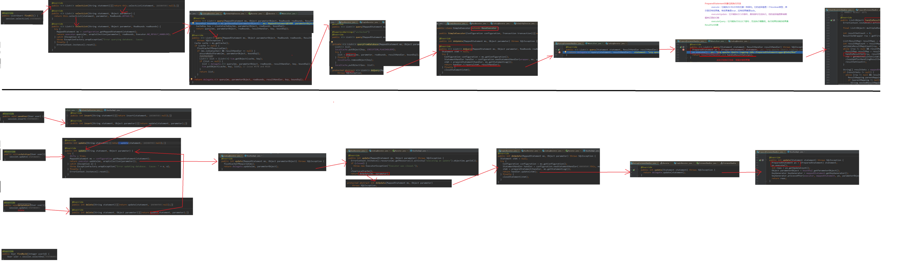
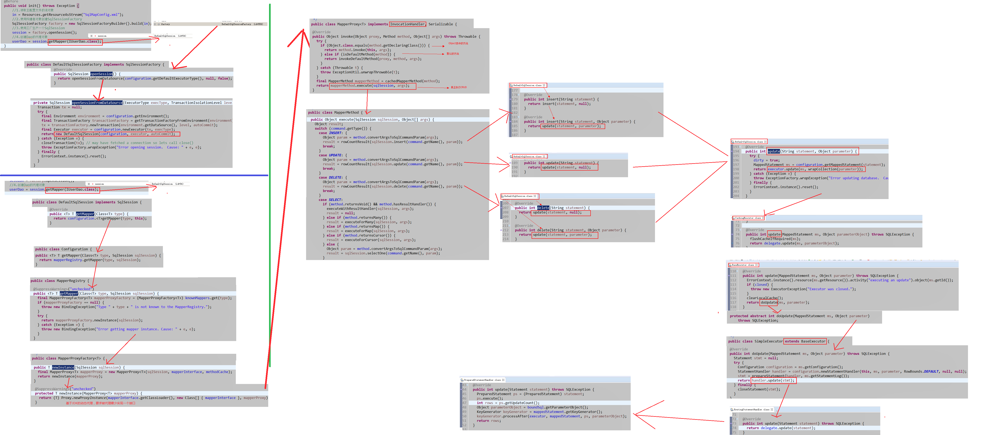

# 基本

# 核心组件

## SqlSessionFactoryBuilder

+ 功能：会根据配置或者代码来生成SqlSessionFactory，采用的是分布构建的Builder模式
+ 生命周期：用于创建SqlSessionFactory，创建成功后就是去了作用，所以只能存在于创建SqlSessionFactory的方法中，**<u>不要长期存在</u>**。
+ 

## SqlSessionFactory

+ 生命周期：
  + 可以被认为是一个数据库连接池，作用是创建SqlSession接口对象，其生命周期存在于整个MyBatis应用中，可以认为**<u>SqlSessionFactory的生命周期就等同于MyBatis的生命周期</u>**。
  + SqlSession是一个对数据库的连接池，如果存在多个不利于对数据库资源的控制，同时也会导致数据库连接资源被耗空。所以往往希望**<u>SqlSessionFactory作为一个单例</u>**。
+ SqlSessionFactory有两个实现类SqlSessionManager和SqlSessionFactoryBuilder，通常使用后者去构件
+ **<u>构建SqlSessionFactory的构建应该使用单例模式，并且需要加锁，防止多线程多次实例化</u>**

### 创建

+ 通过SqlSessionFactoryBuilder读取配置文件创建

  + ```java
    SqlSessionFactoryBuilder builder = new SqlSessionFactoryBuilder();
    SqlSessionFactory factory = builder.build(new FileInputStream("mybatiscfg.xml"));
    ```

+ 通过创建配置文件并使用构造函数创建：

  + ```java
    Configuration configuration = new Configuration();
    SqlSessionFactory factory = new DefaultSqlSessionFactory(configuration);
    ```

## SqlSession

+ 既可以发送sql执行返回结果，也可以获取Mapper的接口。多使用SqlMapper接口编程，提高代码可维护性。
+ **<u>DefaultSqlSession在 单线程下使用</u>**，**<u>SqlSessionManager在多线程下使用</u>**，SqlSession相当于JDBC中的connection对象，代表一个连接资源的启用。使用完成后要在finally中关闭。
+ 生命周期：SqlSession相当于一个数据库的连接对象，可以通过它提交或者回滚事务。**<u>存活在一个业务请求当中</u>**，当**<u>处理完请求后应该关闭这条连接</u>**，归还给SQL Session Factory，否者资源会很快被耗光。使用try...catch...finally...来确保关闭。
+ 在通过SqlSessionFactory获取SqlSession的时候，可以通过**<u>添加一个boolean型的参数来标记是否启用自动提交</u>**，默认需要手动提交
+ 作用：
  + 获取Mapper接口
  + 发送Sql给数据库
  + 控制数据库事务

## SqlMapper

+ 生命周期：它的生命周期应该**<u>小于或者等于SqlSession的生命周期</u>**，Mapper代表的是一个请求中的业务处理，所以应该在一个请求中，一旦完成了相关的事务就应该关闭它。
+ 由一个接口和对应的xml文件组成，主要作用是将Sql查询到的结果映射为一个pojo，或者将pojo的数据插入到数据库中。
+ 使用方式：**<u>如果注解和xml的方式同时定义，xml方式会覆盖掉注解方式</u>**。通常可以将Mapper文件放在resource目录下的同名文件夹内
  + XML文件加接口形式
  + 注解形式

### Select元素

+ 基本元素
  +  id：和接口的方法相对应，给Mybatis调用，如果命名空间和id结合不唯一，会抛出异常。
  +  parameterType：参数的类型，可以给出别名，但是必须是自定义或者内部定义的
  + resultType：结果类型，可以将结果集按照JavaBean自动映射，可以使用别名但是要符合命名规范，**<u>不能和resultMap同时使用</u>**
  + resultMap：结果集，可以提供自定义映射规则
  + flushCache：调用sql要求mybatis是否清空之前查询的本地缓存和二级缓存。
  + useCache：是否启动二级缓存。
  + timeout：设置超时参数
  + fetchSize：获取记录的总条数
  + statementType：选择使用的Statement，Statement，Prepared，Callable。默认为Prepared
  + resultSetType：相对于resultSet接口而言
  + databaseId：使用数据库厂商标识，可以根据不同标识使得sql语句适应不同的数据库
  + resultOrdered：仅适用嵌套结果select语句。
  + resultSets：适用于多个结果集的情况，会列出SQL每个结果集的名称。

### Insert元素

+ 基本元素：
  + id：和接口方法对应
  + parameterType：参数类型
  + flushCache：是否刷新缓存
  + timeout：超时时间
  + statementType：选择使用的Statement，Statement，Prepared，Callable。默认为Prepared
  + useGeneratedKeys：是否启用jdbc的getGeneratedKeys方法取出生成的主键。**<u>常用于主键回填</u>**
  + keyProperty：标记一个属性，通过getGeneratedKeys返回值设置其键值，多个使用逗号隔开
  + keyColumn：设置生成键值对应表中的列名，与KeyProperty对应。
  + databaseId：数据库厂商标识。
+ 主键回填
  + JDBC执行sql后可以通过getGerneratedKeys获取数据库生成主键。insert语句中可以通过配置userGerneratedKeys控制是否打开功能，同时还要配置keyProperty或keyColumn来告诉系统把主键放在那个属性中。**<u>常用于主键设置了自动增长</u>**。

### Update和Delete元素

+ 和Insert元素类似

### Sql元素

+ 可以定义一部分的Sql模板，然后直接引用。

  + 定义

    + ```xml
      <sql id="template">sometemplate</sql>
      ```

  + 引用：在语句相应位置插入

    + ```xml
      <include refid="template" />
      ```

### ResultMap元素

+ 在select之类的标签中定义结果集可以根据结果集进行映射，**<u>需要对每个类定义结果集</u>**。

+ 构成

  + ```xml
    <resultMap id="标识" type="对应的类" autoMapping="自动映射" extends="继承">
        <!--主键-->
        <id property="对应Java属性" column="对应数据库列" javaType="Java的类型" jdbcType="数据库的类型" typeHandler="类型转换器"/>
        <!--元素-->
        <result property="对应Java属性" column="对应数据库列" javaType="Java的类型" jdbcType="数据库的类型" typeHandler="类型转换器"/>
        <constructor><!--构造器--></constructor>
        <!--鉴别器，可以改变封装行为-->
        <discriminator javaType="">
            <case value=""></case>
        </discriminator>
        <association property="对应Java属性" typeHandler="类型转换器" jdbcType="数据库类型" javaType="Java类型" column="对应数据库的列" resultMap="用于封装的结果集" select="指定一个获取相关级联的查询语句" autoMapping="自动映射" foreignColumn="外键" notNullColumn="不为Null" fetchType="">
            <!--一对一级联-->
        </association>
        <collection property="" >
            <!--多对多级联-->
        </collection>
    </resultMap>
    ```

### 级联

+ 级联好处是获取关键数据便捷，但是过多会增加系统复杂度，降低系统性能。**<u>超过3层以上不建议使用级联，会导致系统耦合</u>**。

+ Mybatis使用级联：

  + 一对一级联：association
  + 一对多级联：collection

+ Mybatis级联可以使用**<u>鉴别器discriminator</u>**来根据某些条件来决定使用级联。属性column代表使用那个字段鉴别。子元素case用于区分，相当于Java中的switch

+ 级联的延迟加载

  + 使用延迟加载要加入cglib依赖
  + [在Settings标签中配置Setting](#配置延迟加载)
    + lazyLoadingEnabled：延迟加载全局开关，开启时，所有关联对象都会延迟加载。特定的关系中，通过设置fetchType属性来覆盖该项的开关状态

    + aggressiveLazyLoading：启用时，延迟属性的调用都会带有延迟加载属性的对象完整加载

  + lazyLoadingEnable控制是否开启延迟加载，而aggressiveLazyLoading控制开启是否层级加载，如果要解决层级加载导致其他信息也加载进来，使用association和collection元素配置fetchType属性

    + eager：获取当前POJO后立即加载对应数据
    + lazy：获取当前POJO后延迟加载对应数据

+ 级联两种配置形式：

  + 分层查询：在resultMap中配置级联，并将通过select属性来进行级联

    + 优点：SQL语句简单，容易理解和维护

    + 缺点：存在N+1问题，在进行大量数据查询时效率慢（当然这可以通过延迟加载和分页等进行优化）

    + ```xml
      <resultMap id="resultMap1" type="site.alanliang.geekblog.domain.Article">
          <id property="id" column="id"/>
          <result property="title" column="title"/>
          <!-- 使用了另外一个Sql语句进行级联 -->
          <association property="category" column="category_id"
                     select="site.alanliang.geekblog.mapper.ArticleMapper.selectCategoryById"/>
      </resultMap>
      ```

  + 连接查询：在result Map中配置级联，在sql中把所有相关的选择出来，然后分别对每个resultMap进行级联

    + 优点：消除了N+1问题，在进行大量数据查询时效率比较高

    + 缺点：SQL语句复杂，不易理解和维护

    + ```xml
      <resultMap id="resultMap2" type="site.alanliang.geekblog.domain.Article">
          <id property="id" column="id"/>
          <result property="title" column="title"/>
          <!-- 使用了连接查询inner join来级联 -->
          <association property="category" javaType="site.alanliang.geekblog.domain.Category">
              <id property="id" column="id"/>
              <result property="name" column="name"/>
          </association>
          <collection property="tagList" ofType="site.alanliang.geekblog.domain.Tag">
              <id property="id" column="id"/>
              <id property="name" column="name"/>
          </collection>
      </resultMap>
      ```

### 参数相关

+ 接口中传入的值使用**<u>#{值或el表达式}</u>**来接收。

+ 如果传递了参数，并且没有对应的类型转换器的话。可以在参数后面指定类型转换器。

  + ```xml
    #{age, javaType=int, jdbcType=numeric, typeHandler=MytpyeHandler}
    ```

+ 同时，参数可以对精度进行控制

  + ```xml
    #{width, javaType=double,jdbcType=NUMERIC, numericScale=2}
    ```

+ 调用存储过程

  + ```xml
    #{id, mode=IN}
    #{roleName, mode=out}
    #{note, mode=INOUT}
    ```

+ Mybatis可以使用EL表达式来取对象中的值：

  + ```xml
    #{对象.属性名}
    ```

+ 模糊查询的时候使用**<u>mysql的contact函数来拼接字符串</u>**

### 接口相关

+ 传递多个参数：使用**<u>#{}来获取属性，可能需要用到el表达式来获取属性</u>**
  + 不使用parameter参数，使用#{index}的方式传入参数，index从０开始
  + 使用注解方式，在接口的参数上使用＠Param注解
  + 使用parameterMap
  + 使用LIst或Map传参
  + 总结
    + map传值会导致业务可读性丧失，导致后续扩展和维护困难，不建议使用
    + 注解@param在n<=5时候使用，是最佳的传参方式，比较直观。
    + n>=5时，使用JavaBean的方式
  
+ 分页参数：RowBounds

  + 在接口中可以使用RowBounds来指定页数，而不需要自己计算

  + 只需要在接口中增加一个RowBounds参数，不需要对Mapper做任何处理。

  + 只用于小数据量查询，原理是执行SQL后按照偏移量和限制条数取返回查询结果。大量数据通过分页插件去处理。

  + ```java
    List<Book> selectBookByName(Map<String, Object> map, RowBounds rowBounds);
    ```

  + ```xml
    <select id="selectBookByName" resultMap="BaseResultMap">
        select * from book 
    </select>
    ```

### 缓存

+ 一级缓存：Mybatis中**<u>SqlSession</u>**对象的缓存，查询后查询结果会被放在一块区域内，数据结构是Map，查询同样数据的时候会先去sqlsession中查询，**<u>sqlsession消失后或者调用了更新方法一级缓存就消失了</u>**。调用sqlsession的clearCache方法清空一级缓存
+ 二级缓存：Mybatis中SqlSessionFactory对象的缓存，同一个SqlSessionFactory创建的多个SqlSession共享的缓存空间，二级缓存中存放的是数据而不是对象。**<u>pojo类需要序列化</u>**
  + 配置：
    + [setting中配置cacheEnabled](#开启二级缓存)（默认为true）
    + mapper.xml中开启二级缓存，加入cache标签
    + select中添加useCache属性

# Mybatis配置

+ [基本的配置](#Mybatis配置文件模板)

## properties属性

+ properties可以给系统配置一些运行参数，可以放在xml文件或者properties中。默认提供了三种方式使用properties。使用的时候通过${属性名}来使用

  + property子元素

    + ```xml
      <properties>
          <property name="" value=""/>
      </properties>
      ```

  + properties文件

    + ```xml
      <properties resource=""></properties>
      ```

  + 程序代码传递：常用于有加密的场景

    + ```java
      SqlSessionFactoryBuilder builder = new SqlSessionFactoryBuilder();
      builder.build(new FileInputStream(), new Properties());
      ```

## Settings设置

+ settings是Mybatis中最复杂的配置，能影响Mybatis的底层运行。大部分使用默认值

### <span id="配置延迟加载">配置延迟加载</span>

```xml
<settings>
    <setting name="lazyLoadingEnabled" value="true"/><!--延迟加载/懒加载-->
    <setting name="aggressiveLazyLoading" value="false"/><!--积极加载/预加载-->
</settings>
```

### <span id="开启二级缓存">开启二级缓存</span>

```xml
<settings>
    <!-- 开启二级缓存  默认值为true -->
    <setting name="cacheEnabled" value="true"/>
</settings>
```

### 配置执行器

+ SIMPLE: 默认的执行器, 对每条sql进行预编译->设置参数->执行等操作。为每一个语句创建一个PreparedStatement

+ BATCH: 批量执行器, 对相同sql进行一次预编译, 然后设置参数, 最后统一执行操作

+ REUSE: REUSE 执行器会重用预处理语句。重复使用PreparedStatement

+ 配置方式

+ 全局执行器（不推荐）：

  ```xml
  <settings>
      <setting name="defaultExecutorType" value="BATCH" />
  </settings>
  ```

+ 局部执行器：

   ```java
    SqlSession sqlSession = sqlSessionFactory.openSession(ExecutorType.BATCH)
   ```


## typeAliases别名

+ 别名能通过定义一个简写来代替类的全限定类名，分为系统定义别名和自定义别名，在mybatis中别名不区分大小写

+ 系统定义了一些别名，如果是java基本类型则别名基本上是**<u>_别名</u>**，如果是其他的类型基本上就是类型名。同时可以支持数组，直接在别名后面加上括号，但是**<u>有些数据类型不支持数组的别名</u>**。

+ 注册别名：注册别名使用TypeAliasRegistry的registerAlias方法注册。一般通过Configuration获取TypeAliasRegister类对象，其中由一个getTypeAliasRegistry方法获得别名。然后可以通过registerAlias方法对别名注册。

+ 单一别名：在typeAliases标签中指定typeAlias标签并且带有alias(别名)，type(全限定类名)属性

  + ```xml
    <typeAliases>
        <typeAlias type="" alias=""/>
    </typeAliases>
    ```

+ 扫描别名：在typeAliases标签中指定package标签并且带有name(路径)属性。会扫描包的类，并且将类名变成小驼峰命名法代表别名。如果出现别名，会抛异常。可以使用@Alias(“别名”)注解来区分

  + ```xml
    <typeAliases >
        <!--重复的可以使用@Alias("别名")注解进行区分-->
        <package name="扫描的包"/>
    </typeAliases>
    ```

## typeHandler类型转换器

+ 用于将Java的类型javaType和jdbc的类型jdbcType相互转换。默认提供了常用的typeHandler

+ 系统所有的typeHandler都实现了接口org.apache.ibatis.type.TypeHandler并且继承了BaseTypeHandler

+ 自定义typeHandler：要实现typeHandler需要实现接口typeHandler或者继承BaseTypeHandler

  + ```java
    public class StringTypeHandler extends BaseTypeHandler<String> {
    
      @Override
      public void setNonNullParameter(PreparedStatement ps, int i, String parameter, JdbcType jdbcType)
          throws SQLException {
        ps.setString(i, parameter);
      }
    
      @Override
      public String getNullableResult(ResultSet rs, String columnName)
          throws SQLException {
        return rs.getString(columnName);
      }
    
      @Override
      public String getNullableResult(ResultSet rs, int columnIndex)
          throws SQLException {
        return rs.getString(columnIndex);
      }
    
      @Override
      public String getNullableResult(CallableStatement cs, int columnIndex)
          throws SQLException {
        return cs.getString(columnIndex);
      }
    }
    ```

+ 大多数情况下typeHandler因为枚举使用，Mybatis定义了两个类作为枚举类型的支持分别是EnumOrdinaryTypeHandler和EnumTypeHandler

## ObjectFactory对象工厂

+ 创建结果集的时候，Mybatis会使用一个对象工厂来完成结果集的创建。默认情况下会使用定义的对象工厂DefaultObjectFactory。
+ 自定义ObjectFactory：如果要自定义ObjectFactory一般常继承DefaultObjectFactory，然后对他进行配置。

## plugins插件

## environment运行环境

+ 运行环境分为两个可配置的元素：**<u>事务管理器(transactionManager)</u>**和**<u>数据源(dataSource)</u>**。但在实际中**<u>会采用Spring对数据源和数据库的事务进行管理</u>**。
  + 事务管理器：**<u>不常用，常使用Spring带的事务管理器</u>**
    + 主要的工作是提交，回滚和关闭。Mybatis提供了两个实现类：JdbcTransaction和ManagedTransaction。分别对应了两个工厂，工厂实现了TransactionFactory接口，通过他们生成对应的Transaction对象。
    + 默认事务管理器
      + jdbc：使用jdbc的方式对数据库提交和回滚进行操作
      + managed：把事务交给容器处理，默认情况下，会关闭连接。一般需要把closeConnection设置为false来阻止其默认关闭
    + 自定义事务管理器：需要实现TransactionFactory接口
  + 数据库环境源
    + 主要作用是配置数据库，Mybatis中数据库通过PooledDataSourceFactory，UnpooledDataSourceFactory和JndiDataSourceFactory三个工厂来提供。生成的产品都是一个实现了DataSource接口的数据库连接对象
    + 自定义数据源工厂：需要实现DataSourceFactory接口。然后进行配置

## databaseIdProvider数据库厂商标识

+ 如果定义了属性的话，可以通过在语句中指定databaseId属性来指定使用那条数据库运行

+ **<u>如果指定了数据库id的话，语句会通过当前系统的数据库来匹配寻找那个语句执行，如果没有配置的话则使用默认数据库执行。如果设置了但是没有相应数据库会抛出异常</u>**

+ 自定义规则：实现DatabaseIdprovider接口

+ ```xml
  <databaseIdProvider type="">
      <property name="数据库名" value="数据库别名"/>
  </databaseIdProvider>
  ```

## Mappers映射器文件

+ 接口对应的映射器文件，可以放在resource下的同包名的路径下

+ 引入

  + 文件引入：

    + ```xml
      <mapper resource=”xml文件路径”> // 按照类路径的写法来写
      ```

  + 包名引入：

    + ```xml
      <package name=”mapper接口路径”>
      ```

  + 类注册引入：

    + ```xml
      <mapper class=”全限定类名”> // 注解使用
      ```

  + URL引入：

    + ```xml
      <mapper url=”xml路径”>
      ```


# 动态SQL

+ if元素：相当于Java中的If

  + ```xml
    <if test="条件"></if>
    ```

  + 注意，当条件为Integer判断的时候，如果Integer=0以下判断会出错。因为使用的是El表达式

    ```xml
    <if test="type != null and type != ''">  
        and type = #{type}   
    </if> 
    ```

  + 应该改为：

    ```xml
    <if test="type != null">  
        and type = #{type}   
    </if>
    ```

+ choose、when、otherwise：分别相当于Java中的switch、case、default

+ trim、where、set元素：

  + where：使用where只有当where标签中的条件成立之后，where才会封装到sql语句中。同时where标签可以去掉第一个and或者or
  + trim：使用trim可以去除一些指定的元素，其中prefix代表用于替换的元素，prefixOverrides代表被替换的元素
  + set：用于UPdate语句中

+ foreach：用于遍历集合，拼接之类的

  + ```xml
    <foreach item="roleNo" index="index" collection="roleNoList" open="(" close=")" separator=","></foreach>
    ```

  + collection：传入的参数名称。可以是个集合

  +  item：循环中当前的元素

  + index：当前元素在集合中的位置下标

  +  open和close控制开闭和的标签

  + spearator表示各个元素的间隔符

+ bind元素：bind 标签可以使用 OGNL 表达式创建一个变量井将其绑定到上下文中。以避免因更换数据库而修改 SQL，也能预防 SQL 注入。

# 整合Spring

+ 相关依赖：

  + ```xml
    <dependency>
        <groupId>org.mybatis</groupId>
        <artifactId>mybatis-spring</artifactId>
        <version>1.3.2</version>
    </dependency>
    ```

+ SqlSessionFactoryBean：相当于SqlSessionFactory，可以进行一系列的参数配置。简单的话可以直接使用SpringloC注入，如果复杂可以引入Mybatis的配置文件。

  + 属性property
    + configLocation：用于指定mybatis的XML配置路径，**<u>通常配置settings、typeAliases和mapper</u>**。其中环境配置environments，数据源配置DataSource和事务管理器transactionManager会被忽略，sqlSessionFactoryBean有自带的环境配置

+  SqlSessionTemplate组件：提供了一系列的功能如增删查改，并且是线程安全的类，可以保证每个线程使用的SqlSession唯一且不冲突。只能使用带参的构造方法创建对象

+ MapperFactoryBean：用于配置单独的Mapper

  + 使用MapperFactoryBean类可以配置实现Mapper。而不是通过SqlSession来获取。
  + 需要配置一个Mapper的接口，以及SqlSessionFactoryBean或者SqlSessionTemplate，如果同时配置了的话SqlSessionFactoryBean会被屏蔽掉。
  + 注入mapperInterface属性时，使用value+全限定类名注入。

+ MapperScannerConfigurer：用于扫描Mapper，多个Mapper的时候使用

  + 配置
    + basePackage：指定扫描的包，多个包可以使用逗号隔开
    + annotationClass：指定被什么类注解的时候才扫描，由于Dao通常使用@Repository表示持久层，所以常常指定：org.springframework.stereotype.Repository
    + SqlSessionFactoryBeanName：指定SqlSessionFactory的Bean名称，会被SqlSessionTemplateBeanName覆盖
    + markerInterface：指定一个类实现了说明接口就认为他是Mapper，需要提供一个公共的接口。

  + **<u>如果使用了外置properties的时候不要使用SqlSessionFactory的方式注入，否者会导致数据源中spring注入项还未注入就初始化了数据源</u>**。（https://blog.csdn.net/sqh201030412/article/details/50907284）

+ [参考配置](#Spring整合Mybatis参考配置)

# 源码分析






# 代码

## <span id="Mybatis配置文件模板">Mybatis配置文件模板</span>

```xml
<?xml version="1.0" encoding="UTF-8" ?>
<!DOCTYPE configuration
        PUBLIC "-//mybatis.org//DTD Config 3.0//EN"
        "http://mybatis.org/dtd/mybatis-3-config.dtd">

<configuration>
    <!--相当于Properties文件，可以使用${属性名}来注入-->
    <properties resource="">
        <property name="" value=""/>
    </properties>
    <!--Mybatis底层配置，会影响Mybatis的底层运行-->
    <settings>
        <setting name="" value=""/>
    </settings>
    <!--别名，给一个类指定一个别名-->
    <typeAliases>
        <typeAlias type="" alias=""/>
    </typeAliases>
    <!--类型转换器，将JDBC数据转换成Java对象所需要的转换器-->
    <typeHandlers>
        <typeHandler handler=""></typeHandler>
    </typeHandlers>
    <!--对象工厂，Mybatis创建结果集时创建对象使用的工厂，一般使用默认的-->
    <objectFactory type=""></objectFactory>
    <!--运行时环境，可以指定多个数据库-->
    <environments default="development">
        <environment id="development">
            <!--事务管理器-->
            <transactionManager type="JDBC"></transactionManager>
            <!--数据源-->
            <dataSource type="POOLED">
                <property name="driver" value="${database.driver}"/>
                <property name="url" value="${database.url}"/>
                <property name="username" value="${database.username}"/>
                <property name="password" value="${database.password}"/>
            </dataSource>
        </environment>
    </environments>
    <!--数据库厂商表示-->
    <databaseIdProvider type=""></databaseIdProvider>
    <!--映射文件，接口对Sql语句的映射-->
    <mappers>
        <mapper resource="com/ssm/chapter14/mapper/RoleMapper.xml"></mapper>
    </mappers>
</configuration>
```

## <span id="Mybatis映射文件模板">Mybatis映射文件模板</span>

```java
<?xml version="1.0" encoding="UTF-8" ?>
<!DOCTYPE mapper
  PUBLIC "-//mybatis.org//DTD Mapper 3.0//EN"
  "http://mybatis.org/dtd/mybatis-3-mapper.dtd">
<mapper namespace="com.ssm.chapter14.dao.RoleDao">
	<select id="getRole" parameterType="long" resultType="com.ssm.chapter14.pojo.Role">
		select id, role_name as roleName, note from t_role where id = #{id}
	</select>
</mapper>
```

## <span id="SqlSessionFactory创建工具类">SqlSessionFactory创建工具类</span>

```java
public class SqlSessionFactoryUtils{
    private final static Class<SqlSessionFactoryUtils> LOCK = SqlSessionFactoryUtils.class;
    private static SqlSessionFactory sqlSessionFactory = null;
    private SqlSessionFactoryUtils(){}      // 构造方法私有化，构造单例模式
    public static SqlSessionFactory getSqlSessionFactory(){

            synchronized(LOCK){     // 加锁，防止多线程中多次实例化，保证SqlSessionFactory的唯一性。
                if(sqlSessionFactory != null){
                    return sqlSessionFactory;
                }
                String resource = "mybatis-config.xml";
                InputStream inputStream;
                try {
                    inputStream = Resources.getResourceAsStream(resource);
                    sqlSessionFactory = new SqlSessionFactoryBuilder().build(inputStream);
                } catch (IOException e) {
                    //TODO: handle exception
                    e.printStackTrace();
                    return null;
                }
                return sqlSessionFactory;
            }
    }
}
```

## <span id="Spring整合Mybatis参考配置">Spring整合Mybatis参考配置</span>

```xml
<!--    配置声明式事务管理器-->
<tx:annotation-driven transaction-manager="transactionManager"/>
<!--    导入数据库配置文件-->
<context:property-placeholder location="classpath:config.properties"/>
<bean id="transactionManager" class="org.springframework.jdbc.datasource.DataSourceTransactionManager">
    <property name="dataSource" ref="dataSource" />
</bean>
<bean id="dataSource" class="org.apache.ibatis.datasource.pooled.PooledDataSource">
    <property name="driver" value="${jdbc.driver}" />
    <property name="url" value="${jdbc.url}" />
    <property name="username" value="${jdbc.username}"/>
    <property name="password" value="${jdbc.password}"/>
    <property name="poolMaximumCheckoutTime" value="${jdbc.maxWait}" />
</bean>
<bean id="sqlSessionFactory" class="org.mybatis.spring.SqlSessionFactoryBean">
    <property name="dataSource" ref="dataSource"/>
    <property name="configLocation" value="classpath:mybatis.xml"/>
</bean>
<bean  class="org.mybatis.spring.mapper.MapperScannerConfigurer">
    <property name="basePackage" value="com.ssm.mapper"/>
    <property name="annotationClass" value="org.springframework.stereotype.Repository"/>
    <property name="sqlSessionFactoryBeanName" value="sqlSessionFactory"/>
</bean>
```

