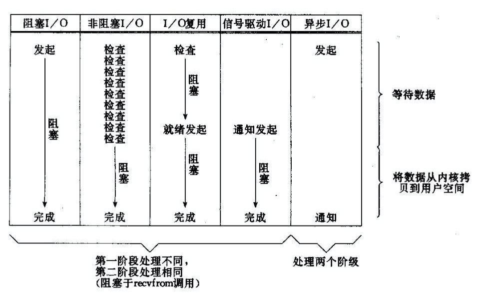
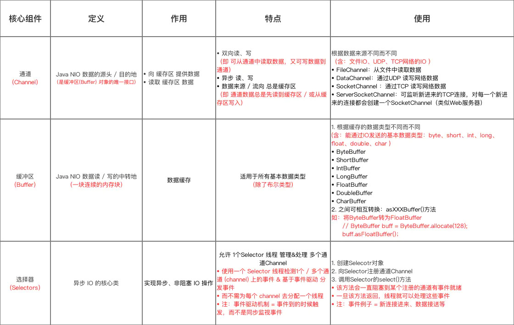
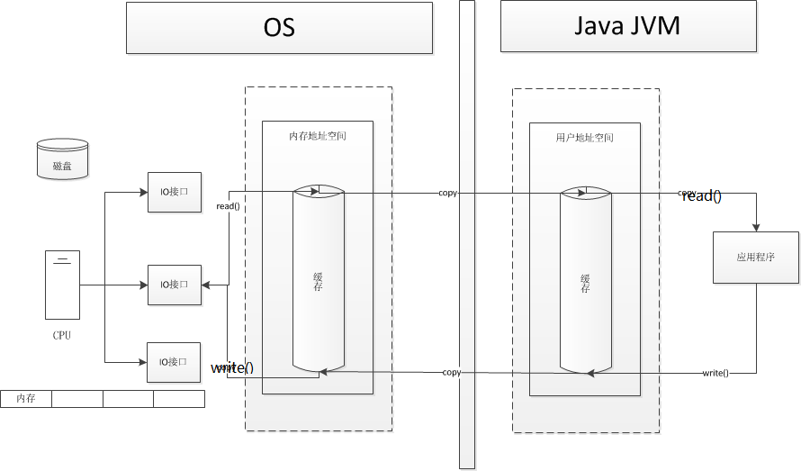
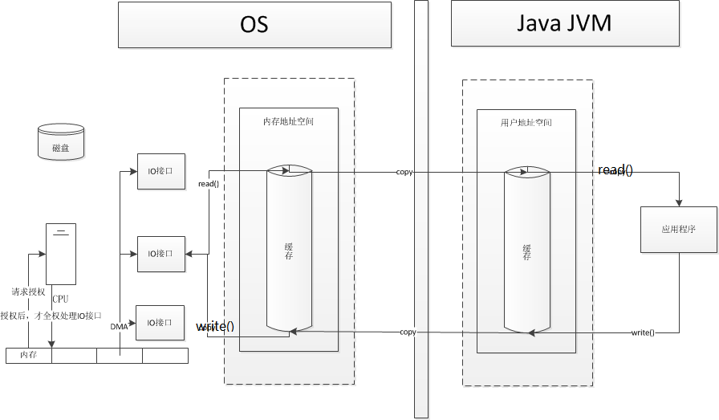

# 基本

https://zhuanlan.zhihu.com/p/23488863

+ 注意：
  + 使用NIO != 高性能，当连接数<1000，并发程度不高或者局域网环境下NIO并没有显著的性能优势。
  + NIO并没有完全屏蔽平台差异，它仍然是基于各个操作系统的I/O系统实现的，差异仍然存在。使用NIO做网络编程构建事件驱动模型并不容易，陷阱重重。

## 常见IO模型



+ 传统的BIO里面socket.read()，如果TCP RecvBuffer里没有数据，函数会一直阻塞，直到收到数据，返回读到的数据。
+ 对于NIO，如果TCP RecvBuffer有数据，就把数据从网卡读到内存，并且返回给用户；反之则直接返回0，永远不会阻塞。
+ 最新的AIO(Async I/O)里面会更进一步：不但等待就绪是非阻塞的，就连数据从网卡到内存的过程也是异步的。
+ BIO里用户最关心“我要读”，NIO里用户最关心"我可以读了"，在AIO模型里用户更需要关注的是“读完了”。
+ NIO一个重要的特点是：socket主要的读、写、注册和接收函数，在等待就绪阶段都是非阻塞的，真正的I/O操作是同步阻塞的（消耗CPU但性能非常高）

# 核心组件



## 通道Channel

+ 类似传统的流，只不过Channel本身不能直接访问数据，只能与buffer进行交互

+ 实现类：

  + FileChannel：文件Channel
  + SocketChannel：TCP Channel
  + ServerSocketChannel：TCP Channel
  + DatagramChannel：UDP Channel

+ 获取通道：

  + 通过FileInputStream、FIleOutputStream、RandomAccessFile、Socket、ServerSocket、DatagramSocket的getChannel方法
  + Channel使用静态方法open
  + 使用Files工具类的newByteChannel方法

+ ```java
  public static void copyFile1() throws Exception{
      FileInputStream inputStream = new FileInputStream("C:\\Users\\Gloduck\\Desktop\\加密.md");
      FileOutputStream outputStream = new FileOutputStream("C:\\Users\\Gloduck\\Desktop\\copy.md");
      FileChannel inputChannel = inputStream.getChannel();
      FileChannel outputChannel = outputStream.getChannel();
      ByteBuffer byteBuffer = ByteBuffer.allocate(1024);
      while (inputChannel.read(byteBuffer) != -1){
          byteBuffer.flip();
          outputChannel.write(byteBuffer);
          byteBuffer.clear();
      }
      inputChannel.close();
      outputChannel.close();
      inputStream.close();
      outputStream.close();
  }
  public static  void copyFile2() throws Exception{
      FileChannel inputChannel = FileChannel.open(Paths.get("C:\\Users\\Gloduck\\Desktop\\加密.md"), StandardOpenOption.READ);
      FileChannel outputChannel = FileChannel.open(Paths.get("C:\\Users\\Gloduck\\Desktop\\copy.md"),StandardOpenOption.READ,StandardOpenOption.WRITE,StandardOpenOption.CREATE);
      MappedByteBuffer inputByteBuffer = inputChannel.map(FileChannel.MapMode.READ_ONLY, 0, inputChannel.size());
      MappedByteBuffer outputByteBuffer = outputChannel.map(FileChannel.MapMode.READ_WRITE, 0, inputChannel.size());
      byte[] bytes = new byte[inputByteBuffer.limit()];
      inputByteBuffer.get(bytes);
      outputByteBuffer.put(bytes);
      inputChannel.close();
      outputChannel.close();
  }
  public static void copyFile3() throws Exception{
      FileChannel inputChannel = FileChannel.open(Paths.get("C:\\Users\\Gloduck\\Desktop\\加密.md"), StandardOpenOption.READ);
      FileChannel outputChannel = FileChannel.open(Paths.get("C:\\Users\\Gloduck\\Desktop\\copy.md"),StandardOpenOption.READ,StandardOpenOption.WRITE,StandardOpenOption.CREATE);
      inputChannel.transferTo(0,inputChannel.size(),outputChannel);
      inputChannel.close();
      outputChannel.close();
  }
  ```

+ 分散（Scatter）与聚集（Gather）

  + 分散读取：分散读取（ Scattering Reads）是指从 Channel 中读取的数据“分散” 到多个 Buffer 中。 特别注意：按照缓冲区的顺序，从 Channel 中读取的数据依次将 Buffer 填满。

  + 聚集写入：聚集写入（ Gathering Writes）是指将多个 Buffer 中的数据“聚集”到 Channel。 特别注意：按照缓冲区的顺序，写入 position 和 limit 之间的数据到 Channel 。 

  + ```java
        public static void ScatterAndGather() throws  Exception{
            // 分散读取
            RandomAccessFile file = new RandomAccessFile("C:\\Users\\Gloduck\\Desktop\\加密.md","rw");
            FileChannel channel = file.getChannel();
            ByteBuffer[] byteBuffers = new ByteBuffer[10];
            for (int i = 0; i < byteBuffers.length; i++) {
                byteBuffers[i] = ByteBuffer.allocate(100);
            }
            channel.read(byteBuffers);
            // 聚集写入
            RandomAccessFile out = new RandomAccessFile("C:\\Users\\Gloduck\\Desktop\\copy.md","rw");
            FileChannel outChannel = out.getChannel();
            for (int i = 0; i < byteBuffers.length; i++) {
                byteBuffers[i].flip();
            }
            outChannel.write(byteBuffers);
            file.close();
            out.close();
            channel.close();
            outChannel.close();
        }
    
    ```

+ IO请求流程

  + 早期计算机IO通过CPU进行处理IO请求
    + 
  + DMA（直接存储器访问）：依靠硬件直接在主存和外部设备之间进行数据传输，在数据IO传输过程中不需要CPU执行程序来干预。当要传输数据时，会向CPU提出DMA请求
    + 
  + Channel
    + 

## 缓冲区Buffer

+ 属性：

  + capacity：容量，表示缓冲区最大存储数据的容量，一旦声明不能改变

  + limit：界限，表示缓冲区可以操作数据的大小（limit后数据不能读写）

  + position：位置，表示缓冲区正在操作数据的位置

  + mark：标记，表示当前position的位置，可以通过reset恢复到mark的位置

  + ```java
    ByteBuffer byteBuffer = ByteBuffer.allocate(1024);
    System.out.println("当前位置：" + byteBuffer.position() + ",限制：" + byteBuffer.limit() + ",容量：" + byteBuffer.capacity());
    byteBuffer.put("asa".getBytes());
    System.out.println("当前位置：" + byteBuffer.position() + ",限制：" + byteBuffer.limit() + ",容量：" + byteBuffer.capacity());
    byteBuffer.flip(); // 转换模式
    System.out.println("当前位置：" + byteBuffer.position() + ",限制：" + byteBuffer.limit() + ",容量：" + byteBuffer.capacity());
    byteBuffer.flip();
    System.out.println("当前位置：" + byteBuffer.position() + ",限制：" + byteBuffer.limit() + ",容量：" + byteBuffer.capacity());
    
    当前位置：0,限制：1024,容量：1024
    当前位置：3,限制：1024,容量：1024
    当前位置：0,限制：3,容量：1024
    当前位置：0,限制：0,容量：1024
    ```

  + Buffer大部分方法只是对mark、limit、position几个游标进行操作。

+ 直接缓冲区和非直接缓冲区：建议将直接缓冲区分配给容易受基础系统的本机IO操作影响的大型、持久的缓冲区

  + 非直接缓冲区：通过allocate方法分配缓冲区，将缓冲区建立在JVM的内存中。

    + 创建的缓冲区，在JVM中内存中创建，在每次调用基础操作系统的一个本机IO之前或者之后，虚拟机都会将缓冲区的内容复制到中间缓冲区（或者从中间缓冲区复制内容），缓冲区的内容驻留在JVM内，因此销毁容易，但是占用JVM内存开销，处理过程中有复制操作。

    + 创建：

      + ```java
        static ByteBuffer allocate(int capacity)
        ```

  + 直接缓冲区：通过allocateDirect方法分配直接缓冲区，将缓冲区建立在物理内存中。

    + 创建的缓冲区，在JVM内存外开辟内存，在每次调用基础操作系统的一个本机IO之前或者之后，虚拟机都会避免将缓冲区的内容复制到中间缓冲区（或者从中间缓冲区复制内容），缓冲区的内容驻留在物理内存内，会少一次复制过程，如果需要循环使用缓冲区，用直接缓冲区可以很大地提高性能。虽然直接缓冲区使JVM可以进行高效的I/O操作，但它使用的内存是操作系统分配的，绕过了JVM堆栈，建立和销毁比堆栈上的缓冲区要更大的开销。

    + 创建：

      + ```java
        static ByteBuffer allocateDirect(int capacity)
        ```

## 选择器Selectors

+ 是SelectableChannel的多路复用器，用于监控SelectableChannel的IO状况。
+ NIO的主要事件有几个：读就绪、写就绪、有新连接到来。
  + 首先需要注册当这几个事件到来的时候所对应的处理器。然后在合适的时机告诉事件选择器：我对这个事件感兴趣。对于写操作，就是写不出去的时候对写事件感兴趣；对于读操作，就是完成连接和系统没有办法承载新读入的数据的时；对于accept，一般是服务器刚启动的时候；而对于connect，一般是connect失败需要重连或者直接异步调用connect的时候。
+ select是阻塞的，无论是通过操作系统的通知（epoll）还是不停的轮询(select，poll)，这个函数是阻塞的。所以你可以放心大胆地在一个while(true)里面调用这个函数而不用担心CPU空转。
+ Java的Selector对于Linux系统来说，有一个致命限制：同一个channel的select不能被并发的调用。因此，如果有多个I/O线程，必须保证：一个socket只能属于一个IoThread，而一个IoThread可以管理多个socket。

# Proactor与Reactor

+ 一般情况下，I/O 复用机制需要事件分发器（event dispatcher）。 事件分发器的作用，即将那些读写事件源分发给各读写事件的处理者。开发人员在开始的时候需要在分发器那里注册感兴趣的事件，并提供相应的处理者（event handler)，或者是回调函数；事件分发器在适当的时候，会将请求的事件分发给这些handler或者回调函数。涉及到事件分发器的两种模式称为：Reactor和Proactor。
+ 

## Reactor模式

+ Reactor模式是基于同步I/O的，事件分发器等待某个事件或者某个应用或某个操作的状态发生（比如文件描述符可读写，或者是socket可读写），事件分发器就**<u>把这个事件传给事先注册的事件处理函数或者回调函数</u>**，由后者来做实际的读写操作。
+ 在Reactor中实现读
  + 注册读就绪事件和相应的事件处理器。
  + 事件分发器等待事件。
  + 事件到来，激活分发器，分发器调用事件对应的处理器。
  + 事件处理器完成实际的读操作，处理读到的数据，注册新的事件，然后返还控制权。

## Proactor模式

+ 事件处理者（或者代由事件分发器发起）**<u>直接发起一个异步读写操作（相当于请求），而实际的工作是由操作系统来完成的</u>**。发起时，需要提供的参数包括用于存放读到数据的缓存区、读的数据大小或用于存放外发数据的缓存区，以及这个请求完后的回调函数等信息。事件分发器得知了这个请求，它默默等待这个请求的完成，然后转发完成事件给相应的事件处理者或者回调。举例来说，在Windows上事件处理者投递了一个异步IO操作（称为overlapped技术），事件分发器等IO Complete事件完成。这种异步模式的典型实现是基于操作系统底层异步API的，所以我们可称之为“系统级别”的或者“真正意义上”的异步，因为具体的读写是由操作系统代劳的。
+ 在Proactor中实现读：
  + 处理器发起异步读操作（注意：操作系统必须支持异步IO）。在这种情况下，处理器无视IO就绪事件，它关注的是完成事件。
  + 事件分发器等待操作完成事件。
  + 在分发器等待过程中，操作系统利用并行的内核线程执行实际的读操作，并将结果数据存入用户自定义缓冲区，最后通知事件分发器读操作完成。
  + 事件分发器呼唤处理器。
  + 事件处理器处理用户自定义缓冲区中的数据，然后启动一个新的异步操作，并将控制权返回事件分发器。

# 其他类

## Charset

+ 提供了字符集编码的转换使用Charset.forName(“字符集”)创建


# 代码

## <span id="阻塞式IO网络通信">阻塞式IO网络通信</span>

```java
@Test
public void client() throws IOException {
    // 1、获取通道（channel）
    SocketChannel socketChannel = SocketChannel.open(new InetSocketAddress("127.0.0.1", 9898));
    FileChannel inChannel = FileChannel.open(Paths.get("Java NIO.pdf"),StandardOpenOption.READ);

    // 2、分配指定大小的缓冲区
    ByteBuffer byteBuffer=ByteBuffer.allocate(1024);

    // 3、读取本地文件，并写入发送channel
    while (inChannel.read(byteBuffer)!=-1) {
        byteBuffer.flip();// 切换到读模式
        socketChannel.write(byteBuffer);
        byteBuffer.clear();// 清空缓冲区
    }

    // 必须shutdown否则就没法切换到接收数据的模式
    socketChannel.shutdownOutput();

    System.out.println("client waiting reading server response");
    // 接收服务端的数据
    int length=0;
    while((length=socketChannel.read(byteBuffer))!=-1){
        byteBuffer.flip();
        System.out.println(new String(byteBuffer.array(),0,length));
        byteBuffer.clear();
    }

    System.out.println("end...");
    inChannel.close();
    socketChannel.close();
}

@Test
public void server() throws IOException{
    // 1、获取通道
    ServerSocketChannel serverSocketChannel = ServerSocketChannel.open();
    FileChannel outChannel=FileChannel.open(Paths.get("33.pdf"), StandardOpenOption.READ,StandardOpenOption.WRITE,StandardOpenOption.CREATE);

    // 2、绑定连接
    serverSocketChannel.bind(new InetSocketAddress(9898));
    // 3、获取客户端的连接
    SocketChannel accept = serverSocketChannel.accept();

    // 4、分配指定大小的缓冲区
    ByteBuffer byteBuffer= ByteBuffer.allocate(1024);
    // 5、接收客户端的数据，并保存到本地
    while (accept.read(byteBuffer)!=-1) {
        byteBuffer.flip();
        outChannel.write(byteBuffer);
        byteBuffer.clear();
    }

    System.out.println("server print ...");

    byteBuffer.put("server success".getBytes());
    byteBuffer.flip();//切换到读模式
    accept.write(byteBuffer);

    // 6、关闭连接
    accept.close();
    outChannel.close();
    serverSocketChannel.close();
}
```

## <span id="非阻塞式IO网络通信">非阻塞式IO网络通信</span>

```java
/**
     * 客户端
     */
@Test
public void client() throws IOException {
    // 1、获取通道（channel）
    SocketChannel socketChannel = SocketChannel.open(new InetSocketAddress("127.0.0.1", 9898));
    // 2、切换成非阻塞模式
    socketChannel.configureBlocking(false);

    // 3、分配指定大小的缓冲区
    ByteBuffer byteBuffer = ByteBuffer.allocate(1024);
    byteBuffer.put("你可理论上的 。。。".getBytes());
    byteBuffer.flip();
    socketChannel.write(byteBuffer);

    socketChannel.close();
}

@Test
public void server() throws IOException {
    // 1、获取通道
    ServerSocketChannel serverSocketChannel = ServerSocketChannel.open();
    // 2.设置为非阻塞
    serverSocketChannel.configureBlocking(false);
    // 3、绑定连接
    serverSocketChannel.bind(new InetSocketAddress(9898));

    // 4、获取Selector选择器
    Selector selector = Selector.open();

    // 5、将通道注册到选择器上,并制定监听事件为：“接收”事件
    serverSocketChannel.register(selector, SelectionKey.OP_ACCEPT);

    // 6、采用轮询的方式获取选择器上“准备就绪”的任务
    while (selector.select() > 0) {
        // 7、获取当前选择器中所有注册的选择键（“已经准备就绪的事件”）
        Iterator<SelectionKey> selectedKeys = selector.selectedKeys().iterator();
        while (selectedKeys.hasNext()) {
            // 8、获取“准备就绪”的时间
            SelectionKey selectedKey = selectedKeys.next();

            // 9、判断key是具体的什么事件
            if (selectedKey.isAcceptable()) {
                // 10、若接受的事件是“接收就绪”事件,就获取客户端连接
                SocketChannel socketChannel = serverSocketChannel.accept();
                // 11、切换为非阻塞模式
                socketChannel.configureBlocking(false);
                // 12、将该通道注册到selector选择器上
                socketChannel.register(selector, SelectionKey.OP_READ);
            } else if (selectedKey.isReadable()) {
                // 13、获取该选择器上的“读就绪”状态的通道
                SocketChannel socketChannel = (SocketChannel) selectedKey.channel();

                // 14、读取数据
                ByteBuffer byteBuffer = ByteBuffer.allocate(1024);
                int length = 0;
                while ((length = socketChannel.read(byteBuffer)) != -1) {
                    byteBuffer.flip();
                    System.out.println(new String(byteBuffer.array(), 0, length));
                    byteBuffer.clear();
                }
                socketChannel.close();
            }

            // 15、移除选择键
            selectedKeys.remove();
        }
    }

    // 7、关闭连接
    serverSocketChannel.close();
}
```

