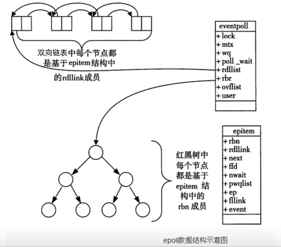
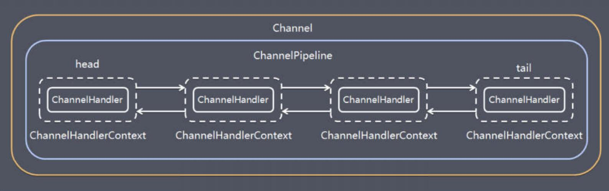
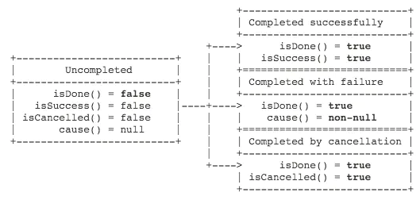
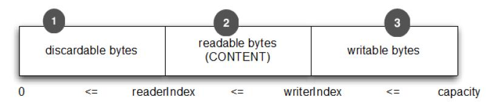

# 简介

## 注意点

+ 一般情况NettyServer有两个EventLoopGroup，其中一个boss使用一个线程，用于建立连接，一个Worker用于读写
+ 如果在worker中要调用耗时的业务，那么一般使用自己实现的线程池，防止后续分发过来的IO请求被阻塞。
+ Netty发送消息有两种方式，一种是通过channel直接发送，一种是通过channel绑定的ChannelHandlerContext发送，对于ChannelHandlerContext来说，发送消息从下一个Handler开始，而对于channel来说，发送消息会从末尾开始。

## 基本

+ 当创建了一个Channel，Netty通过一个单独的EventLoop来注册Channel（每个EventLoop对应一个线程）。所有Netty的IO操作不需要进行同步
+ Bootstrap分为客户端的Bootstrap和服务端的ServerBootstrap
  + Bootstrap：连接远程主机和端口。拥有一个EventLoopGroup
  + ServerBootstrap：绑定本地端口。拥有两个EventLoopGroup
+ Bootstrap有两个Handler，`handler`在初始化的时候就会执行，而`childHandler`会在客户端成功connect后执行
+ ChannelHandler是应用的核心，分为`ChannelOutBoundHandler`和`ChannelInboundHandler`分别用于管理出站和入站流量。ChannelHandler会在程序引导阶段被添加到ChannelPipeline中，并且返回一个`ChannelHandlerContext`代表着一个两者之间的绑定。
+ **I/O 线程一定不能完全阻塞**，禁止任何直接阻塞操作在你的 ChannelHandler， 有一种方法来实现这一要求。你可以指定一个 EventExecutorGroup 当添加 ChannelHandler 到ChannelPipeline。此 EventExecutorGroup 将用于获得EventExecutor，将执行所有的 ChannelHandler 的方法。这EventExecutor 将从 I/O 线程使用不同的线程，从而释放EventLoop。

## 不使用AIO

+ Netty不看重Windows上的使用，在Linux系统上，AIO的底层实现仍使用EPOLL，没有很好实现AIO，因此在性能上没有明显的优势，而且被JDK封装了一层不容易深度优化
+ Netty整体架构是reactor模型, 而AIO是proactor模型, 混合在一起会非常混乱,把AIO也改造成reactor模型看起来是把epoll绕个弯又绕回来
+ AIO还有个缺点是接收数据需要预先分配缓存, 而不是NIO那种需要接收时才需要分配缓存, 所以对连接数量非常大但流量小的情况, 内存浪费很多
+ Linux上AIO不够成熟，处理回调结果速度跟不到处理需求，比如外卖员太少，顾客太多，供不应求，造成处理速度有瓶颈
+ 不支持数据报
+ 不必要的线程模型（太多没什么用的抽象化）

## Bio，Nio，Aio

+ Bio：同步阻塞 I/O 模式，数据的读取写入必须阻塞在一个线程内等待其完成。在客户端连接数量不高的情况下，是没问题的。但是，当面对十万甚至百万级连接的时候，传统的 BIO 模型是无能为力的。因此，我们需要一种更高效的 I/O 处理模型来应对更高的并发量。
+ Nio：NIO 是一种同步非阻塞的 I/O 模型，于 Java 1.4 中引入，对应 java.nio 包，提供了 Channel , Selector，Buffer 等抽象。NIO 中的 N 可以理解为 Non-blocking，不单纯是 New。它支持面向缓冲的，基于通道的 I/O 操作方法。 NIO 提供了与传统 BIO 模型中的 `Socket` 和 `ServerSocket` 相对应的 `SocketChannel` 和 `ServerSocketChannel` 两种不同的套接字通道实现,两种通道都支持阻塞和非阻塞两种模式。对于高负载、高并发的（网络）应用，应使用 NIO 的非阻塞模式来开发
+ Aio：AIO 也就是 NIO 2。在 Java 7 中引入了 NIO 的改进版 NIO 2,它是异步非阻塞的 IO 模型。异步 IO 是基于事件和回调机制实现的，也就是应用操作之后会直接返回，不会堵塞在那里，当后台处理完成，操作系统会通知相应的线程进行后续的操作。AIO 是异步 IO 的缩写，虽然 NIO 在网络操作中，提供了非阻塞的方法，但是 NIO 的 IO 行为还是同步的。对于 NIO 来说，我们的业务线程是在 IO 操作准备好时，得到通知，接着就由这个线程自行进行 IO 操作，IO 操作本身是同步的。查阅网上相关资料，我发现就目前来说 AIO 的应用还不是很广泛，Netty 之前也尝试使用过 AIO，不过又放弃了。

## Proactor与Reactor

+ Reactor： Reactor模式是基于同步I/O的，而Proactor模式是和异步I/O相关的。在Reactor模式中，事件分发器等待某个事件或者可应用或个操作的状态发生（比如文件描述符可读写，或者是socket可读写），事件分发器就把这个事件传给事先注册的事件处理函数或者回调函数，由后者来做实际的读写操作。
+ Proactor模式中，事件处理者（或者代由事件分发器发起）直接发起一个异步读写操作（相当于请求），而实际的工作是由操作系统来完成的。发起时，需要提供的参数包括用于存放读到数据的缓存区、读的数据大小或用于存放外发数据的缓存区，以及这个请求完后的回调函数等信息。事件分发器得知了这个请求，它默默等待这个请求的完成，然后转发完成事件给相应的事件处理者或者回调。
+ Reactor用于同步IO，而Proactor用于异步IO。前者是由回调函数来进行实际的读写操作（能收了你跟俺说一声。），后者是由操作系统来进行实际的读写操作（你给我收十个字节，收好了跟俺说一声。）。

## 多路复用模型

https://blog.csdn.net/jiejiemcu/article/details/107083724

https://www.cnblogs.com/charlesblc/p/6242479.html

### select

+ select机制会监听它所负责的所有socket，当其中一个socket或者多个socket可读或者可写的时候，它就会返回，而如果所有的socket都是不可读或者不可写的时候，这个进程就会被阻塞，直到超时或者socket可读写，当select函数返回后，可以通过遍历fdset，来找到就绪的描述符。
  + 用户进程调用select()函数，如果当前没有可读写的socket，则用户进程进入阻塞状态。
  + 对于内核空间来说，它会从用户空间拷贝fd_set到内核空间，然后在内核中遍历一遍所有的socket描述符，如果没有满足条件的socket描述符，内核将进行休眠，当设备驱动发生自身资源可读写后，会唤醒其等待队列上睡眠的内核进程，即在socket可读写时唤醒，或者在超时后唤醒。
  + 返回select()函数的调用结果给用户进程，返回就绪socket描述符的数目，超时返回0，出错返回-1。
  + 注意，在select()函数返回后还是需要轮询去找到就绪的socket描述符的，此时用户进程才可以去操作socket。
+ 缺点：
  + 单个进程能够监视的文件描述符的数量存在最大限制，在Linux上一般为1024，可以通过修改宏定义甚至重新编译内核的方式提升这一限制，但是这样也会造成效率的降低。
  + 需要维护一个用来存放大量fd的数据结构，这样会使得用户空间和内核空间在传递该结构时复制开销大。
  + 每次在有socket描述符活跃的时候，都需要遍历一遍所有的fd找到该描述符，这会带来大量的时间消耗（时间复杂度是O(n)，并且伴随着描述符越多，这开销呈线性增长）

### poll

+ poll的实现和select非常相似，只是描述fd集合的方式不同，poll使用`pollfd`结构而不是select的`fd_set`结构，poll不限制socket描述符的个数，因为它是使用链表维护这些socket描述符的，其他的都差不多和select()函数一样，poll()函数返回后，需要轮询`pollfd`来获取就绪的描述符，根据描述符的状态进行处理，但是poll没有最大文件描述符数量的限制。poll和select同样存在一个缺点就是，包含大量文件描述符的数组被整体复制于用户态和内核的地址空间之间，而不论这些文件描述符是否就绪，它的开销随着文件描述符数量的增加而线性增大。

### epoll

+ epoll使用一个epfd（epoll文件描述符）管理多个socket描述符，epoll不限制socket描述符的个数，将用户空间的socket描述符的事件存放到内核的一个事件表中，这样在用户空间和内核空间的copy只需一次。当epoll记录的socket产生就绪的时候，epoll会通过callback的方式来激活这个fd，这样子在epoll_wait便可以收到通知，告知应用层哪个socket就绪了，这种通知的方式是可以直接得到那个socket就绪的，因此相比于select和poll，它不需要遍历socket列表，时间复杂度是O(1)，不会因为记录的socket增多而导致开销变大。
+ epoll相关系统调用：
  + epoll_create：创建一个epoll文件描述符
  + epoll_ctl：用来增删改监听的文件描述符及事件，添加的事件将会被挂载到红黑树上。
  + epoll_wait/epoll_pwait：接收发生在被侦听的描述符上的，用户感兴趣的IO事件。当调用epoll_wait时，只需要观察双向链表中是否有数据就行。有数据就返回，没有数据就sleep，如果超时也返回。
+ epoll使用红黑树记录添加的socket，使用双向链表来接收内核触发的事件。

```c
struct eventpoll{
    ....
    /*红黑树的根节点，这颗树中存储着所有添加到epoll中的需要监控的事件*/
    struct rb_root  rbr;
    /*双链表中则存放着将要通过epoll_wait返回给用户的满足条件的事件*/
    struct list_head rdlist;
    ....
};
```

+ 对于每一个事件都会创建一个epitem结构体

```c
struct epitem{
    struct rb_node  rbn;//红黑树节点
    struct list_head    rdllink;//双向链表节点
    struct epoll_filefd  ffd;  //事件句柄信息
    struct eventpoll *ep;    //指向其所属的eventpoll对象
    struct epoll_event event; //期待发生的事件类型
}
```



+ epoll对socket描述符的操作有两种模式：LT（level trigger）和ET（edge trigger）。LT模式是默认模式，LT模式与ET模式的区别如下：
  + LT模式：即水平触发模式，当epoll_wait检测到socket描述符处于就绪时就通知应用程序，应用程序可以不立即处理它。下次调用epoll_wait时，还会再次产生通知。
  + ET模式：即边缘触发模式，当epoll_wait检测到socket描述符处于就绪时就通知应用程序，应用程序必须立即处理它。如果不处理，下次调用epoll_wait时，不会再次产生通知。
+ 当我们执行epoll_ctl时，除了把socket放到epoll文件系统里file对象对应的红黑树上之外，还会给内核中断处理程序注册一个回调函数，告诉内核，如果这个句柄的中断到了，就把它放到准备就绪list链表里。所以，当一个socket上有数据到了，内核在把网卡上的数据copy到内核中后就来把socket插入到准备就绪链表里了。
+ 当一个socket句柄上有事件发生的时候，内核就会将句柄加入到准备就绪的双向链表中，如果调用了epoll_wait，就会把socket拷贝到用户内存，然后清空双向链表。如果是LT模式，如果发现socket还有未处理的事件，就会继续将这个句柄放入双向链表。

## 零拷贝

+ Netty的零拷贝主要表现在三个方面：
  + Netty 的接收和发送 ByteBuffer 采用 DIRECT BUFFERS，使用堆外直接内存进行 Socket 读写，不需要进行字节缓冲区的二次拷贝。如果使用传统的堆内存（HEAP BUFFERS）进行 Socket 读写，JVM 会将堆内存 Buffer 拷贝一份到直接内存中，然后才写入 Socket 中。相比于堆外直接内存，消息在发送过程中多了一次缓冲区的内存拷贝。
  + Netty 提供了组合 Buffer 对象，可以聚合多个 ByteBuffer 对象，用户可以像操作一个 Buffer 那样方便的对组合 Buffer 进行操作，避免了传统通过内存拷贝的方式将几个小 Buffer 合并成一个大的 Buffer。
  + Netty 的文件传输采用了 transferTo（对应`sendfile`系统调用） 方法，它可以直接将文件缓冲区的数据发送到目标 Channel，避免了传统通过循环 write 方式导致的内存拷贝问题。

## 粘包和拆包

+ Netty解决粘包方式：
  + 使用封装后的更高级的协议
  + 使用带消息头的协议，并且在消息头中存储信息的开始表示和消息的长度。
    + 相关类：`LengthFieldBasedFrameDecoder`和`LengthFieldPrepender`
      + `LengthFieldBasedFrameDecoder`：该解码器会每次读取固定长度的消息，如果当前读取到的消息不足指定长度，那么就会等待下一个消息到达后进行补足。`LengthFieldBasedFrameDecoder`只是一个解码器。
      + `LengthFieldPrepender`：该编码器会给数据包中添加一个长度字段。一般和`LengthFieldBasedFrameDecoder`一起使用。`LengthFieldPrepender`只是一个编码器。
  + 使用定长消息，服务端每次读取指定长度的内容作为一条完整的消息，当消息不够长时空位不上固定字符。
    + 相关类：`FixedLengthFrameDecoder`
  + 设置消息边界，服务端从网络流中按消息边界分离出消息的内容。
    + 相关类：`LineBasedFrameDecoder`和`DelimiterBasedFrameDecoder`
      + 这两个只是一个解码器，添加分隔符的操作需要用户自行处理。

## 序列化协议

+ 常见序列化协议对比：

  + | 序列化方式             | 无默认构造函数 | 循环引用              | 对象为null | 是否需要预先知道对象所属的类 | 大对象(4M) |
    | ---------------------- | -------------- | --------------------- | ---------- | ---------------------------- | ---------- |
    | **Kryo**               | 支持           | 需将reference选项打开 | 支持       | 不需要，关闭register         | 支持       |
    | **Java**               | 支持           | 支持                  | 支持       | 不需要                       | 支持       |
    | **Protostuff**         | 支持           | 支持                  | 支持       | 不需要                       | 支持       |
    | **Protostuff-runtime** | 不支持         | 支持                  | 支持       | 需要                         | 支持       |
    | **Hessian**            | 支持           | 支持                  | 支持       | 不需要                       | 支持       |

### JDK

### protobuf

+ protobuf 是google开源的一个序列化框架，类似xml，json，最大的特点是基于二进制，比传统的XML表示同样一段内容要短小得多。还可以定义一些可选字段，用于服务端与客户端通信。
+ 优点：
  + 序列化速度快，序列化后体积小，传输更快。
  + 可以自定义数据结构，
  + 支持多个平台。
  + 通过标识字段的顺序，可以实现协议的前向兼容。
  + 支持向前兼容和向后兼容。
+ 缺点：
  + 需要编写`.proto`文件，然后生成代码
+ 支持数据类型：bool、double、float、int32、int64、string、bytes、enum、message
+ 限定符：
  + require：必须赋值。
  + optional：字段可以赋值，也可以不赋值。
  + repeated：字段可以重复容易次数。
  + enum：只能用指定的值作为值。
+ 基本规则：每个消息中必须至少留有一个 required类型的字段、包含0个或多个optional类型的字段; repeated表示的字段可以包含0个或多个数据;[1,15]之内的标识号在编码的时候会占用一个字节(常用),[16,2047]之内的标识号则占用2个字节,标识号定不能重复、使用消息类型,也可以将消息嵌套任意多层,可用嵌套消息类型来代替组。
+ protobuf的消息升级原则:不要更改任何已有的字段的数值标识;不能移除已经存在的required字段, optional和 repeated类型的字段可以被移除,但要保留标号不能被重用。新添加的字段必须是 optional或 repeated。因为旧版本程序无法读取或写入新增的 required限定符的字段。


### Kryo

+ [Kryo官方文档](https://github.com/EsotericSoftware/kryo/blob/master/README.md)

+ 优点：
  + kryo同时会记录对象的类型信息，放进序列化结果中。反序列化的时候不需要再提供类型信息。
  + 支持类注册，kryo可以注册类，注册的类会被分配到一个Id（不同机器id可能不同）。这样在传输的过程中就不需要带上类的全限定类名了。同还可以避免反序列化的安全隐患。
  + 支持循环引用。
+ 缺点：
  + 不支持不同版本之间的兼容，如果在被序列化后修改了某些字段，反序列化的时候就会反序列化异常。
  + kryo不是线程安全的，需要保证线程安全（可以使用ThreadLocal或池化）。

## 长短连接

+ 长连接： client 向 server 双方建立连接之后，即使 client 与 server 完成一次读写，它们之间的连接并不会主动关闭，后续的读写操作会继续使用这个连接。
  + 缺点：
    + 维护长连接需要耗费资源
+ 短链接： server 端 与 client 端建立连接之后，读写完成之后就关闭掉连接，如果下一次再要互相发送消息，就要重新连接。
  + 缺点：
    + 每一次的读写都要建立连接必然会带来大量网络资源的消耗，并且连接的建立也需要耗费时间。

# JDK NIO

## 基本

+ JDKNIO的问题：
  + `Selector.select`会导致select在没有准备好事件的时候提前返回，而一般又会在循环中调用select方法，导致照成空转

# 常见的Option

+ ChannelOption.SO_BACKLOG：
  + 对应的是tcp/ip协议listen函数中的backlog参数。BackLog指定了连接队列的大小
+ ChannelOption.SO_REUSEADDR：
  + 对应于套接字选项中的SO_REUSEADDR，这个参数表示允许重复使用本地地址和端口。
    + 比如，某个服务器进程占用了TCP的80端口进行监听，此时再次监听该端口就会返回错误，使用该参数就可以解决问题，该参数允许共用该端口，这个在服务器程序中比较常使用。
    + 比如某个进程非正常退出，该程序占用的端口可能要被占用一段时间才能允许其他进程使用，而且程序死掉以后，内核一需要一定的时间才能够释放此端口，不设置SO_REUSEADDR就无法正常使用该端口。
+ ChannelOption.SO_KEEPALIVE：
  + 当设置该选项以后，如果在两小时内没有数据的通信时，TCP会自动发送一个活动探测数据报文。
+ ChannelOption.SO_SNDBUF和ChannelOption.SO_RCVBUF：
  + 分别对应发送缓冲和接收缓冲区的大小。
+ ChannelOption.SO_LINGER：
  + 对应于套接字选项中的SO_LINGER，Linux内核默认的处理方式是当用户调用close（）方法的时候，函数返回，在可能的情况下，尽量发送数据，不一定保证会发送剩余的数据，造成了数据的不确定性，使用SO_LINGER可以阻塞close()的调用时间，直到数据完全发送。
  + l_onoff = 0代表关闭SO_LINGER特性，close函数立即返回，如果发送区有数据，则将发送缓冲区的数据发送给对端后关闭连接。
  + l_onff = 1代表开启SO_LINGER特性，如果x大于0，则close函数会阻塞，如果在x秒内发送完缓冲区数据，则正常关闭连接。如果没有发送完缓冲区数据，则发送RST包给对端。
+ ChannelOption.TCP_NODELAY：
  + 该参数的作用就是禁止使用Nagle算法，使用于小数据即时传输。和TCP_NODELAY相对应的是TCP_CORK，该选项是需要等到发送的数据量最大的时候，一次性发送数据，适用于文件传输。
    + Nagle算法是将小的数据包组装为更大的帧然后进行发送，而不是输入一次发送一次，因此在数据包不足的时候会等待其他数据的到来，组装成大的数据包进行发送，虽然该算法有效提高了网络的有效负载，但是却造成了延时。

# 常见Handler

## IdleStateHandler

+ 空闲状态处理器，能处理读空闲、写空闲、读写空闲。如果发生了空闲，`userEventTriggered`方法就会被触发。可以通过此Handler来实现心跳机制。

+ 参数：

  ```java
  private final boolean observeOutput;// 是否考虑出站时较慢的情况。默认值是false（不考虑）。
  private final long readerIdleTimeNanos; // 读事件空闲时间，0 则禁用事件
  private final long writerIdleTimeNanos;// 写事件空闲时间，0 则禁用事件
  private final long allIdleTimeNanos; //读或写空闲时间，0 则禁用事件

+ IdleStateHandler 的实现基于 EventLoop 的定时任务，每次读写都会记录一个值，在定时任务运行的时候，通过计算当前时间和设置时间和上次事件发生时间的结果，来判断是否空闲。
+ 内部有 3 个定时任务，分别对应读事件，写事件，读写事件。通常用户监听读写事件就足够了。
+ 同时，IdleStateHandler 内部也考虑了一些极端情况：客户端接收缓慢，一次接收数据的速度超过了设置的空闲时间。Netty 通过构造方法中的 observeOutput 属性来决定是否对出站缓冲区的情况进行判断。默认为false，即出站缓慢也认为是空闲。因为此时更需要关注的是OOM。

# Handler常见方法

+ `handlerAdded`：
+ `handlerRemoved`：
+ `channelRegistered`：
+ `channelActive`：

# 核心组件


## Bootstrap和Server Bootstrap

+ Netty 应用程序通过设置 bootstrap（引导）类的开始，该类提供了一个 用于应用程序网络层配置的容器。

+ BootStrap对应的是客户端的引导类，而ServerBootstrap对应的是服务端的引导类：

  + Bootstrap

  ```java
   EventLoopGroup group = new NioEventLoopGroup();
          try {
              //创建客户端启动引导/辅助类：Bootstrap
              Bootstrap b = new Bootstrap();
              //指定线程模型
              b.group(group).
                      ......
              // 尝试建立连接
              ChannelFuture f = b.connect(host, port).sync();
              f.channel().closeFuture().sync();
          } finally {
              // 优雅关闭相关线程组资源
              group.shutdownGracefully();
          }
  ```

  + ServerBootstrap

  ```java
    		// 1.bossGroup 用于接收连接，workerGroup 用于具体的处理
          EventLoopGroup bossGroup = new NioEventLoopGroup(1);
          EventLoopGroup workerGroup = new NioEventLoopGroup();
          try {
              //2.创建服务端启动引导/辅助类：ServerBootstrap
              ServerBootstrap b = new ServerBootstrap();
              //3.给引导类配置两大线程组,确定了线程模型
              b.group(bossGroup, workerGroup).
                     ......
              // 6.绑定端口
              ChannelFuture f = b.bind(port).sync();
              // 等待连接关闭
              f.channel().closeFuture().sync();
          } finally {
              //7.优雅关闭相关线程组资源
              bossGroup.shutdownGracefully();
              workerGroup.shutdownGracefully();
          }
      }
  ```

+ 

## Channel

+ 底层网络传输 API 必须提供给应用 I/O操作的接口，如读，写，连接，绑定等等。对于我们来说，这是结构几乎总是会成为一个“socket”。 Netty 中的接口 Channel 定义了与 socket 丰富交互的操作集：bind, close, config, connect, isActive, isOpen, isWritable, read, write 等等。 Netty 提供大量的 Channel 实现来专门使用。这些包括 AbstractChannel，AbstractNioByteChannel，AbstractNioChannel，EmbeddedChannel， LocalServerChannel，NioSocketChannel 等等。

## ChannelHandler

+ ChannelHandler 支持很多协议，并且提供用于数据处理的容器。我们已经知道 ChannelHandler 由特定事件触发。 ChannelHandler 可专用于几乎所有的动作，包括将一个对象转为字节（或相反），执行过程中抛出的异常处理。
+ handler是发生在初始化的时候，而childHandler是发生在客户端连接之后。
+ 常用的一个接口是 ChannelInboundHandler，这个类型接收到入站事件（包括接收到的数据）可以处理应用程序逻辑。当你需要提供响应时，你也可以从 ChannelInboundHandler 冲刷数据。**一句话，业务逻辑经常存活于一个或者多个 ChannelInboundHandler**。
+ ChannelHandler有两个重要的接口：ChannelInBoundHandler和ChannelOutBoundHandler
  + InBound可以理解为网络数据从外部流向系统内部。一般用于执行半包/粘包，解码，读取数据等
  + OutBound可以理解为网络数据从内部流向系统外部。一般用来进行编码，发送报文到客户端。

## ChannelPipeline

+ ChannelPipeline 提供了一个容器给 ChannelHandler 链并提供了一个API 用于管理沿着链入站和出站事件的流动。每个 Channel 都有自己的ChannelPipeline，当 Channel 创建时自动创建的。 ChannelHandler 是如何安装在 ChannelPipeline？ 主要是实现了ChannelHandler 的抽象 ChannelInitializer。ChannelInitializer子类 通过 ServerBootstrap 进行注册。当它的方法 initChannel() 被调用时，这个对象将安装自定义的 ChannelHandler 集到 pipeline。当这个操作完成时，ChannelInitializer 子类则 从 ChannelPipeline 自动删除自身。

## ChannelHandlerContext

+ 保存了Channel的所有上下文信息，同时关联了一个ChannelHandler对象。
+ 

## EventLoop

+ EventLoop 用于处理 Channel 的 I/O 操作。一个EventLoop对应一个线程，并且一个连接{（Channel）始终会对应着一个对应的EventLoop，而一个EventLoop会对应多个连接。

+ 一个EventLoopGroup对应多个EventLoop。EventLoopGroup如果不指定线程数的话，那么会设置默认值。为相关参数、1、CPU核心数 * 2的三者的最大值。

  + ```java
    DEFAULT_EVENT_LOOP_THREADS = Math.max(1, SystemPropertyUtil.getInt(
        "io.netty.eventLoopThreads", NettyRuntime.availableProcessors() * 2));
    ```

+ 在EventLoopGroup的父类`MultithreadEventExecutorGroup`中维护了由`EventExecutor`组成的线程池，并且通过`EventExecutorChooser`来从`EventExecutor`中选择一个线程来执行任务。

+ 当一个连接到达时，Netty就会注册一个Channel，然后从EventLoopGroup中分配一个EventLoop绑定到这个Channel上。

+ 通常EventLoop分为Boss和worker两类group。

## ChannelFuture

+ ChannelFuture的作用是用来保存Channel异步操作的结果。Netty 所有的 I/O 操作都是异步。因为一个操作可能无法立即返回，我们需要有一种方法在以后确定它的结果。出于这个目的，Netty 提供了接口 ChannelFuture,它的 addListener 方法注册了一个 ChannelFutureListener ，当操作完成时，可以被通知（不管成功与否）。
+ 对于一个ChannelFuture可能已经完成，也可能未完成。当一个I/O操作开始的时候，一个新的future对象就会被创建。在开始的时候，新的future是未完成的状态－－它既非成功、失败，也非被取消，因为I/O操作还没有结束。如果I/O操作以成功、失败或者被取消中的任何一种状态结束了，那么这个future将会被标记为已完成，并包含更多详细的信息（例如：失败的原因）。请注意，即使是失败和被取消的状态，也是属于已完成的状态。
+ 

## ByteBuf

+ 
+ ByteBuf维护了`writerIndex`和`readIndex`
  + 当写入索引和读取索引位置相同的时候，ByteBuf不可读
  + 当访问数据超过最大后，抛出`IndexOutOfBoundsException`异常
  + 0 <= readerIndex <= writerIndex <= capacity
+ ByteBuf分为**堆缓冲区**和**直接缓冲区**和**复合缓冲区**
  + 堆缓冲区：将数据分配在JVM的堆空间
  + 直接缓冲区：分配在内存空间，无法GC
  + 复合缓冲区：`ByteBuf`的子类`CompositeByteBuf`来处理。

# 传输方式

## NIO

## OIO

## Local

## Embedded

# Netty引用计数

[Netty引用计数详解](http://ifeve.com/reference-counted-objects/)

+ Netty中使用引用计数来管理对象的生命周期，一旦对象不再被引用后，Netty 会将它（或它共享的资源）归还到对象池（或对象分配器）。引用计数的接口为`ReferenceCounted`

## 内存泄漏

+ Netty引用计数的缺点是，容易发生内存泄漏。因为JVM并不知道Netty的引用计数实现，当引用计数对象不 可达时，JVM就会将它们GC掉，即时此时它们的引用计数并不为0。一旦对象被GC就不能再访问，也就不能 归还到缓冲池，所以会导致内存泄露。
+ Netty内存泄漏检查：使用参数` -Dio.netty.leakDetectionLevel=advanced`
  + DISABLED – 完全禁用检查。不推荐。
  + SIMPLE – 检查1%的缓冲区是否存在内存泄露。默认。
  + ADVANCED – 检查1%的缓冲区，并提示发生内存泄露的位置
  + PARANOID – 与ADVANCED等级一样，不同的是会检查所有的缓冲区。对于自动化测试很有用，你可以让构建测试失败 如果构建输出中包含’LEAK’ 用JVM选项 -Dio.netty.leakDetectionLevel 来指定内存泄露检查等级

# 代码分析

## 启动流程

+ [启动流程代码分析](https://www.jianshu.com/p/c5068caab217)，[启动流程代码分析](https://cloud.tencent.com/developer/article/1152635)

+ `AbstractBootstrap#doBind`

  ```java
  private ChannelFuture doBind(final SocketAddress localAddress) {
      //...
      // 初始化并注册
      final ChannelFuture regFuture = initAndRegister();
      //...
      final Channel channel = regFuture.channel();
      //...
  	// 执行绑定
      doBind0(regFuture, channel, localAddress, promise);
      //...
      return promise;
  }
  ```

+ `AbstractBootstrap#initAndRegister`：初始化并注册

  + 创建channel，通过一开始Bootstrap`channel()`中传入的class然后通过无参构造器反射创建一个`Channel`对象。具体是通过`ChannelFactory#newChannel`实现的。在这一步只是初始化了一些组件（Channel、ChannelConfig、ChannelId、Unsafe、Pipeline、ChannelHander）
  + 初始化channel。抽象方法，由具体的实现类实现。
    + 主要设置为Channel设置option和attr。
    + 对于服务端pipline添加了一个`ChannelHandler`（Bootstrap中配置的），一个`ServerBootstrapAcceptor`（用于接收请求）
  + 注册这个channel
    + 调用一个next方法选择EventLoopGroup中的一个EventLoop
    + 将EventLoop绑定到Channel上。
    + 执行注册，如果是NioChannel，则向Java的Nio注册`AbstractNioChannel#doRegister`
    + 调用handlerAdded方法
    + 调用channelRegistered方法
  
  ```java
  final ChannelFuture initAndRegister() {
      Channel channel = null;
      // ...
      channel = channelFactory.newChannel();
      //...
      init(channel);
      //...
      // 此处的register会调用EventLoopGroup#next方法选择一个EventLoop去注册这个channel
      ChannelFuture regFuture = config().group().register(channel);
      //...
      return regFuture;
  }
  ```
  + 注册channel流程
  
  ```java
  // MultithreadEventLoopGroup#register
  public ChannelFuture register(Channel channel) {
      // 这里的next会从EventLoopGroup中选择一个EventLoop然后去注册当前Channel
      return next().register(channel);
  }
  
  // SingleThreadEventLoop#register
  // 调用选中的EventLoop的register方法
  public ChannelFuture register(Channel channel) {
      return register(new DefaultChannelPromise(channel, this));
  }
  public ChannelFuture register(final ChannelPromise promise) {
      ObjectUtil.checkNotNull(promise, "promise");
      promise.channel().unsafe().register(this, promise);
      return promise;
  }
  
  //AbstractChannel#register
  public final void register(EventLoop eventLoop, final ChannelPromise promise) {
      //...
      // 将EventLoop绑定到NioServerSocketChannel上。然后调用register0
      AbstractChannel.this.eventLoop = eventLoop;
      if (eventLoop.inEventLoop()) {
          register0(promise);
      } else {
          //...
          // 一般来说启动时候会进入这个判断
          eventLoop.execute(new Runnable() {
              @Override
              public void run() {
                  register0(promise);
              }
          });
          //...
      }
  }
  
  //AbstractChannel#register0
  private void register0(ChannelPromise promise) {
      //...
      boolean firstRegistration = neverRegistered;
      // 执行注册，抽象方法，由子类实现。如是NioChannel，则在AbstractNioChannel#doRegister向JavaNio的Channel注册
      doRegister();
      neverRegistered = false;
      registered = true;
      // 调用handlerAdded方法
      pipeline.invokeHandlerAddedIfNeeded();
  
      safeSetSuccess(promise);
      // 调用channelRegistered方法
      pipeline.fireChannelRegistered();
      // isActive = isOpen() && javaChannel().socket().isBound()，所以第一次不会进入此判断。
      if (isActive()) {
          if (firstRegistration) {
              // 此处并不会在启动时候执行。
              pipeline.fireChannelActive();
          } else if (config().isAutoRead()) {
              beginRead();
          }
      }
      //...
  }
  ```
  

+ `AbstractBootstrap#doBind0`：执行绑定，绑定事件会在pipline中传播，是一个出站事件，从tail到head。最终调用head的bind方法。在bind中调用子类重写的`AbstractChannel#doBind`方法然进行绑定，并且调用`fireChannelActive`方法

  ```java
  // AbstractBootstrap#doBind0
  private static void doBind0(
      final ChannelFuture regFuture, final Channel channel,
      final SocketAddress localAddress, final ChannelPromise promise) {
  
      // This method is invoked before channelRegistered() is triggered.  Give user handlers a chance to set up
      // the pipeline in its channelRegistered() implementation.
      channel.eventLoop().execute(new Runnable() {
          @Override
          public void run() {
              if (regFuture.isSuccess()) {
                  channel.bind(localAddress, promise).addListener(ChannelFutureListener.CLOSE_ON_FAILURE);
              } else {
                  promise.setFailure(regFuture.cause());
              }
          }
      });
  }
  
  // AbstractChannel#bind
  public final void bind(final SocketAddress localAddress, final ChannelPromise promise) {
      assertEventLoop();
  	//...
      try {
          // 这里是一个抽象类，具体由子类去实现。下面的是NioServerSocketChannel的绑定
          doBind(localAddress);
      } catch (Throwable t) {
          safeSetFailure(promise, t);
          closeIfClosed();
          return;
      }
  
      if (!wasActive && isActive()) {
          invokeLater(new Runnable() {
              @Override
              public void run() {
                  // channelActive是在这里调用的
                  pipeline.fireChannelActive();
              }
          });
      }
  
      safeSetSuccess(promise);
  }
  
  // NioServerSocketChannel#doBind
  protected void doBind(SocketAddress localAddress) throws Exception {
      if (PlatformDependent.javaVersion() >= 7) {
          javaChannel().bind(localAddress, config.getBacklog());
      } else {
          javaChannel().socket().bind(localAddress, config.getBacklog());
      }
  }
  ```

+ 调用`channelActive`是一个入站事件，从head到tail。在此会调用head的`channelActive`事件。head的`channelActive`事件中会调用`readIfIsAutoRead()`方法最终执行`doBeginRead()`，并且在这里注册感兴趣的事件。

  ```java
  // DefaultChannelPipline$HeadContext#channelActive
  public void channelActive(ChannelHandlerContext ctx) {
      ctx.fireChannelActive();
  
      readIfIsAutoRead();
  }
  // DefaultChannelPipline$HeadContext#readIfIsAutoRead
  private void readIfIsAutoRead() {
      if (channel.config().isAutoRead()) {
          channel.read();
      }
  }
  // DefaultChannelPipline$HeadContext#read
  public void read(ChannelHandlerContext ctx) {
      unsafe.beginRead();
  }
  // AbstractChannel#beginRead
  public final void beginRead() {
      //...
      // 一个抽象类，具体由子类去实现。下面的是NioServerSocketChannel的Read
      doBeginRead();
      //...
  }
  
  // AbstractNioChannel#doBeginRead
  protected void doBeginRead() throws Exception {
      // Channel.read() or ChannelHandlerContext.read() was called
      final SelectionKey selectionKey = this.selectionKey;
      if (!selectionKey.isValid()) {
          return;
      }
  
      readPending = true;
  
      final int interestOps = selectionKey.interestOps();
      if ((interestOps & readInterestOp) == 0) {
          selectionKey.interestOps(interestOps | readInterestOp);
      }
  }
  ```

+ 总结：此处以JavaNio为例，建议和JavaNio结合分析。
  + Netty启动分为三个步骤：创建channel，初始化channel，注册channel，绑定channel。
  + 创建channel是调用的`ChannelFactory`的`newChannel`反射创建的。在这一步只是初始化了一些组件（Channel、ChannelConfig、ChannelId、Unsafe、Pipeline、ChannelHander）。
    + Nio举例，会在这里设置通道为非阻塞。
  + 初始化channel。抽象方法，由具体的实现类实现。`ServerBootstrap`和`Bootstrap`
    + 主要设置为Channel设置option和attr。
    + 对于服务端pipline添加了一个`ChannelHandler`（Bootstrap中配置的），一个`ServerBootstrapAcceptor`（用于接收请求）
  + 注册这个channel
    + 调用一个next方法选择EventLoopGroup中的一个EventLoop
    + 将EventLoop绑定到Channel上。
    + 执行`doRegister`模板方法。Nio举例，将channel注册到选择器上。
    + 调用handlerAdded方法
    + 调用channelRegistered方法
  + 在bind过程中涉及到两个比较重要的模板方法，`doBind`和`doBeginRead`。`doBind`会执行具体的绑定，Nio举例，就是调用Java的Nio的Api绑定通道，`doBeginRead`会在`channelActive`的时候调用，会注册通道感兴趣的事件（一开始初始化NioServerSocketChannel对象注册的事件，默认为`SelectionKey.OP_ACCEPT`）。

## NioServerSocketChannel

+ 构造函数：

  ```java
  // channel为Java Nio的SelectorProvider#openServerSocketChannel创建的channel
  public NioServerSocketChannel(ServerSocketChannel channel) {
      super(null, channel, SelectionKey.OP_ACCEPT);
      config = new NioServerSocketChannelConfig(this, javaChannel().socket());
  }
  
  // 调用的父类构造方法，Java Nio的那一套。
  protected AbstractNioChannel(Channel parent, SelectableChannel ch, int readInterestOp) {
      super(parent);
      this.ch = ch;
      this.readInterestOp = readInterestOp;
      //...
      // 设置channel为非阻塞。
      ch.configureBlocking(false);
  	//...
  }
  
  // 调用父类的构造方法
  protected AbstractChannel(Channel parent) {
      this.parent = parent;
      // 创建一个Channel的唯一标识。
      id = newId();
  	// 创建Unsafe对象
      unsafe = newUnsafe();
      // 创建pipline对象
      pipeline = newChannelPipeline();
  }
  ```

  

# 代码

## <span id="Nio实现的Server">Nio实现的Server</span>

```java
package cn.gloduck;

import java.io.IOException;
import java.net.InetSocketAddress;
import java.nio.ByteBuffer;
import java.nio.channels.SelectionKey;
import java.nio.channels.Selector;
import java.nio.channels.ServerSocketChannel;
import java.nio.channels.SocketChannel;
import java.nio.charset.StandardCharsets;
import java.util.Iterator;
import java.util.Set;

public class NioServer {
    private static final int BUFFER_SIZE = 1024;
    public static void main(String[] args) throws IOException {
        Selector selector = Selector.open();
        ServerSocketChannel serverSocketChannel = ServerSocketChannel.open();
        // 绑定端口
        serverSocketChannel.bind(new InetSocketAddress(8000));
        // 设置为非阻塞
        serverSocketChannel.configureBlocking(false);
        // 注册到选择器
        serverSocketChannel.register(selector, SelectionKey.OP_ACCEPT);
        System.out.printf("注册的对象是：%s%n", serverSocketChannel.toString());
        while (true) {
            selector.select();
            Set<SelectionKey> selectionKeys = selector.selectedKeys();
            Iterator<SelectionKey> selectionKeyIterator = selectionKeys.iterator();
            while (selectionKeyIterator.hasNext()) {
                SelectionKey selectionKey = selectionKeyIterator.next();
                if (selectionKey.isAcceptable()) {
                    // 如果是accept，channel中的acceptable只有最开始注册的serverSocketChannel
                    ServerSocketChannel channel = (ServerSocketChannel) selectionKey.channel();
                    System.out.printf("当前为：accept，通道为：%s%n", channel.toString());
                    // 获取一个等待中的链接
                    SocketChannel accept = channel.accept();
                    if (accept == null) {
                        // 非阻塞模式，如果没有等待的链接会返回null
                        System.out.println("没有连接");

                        continue;
                    }
                    // 将接收到的链接设置为非阻塞
                    accept.configureBlocking(false);
                    // 将连接注册到selector
                    accept.register(selector, SelectionKey.OP_READ);
                    System.out.printf("注册了一个连接，来自：%s", accept.getLocalAddress());
                } else if(selectionKey.isReadable()){
                    // 如果是Read，上面代码中注册的获取到的连接
                    SocketChannel channel = (SocketChannel) selectionKey.channel();
                    ByteBuffer byteBuffer = ByteBuffer.allocate(BUFFER_SIZE);
                    int length = channel.read(byteBuffer);
                    if(length > 0){
                        // 转换bytebuffer的模式
                        byteBuffer.flip();
                        // 如果有读取到数据
                        byte[] bytes = new byte[byteBuffer.remaining()];
                        byteBuffer.get(bytes);
                        String content = new String(bytes, StandardCharsets.UTF_8);
                        System.out.printf("获取到了内容：%s，来自：%s",content, channel.getRemoteAddress());
                    }
                }
                selectionKeyIterator.remove();
            }
        }
    }
}

```

