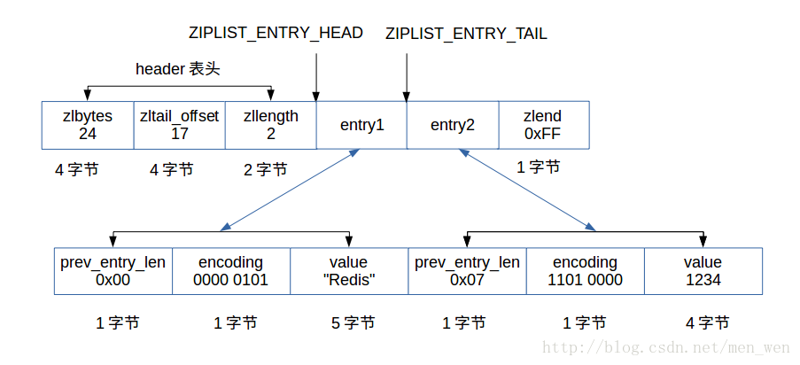
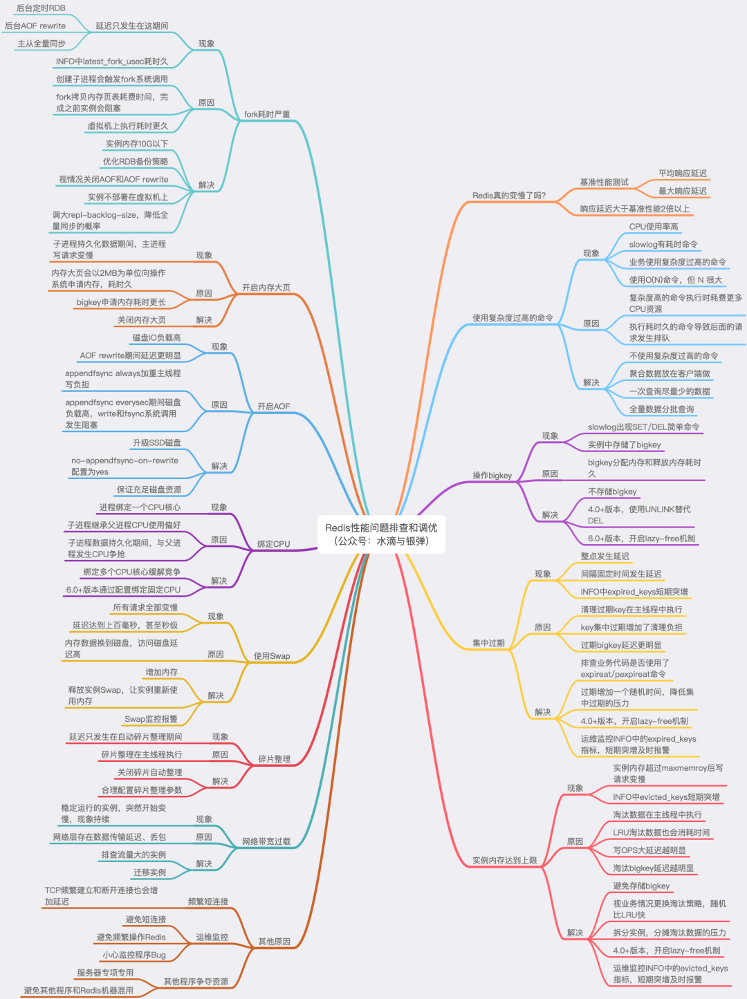

+ Redis文章推荐：https://www.jianshu.com/p/53083f5f2ddc

# 基本

+ redis利用队列技术将并发访问变为串行访问，消除了传统数据库串行控制的开销
+ Redis和Memcached：
  + 共同点：
    + 都是基于内存的数据库,一般都用来当做缓存使用。
    + 都有过期策略。
    + 两者的性能都非常高。
  + 不同点：
    + Redis 支持更丰富的数据类型(支持更复杂的应用场景)
    + Redis 支持数据的持久化,可以将内存中的数据保持在磁盘中,重启的时候可以再次加载进行使用,而 Memecache 把数据全部存在内存之中。
    + Redis 有灾难恢复机制。
    + Redis 在服务器内存使用完之后,可以将不用的数据放到磁盘上。但是,Memcached 在服务器内存使用完之后,就会直接报异常。
    + Memcached 没有原生的集群模式,需要依靠客户端来实现往集群中分片写入数据;但是Redis 目前是原生支持 cluster 模式的.
    + Memcached 是多线程,非阻塞 IO 复用的网络模型;Redis 使用单线程的多路 IO 复用模型。
    + Redis 支持发布订阅模型、Lua 脚本、事务等功能,而 Memcached 不支持。并且,Redis支持更多的编程语言。
    + Memcached过期数据的删除策略只用了惰性删除,而 Redis 同时使用了惰性删除与定期删除。
+ Redis6.0之后引入了多线程，但是多线程**只是针对于处理网络请求而言，数据的读写仍然是单线程**。

# 数据结构


## String

+ C中并没有字符串类型，只能使用指针或符数组的形式表示一个字符串，所以redis设计了一种简单动态字符串(SDS[Simple Dynamic String])作为底实现，此对象中包含三个属性：：

  + len：buf中已经占有的长度(表示此字符串的实际长度)
  + free：buf中未使用的缓冲区长度
  + buf[]：实际保存字符串数据的地方
+ 空间分配原则：当len小于IMB（1024*1024）时增加字符串分配空间大小为原来的2倍，当len大于等于1M时每次分配 额外多分配1M的空间。
+ 特点：

  + redis为字符分配空间的次数是小于等于字符串的长度N，而原C语言中的分配原则必为N。降低了分配次数提高了追加速度，代价就是多占用一些内存空间，且这些空间不会自动释放。
  + 二进制安全的
  + 高效的计算字符串长度(时间复杂度为O(1))
  + 高效的追加字符串操作。
+ 应用场景：一般常用在需要计数的场景,比如用户的访问次数、热点文章的点赞转发数量等等。

### 二进制安全

https://segmentfault.com/a/1190000023130486

+ 二进制安全：通俗的讲，C语言中，用“\0”表示字符串的结束，如果字符串中本身就有“0”字符，那么这个字符串就会被截断，即非二进制安全；若通过某种机制，保证读写字符串时不损害其内容，则是二进制安全。
+ Redis保证二进制安全：
  + redis中使用了自己实现的字符串，及SDS，由于有`len`来标识长度，所以不需要使用分隔符表示字符串结束。使得Redis的String可以用来存放图片等。
  + SDS对象中的buf是一个柔性数组，上层调用时，SDS直接返回了buf。由于buf是直接指向内容的指针，所以兼容C语言函数。而当真正读取内容时，SDS会通过len来限制读取长度，而非“0”，所以保证了二进制安全。

### 操作：

+ | **命令**               | **说明**                                          | **备注**                                                     |
  | ---------------------- | ------------------------------------------------- | ------------------------------------------------------------ |
  | set key value          | 设置键值对                                        | 最常用的写入命令                                             |
  | get key                | 通过键获取值                                      | 最常用的读取命令                                             |
  | del key                | 通过 key ，删除键值对                             | 删除命令，返回删除数，注意，它是一个通用命令，在其他数据结构中，也可以使用它 |
  | strlen key             | 求 key 指向字符串的长度                           | 返回长度                                                     |
  | getset key value       | 修改原来 key 的对应值，并将旧值返回               | 如果原来值为空，则返回空，并设置新值                         |
  | getrange key start end | 获取子串                                          | 记 字符串的长度为 len ，把字符串看作一个数组，而Redis 是以 0 开始计数的，所有start 和 end 的取值范围 为 0 到 len-1 |
  | append key value       | 将新的字符串 value 加入到 原来 key 指向的字符串末 | 返回 key 指向 新字符串的长度                                 |

## List

+ 一个列表结构可以有序地存储多个字符串，在3.2版本之前，列表是使用ziplist和linkedlist实现的，在这些老版本中，当列表对象同时满足以下两个条件时，列表对象使用ziplist编码：

  + 列表对象保存的所有字符串元素的长度都小于64字节
  + 列表对象保存的元素数量小于512个

+ 当有任一条件 不满足时将会进行一次转码，使用linkedlist。而在3.2版本之后，重新引入了一个quicklist的数据结构，列表的底层都是由quicklist实现的，它结合了ziplist和linkedlist的优点。

  + quickList可以尽量的减少`prev`和`next`指针占用的空间（一共16字节），同时可以尽量的减少内存的碎片化，并且连续。

+ Redis操作链表的命令都是不安全的，

+ **ziplist**：由表头和N个entry节点和压缩列表尾部标识符zlend组成的一个**连续的内存块**。然后通过一系列的编码规则，提高内存的利用率，主要用于存储整数和比较短的字符串。可以看出在插入和删除元素的时候，都需要对内存进行一次扩展或缩减，还要进行部分数据的移动操作

  + 数据结构：
    + 表头：
      + zlbytes：4个字节，记录占用的内存数
      + zltail_offset：4个字节，尾节点想对起始位置的偏移
      + zllength：2个字节，记录节点数量
    + 数据节点：
      + entry：存放数据的节点
        + prev_entry_len：记录前驱节点的长度。
        + encoding：记录当前节点的value成员的数据类型以及长度。
        + value：根据encoding来保存字节数组或整数。
    + 表尾：
      + zlend：1个字节，保存一个常数255(0xFF)，标记压缩列表的末端。
  + 
  + ziplist本来就设计为各个数据项挨在一起组成连续的内存空间，这种结构并不擅长做修改操作。一旦数据发生改动，就会引发内存realloc，可能导致内存拷贝。

+ **linkedlist**：为一个双向链表，和普通的链表定义相同，每个entry包含向前向后的指针，当插入或删除元素的时候，只需要对此元素前后指针操作即可。所以插入和删除效率很高。但查询的效率却是O(n)[n为元素的个数]。

+ **quicklist**：就是一个双向链表结构，和普通的链表操作一样，插入删除效率很高，但查询的效率却是O(n)。不过，这样的链表访问两端的元素的时间复杂度却是O(1)。所以，对list的操作多数都是poll和push。每个quicklist节点就是一个ziplist，具备压缩列表的特性

+ 配置优化：

  + ```shell
    list-max-ziplist-size 表示每个quicklistNode的字节大小。默认为-2 表示8KB
    list-compress-depth 表示quicklistNode节点是否要压缩。默认是0 表示不压缩
    ```

+ 应用场景：发布与订阅或者说消息队列、慢查询。


### 操作：

+ | **命  令**                           | **说  明**                                                   | **备  注**                                                   |
  | ------------------------------------ | ------------------------------------------------------------ | ------------------------------------------------------------ |
  | lpush key node1 [node2.].....        | 把节点 node1 加入到链表最左边                                | 如果是 node1、node2 ...noden 这样加入， 那么链表开头从左到右的顺序是 noden...node2、node1 |
  | rpush key node1[node2]......         | 把节点 node1 加入到链表的最右边                              | 如果是 node1、node2....noden 这样加 入，那么链表结尾从左到右的顺序是 node1、node2,node3...noden |
  | lindex key index                     | 读取下标为 index 的节点                                      | 返回节点字符串，从 0 开始算                                  |
  | llen key                             | 求链表的长度                                                 | 返回链表节点数                                               |
  | lpop key                             | 删除左边第一个节点，并将其返回                               | ——                                                           |
  | rpop key                             | 删除右边第一个节点，并将其返回                               | ——                                                           |
  | linsert key before\|after pivot node | 插入一个节点 node，并且可以指定在值为pivot 的节点的前面（before）或者后面（after)） | 如果 list 不存在，则报错；如果没有值为对应 pivot 的，也会插入失败返回 -1 |
  | lpushx list node                     | 如果存在 key 为 list 的链表，则插入节点 node, 并且作为从左到右的第一个节点 | 如果 list 不存在，则失败                                     |
  | rpushx list node                     | 如果存在 key 为 list 的链表，则插入节点 node，并且作为从左到右的最后个节点 | 如果 list 不存在，则失败                                     |
  | lrange list start end                | 获取链表 list 从 start 下标到 end 下标的节点值               | 包含 start 和 end 下标的值                                   |
  | lrem list count value                | 如果 count 为 0，则删除所有值等于 value 的节 点：如果 count 不是 0，则先对 count 取绝对值，假设记为 abs，然后从左到右删除不大于 abs 个等于 value 的节点 | 注意，count 为整数，如果是负数，则 Redis 会先求取其绝对值，然后传递到后台操作 |
  | lset key index node                  | 设置列表下标为 index 的节点的值为 node                       | ——                                                           |
  | ltrim key start stop                 | 修剪链表，只保留从 start 到 stop 的区间的节点，其余的都删除掉 | 包含 start 和 end 的下标的节点会保留                         |

+ 阻塞操作：

  + | **命  令**                      | **说  明**                                                   | **备  注**                             |
    | ------------------------------- | ------------------------------------------------------------ | -------------------------------------- |
    | blpop key timeout               | 移出并获取列表的第一个元索，如果列表没有元素会阻塞列表直到等待超时或发现可弹出元索为止 | 相对于 lpop 命令，它的操作是进程安全的 |
    | brpop key timeout               | 移出并获取列表的最后一个元素，如果列表没有元素会阻塞列表直到等待超时或发现可弹出元素为止 | 相对于 rpop 命令，它的操作是进程安全的 |
    | rpoplpush key sre dest          | 按从左到右的顺序，将一个链表的最后一个元素移除，并插入到目标链表最左边 | 不能设置超时时间                       |
    | brpoplpush key src dest timeout | 按从左到右的顺序，将一个链表的最后一个元素移除，并插入到目标链表最左边，并可以设置超时时间 | 可设置超时时间                         |

## Hash

+  redis的散列可以存储多个键 值 对之间的映射，散列存储的值既可以是字符串又可以是数字值，并且用户同样可以对散列存储的数字值执行自增操作或者自减操作。散列可以看作是一个文档或关系数据库里的一行。hash底层的数据结构实现有两种：

  + 一种是ziplist，上面已经提到过。当存储的数据超过配置的阀值时就是转用hashtable的结构。这种转换比较消耗性能，所以应该尽量避免这种转换操作。同时满足以下两个条件时才会使用这种结构：
    + 当键的个数小于hash-max-ziplist-entries（默认512）
    + 当所有值都小于hash-max-ziplist-value（默认64）
  + 另一种就是hashtable。这种结构的时间复杂度为O(1)，但是会消耗比较多的内存空间

### Rehash

+ redis的负载因子是通过：(used / size)来计算的。
  + 扩容
    + 如果没有bgsave操作，在元素数量达到hash长度的时候就会进行扩容
    + 如果有bgsave操作，在元素数量达到hash长度的5倍会进行扩容。
  + 收缩：
    + 当哈希表的负载因子小于 0.1时， 程序自动开始对哈希表执行收缩操作。收缩不会考虑bgsave操作。
  + 在执行 BGSAVE 命令或 BGREWRITEAOF 命令的过程中，Redis 需要创建当前服务器进程的子进程，而大多数操作系统都采用写时复制 （copy-on-write）技术来优化子进程的使用效率，所以在子进程存在期间，服务器会提高执行扩展操作所需的负载因子，尽可能地避免在子进程存在期间进行哈希表扩展操作。这可以避免不必要的内存写入操作，最大限度节约内存。
+ redis使用了渐进式的rehash，在扩容的时候如果一次性把数据迁移到另外一个哈希表的时候将会导致效率的降低，所以redis使用了渐进式的rehash，将rehash的操作分摊在每一次访问中，在访问某个元素的时候，同时还会执行哈希表的迁移操作。
  + 具体步骤：
    + 为ht[1]分配空间，让字典同时持有ht[0]和ht[1]两个哈希表
    + 将rehashindex的值设置为0，表示rehash工作正式开始
    + 在rehash期间，每次对字典执行增删改查操作是，程序除了执行指定的操作以外，还会顺带将ht[0]哈希表在rehashindex索引上的所有键值对rehash到ht[1]，当rehash工作完成以后，rehashindex的值+1
    + 随着字典操作的不断执行，最终会在某一时间段上ht[0]的所有键值对都会被rehash到ht[1]，这时将rehashindex的值设置为-1，表示rehash操作结束
  + 注意：
    + **如果有增删改查操作时，如果index大于rehashindex，访问ht[0]，否则访问ht[1]。**


#### 相关源码

+ 结构体源码：

```c
/* 哈希表节点 */
typedef struct dictEntry {
    // 键
    void *key;
    // 值
    union {
        void *val;
        uint64_t u64;
        int64_t s64;
    } v;
    // 指向下个哈希表节点，形成链表
    struct dictEntry *next;
} dictEntry;

/* This is our hash table structure. Every dictionary has two of this as we
 * implement incremental rehashing, for the old to the new table. */
/* 哈希表
 * 每个字典都使用两个哈希表，以实现渐进式 rehash 。
 */
typedef struct dictht {
    // 哈希表数组
    // 可以看作是：一个哈希表数组，数组的每个项是entry链表的头结点（链地址法解决哈希冲突）
    dictEntry **table;
    // 哈希表大小
    unsigned long size;
    // 哈希表大小掩码，用于计算索引值
    // 总是等于 size - 1
    unsigned long sizemask;
    // 该哈希表已有节点的数量
    unsigned long used;
} dictht;
/* 字典 */
typedef struct dict {
    // 类型特定函数
    dictType *type;
    // 私有数据
    void *privdata;
    // 哈希表
    dictht ht[2];
    // rehash 索引
    // 当 rehash 不在进行时，值为 -1
    int rehashidx; /* rehashing not in progress if rehashidx == -1 */
    // 目前正在运行的安全迭代器的数量
    int iterators; /* number of iterators currently running */
} dict;
```

+ 分步哈希源码：

```c
/* Performs N steps of incremental rehashing. Returns 1 if there are still
 * keys to move from the old to the new hash table, otherwise 0 is returned.
 *
 * Note that a rehashing step consists in moving a bucket (that may have more
 * than one key as we use chaining) from the old to the new hash table, however
 * since part of the hash table may be composed of empty spaces, it is not
 * guaranteed that this function will rehash even a single bucket, since it
 * will visit at max N*10 empty buckets in total, otherwise the amount of
 * work it does would be unbound and the function may block for a long time. */
int dictRehash(dict *d, int n) {
    int empty_visits = n*10; /* Max number of empty buckets to visit. */
    if (!dictIsRehashing(d)) return 0;

    while(n-- && d->ht[0].used != 0) {
        dictEntry *de, *nextde;

        /* Note that rehashidx can't overflow as we are sure there are more
         * elements because ht[0].used != 0 */
        assert(d->ht[0].size > (unsigned long)d->rehashidx);
        while(d->ht[0].table[d->rehashidx] == NULL) {
            d->rehashidx++;
            if (--empty_visits == 0) return 1;
        }
        de = d->ht[0].table[d->rehashidx];
        /* Move all the keys in this bucket from the old to the new hash HT */
        while(de) {
            uint64_t h;

            nextde = de->next;
            /* Get the index in the new hash table */
            h = dictHashKey(d, de->key) & d->ht[1].sizemask;
            de->next = d->ht[1].table[h];
            d->ht[1].table[h] = de;
            d->ht[0].used--;
            d->ht[1].used++;
            de = nextde;
        }
        d->ht[0].table[d->rehashidx] = NULL;
        d->rehashidx++;
    }

    /* Check if we already rehashed the whole table... */
    if (d->ht[0].used == 0) {
        zfree(d->ht[0].table);
        d->ht[0] = d->ht[1];
        _dictReset(&d->ht[1]);
        d->rehashidx = -1;
        return 0;
    }

    /* More to rehash... */
    return 1;
}
```


### 操作：

+ | **命令**                               | **说明**                                 | **备注**                     |
  | -------------------------------------- | ---------------------------------------- | ---------------------------- |
  | hdel key field1 [field2 ....]          | 删除hash结构中的某个（些)字段            | 可以进行多个字段的删除       |
  | hexists key field                      | 判断hash结构中是否存在field字段          | 存在返回1，否则返回0         |
  | hgetall key                            | 获取所有hash结构中的键值                 | 返回键和值                   |
  | hincr key field increment              | 指定给hash结构中的某个字段加上一个整数   | 要求该字段是一个整数字符串   |
  | hincrbyfloat key field increment       | 指定给hash结构中的某个字段加上一个浮点数 | 要求该字段是一个数字型字符串 |
  | hkeys key                              | 返回hash中所有的键                       |                              |
  | hlen key                               | 返回hash中键值对的数量                   |                              |
  | hmget key field1[field2...]            | 返回hash中指定的键的值，可以是多个       | 依次返回值                   |
  | hmset key field1 value1[field2 value2] | hash结构设置多个键值对                   |                              |
  | hset key field value                   | 在hash结构中设置键值对                   | 单个设置，m表示多个的意思    |
  | hsetnx key field value                 | 当hash结构中不存在对应的键才设置值       |                              |
  | hvals key                              | 返回hash结构中所有的值                   |                              |

## Set

+ redis的集合和列表都可以存储多个字符串，它们之间的不同在于，列表可以存储多个相同的字符串，而集合则通过使用散列表（hashtable）来保证自已存储的每个字符串都是各不相同的(这些散列表只有键，但没有与键相关联的值)，redis中的集合是无序的。还可能存在另一种集合，那就是intset，它是用于存储整数的有序集合，里面存放同一类型的整数。共有三种整数：int16_t、int32_t、int64_t。查找的时间复杂度为O(logN)，但是插入的时候，有可能会涉及到升级（比如：原来是int16_t的集合，当插入int32_t的整数的时候就会为每个元素升级为int32_t）这时候会对内存重新分配，所以此时的时间复杂度就是O(N)级别的了。注意：intset只支持升级不支持降级操作。

  + intset在redis.conf中也有一个配置参数set-max-intset-entries默认值为512。表示如果entry的个数小于此值，则可以编码成REDIS_ENCODING_INTSET类型存储，节约内存。否则采用dict的形式存储。


### 操作：

+ | **命  令**                               | **说  明**                                                   | **备  注**                                                   |
  | ---------------------------------------- | ------------------------------------------------------------ | ------------------------------------------------------------ |
  | sadd key member1 [member2 member3......] | 给键为 key 的集合増加成员                                    | 可以同时増加多个                                             |
  | scard key                                | 统计键为 key 的集合成员数                                    | —                                                            |
  | sdiffkey1 [key2]                         | 找出两个集合的差集                                           | 参数如果是单key，那么 Redis 就返回这个 key 的所有元素        |
  | sdiftstore des key1 [key2]               | 先按 sdiff 命令的规则，找出 key1 和 key2 两 个集合的差集，然后将其保存到 des 集合中。 | —                                                            |
  | sinter key1 [key2]                       | 求 key1 和 key2 两个集合的交集。                             | 参数如果是单 key，那么 Redis 就返冋这个 key 的所有元素       |
  | sinterstore des key1 key2                | 先按 sinter 命令的规则，找出 key1 和 key2 两个集合的交集，然后保存到 des 中 | —                                                            |
  | sismember key member                     | 判断 member 是否键为 key 的集合的成员                        | 如果是返回 1，否则返回 0                                     |
  | smembers key                             | 返回集合所有成员                                             | 如果数据量大，需要考虑迭代遍历的问题                         |
  | smove src des member                     | 将成员 member 从集合 src 迁移到集合 des 中                   | —                                                            |
  | spop key                                 | 随机弹出集合的一个元素                                       | 注意其随机性，因为集合是无序的                               |
  | srandmember key [count]                  | 随机返回集合中一个或者多个元素，count 为限制返回总数，如果 count 为负数，则先求其绝对值 | count 为整数，如果不填默认为 1，如果 count 大于等于集合总数，则返回整个集合 |
  | srem key member1[member2......]          | 移除集合中的元素，可以是多个元素                             | 对于很大的集合可以通过它删除部分元素，避免删除大量数据引发 Redis 停顿 |
  | sunion key1 [key2]                       | 求两个集合的并集                                             | 参数如果是单 key，那么 Redis 就返回这个 key 的所有元素       |
  | sunionstore des key1 key2                | 先执行 sunion 命令求出并集，然后保存到键为 des 的集合中      | —                                                            |

## ZSet

+ 有序集合和散列一样，都用于存储键值对：有序集合的键被称为成员（member),每个成员都是各不相同的。有序集合的值则被称为分值（score），分值必须为浮点数。有序集合是redis里面唯一一个既可以根据成员访问元素(这一点和散列一样),又可以根据分值以及分值的排列顺序访问元素的结构。它的存储方式也有两种：

  + 是ziplist结构：与上面的hash中的ziplist类似，member和score顺序存放并按score的顺序排列

    + 

  + 一种是skiplist与dict的结合：

    + skiplist是一种跳跃表结构，用于有序集合中快速查找，大多数情况下它的效率与平衡树差不多，但比平衡树实现简单。redis的作者对普通的跳跃表进行了修改，包括添加span\tail\backward指针、score的值可重复这些设计，从而实现排序功能和反向遍历的功能

      + 表头（head）：指向头节点
      + 表尾（tail）：指向尾节点
      + 节点（node）：实际保存的元素节点，每个节点可以有多层，层数是在创建此节点的时候随机生成的一个数值，而且每一层都是一个指向后面某个节点的指针。
      + 层（level）：目前表内节点的最大层数
      + 长度（length）：节点的数量。
      + 跳跃表的遍历总是从高层开始，然后随着元素值范围的缩小，慢慢降低到低层。

      

+ 有序列表是使用skiplist和dict结合实现的，skiplist用来保障有序性和访问查找性能，dict就用来存储元素信息，并且dict的访问时间复杂度为O(1)。

+ 实现：

  + 当数据量小的时候，Zset通过ziplist来实现
  + 当数据量大的时候，Zset通过跳表+字典来实现，其中，字典用于存放数据的分数，而跳表用于查询数据。
    + zscore的查询是通过字典来实现的
    + 根据排名来查询数据是通过扩展后的跳表来实现的。

+ redis的扩展：

  + 分数(score)允许重复，即skiplist的key允许重复。这在最开始介绍的经典skiplist中是不允许的。
  + 在比较时，不仅比较分数（相当于skiplist的key），还比较数据本身。在Redis的skiplist实现中，数据本身的内容唯一标识这份数据，而不是由key来唯一标识。另外，当多个元素分数相同的时候，还需要根据数据内容来进字典排序。
  + 第1层链表不是一个单向链表，而是一个双向链表。这是为了方便以倒序方式获取一个范围内的元素。
  + 在skiplist中可以很方便地计算出每个元素的排名(rank)。


### 操作：

+ | **命  令**                                                  | **说  明**                                                   | **备  注**                                                   |
  | ----------------------------------------------------------- | ------------------------------------------------------------ | ------------------------------------------------------------ |
  | zadd key score1 value1 [score2 value2......]                | 向有序集合的 key，增加一个或者多个成员                       | 如果不存在对应的 key，则创建键为 key 的有序集合              |
  | zcard key                                                   | 获取有序集合的成员数                                         | —                                                            |
  | zcount key min max                                          | 根据分数返回对应的成员列表                                   | min 为最小值，max 为最大值，默认为包含 min 和 max 值，采用数学区间表示的方法，如果需要不包含，则在分数前面加入“(”，注意不支持“[”表示 |
  | zincrby key increment member                                | 给有序集合成员值为 member 的分数增加 increment               | —                                                            |
  | zinterstore desKey numkeys key1 [key2 key3......]           | 求多个有序集合的交集，并且将结果保存到 desKey 中             | numkeys 是一个整数，表示多少个有序集合                       |
  | zlexcount key min max                                       | 求有序集合 key 成员值在 min 和 max 的范围                    | 这里范围为 key 的成员值，Redis 借助数据区间的表示方法，“[”表示包含该值，“(”表示不包含该值 |
  | zrange key start stop [withscores]                          | 按照分值的大小（从小到大）返回成员，加入 start 和 stop 参数可以截取某一段返回。如果输入可选项 withscores，则连同分数一起返回 | 这里记集合最人长度为 len，则 Redis 会将集合排序后，形成一个从 0 到 len-1 的下标，然后根据 start 和 stop 控制的下标（包含 start 和 stop）返回 |
  | zrank key member                                            | 按从小到大求有序集合的排行                                   | 排名第一的为 0，第二的为 1……                                 |
  | zrangebylex key min max [limit offset count]                | 根据值的大小，从小到大排序，min 为最小值，max 为最大值；limit 选项可选，当 Redis 求出范围集合后，会生产下标 0 到 n，然后根据偏移量 offset 和限定返回数 count，返回对应的成员 | 这里范围为 key 的成员值，Redis 借助数学区间的表示方法，“[”表示包含该值，“(”表示不包含该值 |
  | zrangebyscore key min max [withscores] [limit offset count] | 根据分数大小，从小到大求取范围，选项 withscores 和 limit 请参考 zrange 命令和 zrangebylex 说明 | 根据分析求取集合的范围。这里默认包含 min 和 max，如果不想包含，则在参数前加入“(”， 注意不支持“[”表示 |
  | zremrangebyscore key start stop                             | 根据分数区间进行删除                                         | 按照 socre 进行排序，然后排除 0 到 len-1 的下标，然后根据 start 和 stop 进行删除，Redis 借助数学区间的表示方法，“[”表示包含该值，“(” 表示不包含该值 |
  | zremrangebyrank key start stop                              | 按照分数排行从小到大的排序删除，从 0 开始计算                | —                                                            |
  | zremrangebylex key min max                                  | 按照值的分布进行删除                                         | —                                                            |
  | zrevrange key start stop [withscores]                       | 从大到小的按分数排序，参数请参见 zrange                      | 与 zrange 相同，只是排序是从大到小                           |
  | zrevrangebyscore key max min [withscores]                   | 从大到小的按分数排序，参数请参见 zrangebyscore               | 与 zrangebyscore 相同，只是排序是从大到小                    |
  | zrevrank key member                                         | 按从大到小的顺序，求元素的排行                               | 排名第一位 0，第二位 1......                                 |
  | zscore key member                                           | 返回成员的分数值                                             | 返回成员的分数                                               |
  | zunionstore desKey numKeys key1 [key2 key3 key4......]      | 求多个有序集合的并集，其中 numKeys 是有序集合的个数          | ——                                                           |

## Bitmap

+ 位图是支持按 bit 位来存储信息，可以用来实现 **布隆过滤器（BloomFilter）**；

## **HyperLogLog**

+ 提供不精确的去重计数功能，比较适合用来做大规模数据的去重统计，例如统计 UV；

+ 基数计数：统计一批数据不重复元素的个数。

+ HyperLogLog只需要12kb的内存就可以计算2^64个不同元素的基数。并且误判率是0.81%。

+ 在redis中，HyperLogLog一共分了$2^{14}$个桶，每个桶6bit。Redis会将value转为64位的比特串，低14位对应桶的标号，剩下50位按照1第一次出现的位置记录到桶中。

+ HyperLogLog的哈希函数需要保证每位均匀。

+ HyperLogLog使用分桶求调和平均以及偏差修正来保证预估的准确性。

+ HyperLogLog使用了调和平均数进行估算。

  + $DV_{HLL} = const * m * (\frac{m}{\sum_{j=1}^m \frac{1}{2^{Mj}}})$。

    + M为每个桶第一个出现1的位置。（如果多个值在同一个桶，取M大的那个）。

    + 其中const用于偏差修正：$p = log_2m$

      + ```c
        // m 为桶数
        switch (p) {
           case 4:
               constant = 0.673 * m * m;
           case 5:
               constant = 0.697 * m * m;
           case 6:
               constant = 0.709 * m * m;
           default:
               constant = (0.7213 / (1 + 1.079 / m)) * m * m;
        }
        ```


### 原理

+ [HyperLogLog原理](https://www.zhihu.com/question/53416615)
+ [HyperLogLog 算法的原理讲解](https://cloud.tencent.com/developer/article/1430352)
+ 按照扔硬币的场景，对于0、1序列，可以根据第一个1出现的位置来估算这批0、1序列的个数。第i个出现1的概率为：$\frac{1}{2^i}$，即可能有$2^i$个基数。
  + 出现序列`1XXXXX`意味着不重复的元素估计有$2^1 = 2$个；
  + 出现序列`01XXXX`意味着不重复的元素估计有$2^2 = 2$个；
  + 出现序列`001XXX`意味着不重复的元素估计有$2^3 = 2$个；
+ 每次取1出现的位置最大的那个。

## GeoHash

+ 在Redis中将经纬度使用52位整数编码。Redis的GeoHash基于Zset实现。zset的value是元素的key，score是52位整数（key的位置）


# Redis结构体

```c
typedef struct redisDb {

    // 数据库键空间，保存着数据库中的所有键值对
    dict *dict;                 /* The keyspace for this DB */

    // 键的过期时间，字典的键为键，字典的值为过期事件 UNIX 时间戳
    dict *expires;              /* Timeout of keys with a timeout set */

    // 正处于阻塞状态的键
    dict *blocking_keys;        /* Keys with clients waiting for data (BLPOP) */

    // 可以解除阻塞的键
    dict *ready_keys;           /* Blocked keys that received a PUSH */

    // 正在被 WATCH 命令监视的键
    dict *watched_keys;         /* WATCHED keys for MULTI/EXEC CAS */

    struct evictionPoolEntry *eviction_pool;    /* Eviction pool of keys */

    // 数据库号码
    int id;                     /* Database ID */

    // 数据库的键的平均 TTL ，统计信息
    long long avg_ttl;          /* Average TTL, just for stats */

} redisDb;
```

```c
/*
 * 字典
 */
typedef struct dict {

    // 类型特定函数
    dictType *type;

    // 私有数据
    void *privdata;

    // 哈希表
    dictht ht[2];

    // rehash 索引
    // 当 rehash 不在进行时，值为 -1
    int rehashidx; /* rehashing not in progress if rehashidx == -1 */

    // 目前正在运行的安全迭代器的数量
    int iterators; /* number of iterators currently running */

} dict;
```

```c
/*
 * 哈希表
 *
 * 每个字典都使用两个哈希表，从而实现渐进式 rehash 。
 */
typedef struct dictht {
    
    // 哈希表数组
    dictEntry **table;

    // 哈希表大小
    unsigned long size;
    
    // 哈希表大小掩码，用于计算索引值
    // 总是等于 size - 1
    unsigned long sizemask;

    // 该哈希表已有节点的数量
    unsigned long used;

} dictht;
```


# Redis过期

+ Redis中除了字符串类型有自己独有设置过期时间的命令 setex 外,其他方法都需要依靠expire 命令来设置过期时间 。另外, persist 命令可以移除一个键的过期时间。
+ Redis整体结构由两个字典维护，一个是数据库字典，包含了数据库中所有的键值对;一个是过期字典，包含了键的过期时间。
+ 过期删除策略：
  + 惰性删除 :只会在取出key的时候才对数据进行过期检查。这样对CPU最友好,但是可能会造成太多过期 key 没有被删除。
  + 定期删除 : 每隔一段时间抽取一批 key 执行删除过期key操作。并且,Redis 底层会通过限制删除操作执行的时⻓和频率来减少删除操作对CPU时间的影响。
    + Redis 内部维护了一个定时任务，默认每隔 100 毫秒（1秒10次）就会从全局的过期哈希表中随机取出 20 个 key，然后删除其中过期的 key，如果过期 key 的比例超过了 25%，则继续重复此过程，直到过期 key 的比例下降到 25% 以下，或者这次任务的执行耗时超过了 25 毫秒，才会退出循环。

## 内存淘汰机制

+ volatile-lru(least recently used):从已设置过期时间的数据集(server.db[i].expires)中挑选最近最少使用的数据淘汰
+ volatile-ttl:从已设置过期时间的数据集(server.db[i].expires)中挑选将要过期的数据淘汰
+ volatile-random:从已设置过期时间的数据集(server.db[i].expires)中任意选择数据淘汰
+ allkeys-lru(least recently used):当内存不足以容纳新写入数据时,在键空间中,移除 最近最少使用的 key(这个是最常用的)
+ allkeys-random:从数据集(server.db[i].dict)中任意选择数据淘汰
+ no-eviction:禁止驱逐数据,也就是说当内存不足以容纳新写入数据时,新写入操作会报错。
+ volatile-lfu(least frequently used):从已设置过期时间的数据集(server.db[i].expires)中挑选最不经常使用的数据淘汰（**4.0以后添加**）
+ allkeys-lfu(least frequently used):当内存不足以容纳新写入数据时,在键空间中,移除最不经常使用的 key（**4.0以后添加**）

# 持久化

## 为什么要fork

+ [redis为什么要fork新进程](https://zhuanlan.zhihu.com/p/114547256)
+ 虽然对于快照来说里面的内容越新越好，当前情况下使用多线程可能会更有优势一点。但是考虑到redis的主从复制，可能会导致一些问题。
  + redis主从复制的时候会生成一个rdb然后发送给从机，并且记录生成rdb时所有的命令。从机收到rdb后从rdb恢复数据，然后执行一遍主机生成rdb时候执行的命令。
  + 此时如果使用多线程有一种情况，如果主线程准备修改某个数据，此时这个数据还没被记录到快照中，在修改过后，这个记录被记录到快照中。同时主机会记录这条命令（因为这条命令是生成rdb时候执行的），此时如果从机恢复数据到内存，本来恢复的数据已经是修改过后的数据了，但是由于还会执行主机备份时记录的修改命令，所以会导致这条修改命令被"重复"执行。
  + 所以记录快照的时候需要保证所有数据都是同一时间点的。这时候需要使用到写时复制技术。
+ 由于fork本身就是基于写时复制技术，fork出来的子线程和父线程共享同一个内存，只有在进行写入的时候才进行真正的复制（并且共享的单位是页，即父/子进程修改某个页的时候，这个页才会触发复制操作）。这样如果父子进程都没有修改数据的话，可以为操作系统节省大量空间。
+ 综上所述：使用fork主要是因为不用自己实现一遍写时复制，同时在没有修改数据的情况下，可以尽量的节省空间。并且写时复制可以保证导出的RDB内的所有数据都是同一个时间点的。

## 快照持久化（RDB）

+ 默认方式，在一定间隔时间中，检测key的变化，然后持久化数据。备份时会造成redis卡顿，但是恢复重启会很快。
+ RDB命令：
  + save：会阻塞当前Redis服务器，直到持久化完成，线上应该禁止使用。
  + bgsave：该触发方式会fork一个子进程，由子进程负责持久化过程，因此阻塞只会发生在fork子进程的时候。
+ save m n原理：
  + serverCron是Redis服务器的周期性操作函数，默认每隔100ms执行一次；该函数对服务器的状态进行维护，其中一项工作就是检查 save m n 配置的条件是否满足，如果满足就执行bgsave。


## AOF持久化（AOF）

+ AOF：日志记录的方式，可以记录每一条命令的操作。每一次执行命令后，持久化数据。恢复重启慢，备份文件较大，但是不会造成卡顿。AOF 文件的保存位置和 RDB 文件的位置相同,都是通过 dir 参数设置的,默认的文件名是 appendonly.aof。
+ appendfsync配置：
  + always：每一次操作都进行持久化
  + everysec：每隔一秒一次持久化
  + no：不进行持久化


## AOF + RDB 混合

+ Redis 4.0 开始支持 RDB 和 AOF 的混合持久化(默认关闭,可以通过配置项 `aof-use-rdb-preamble` 开启)。

## AOF重写

+ AOF 重写可以产生一个新的 AOF 文件,这个新的 AOF 文件和原有的 AOF 文件所保存的数据库状态一样,但体积更小。
+ 该功能是通过读取数据库中的键值对来实现的,程序无须对现有AOF 文件进行任何读入、分析或者写入操作。
+ 在执行 BGREWRITEAOF 命令时,Redis 服务器会维护一个 AOF 重写缓冲区,该缓冲区会在子 进程创建新 AOF 文件期间,记录服务器执行的所有写命令。当子进程完成创建新 AOF 文件的工 作之后,服务器会将重写缓冲区中的所有内容追加到新 AOF 文件的末尾,使得新旧两个 AOF 文 件所保存的数据库状态一致。最后,服务器用新的 AOF 文件替换旧的 AOF 文件,以此来完成 AOF 文件重写操作
+ 配置：
  + no-appendfsync-on-rewrite：是否在AOP文件重写期间调用fsync（无论后台是否有子进程在刷盘），某些linux系统中，调用fsync可能会造成阻塞
  + auto-aof-rewrite-percentage：重写AOP文件的条件，百分比，如果整长量超过指定数值时候会重写文件。
  + auto-aof-rewrite-min-size：增长超过该值才会重写。
+ 在重写期间，由于主进程依然在响应命令，为了保证最终备份的完整性；因此它依然会写入旧的AOF file中，如果重写失败，能够保证数据不丢失。
+ 为了把重写期间响应的写入信息也写入到新的文件中，因此也会为子进程保留一个buf，防止新写的file丢失数据。
+ 重写是直接把当前内存的数据生成对应命令，并不需要读取老的AOF文件进行分析、命令合并。
+ AOF文件直接采用的文本协议，主要是兼容性好、追加方便、可读性高可认为修改修复。

## Redis恢复

+ 启动时会先检查AOF文件是否存在，如果不存在就尝试加载RDB


# Redis速度慢的原因



## 排查

+ 查看Redis慢日志

  + 配置慢日志

  ```shell
  # 命令执行耗时超过 5 毫秒，记录慢日志
  CONFIG SET slowlog-log-slower-than 5000
  # 只保留最近 500 条慢日志
  CONFIG SET slowlog-max-len 500
  ```

  + 命令查看：`SLOWLOG get 5`

+ 查看CPU使用情况：
  + 如果CPU使用率高，OPS不大，很有可能是使用了复杂度高的命令导致的。

# 事务

+ Redis事务机制

  + 语法错误：对于之前和之后的命令都会进行回滚
  + 据错误：当前命令执行错误，之前和之后的命令都会继续执行

+ Watch监控事务：

  + 参考了多线程中的CAS乐观锁，但是进行了修改，防止出现ABA问题
  + 多线程时，会先去对比被watch监控的键值对，如果没有发生变化，则执行事务队列中的命令，提交事务;如果发生变化，则证明此线程中的数据已经被其他的线程所修改，那么不会执行任何事务中的命令，而去对事务进行回滚。

+ 操作：

  + | **命 令**                 | **说 明**                                                    | **备 注**                                                    |
    | ------------------------- | ------------------------------------------------------------ | ------------------------------------------------------------ |
    | multi                     | 开启事务命令，之后的命令就进入队列，而不会马上被执行         | 在事务生存期间，所有的 Redis 关于[数据结构](http://c.biancheng.net/data_structure/)的命令都会入队 |
    | watch key1 [key2......]   | 监听某些键，当被监听的键在事务执行前被修改，则事务会被回滚   | 使用乐观锁                                                   |
    | unwatch key1 [key2......] | 取消监听某些键                                               | ——                                                           |
    | exec                      | 执行事务，如果被监听的键没有被修改，则采用执行命令，否则就回滚命令 | 在执行事务队列存储的命令前，Redis 会检测被监听的键值对有没有发生变化，如果没有则执行命令, 否则就回滚事务 |
    | discard                   | 回滚事务                                                     | 回滚进入队列的事务命令，之后就不能再用 exec 命令提交了       |

# 流水线

+ multi...exec由于会检测对应的锁和序列化命令，所以对系统开销较大，而pipelined流水线技术，可以使得直接在队列下执行一条命令
+ 在Java中使用：使用RedisTemplate中的executePipelined方法

# 发布订阅

+ Redis的发布订阅：类似观察者模式，一个发送消息后，其他的订阅会收到消息
  + subscribe channel1	// 开启一个监听，监听channel1
  	 publish channel1 message	// 向channel1发布message
+ Spring使用发布订阅
  + 参考：http://c.biancheng.net/view/4547.html
  + 接收消息的类：实现MessageListener接口，并实现接口中的onMessage方法，将其定义为一个bean
  + 配置监听容器：使用RedisMessageListenerContainer类

# 超时命令

+ 在redis中key超时了，redis不会回收key的存储空间，只会标识那些键值对超时了，优点是可以减少回收大元素结构所需要的时间，缺点是会浪费大量空间

  + 定时回收：在确定的某够时间触发一段代码，回收超时的键值对
  + 惰性回收：当一个超时的键值对，再次被get访问时，会自动从内存中清空

+ 操作：

  + | **命  令**               | **说  明**               | **备  注**                                                   |
    | ------------------------ | ------------------------ | ------------------------------------------------------------ |
    | persist key              | 持久化 key，取消超时时间 | 移除 key 的超时时间                                          |
    | ttl key                  | 査看 key 的超时时间      | 以秒计算，-1 代表没有超时时间，如果不存在 key 或者 key 已经超时则为 -2 |
    | expire key seconds       | 设置超时时间戳           | 以秒为单位                                                   |
    | expireat key timestamp   | 设置超时时间点           | 用 uninx 时间戳确定                                          |
    | pptl key milliseconds    | 查看key的超时时间戳      | 用亳秒计算                                                   |
    | pexpire key              | 设置键值超时的时间       | 以亳秒为单位                                                 |
    | Pexpireat key stamptimes | 设置超时时间点           | 以亳秒为单位的 uninx 时间戳                                  |

# 哨兵模式

+ 哨兵是一个独立的进程，通过发送命令，等待Redis服务器响应，从而监控多个Redis实例。如果检测到主机宕机会自动将从机切换成主机，并通知其他的从机更新主机。
+ 故障切换：一个哨兵检测到主机不可用，不会马上failover，而会主观认为当前主机不可用（主观下线）如果其他的哨兵也检测到不可用，则会进行一次投票，由一个哨兵发起。如果投票成功后，进行failover并通过发布订阅告诉其他哨兵切换主机（客观下线）

# Redis实现锁

+ Redis可以使用INCR、SETNX、SET来实现加锁。
+ INCR：如果key不存在，那么key的值先被初始化为0，然后执行INCR操作进行加1，然后其他线程执行INCR加1操作时，如果返回的数大于1，那么说明当前锁正在被使用中。
+ SETNX：如果key不存在，将key设置成value；如果key存在，那么不做任何操作。
+ SET：前两种方式都需要单独的设置过期时间，会导致操作变成非原子操作。而set可以在指令中直接指定过期时间。

# 分布式部署方案

## 主从模式

+ 如果Redis的master宕机过后，通过哨兵模式进行主从切换，一般master负责写，而follower负责读。

## 集群模式

+ Redis的集群部署可以将数据划分为多个子集存在不同的节点上，每个节点负责自己整个数据的一部分。
+ Redis Cluster采用哈希分区规则中的虚拟槽分区。虚拟槽分区巧妙地使用了哈希空间，使用分散度良好的哈希函数把所有的数据映射到一个固定范围内的整数集合，整数定义为槽（slot）。Redis的槽的范围是（0 - 16383，2^14-1）。槽是集群内数据管理和迁移的基本单位。所有的键根据哈希函数映射到哈希槽，每个节点负责维护一部分的槽和其映射的键值数据。
+ 计算规则为：key = CRC16 % 16384
+ 哈希槽让在集群中添加和移除节点非常容易。例如，如果我想添加一个新节点 D ，我需要从节点 A 、B、C 移动一些哈希槽到节点 D。同样地，如果我想从集群中移除节点 A ，我只需要移动 A 的哈希槽到 B 和 C。当节点 A 变成空的以后，我就可以从集群中彻底删除它。因为从一个节点向另一个节点移动哈希槽并不需要停止操作，所以添加和移除节点，或者改变节点持有的哈希槽百分比，都不需要任何停机时间（downtime）。 

## 单机模式

+ 在单台机器上部署redis，该模式不适合生产使用。

# 整合Spring

+ 依赖：

  ```xml
  <!-- 1、java连接Redis的jar包，也就是使用jedis -->
  <dependency>
      <groupId>redis.clients</groupId>
      <artifactId>jedis</artifactId>
      <version>2.4.2</version>
  </dependency>
  
  <!-- 2、spring整合Redis的jar包 -->
  <dependency>
      <groupId>org.springframework.data</groupId>
      <artifactId>spring-data-redis</artifactId>
      <version>1.4.2.RELEASE</version>
  </dependency>
  ```

+ 配置连接池信息：

  ```xml
  <!-- 1、配置连接池信息 -->
  <bean id="jedisPoolConfig" class="redis.clients.jedis.JedisPoolConfig">
      <!-- 最大连接数-->
      <property name="maxTotal" value="50"></property>
      <property name="maxIdle" value="5"></property>
      <!-- 这里只是Spring整合Redis测试，配两个做个样子就得了-->
  </bean>
  ```

+ 

# 常见问题

https://www.cnblogs.com/xichji/p/11286443.html

## 缓存穿透

+ key对应的数据在数据源并不存在，每次针对此key的请求从缓存获取不到，请求都会到数据源（数据库），从而可能压垮数据源。比如用一个不存在的用户id获取用户信息，不论缓存还是数据库都没有，若黑客利用此漏洞进行攻击可能压垮数据库。
+ 解决方案：
  + 对参数进行校验。错误的参数直接过滤。
  + 缓存无效key，并设置过期时间。
    + 缺点：会导致大量的无效缓存
  + 布隆过滤器：把所有可能存在的请求的值都存放在布隆过滤器中,当用户请求过来,先判断用户发来的请求的值是否存在于布隆过滤器中。不存在的话,直接返回请求参数错误信息给客户端,存在的话才会走下面的流程。
    + 缺点：可能会导致误判
    + 布隆过滤器通过哈希函数计算key的哈系值然后获取相应的位置。并把位置的值置为1。由于会存在哈希冲突，所以布隆过滤器说某个元素存在，小概率会误判。布隆过滤器说某个元素不在，那么这个元素一定不在。

## 缓存击穿

+ key对应的数据存在，但在redis中过期，此时若有大量并发请求过来，这些请求发现缓存过期一般都会从后端DB加载数据并回设到缓存，这个时候大并发的请求可能会瞬间把后端DB压垮。
+ 解决方案：
  + 加锁：如果缓存失效的话，则对操作进行加锁，然后获取数据。
  + Redis集群：使用redis集群并设置不同的失效时间比如随机设置缓存的失效时间。
  + 随机指数退避算法：如果发现缓存失效，则随机一个很短的时间，并sleep，再次查询，如果失败再执行更新。

## 缓存雪崩

+ 当缓存服务器重启或者大量缓存集中在某一个时间段失效，这样在失效的时候，也会给后端系统(比如DB)带来很大压力。和缓存击穿的区别在于一个是针对单个记录，一个是针对一群记录。
+ 同上

## 缓存一致性

+ 先删缓存在更新数据库：如果线程A删除了缓存，此时更新还没有更新到数据库中，线程B重新从数据库中读取到了还没有更新的值，然后将其缓存。A又把数据更新到了数据库中，此时缓存不一致。
  + 解决方案：延时双删，线程A在更新完数据库后再删除一次缓存。
+ 先更新数据库再删除缓存：如果线程A更新完成数据库，此时还没有删除缓存， 其他线程读取的就是脏值
  + 解决方案：使用
    + 消息队列
    + 监听binlog来删除缓存
+ 为什么删除缓存：
  + 更新缓存的代价有时候是很高，如比较复杂的缓存数据计算的场景，更新缓存的逻辑及操作造成的开销就比较大。再且如果频繁更新数据库，就要频繁的更新缓存，相当于每次更新都要double的一个程序开销，增加更新的复杂度。
  + 而部分缓存数据，可能访问的频率不是很高，等访问的时候再更新缓存信息可以大幅的降低开销。
  + 其实删除缓存，而不是更新缓存，就是一个 lazy 计算的思想。类似于redis的key过期处理策略。