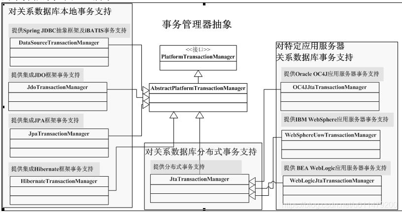
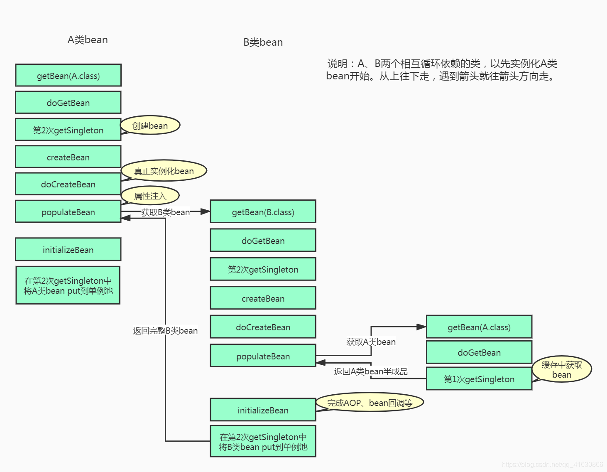
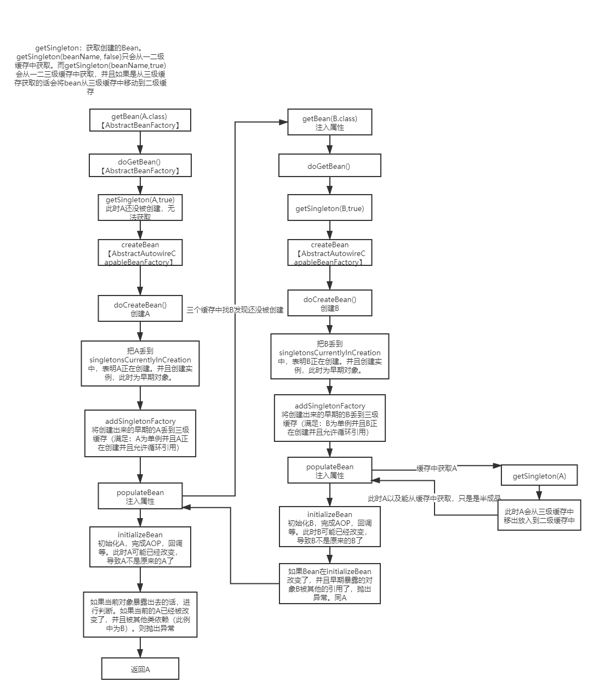
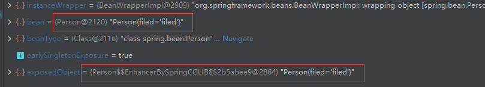
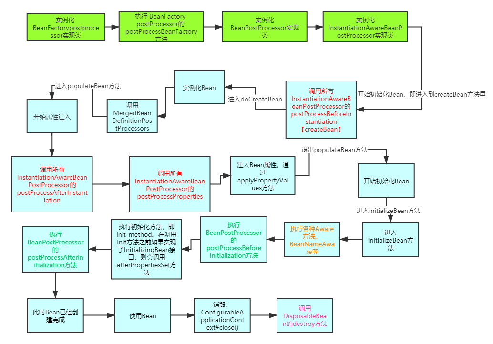
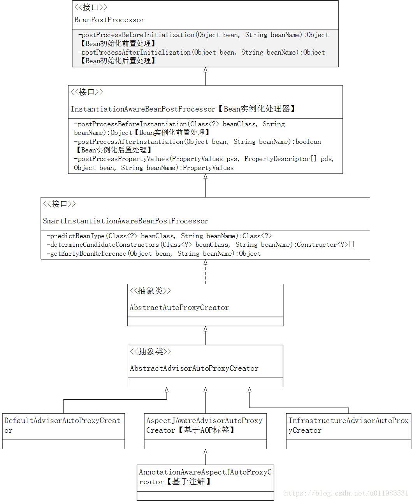
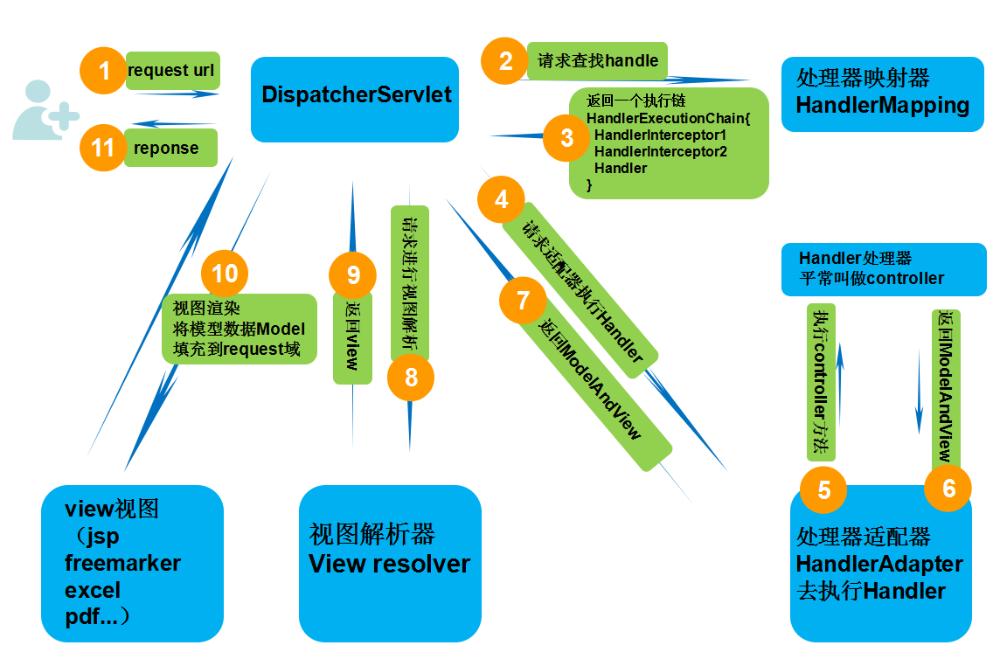

# 基础概念

## IOC

+ LOC：控制反转，把创建对象的权力交给框架，是框架的重要特征。普通使用new的方法，类有完全能够控制创建的类的权力，而使用你反射的方法来创建类则没有完全能控制类的权力，但是能够降低代码之间的耦合度。

## AOP

+ 面向切面编程，主要使用代理设计模式实现。
+ 相关概念：
  + 切面（aspect） ： 类是对物体特征的抽象，切面就是对横切关注点的抽象
  + 横切关注点： 对哪些方法进行拦截，拦截后怎么处理，这些关注点称之为横切关注点。
  + 连接点（joinpoint） ： 被拦截到的点，具体要拦截的东西，因为 Spring 只支持方法类型的连接点，所以在 Spring中连接点指的就是被拦截到的方法，实际上连接点还可以是字段或者构造器。
  + 切入点（pointcut） ： 对连接点进行拦截的定义
  + 通知（advice） ： 所谓通知指的就是指拦截到连接点之后要执行的代码， 通知分为前置、后置、异常、最终、环绕通知五类。
  + 目标对象： 代理的目标对象
  + 织入（weave） ： 将切面应用到目标对象并导致代理对象创建的过程
  + 引入（introduction） ： 在不修改代码的前提下，引入可以在运行期为类动态地添加一些方法或字段

# Spring

## SpringAOP

+ Spring中的AOP分为**Spring自带的AOP**以及**通过AspectJ实现的AOP**

+ 两者区别：

  | Spring AOP                                       | AspectJ                                                      |
  | ------------------------------------------------ | ------------------------------------------------------------ |
  | 在纯 Java 中实现                                 | 使用 Java 编程语言的扩展实现                                 |
  | 不需要单独的编译过程                             | 除非设置 LTW，否则需要 AspectJ 编译器 (ajc)                  |
  | 只能使用运行时织入                               | 运行时织入不可用。支持编译时、编译后和加载时织入             |
  | 功能不强-仅支持方法级编织                        | 更强大 - 可以编织字段、方法、构造函数、静态初始值设定项、最终类/方法等......。 |
  | 只能在由 Spring 容器管理的 bean 上实现           | 可以在所有域对象上实现                                       |
  | 仅支持方法执行切入点                             | 支持所有切入点                                               |
  | 代理是由目标对象创建的, 并且切面应用在这些代理上 | 在执行应用程序之前 (在运行时) 前, 各方面直接在代码中进行织入 |
  | 比 AspectJ 慢多了                                | 更好的性能                                                   |
  | 易于学习和应用                                   | 相对于 Spring AOP 来说更复杂                                 |

### Spring自带AOP

+ Spring自带的AOP接口：
  + 前置通知：MethodBeforeAdvice
  + 后置通知：AfterReturningAdvice
  + 环绕通知：MethodInterceptor
  + 异常通知：ThrowsAdvice

### AspectJ

+ 使用流程：

  + 使用Aspect注解一个切面类，并将切面注册成Bean
  + 在切面类内编写前置后置等方法，并使用AspecJ指示器指示切面
  + 在配置类配置@EnableAspectJAutoProxy**<u>（否则要在XML配置使用注解方式配置）</u>**
  + 如果多个方法引用相同一个切面，可以定义一个pointCut注解然后定义指示器。其他的方法指示器可以直接指定这个被pointCut注解的方法
  + 如果有多个切面，可以使用**<u>@order</u>**注解来指定顺序或者实现**<u>ordered接口</u>**，如果不指定，则调用顺序是无顺的。

+ AOP相关注解

  + @Aspect：指定一个切面的类

  + @Before：在被代理的方法前先调用

  + @Around：将被代理对象的方法封装起来，并用环绕通知取代他

    + 如果要使用环绕通知可以在方法中加入ProceedingJoinPoint来控制方法调用位置

      ```java
      @Around("pointCut()")
      public void around(ProceedingJoinPoint jp){
          try {
              // 调用被代理的方法
              jp.proceed();
          } catch (Throwable throwable) {
              throwable.printStackTrace();
          }
      }
      ```

  + @After：在被代理对象的方法后调用

  + @AfterReturning：在被代理对象的方法正常返回后调用

  + @AfterThrowing：在被代理对象的方法抛出异常后调用

+ AspecJ指示器：放在相应注解的参数中，指示那些方法要被AOP

  + arg()：限制连接点匹配参数为指定类型的方法

  + @args()：限制而连接点匹配参数为指定注解标注的执行方法

  + execution：用于匹配连接点的执行方法，最常用的匹配，可以通过正则表达式匹配

    + 格式：修饰符 返回值 包名.类名.方法名(参数列表)。**<u>支持使用正则表达式修饰符可以省略</u>**

    + 参数：普通类型直接写，其他写全限定类名。使用..表示有无参数都可以并且匹配任意参数，使用*表示任意参数

      ```java
      @Pointcut("execution(* *..*.*(..))")	// 全通配写法
      @Pointcut("execution(* com.ssm.annotationaop.ServiceImp.saveAccount(..))")	// 示例
      ```

  + this()：限制连接点匹配AOP代理的Bean，引用为指定类型的类

  + target：限制连接点匹配被代理对象为指定的类型

  + @target()：限制连接点匹配特定的执行对象，这些对象要符合指定的注解类型

  + within()：限制连接点匹配指定的包

  + @within()：限制连接点匹配指定的类型

  + @annotation：限定匹配带有指定注解的连接点

+ 引入父类：相当于给value指定的类增加了一个父接口，实现类为defaultImpl指定的实现类。可以通过强制转换来调用方法

  + 实现原理：生成代理对象的时候obj.getClass().getInterfaces()将对象挂在多个接口上，而SpringAOP让其强制成为了代理对象的接口。使之能强制转换

    ```java
    @DeclareParents(value = "com.ssm.annotationaop.IService+", defaultImpl = ServiceParentImp.class)
    ```

### 实现


## Bean

### 作用范围

+ 范围：
  + singleton：单例，默认值
  + prototype：多例
  + request：作用于web应用的请求范围
  + session：作用域web应用的会话范围
  + global-session：作用于集群环境的会话范围，不是集群环境时就是session


## BeanFactory和ApplicationContext

BeanFactory：负责配置、创建、管理bean，IOC功能的实现主要就依赖于该接口子类实现。

- **针对bean对象数据加载都是懒加载模式，只有在使用到某个Bean时(调用getBean())，才对该Bean进行加载实例化**。

ApplicationContext 是 Spring 应用程序中的中央接口，用于向应用程序提供配置信息。它继承了 BeanFactory 接口，所以 ApplicationContext 包含 BeanFactory 的所有功能以及更多功能 其主要实现的接口与功能如下：

- MessageSource，主要用于国际化数据资源的加载，如存在中文的配置文件。
- ApplicationEventPublisher，提供了事件发布功能，事件驱动模型。
- EnvironmentCapable，可以获取容器当前运行的环境
- ResourceLoader，主要用于加载资源文件，提供底层资源的访问的能力
- BeanFactory接口
- 非延迟加载：**ApplicationContext是在容器启动时，一次性创建了所有的Bean。**这样，在容器启动时，我们就可以发现Spring中存在的配置错误。
- 后置处理器注册方式：两者都支持BeanPostProcessor、BeanFactoryPostProcessor的使用，但两者之间的区别是：BeanFactory需要手动注册，而ApplicationContext则是自动注册
- 提供Web及Aop的支持

BeanFactory是Spring框架的基础设施，面向Spring本身；而ApplicationContext面向使用Spring的开发者，相比BeanFactory提供了更多面向实际应用的功能，几乎所有场合都可以直接使用ApplicationContext而不是底层的BeanFactory

ApplicationContext 还区分不同类型的上下文：

1. ClassPathXmlApplicationContext：从类路径加载配置文件的上下文。
2. AnnotationApplicationContext：基于注解加载配置的上下文。
3. ServletWebServerApplicationContext：提供web应用的服务的上下文。

## 事务管理器

### 事务的隔离级别

+ 隔离级别：Isolation
+ 高的级别如序列化会导致大量的线程被挂起，直到获得锁才能进一步操作，恢复时又需要大量等待时间，大部分场景下使用读写提交的方式设置事务
+ 默认为Isolation.DEFAULT，随数据库变化而变化。默认Mysql是可重复读

### 事务的传播行为

+ 传播行为：propagation，方法之间的调用事务策略问题
+ Spring事务管理器自带的传播行为：
  + Required：方法调用时，如果不存在当前事务，那么就创建事务，如果之前的方法已经存在事务了，就沿用之前的事务（**spring默认传播行为**）
  + Supports:当方法调用时，如果不存在当前事务，那么不启用事务，如果存在当前事务，那么就沿用当前事务
  + Mandatory:方法必须在事务内允许，如果不存在事务就抛出异常
  + Requires_New：无论是否存在当前事务，方法都会在新的事务中运行。事务管理器会打开新的事务运行方法
  + Not_Supported：不支持事务，如果不存在当前事务也不会创建事务;如果存在当前事务则挂起，直到方法结束后才恢复当前事务
  + Never:不支持事务，在没有事务环境中才能运行，如果存在事务则抛出异常
  + Nested：嵌套事务，调用方法如果抛出异常只回滚自己内部执行的sql，而不回滚主方法的sql。
    + 如果数据库支持保存点，那么发生异常将方法内执行的sql回滚到保存点上，否则等同于requires_new

### 核心接口

+ PlatformTransactionManager：事务管理器的接口

  + ```java
    public interface PlatformTransactionManager {  
           TransactionStatus getTransaction(TransactionDefinition definition) throws TransactionException;  	// 返回一个已经激活的事务或创建一个新的事务（根据给定的TransactionDefinition类型参数定义的事务属性），返回的是TransactionStatus对象代表了当前事务的状态，其中该方法抛出TransactionException（未检查异常）表示事务由于某种原因失败
           void commit(TransactionStatus status) throws TransactionException;  //用于提交TransactionStatus参数代表的事务 
           void rollback(TransactionStatus status) throws TransactionException;// 用于回滚TransactionStatus参数代表的事务  
    }  
    ```

+ TransactionDefinition：事务的属性

  + ```java
    public interface TransactionStatus extends SavepointManager {  
           boolean isNewTransaction();  // 返回当前事务状态是否是新事务
           boolean hasSavepoint();  // 返回当前事务是否有保存点 
           void setRollbackOnly();  	// 设置当前事务应该回滚
           boolean isRollbackOnly();  // 返回当前事务是否应该回滚
           void flush();  // 用于刷新底层会话中的修改到数据库，一般用于刷新如Hibernate/JPA的会话，可能对如JDBC类型的事务无任何影响
           boolean isCompleted();  // 当前事务否已经完成
    }  
    ```

### 内置事务管理器实现

+ **DataSourceTransactionManager** ：位于org.springframework.jdbc.datasource包中，数据源事务管理器，提供对单个javax.sql.DataSource事务管理，用于Spring JDBC抽象框架、iBATIS或MyBatis框架的事务管理；**常用事务管理器**
+ JdoTransactionManager ：位于org.springframework.orm.jdo包中，提供对单个javax.jdo.PersistenceManagerFactory事务管理，用于集成JDO框架时的事务管理；
+ **JpaTransactionManager** ：位于org.springframework.orm.jpa包中，提供对单个javax.persistence.EntityManagerFactory事务支持，用于集成JPA实现框架时的事务管理；
+ **HibernateTransactionManager** ：位于org.springframework.orm.hibernate3包中，提供对单个org.hibernate.SessionFactory事务支持，用于集成Hibernate框架时的事务管理；该事务管理器只支持Hibernate3+版本，且Spring3.0+版本只支持Hibernate 3.2+版本；
+ **JtaTransactionManager** ：位于org.springframework.transaction.jta包中，提供对分布式事务管理的支持，并将事务管理委托给Java EE应用服务器事务管理器；
+ **OC4JjtaTransactionManager** ：位于org.springframework.transaction.jta包中，Spring提供的对OC4J10.1.3+应用服务器事务管理器的适配器，此适配器用于对应用服务器提供的高级事务的支持；
+ **WebSphereUowTransactionManager** ：位于org.springframework.transaction.jta包中，Spring提供的对WebSphere 6.0+应用服务器事务管理器的适配器，此适配器用于对应用服务器提供的高级事务的支持；
+ **WebLogicJtaTransactionManager** ：位于org.springframework.transaction.jta包中，Spring提供的对WebLogic 8.1+应用服务器事务管理器的适配器，此适配器用于对应用服务器提供的高级事务的支持。



### 事务失效

+ 失效情况
  + 注解属性导致失效：设置了错误的隔离模式（`propagation `）或robackFor
  + 方法修饰符导致出错：@Transactional应用在非public方法上。
  + 自调用：通过this调用方法
+ 解决：
  + 针对自调用导致的失效可以通过`AopContext.currentProxy()`来获取当前代理对象来解决。

### 注意事项

+ Spring使用的是动态代理技术，所以静态方法和非public方法注解是失效的。
+ 事务的自调用：如果一个事务类的一个事务调用自身类单方法会产生自调用问题
  + 产生原因：@Transaction是基于AOP实现的，AOP是通过动态代理实现的，如果自己调用自己的方法不会存在代理对象的调用，导致AOP无法设置@Transactional的参数，导致里层的@Transaction失效
  + 解决方法：
    + 可以使用两个服务类来完成事务
    + 可以在容器中获取自身的代理对象，然后调用方法
+ 错误使用Service：如果在同一个Controller使用Service（@Transaction标注）方法。如果多次调用了Service方法，Spring会为每一个Service方法创建一个事务，会造成不同是提交和回滚不一致的问题
+ 不要过长时间占用事务：不要在Service层（@Transaction标注）的方法中加入与数据库操作无关的操作，否则会长时间的占用数据库事务，导致性能低下。
+ 错误捕捉异常：如果在自己的事务中使用了try_catch语句，并对异常进行了处理。会导致spring得不到异常信息，导致spring把事务提交。正确的做法是处理了异常过后再抛出一个异常让spring感知。或者使用`TransactionAspectSupport.currentTransactionStatus().setRollbackOnly();`进行手动回滚。
+ 

### 编程式事务管理器

+ 常使用TransactionTemplate
+ 事务会交由事务管理器管理，执行完后不会提交事务，需要手动调用commit和rollback方法

### 声明式事务管理器

+ 如果业务不发生异常（或者发生异常，但是配置允许提交），Spring会让事务管理器提交事务，发生异常时则回滚事务
+ @Transactional注解：
  + value、transcationManager：定义事务管理器，为一个实现PlatformTransactionManager的接口
  + isolation：事务的隔离级别
  + propagation：传播行为（方法之间的调用行为）
  + timeout：超时时间，如果超时将抛出异常
  + readOnly：是否开启只读事务
  + rollbackFor：回滚事务的异常类定义，当方法产生定义异常时，才回滚事务，否则提交
  + rollbackForClassName：回滚事务的异常类名定义
  + noRollbackFor：产生那些异常不回滚事务
  + noRollbackForClassName：和noRollbackFor作用相同

## Spring钩子

+ BeanPostProcessor常用子类：
  + ConfigurationClassPostProcessor$ImportAwareBeanPostProcessor
  + AutowiredAnnotationBeanPostProcessor
  + AnnotationAwareAspectJAutoProxyCreator

### Aware

+ Spring拥有一堆Aware接口，initializeBean的时候对处理这些Aware接口。
+ Aware接口的作用是使得自身感知到一些属性。如`BeanNameAware`可以让Bean感知到自己在Spring中的名称

### BeanPostProcessor

+ 接口方法：
  + `Object postProcessBeforeInitialization(Object bean, String beanName)`
  + `Object postProcessAfterInitialization(Object bean, String beanName)`

## InstantiationBeanPostProcessor


## Spring解决循环依赖

https://blog.csdn.net/qq_41630866/article/details/104332517

https://blog.csdn.net/chaitoudaren/article/details/105060882

https://blog.csdn.net/likun557/article/details/113977261

https://cloud.tencent.com/developer/article/1497692





+ Spring使用了三级缓存 + 提前暴露对象的方式来解决循环依赖的问题。
+ Spring解决循环依赖的条件：
  + 出现循环依赖的Bean必须是单例的。
  + 依赖注入的方式不能全是构造器注入的方式。
+ 相关的重要属性：位于`DefaultSingletonBeanRegistry`类中
  + Spring内部维护了三个Map，所谓的三重缓存。
    + `Map<String, Object> singletonObjects`：单例池容器，用于缓存单例Bean的地方。一级缓存。
      + 这里的bean是已经创建完成的，该bean经历过实例化->属性填充->初始化以及各类的后置处理。因此，一旦需要获取bean时，我们第一时间就会寻找一级缓存
    + `Map<String, Object> earlySingletonObjects`：早期的单例Bean。二级缓存。
      + 这里跟一级缓存的区别在于，该缓存所获取到的bean是提前曝光出来的，是还没创建完成的。也就是说获取到的bean只能确保已经进行了实例化，但是属性填充跟初始化肯定还没有做完，因此该bean还没创建完成，仅仅能作为指针提前曝光，被其他bean所引用
    + `Map<String, ObjectFactory<?>> singletonFactories`：创建中单例Bean的原始工厂。三级缓存。
      + 在bean实例化完之后，属性填充以及初始化之前，如果允许提前曝光，spring会将实例化后的bean提前曝光，也就是把该bean转换成beanFactory并加入到三级缓存。在需要引用提前曝光对象时再通过singletonFactory.getObject()获取。
      + 当其他的bean从三级缓存中获取了Bean后，当前的Bean就会从三级缓存中放入到二级缓存。并且从三级缓存中取出的时候会调用`SmartInstantiationAwareBeanPostProcessor#getEarlyBeanReference`方法。
  + `Set<String> singletonsCurrentlyInCreation`：保存了当前正在创建的单例对象的名称。
  + `Map<String, Set<String>> dependentBeanMap`：保存了一个bean对其他的bean的依赖。
+ 问题：
  + 如何解决循环依赖的：
    + 通过提前曝光解决循环依赖，当AB循环依赖的时候，先将A的半成品曝光出去，让B先完成初始化，然后在使得初始化完成后的B注入到A中。
  + 为什么要三级缓存：
    + 很多博文说三级缓存是为了解决AOP的循环依赖，但事实上不是这样的，即使没有三级缓存，Spring也可以通过提前暴露代理对象的方法来解决AOP的循环依赖。
    + 所以三级缓存的作用主要是：延迟对实例化阶段生成的对象的代理，只有真正发生循环依赖的时候，才去提前生成代理对象，否则只会创建一个工厂并将其放入到三级缓存中，但是不会去通过这个工厂去真正创建对象。
    + 对于代理过的对象，如果在被暴露出去的时候被其他的Bean所引用了，就会在从三级缓存中移除的时候创建代理；如果没有被引用的话，则在初始化Bean的时候创建代理。
    + 三级缓存作用：（三级缓存并非非要不可）
      + 通过`SmartInstantiationAwareBeanPostProcessor`对Bean进行扩展。
      + 尽量可能的延迟AOP的初始化。
    + 

## Bean的生命周期

https://www.jianshu.com/p/1dec08d290c1

+ 实例化
+ 属性赋值
+ 初始化
+ 销毁

```java
//AbstractAutowireCapableBeanFactory.class
protected Object doCreateBean(final String beanName, final RootBeanDefinition mbd, final @Nullable Object[] args)
      throws BeanCreationException {

   // Instantiate the bean.
   BeanWrapper instanceWrapper = null;
   if (instanceWrapper == null) {
       // 实例化阶段！
      instanceWrapper = createBeanInstance(beanName, mbd, args);
   }

   // Initialize the bean instance.
   Object exposedObject = bean;
   try {
       // 属性赋值阶段！
      populateBean(beanName, mbd, instanceWrapper);
       // 初始化阶段！
      exposedObject = initializeBean(beanName, exposedObject, mbd);
   }
}
```

### 图解



### 代码

createBean：

```java
// AbstractAutowireCapableBeanFactory.class
protected Object createBean(String beanName, RootBeanDefinition mbd, @Nullable Object[] args)
			throws BeanCreationException {
		...

		// Prepare method overrides.
		try {
			mbdToUse.prepareMethodOverrides();
		}
		catch (BeanDefinitionValidationException ex) {
			throw new BeanDefinitionStoreException(mbdToUse.getResourceDescription(),
					beanName, "Validation of method overrides failed", ex);
		}

		try {
            // 调用InstantiationAwareBeanPostProcessor的postProcessBeforeInstantiation
			// Give BeanPostProcessors a chance to return a proxy instead of the target bean instance.
			Object bean = resolveBeforeInstantiation(beanName, mbdToUse);
			if (bean != null) {
				return bean;
			}
		}
		catch (Throwable ex) {

		}

		try {
            // 调用doCreateBean方法
			Object beanInstance = doCreateBean(beanName, mbdToUse, args);
			if (logger.isTraceEnabled()) {
				logger.trace("Finished creating instance of bean '" + beanName + "'");
			}
			return beanInstance;
		}
		catch (BeanCreationException | ImplicitlyAppearedSingletonException ex) {

		}
		catch (Throwable ex) {

		}
	}
```

doCreateBean：

```java
// AbstractAutowireCapableBeanFactory.class
protected Object doCreateBean(String beanName, RootBeanDefinition mbd, @Nullable Object[] args)
        throws BeanCreationException {

    // Instantiate the bean.
    BeanWrapper instanceWrapper = null;
    if (mbd.isSingleton()) {
        instanceWrapper = this.factoryBeanInstanceCache.remove(beanName);
    }
    if (instanceWrapper == null) {
        // 初始化对象，相当于new Object
        instanceWrapper = createBeanInstance(beanName, mbd, args);
    }
    Object bean = instanceWrapper.getWrappedInstance();
    Class<?> beanType = instanceWrapper.getWrappedClass();
    if (beanType != NullBean.class) {
        mbd.resolvedTargetType = beanType;
    }

    // Allow post-processors to modify the merged bean definition.
    synchronized (mbd.postProcessingLock) {
        if (!mbd.postProcessed) {
            try {
                applyMergedBeanDefinitionPostProcessors(mbd, beanType, beanName);
            }
            catch (Throwable ex) {
                throw new BeanCreationException(mbd.getResourceDescription(), beanName,
                        "Post-processing of merged bean definition failed", ex);
            }
            mbd.postProcessed = true;
        }
    }

    ...

    // Initialize the bean instance.
    Object exposedObject = bean;
    try {
        /**
         * 属性赋值：
         *  执行InstantiationAwareBeanPostProcessors的postProcessAfterInstantiation方法
         *  调用InstantiationAwareBeanPostProcessor的postProcessPropertyValues方法
         *  注入属性，具体通过：applyPropertyValues方法
         */
        populateBean(beanName, mbd, instanceWrapper);
        /**
         * 初始化Bean：
         *  调用各种Aware，具体通过：invokeAwareMethods方法
         *  调用BeanPostProcessor的postProcessBeforeInitialization方法
         *  调用Bean的init方法：通过：invokeInitMethods。在调用init方法之前如果实现了InitializingBean接口，则会调用afterPropertiesSet方法
         *  调用BeanPostProcessor的postProcessAfterInitialization方法
         */
        exposedObject = initializeBean(beanName, exposedObject, mbd);
    }
    catch (Throwable ex) {
        if (ex instanceof BeanCreationException && beanName.equals(((BeanCreationException) ex).getBeanName())) {
            throw (BeanCreationException) ex;
        }
        else {
            throw new BeanCreationException(
                    mbd.getResourceDescription(), beanName, "Initialization of bean failed", ex);
        }
    }
    ...
}
```

## Spring动态代理



+ SpringAOP的自动代理是通过`BeanPostProcessor`来实现的。在调用`InstantiationBean`的时候，会调用`postProcessAfterInitialization`方法，此时会调用到`AbstractAdvisorAutoProxyCreator`的相关方法，来实现自动代理。
+ 创建代理的时机有两个：
  + 如果当前对象被循环引用的话（被暴露了），就在其他对象注入当前对象的时候创建代理。
  + 如果没有被引用，那么在初始化对象的时候创建代理。
+ 创建动态代理的时候会有一个缓存，记录那些Bean是被动态代理过的，如果被动态代理过那么在初始化对象时就不会重新代理一边了。

## Filter和Interceptor

### FIlter

+ filter（过滤器）作用于在intreceptor(拦截器)之前，不像intreceptor一样依赖于springmvc框架，只需要依赖于serverlet。
  + 比较原始的一种方法是定义一个类实现javax.servlet.Filter接口
  + 另一种方法的自定义Filter，继承springframework.web.filter.OncePerRequestFilter，可以对同一个请求，只经过一次过滤

+ SpringBootApplication 上使用@ServletComponentScan 注解后
  + Servlet可以直接通过@WebServlet注解自动注册
    - 常规servlet，可以声明URL，doGet和doPost方法
  + Filter可以直接通过@WebFilter注解自动注册
    - @Order里边的数字越小代表越先被该Filter过滤
    - Filter和FilterChain都是用责任链模式实现
  + Listener可以直接通过@WebListener 注解自动注册
    - 监听Servlet生命周期

### Interceptor

+ 拦截器可用于横切关注点，并避免重复的处理程序代码，如日志记录、更改Spring模型中全局使用的参数等。
+ 通过继承HandlerInterceptor接口，重写以下三个方法：
  + preHandle()： 在实际的handler被执行前但是modelView 还未生成前调用。
    - 返回boolean类型数据，可以告诉spring 是否执行该方法。
  + postHandle()：在handler处理请求完成之后，生成视图之前执行。
  + afterCompletion()：在请求完全完成且视图也生成了之后调用。
+ spring mvc的拦截器是只拦截controller而不拦截jsp,html 页面文件的。这就用到过滤器filter了，filter是在servlet前执行的，你也可以理解成过滤器中包含拦截器，一个请求过来 ，先进行过滤器处理，看程序是否受理该请求 。 过滤器放过后 ， 程序中的拦截器进行处理 
  + 拦截器不依赖servlet容器，过滤器依赖；
  + 拦截器是基于java反射机制来实现的，过滤器基于回调
  + 过滤器：关注web请求；
  + 拦截器：关注方法调用；

# SpringBoot

## SpringBoot启动过程

https://blog.csdn.net/qq_32828253/article/details/109496848

```java
    public ConfigurableApplicationContext run(String... args) {
        // 启动记时工具
        StopWatch stopWatch = new StopWatch();
        stopWatch.start();
        // 创建启动上下文对象
        DefaultBootstrapContext bootstrapContext = this.createBootstrapContext();
        ConfigurableApplicationContext context = null;
        this.configureHeadlessProperty();
        // 获取监听器，主要在springboot的各个启动流程中调用一些钩子函数，使用了观察者模式。
        SpringApplicationRunListeners listeners = this.getRunListeners(args);
        // 启动监听器
        listeners.starting(bootstrapContext, this.mainApplicationClass);

        try {
            ApplicationArguments applicationArguments = new DefaultApplicationArguments(args);
            // 准备环境
            ConfigurableEnvironment environment = this.prepareEnvironment(listeners, bootstrapContext, applicationArguments);
            this.configureIgnoreBeanInfo(environment);
            // 打印banner
            Banner printedBanner = this.printBanner(environment);
            // 创建spring容器，会根据不同的环境创建不同的context，如servlet和reactive。
            // 如servletcontext，会需要两个扫描器用于扫描bean，分别为：AnnotatedBeanDefinitionReader和ClassPathBeanDefinitionScanner。一个用于扫描注解的baean一个用于扫描文件定义的bean
            context = this.createApplicationContext();
            context.setApplicationStartup(this.applicationStartup);
            // 准备spring容器，主要调用ApplicationContextInitializer的initialize方法，设置环境以及加载Bean（主要是加载启动类）
            this.prepareContext(bootstrapContext, context, environment, listeners, applicationArguments, printedBanner);
            // 刷新容器，关键
            this.refreshContext(context);
            // 容器后置处理
            this.afterRefresh(context, applicationArguments);
            // 结束计时器并打印，这就是我们启动后console的显示的时间
            stopWatch.stop();
            if (this.logStartupInfo) {
                (new StartupInfoLogger(this.mainApplicationClass)).logStarted(this.getApplicationLog(), stopWatch);
            }
            // 发出启动结束事件
            listeners.started(context);
            // 执行runner的run方法
            this.callRunners(context, applicationArguments);
        } catch (Throwable var10) {
            this.handleRunFailure(context, var10, listeners);
            throw new IllegalStateException(var10);
        }

        try {
            listeners.running(context);
            return context;
        } catch (Throwable var9) {
            this.handleRunFailure(context, var9, (SpringApplicationRunListeners)null);
            throw new IllegalStateException(var9);
        }
    }
```

+ prepareContext：

```java
	/**
	 * Spring容器准备
	 */
	private void prepareContext(DefaultBootstrapContext bootstrapContext, ConfigurableApplicationContext context,
								ConfigurableEnvironment environment, SpringApplicationRunListeners listeners,
								ApplicationArguments applicationArguments, Banner printedBanner) {
		// 设置上下文环境
		context.setEnvironment(environment);
		//
		postProcessApplicationContext(context);
		// 执行所有ApplicationContextInitializer对象的initialize方法（这些对象是通过读取spring.factories加载）
		applyInitializers(context);
		// 发布上下文准备完成事件到所有监听器
		listeners.contextPrepared(context);
		bootstrapContext.close(context);
		if (this.logStartupInfo) {
			logStartupInfo(context.getParent() == null);
			logStartupProfileInfo(context);
		}
		//
		ConfigurableListableBeanFactory beanFactory = context.getBeanFactory();
		beanFactory.registerSingleton("springApplicationArguments", applicationArguments);
		if (printedBanner != null) {
			beanFactory.registerSingleton("springBootBanner", printedBanner);
		}
		if (beanFactory instanceof DefaultListableBeanFactory) {
			((DefaultListableBeanFactory) beanFactory)
					.setAllowBeanDefinitionOverriding(this.allowBeanDefinitionOverriding);
		}
		if (this.lazyInitialization) {
			context.addBeanFactoryPostProcessor(new LazyInitializationBeanFactoryPostProcessor());
		}
		// Load the sources
		Set<Object> sources = getAllSources();
		Assert.notEmpty(sources, "Sources must not be empty");
		// 加载bean到上下文
		load(context, sources.toArray(new Object[0]));
		// 发送上下文加载完成事件
		listeners.contextLoaded(context);
	}
```

+ refreshContext：

```java
	private void refreshContext(ConfigurableApplicationContext context) {
		if (this.registerShutdownHook) {
            // 注册一个关闭钩子
			try {
				context.registerShutdownHook();
			}
			catch (AccessControlException ex) {
				// Not allowed in some environments.
			}
		}
		refresh((ApplicationContext) context);
	}
```


+ refresh：

```java
public void refresh() throws BeansException, IllegalStateException {
    synchronized (this.startupShutdownMonitor) {
        // 刷新前的一些准备工作。
        prepareRefresh();

        // 告诉子类刷新工厂，并且获取刷新后的工厂。
        ConfigurableListableBeanFactory beanFactory = obtainFreshBeanFactory();

        // 初始化BeanFactory，对BeanFactory进行一些配置。
        prepareBeanFactory(beanFactory);

        try {
            // 对工厂进行处理，比如将定义的Bean转换为BeanDefination就是在此步完成的。AnnotationConfigServletWebServerApplicationContext#postProcessBeanFactory
            postProcessBeanFactory(beanFactory);

            // 调用上下文中注册为bean的工厂 BeanFactoryPostProcessor。比如将Spring的自动配置类扫描到容器里就是在此步实现的，Mybatis为接口注册BeanDefinition也是在此步实现的。
            invokeBeanFactoryPostProcessors(beanFactory);

            // 注册各种BeanPostProcessor
            registerBeanPostProcessors(beanFactory);

            // 注册MessageSource，国际化相关。
            initMessageSource();

            // 初始化容器事件广播器(用来发布事件)
            initApplicationEventMulticaster();

            // 初始化一些特殊的Bean
            onRefresh();

            // 将所有监听器注册到前两步创建的事件广播器中
            registerListeners();

            // 结束bean的初始化工作（主要将所有单例BeanDefinition实例化）
            finishBeanFactoryInitialization(beanFactory);

            // 发布完成刷新的时间。
            finishRefresh();
        }

        catch (BeansException ex) {
            if (logger.isWarnEnabled()) {
                logger.warn("Exception encountered during context initialization - " +
                            "cancelling refresh attempt: " + ex);
            }

            // 销毁所有已经创建了的单例Bean
            destroyBeans();

            // Reset 'active' flag.
            cancelRefresh(ex);

            // Propagate exception to caller.
            throw ex;
        }

        finally {
            // Reset common introspection caches in Spring's core, since we
            // might not ever need metadata for singleton beans anymore...
            resetCommonCaches();
        }
    }
}
```

## Starter


## 自动配置

https://blog.csdn.net/qq_32828253/article/details/109412992

+ 自动配置位于：AutoConfigurationImportSelector类中
+ 流程：
  + 获取jar包下的`META-INF/spring.factories`
  + 解析出文件的key和value保存到集合中
  + 将结果保存到缓存中
  + 并对结果进行去重
  + 通过反射来实例化对应标有@Configuration注解的JavaConfig形式的IoC容器配置类，然后统一汇总到IoC容器中

# SpringMVC

## SpringMVC流程



# Mybatis

+ `#{}`和`${}`的区别：前者是预处理，后者是字符串拼接。使用前者可以有效的防止SQL注入。
+ Mybatis延迟加载：延迟加载的基本原理是，使用CGLIB创建目标对象的代理对象，当调用目标方法时，进入拦截器方法，比如调用a.getB().getName()，拦截器invoke()方法发现a.getB()是null值，那么就会单独发送事先保存好的查询关联B对象的sql，把B查询上来，然后调用a.setB(b)，于是a的对象b属性就有值了，接着完成a.getB().getName()方法的调用。
+ 一二级缓存：查询顺序是二级缓存->一级缓存->数据库
  + 一级缓存: 基于 PerpetualCache 的 HashMap 本地缓存，其存储作用域为 Session，当 Session flush 或 close 之后，该 Session 中的所有 Cache 就将清空，默认打开一级缓存。一级缓存是基于对象进行缓存的。
  + 二级缓存：是SqlSessionFactory级别的缓存，同一个SqlSessionFactory产生的SqlSession都共享一个二级缓存，缓存的是数据而不是对象。

# 常用注解

+ @Configuration

  + 作用：用来定义配置类，可以替换xml配置文件。被注解的类中含有一个或多个被@Bean注解的方法，这些方法会被AnnotationConfigApplicationContext或AnnotationConfigWebApplicationContext类进行扫描，并用于构建bean实例，初始化Spring容器
  + 注意事项：
    + 该类不能是final类型
    + 该类不可以是匿名类
    + @Configuration嵌套时，嵌套的configuration必须是静态类
  + 如果配置类被其他已经注册的配置类@Import的话可以不写此注解

+ @Componet @Controller @Service @Repository

  + @Componet是一个标准的spring Bean类，声明当前类的对象被spring托管，spring会创建该类的实例并存放在IOC容器中
  + @Controller @Service @Repository都是@Componet的子类
  + **<u>@Controller 标注一个控制器组件类</u>**
  + **<u>@Service 标注一个业务逻辑组件类</u>**
  + **<u>@Repository 标注一个DAO组件类</u>**

+ @ComponentScan和@ComponentScans

  + @ComponentScan会自动扫描声明的包路径，创建路径下需要创建的实例Componet,Controller,Service,Repository到Spring容器中
  + @ComponentScans可以注册多个ComponentScan
  + 注意事项：
    + 多个ComponentScan会生成多个实例
    + 同一个ComponentScan**<u>重复定义相同的包或者有子包也不会造成同一个Bean多次被扫描</u>**

+ @Autowired

  + @Autowired注解的类能被自动装配。可以通过配置required来指定当前注入的是否为必须的，如果为必须的没找到抛异常。否则空指针。
  + 在带参数的构造方法括号参数内使用@Autowired注解可以使得注解支持到参数
  + 注意事项：
    + spring按类型注入对象，而接口可以有多个实现类，导致获取的Bean不唯一。如果不唯一再根据变量名和bean对应查找如果找到就注入，否则报错。
      + @Primary：指定存在多个实现类时首先使用的类，可以存在多个，但是会抛出异常。**相当于XML配置primary属性**
      + @Qualifier：配置在vo里面，指定用于实例化的实现类。给类成员注入时不能单独使用但是给方法参数注入时候可以。也可以直接注入在方法的参数上。**相当于XML配置qualifier属性**

+ @Bean

  + 标记在方法上，让方法的返回值直接注册成为一个Bean

+ @Resouce

  + 直接按照bean的id注入，可以独立使用。属性name用于指定Bean的id。非spring提供。区别于**<u>@Autowired</u>**

+ @Value

  + 通过SpringEL表达式指定BeanName来实现属性注入

+ @ConfigurationPropertie  

  + 批量注入配置文件中的属性

+ @Scope

  + 定义了该Bean的作用域范围。**相当于XML配置的scope标签**
    + singleton：单例
    + prototype：多例

+ @PropertySource

  + 导入properties配置文件，可以直接使用classpath标识标识类文件夹。然后通过@Value注解注入值

+ @ImportResource

  + 用于引入XML的配置内容，可以配置多个XML文件

+ @Import

  + 将@Import标记的类注册成Bean
  + 导入其他的配置类，使得其他的类不用写@Configuration注解
  + 导入ImportBeanDefinitionRegistrar的具体实现
  + 导入ImportSelector的具体实现

+ @PreDestory：用于指定销毁方法。**相当于XML配置的destoryy-method标签**

  + @PreDestory修饰的方法会在**<u>服务器卸载Servlet的时候运行，并且之后被服务器调用一次</u>**，类似于Servlet中的destory()方法，虽然PreDestory字面意思是在destory之前运行，但是被**<u>@PreDestory修饰的方法会在destory方法运行之后运行</u>**，在Servlet被彻底卸载之前，PreDestory里的Destory指的是Servlet的销毁，而不是destory()方法。

+ @PostConstruct：用于指定初始化方法。**相当于XML配置的init-method标签**

  + @PostConstruct修饰的方法会在**<u>服务器加载Servlet的时候运行，并且只会被服务器调用一次</u>**，类似于Servlet的init()方法，PostConstruct从字面上将有“在构造函数之后运行”的意思，事实上,被**@PostConstruct修饰的方法构造函数之后、init()方法之前运行**。

+ @Profile：指定返回的bean的使用环境。在XML中在Beans的profile标签中指定

  + 激活方式：

    + 作为SpringMVC中的DispatcherServlet的初始化参数：

      + ```xml
        <servlet>  
            <servlet-name>springMVC</servlet-name>  
            <servlet-class>org.springframework.web.servlet.DispatcherServlet</servlet-class>  
            <init-param>  
                <param-name>contextConfigLocation</param-name>  
                <param-value>classpath:/spring-servlet.xml</param-value>  
            </init-param>  
            <init-param>  
                <param-name>spring.profiles.default</param-name>  
                <param-value>dev</param-value>  
            </init-param>  
            <load-on-startup>1</load-on-startup>  
        </servlet>
        ```

    + 作为Web 应用上下文中的初始化参数：

      + ```java
        AnnotationConfigApplicationContext ctx = new AnnotationConfigApplicationContext();
        ctx.getEnvironment().setActiveProfiles("development");
        ctx.refresh();
        ```

    + JVM参数方式：

      + ```shell
        -Dspring.profiles.active="product"
        ```

    + Tomcat中 catalina.bat添加：

      + ```shell
        JAVA_OPTS="-Dspring.profiles.active=test"
        ```

    + Junit注解方式：

      + ```java
        @ActiveProfiles({"unittest","productprofile"})
        ```

    + 配置环境变量

+ 

## 注解对比

+ @Resource和@Autowired

  + @Autowired注解是按类型装配依赖对象，默认情况下它要求依赖对象必须存在，如果允许null值，可以设置它required属性为false。可以结合@Qualifier注解一起使用。
  + @Resource注解和@Autowired一样，也可以标注在字段或属性的setter方法上，但它默认按名称装配。默认按byName自动注入，也提供按照byType 注入；
  + @Resources按名字，是JDK的，@Autowired按类型，是Spring的。
  + 处理这2个注解的BeanPostProcessor不一样CommonAnnotationBeanPostProcessor是处理@Resource注解的，AutoWiredAnnotationBeanPostProcessor是处理@AutoWired注解的

+ @ConfigurationPropertie 和@Value

  + |                      | @ConfigurationPropertie  | @Value     |
    | -------------------- | ------------------------ | ---------- |
    | 功能                 | 批量注入配置文件中的属性 | 一个个指定 |
    | 松散绑定（松散语法） | 支持                     | 不支持     |
    | SpEL                 | 不支持                   | 支持       |
    | JSR303数据校验       | 支持                     | 不支持     |
    | 复杂类型封装         | 支持                     | 不支持     |

  + 前者SpringBoot提供，后者Spring提供

# SpringSecurity

# Shiro

## RBAC模型

+  RBAC是Role-BasedAccess Control的英文缩写，意思是基于角色的访问控制。RBAC认为权限授权实际上是Who、What、How的问题。在RBAC模型中，who、what、how构成了访问权限三元组，也就是“Who对What(Which)进行How的操作。
+ RBAC0：RBAC0模型由四个部分组成，用户（User）、角色（Role）、会话（Session）、许可（Permission）
  + 其中，用户和角色是多对多的关系，用户和许可是多对多的关系，用户和会话是一对一的关系，会话和角色是一对多的关系。
+ RBAC1：建立在RBAC0基础上，在角色上引入了继承的关系
+ RBAC2：建立在RBAC0基础上，引入了静态职责分离和动态职责分离
  + 静态职责分离（SSD）：
    + 互斥角色：同一个用户只能在互斥的角色中选择一个
    + 基数约束：一个用户拥有的角色是有限的，一个角色拥有的许可也是有限的
    + 先决条件约束：用户想要获得高级角色，首先必须拥有低级角色
  + 动态职责分离（DSD）：
    + DSD是会话和角色之间的约束，可以动态的约束用户拥有的角色，如一个用户可以拥有两个角色，但是运行时只能激活一个角色。
+ RBAC3：RBAC3，它是RBAC1与RBAC2合集，所以RBAC3是既有角色分层又有约束的一种模型

# 处理技巧

## 异常处理

+ 定义@ControllerAdvice + @ExceptionHandler 来处理。

## 参数校验

+ 

## POST乱码

## GET乱码

## 返回值乱码

## 缓存模糊匹配

## XSS处理

# 面试题

# 代码

## SpringBean生命周期测试代码

```java
/**
 * 测试Bean
 */
@Component
public class Person implements BeanFactoryAware, BeanNameAware,
        InitializingBean, DisposableBean {
    private String filed;

    @Value("filed")
    public void setFiled(String filed) {
        System.out.println("执行Bean的属性注入");
        this.filed = filed;
    }

    public Person(){
        System.out.println("执行Bean的构造方法");
    }

    @Override
    public void setBeanFactory(BeanFactory beanFactory) throws BeansException {
        System.out.println("执行BeanFactoryAware的setBeanFactory");
    }

    @Override
    public void setBeanName(String name) {
        System.out.println("执行BeanNameAware的setBeanName");
    }

    @Override
    public void destroy() throws Exception {
        System.out.println("执行Bean的销毁方法");
    }

    @Override
    public void afterPropertiesSet() throws Exception {
        System.out.println("执行InitializingBean的afterPropertiesSet");
    }

    @Override
    public String toString() {
        return "Person{" +
                "filed='" + filed + '\'' +
                '}';
    }
}


/**
 * 自定义处理器
 */
@Component
public class MyBeanPostProcessor implements BeanPostProcessor {
    @Override
    public Object postProcessBeforeInitialization(Object bean, String beanName) throws BeansException {
        System.out.println("执行MyBeanPostProcessor的postProcessBeforeInitialization");
        return null;
    }

    @Override
    public Object postProcessAfterInitialization(Object bean, String beanName) throws BeansException {
        System.out.println("执行MyBeanPostProcessor的postProcessAfterInitialization");

        return null;
    }
}


/**
 * 自定义Bean实例化处理器
 */
@Component
public class MyInstantiationAwareBeanPostProcessor extends InstantiationAwareBeanPostProcessorAdapter {
    @Override
    public Object postProcessBeforeInstantiation(Class<?> beanClass, String beanName) throws BeansException {
        System.out.println("MyInstantiationAwareBeanPostProcessor调用postProcessBeforeInstantiation");
        return super.postProcessBeforeInstantiation(beanClass, beanName);
    }

    @Override
    public boolean postProcessAfterInstantiation(Object bean, String beanName) throws BeansException {
        System.out.println("MyInstantiationAwareBeanPostProcessor调用postProcessAfterInstantiation");

        return super.postProcessAfterInstantiation(bean, beanName);
    }

    @Override
    public PropertyValues postProcessProperties(PropertyValues pvs, Object bean, String beanName) throws BeansException {
        System.out.println("MyInstantiationAwareBeanPostProcessor调用postProcessProperties");

        return super.postProcessProperties(pvs, bean, beanName);
    }
}

/**
 * 配置包扫描
 */
@ComponentScan("spring")
public class Config {
}


/**
 * 主方法
 */
public class App {
    public static void main(String[] args) {
        ApplicationContext context = new AnnotationConfigApplicationContext(Config.class);
        Person person = (Person)context.getBean("person");
        try {
            person.destroy();
        } catch (Exception e) {
            e.printStackTrace();
        }

    }
}
```

