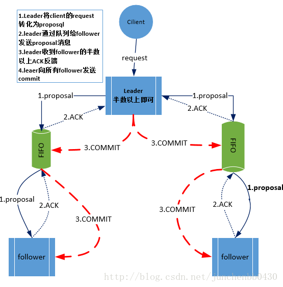
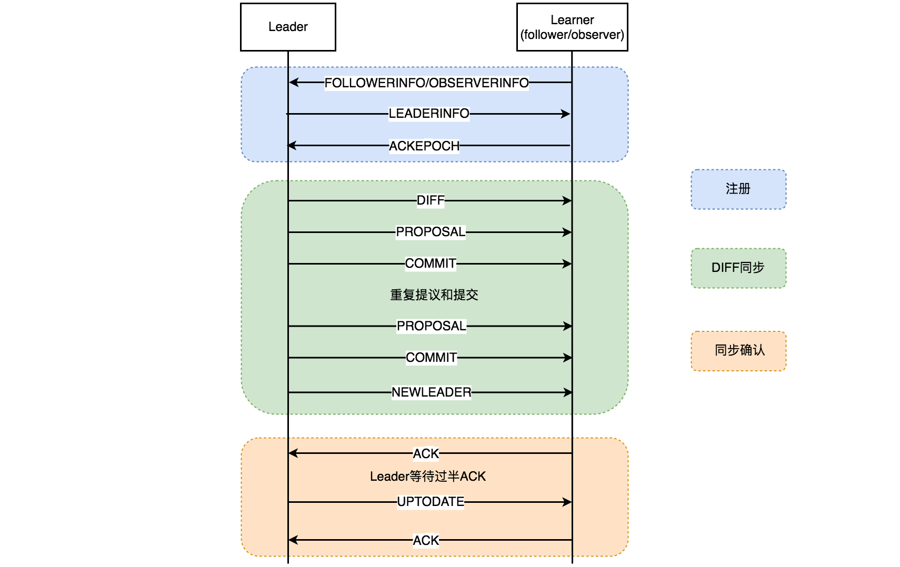

# 简介

+ Zookeeper是一个开源的分布式的，为分布式应用提供协调服务的Apache项目。Zookeeper从设计模式角度来理解：是一个基于观察者模式设计的分布式服务管理框架，它负责存储和管理大家都关心的数据，然后接受观察者的注册，一旦这些数据的状态发生变化，Zookeeper就将负责通知已经在Zookeeper上注册的那些观察者做出相应的反应。 
+ 特点：
  + zookeeper：一个领导者（Leader），多个跟随者（Follower）组成的集群。
  + 集群中只要有半数以上节点存活，Zookeeper集群就能正常服务。
  + 全局数据一致：每个Server保存一份相同的数据副本，Client无论连接到哪个Server，数据都是一致的。
  + 更新请求顺序进行，来自同一个Cclient的更新请求按其发送顺序依次执行。
  + 数据更新原子性，一次数据更新要么成功，要么失败。
  + 实时性，在一定时间范围内，Client能读到最新数据。
+ 分桶策略：将类似的会话放在同一区块中进行管理，以便于Zookeeper对会话进行不同区块的隔离处理以及同一区块的统一处理。
  + `ExpirationTime_ = currentTime + sessionTimeout `
  + `ExpirationTime = (ExpirationTime_ / ExpirationInrerval + 1) * ExpirationInterval `
  + ExpirationInterval 是指 Zookeeper 会话超时检查时间间隔，默认 tickTime
+ zookeeper的角色：
  + 领导者（Leader）：负责发起投票和决议，更新系统状态
  + 跟随者（Follower）：用于接收客户请求并向客户端返回结果，在选主过程中参与投票。
  + 观察者（Observer）：可以接收客户端连接，将写请求转发给Leader节点，Observer不参与投票过程，只同步Leader的状态。Observer的目的是为了扩展系统，提高读取速度。因为Zookeeper需要半数以上投票才执行操作，在follower多的情况下会消耗性能。[Observer的作用](https://blog.csdn.net/yangshangwei/article/details/111658771)
+ [Zookeeper处理流程](https://blog.csdn.net/fedorafrog/article/details/103830115)

# Zab协议

+ https://blog.csdn.net/liuchang19950703/article/details/111406622

## 作用

+ 使用一个单一的主进程（Leader）来接收并处理客户端的事务请求（也就是写请求），并采用了Zab的原子广播协议，将服务器数据的状态变更以 事务proposal （事务提议）的形式广播到所有的副本（Follower）进程上去。
+ 保证一个全局的变更序列被顺序引用。Zookeeper是一个树形结构，很多操作都要先检查才能确定是否可以执行，比如P1的事务t1可能是创建节点"/a"，t2可能是创建节点"/a/bb"，只有先创建了父节点"/a"，才能创建子节点"/a/b"。为了保证这一点，Zab要保证同一个Leader发起的事务要按顺序被apply，同时还要保证只有先前Leader的事务被apply之后，新选举出来的Leader才能再次发起事务。
+ 当主进程出现异常的时候，整个zk集群依旧能正常工作。

## 工作模式

+ zab协议有两种模式，一种是恢复模式，一种是广播模式
  + 恢复模式：恢复模式可以保证在Leader进程崩溃时候可以重新选出leader并且保证数据的完整。
    + 进入恢复模式：
      + 集群启动时
      + leader宕机了
      + leader与半数的机器失去联系
  + 广播模式：zookeeper所有的事务请求都由一个leader来处理。其他服务器为follower。Leader将客户端的事务请求转换为事务Proposal，每个事务绑定一个递增的事务ID，并且将Proposal分发给集群中其他所有的Follower，当follower将Proposal持久化到硬盘上后给leader发送一个ACK，当有过半数（>=N/2+1）的Follower反馈信息后，Leader将再次向集群内Follower广播Commit信息，Commit为将之前的Proposal提交。

## 广播模式



## Paxos算法的异同

+ 相同点：
  + 两者都存在一个类似于 Leader 进程的角色，由其负责协调多个 Follower 进程的运行
  + Leader 进程都会等待超过半数的 Follower 做出正确的反馈后，才会将一个提案进行提交
  + ZAB 协议中，每个 Proposal 中都包含一个 epoch 值来代表当前的 Leader周期，Paxos 中名字为 Ballot
+ 不同点：
  + ZAB 用来构建高可用的分布式数据主备系统（Zookeeper），Paxos 是用来构建分布式一致性状态机系统。

# ACL权限控制

+ Zookeeper的权限控制是基于ACL（Access Control List）。每一项资源，都配有一个列表，这个列表记录的就是哪些用户可以对这项资源执行CRUD中的那些操作。当系统试图访问这项资源时，会首先检查这个列表中是否有关于当前用户的访问权限，从而确定当前用户可否执行相应的操作。
+ zookeeper的操作权限：
  + CREATE : 能创建子节点
  + READ ：能获取节点数据和列出其子节点
  + WRITE : 能设置/更新节点数据
  + DELETE : 能删除子节点
  + ADMIN : 能设置节点 ACL 的权限
+ 认证方式：
  + world ： 默认方式，所有用户都可无条件访问。
  + auth :不使用任何 id，代表任何已认证的用户。
  + digest :用户名:密码认证方式： username:password 。
  + ip : 对指定 ip 进行限制。

# 节点Znode

+ ZooKeeper数据模型的结构与Unix文件系统很类似，整体上可以看作是一棵树，每个节点称做一个ZNode。每一个ZNode默认能够存储1MB的数据，每个ZNode都可以通过其路径唯一标识。 

## 节点类型

+ PERSISTENT-持久节点
  + 除非手动删除，否则节点一直存在于Zookeeper上
+ EPHEMERAL-临时节点
  + 临时节点的生命周期与客户端会话绑定，一旦客户端会话失效（客户端与zookeeper连接断开不一定会话失效），那么这个客户端创建的所有临时节点都会被移除。
+ PERSISTENT_SEQUENTIAL-持久顺序节点
  + 基本特性同持久节点，只是增加了顺序属性，节点名后边会追加一个由父节点维护的自增整型数字。
+ EPHEMERAL_SEQUENTIAL-临时顺序节点
  + 基本特性同临时节点，增加了顺序属性，节点名后边会追加一个由父节点维护的自增整型数字。

## 节点信息

+ ```shell
  cZxid = 0x2
  ctime = Tue Nov 27 11:05:34 CST 2018
  mZxid = 0x2   // 即该节点最后一次更新时的事务 id
  mtime = Tue Nov 27 11:05:34 CST 2018
  pZxid = 0x3
  cversion = 1    // 子节点版本号，当前节点的子节点每次变化时值增加 1
  dataVersion = 0  // 数据节点内容版本号，节点创建时为 0，每更新一次节点内容(不管内容有无变化)该版本号的值增加 1
  aclVersion = 0   // 节点的 ACL 版本号，表示该节点 ACL 信息变更次数
  ephemeralOwner = 0x0
  dataLength = 0
  numChildren = 1   // 当前节点的子节点个数
  ```

+ 

# Leader选举

+ zookeeper集群有两个核心属性：myid和zxid
  + myid：zk集群中服务器的唯一标识。
  + zxid：一个64位的long类型，会拆分成两个部分。高32位表示epoch，低32位标识事务id。
    + epoch代表一个年代，也可以代表一个leader的统治时期。如果当前leader挂了，epoch的值会+1。
    + 低32位代表事务id，是一个自增的id。每当选举出一个新的leader时，新的leader就从本地事物日志中取出ZXID,然后解析出高32位的epoch编号，进行加1，再将低32位的全部设置为0。
+ 在进行选举的时候必须超过半数的服务器选择同一个服务器作为leader，这个服务器才会作为leader。这个服务器数是一开始配置在配置文件里的。[zookeeper过半机制详解](https://www.cnblogs.com/kevingrace/p/12433503.html)
+ zookeeper使用过半数投票的方式来防止脑裂（选出多个master），同时为了防止原来的leader复活。在zxid中的高32位使用了epoch标号，follower如果确认了新的leader存在，就会知道其epoch，那么它会拒绝epoch小于当前epoch的leader（原来的leader）的请求。

## 启动时选举

+ 在进行Leader选举的时候，至少需要两台机器。
+ 流程：
  + 发起投票：每个服务器发出一个投票。首先会以自己作为Leader服务器来进行投票。投票会包含推举的服务器的myid和zxid。然后将投票发给集群中的其他机器。
  + 接受来自各个服务器的投票。集群的每个服务器收到投票后，首先判断该投票的有效性，如检查是否是本轮投票、是否来自LOOKING状态的服务器。
  + 处理投票，优先检查zxid，zxid大的优先作为Leader，然后检查myid，myid大的作为Leader服务器。
  + 统计投票。每次投票后，服务器都会统计投票信息，判断是否已经有过半机器接受到相同的投票信息，如果有过半了，那么就认为已经选出Leader了。
  + 改变服务器状态。一旦确定了Leader，每个服务器就会更新自己的状态，如果是Follower，那么就变更为FOLLOWING，如果是Leader，就变更为LEADING。

## 运行时选举

+ 在Zookeeper运行期间，Leader与非Leader服务器各司其职，即便当有非Leader服务器宕机或新加入，此时也不会影响Leader，但是一旦Leader服务器挂了，那么整个集群将暂停对外服务，进入新一轮Leader选举，其过程和启动时期的Leader选举过程基本一致。

# 数据同步

+ zookeeper的数据同步分为四类：
  + DIFF：直接差异化同步
  + TRUNC+DIFF：先回滚再差异化同步
  + TRUNC：仅回滚同步
  + SNAP：全量同步
+ zookeeper维护了一个写请求队列（默认大小是500，可以通过参数`zookeeper.commitLogCount`配置），
  + 重要参数：
    + peerLastZxid:该learner服务器最后处理的ZXID。
    + minCommittedLog:leader服务器提议缓存队列committedLog中的最小ZXID。
    + maxCommittedLog:leader服务器提议缓存队列committedLog中的最大ZXID。
+ 在zookeeper集群中新的leader选举成功之后，leader会将自身的提交的最大proposal的事物ZXID发送给其他的follower节点。follower节点会根据leader的消息进行回退或者是数据同步操作。最终目的要保证集群中所有节点的数据副本保持一致。
+ [zookeeper数据同步详细分析](https://blog.csdn.net/weixin_33826609/article/details/91389764)

## DIFF（差异化同步）

+ 当follower的peerLastZxid等于leader的peerLastZxid，则说明此时leader和follower的数据一致，不需要同步。

+ 当follower的peerLastZxid介于maxCommitedLog，minCommitedLog之间，说明此时follower和leader数据存在差距，则进行diff同步，首先leader会发送给follower diff报文，通知其同步方式，然后会发送差异的提案及其提交的报文。

  ```shell
      Leader                 Follower
   
        |          DIFF         |  
        | --------------------> |
        |        PROPOSAL       |  
        | --------------------> |  
        |         COMMIT        |  
        | --------------------> |
        |        PROPOSAL       |  
        | --------------------> |  
        |         COMMIT        |  
        | --------------------> |
  ```

## TRUNC + DIFF

+ 如果follower的peerZxid在maxCommittedLog和minCommittedLog 之间，但是follower 中的peerLastZxid 在leader节点中不存在，则leader需要告知follower先回滚到peerLastZxid前一个zxid再执行差异化同步。

+ 这种情况可能发生在老leader提交事务但是还没有发送提案就宕机了，然后zookeeper选出新的leader，此时老leader重新上线，就需要进行同步使得老leader同步完事务。

  ```shell
     Leader                 Follower
   
        |         TRUNC         |  
        | --------------------> |
        |        PROPOSAL       |  
        | --------------------> |  
        |         COMMIT        |  
        | --------------------> |
        |        PROPOSAL       |  
        | --------------------> |  
        |         COMMIT        |  
        | --------------------> |
  ```

+ 

## TRUNC（回滚同步）

+ 若 follower 的 peerLastZxid 大于 leader 的 maxCommittedLog，则告知 follower 回滚至 maxCommittedLog； 该场景可以认为是 TRUNC+DIFF 的简化模式

  ```shell
      Leader                 Follower
   
        |         TRUNC         |  
        | --------------------> |
  
  ```

## SNAP(全量同步)

+ 若 follower 的 peerLastZxid 小于 leader 的 minCommittedLog 或者 leader 节点上不存在提案缓存队列时，将采用 SNAP 全量同步方式。 该模式下 leader 首先会向 follower 发送 SNAP 报文，随后从内存数据库中获取全量数据序列化传输给 follower， follower 在接收全量数据后会进行反序列化加载到内存数据库中。

+ leader 在完成数据同步之后，会向 follower 发送 NEWLEADER 报文，在收到过半的 follower 响应的 ACK 之后此时说明过半的节点完成了数据同步，接下来 leader 会向 follower 发送 UPTODATE 报文告知 follower 节点可以对外提供服务了，此时 leader 会启动 zk server 开始对外提供服务。

  ```shell
      Leader                 Follower
   
        |         SNAP          |  
        | --------------------> |
        |         DATA          |  
        | --------------------> |
  ```

  

# 数据不一致

+ 查询不一致：
  + 因为Zookeeper是过半成功即代表成功，假设我们有5个节点，如果123节点写入成功，如果这时候请求访问到4或者5节点，那么有可能读取不到数据，因为可能数据还没有同步到4、5节点中，也可以认为这算是数据不一致的问题。
  + 解决方案可以在读取前使用sync命令。
+ leader未发送proposal宕机：
  + leader刚生成一个proposal，还没有来得及发送出去，此时leader宕机，重新选举之后作为follower，但是新的leader没有这个proposal。
  + 这种场景下的日志将会被丢弃。
+ leader发送proposal成功，发送commit前宕机：
  + 如果发送proposal成功了，但是在将要发送commit命令前宕机了，如果重新进行选举，还是会选择zxid最大的节点作为leader，因此，这个日志并不会被丢弃，会在选举出leader之后重新同步到其他节点当中。

# Watch监听机制

+ Zookeeper允许客户端向服务器Znode注册一个Watcher监听，当服务端一些指定事件触发了这个Watcher，服务端会向指定的客户端发送一个事件通知来实现分布式通知功能。
+ 特点：
  + 一次性执行，不管是客户端还是服务端，一个watcher一旦被触发，zookeeper就会将其移除。可以减少服务端的压力。
  + 客户端串行执行，客户端的watcher回调是一个串行的过程。
  + 轻量，服务端只会告诉客户端发生了事件而不会说明事件的具体内容，同时客户端注册watcher时，并不会真正的将watcher对象传递到服务器，只会在客户端的请求使用boolean类型属性进行标记。WatchEvent是最小的通信单元，结构上只包含通知状态、事件类型和节点路径，并不会告诉数据节点变化前后的具体内容。
  + 时效性，watcher只有在当前session彻底失效时才会失效，如果在session有效期内快速重连成功，则watcher依旧存在，仍然可以收到通知。
  + zookeeper的wathcer event是异步发送的，zookeeper只能保证最终一致性，而无法保证强一致性。
+ 服务端watcher处理流程：
  + 服务端收到客户端的请求，判断是否需要注册watcher，如果需要的话，将数据节点的节点路径和`ServerCnxn`（代表一个连接）存储在`WatcherManager`的`WatchTable`和`watch2Paths`中去。
  + 当某些事件触发的时候，服务器会将通知状态、事件类型、节点路径封装成一个`WatchEvent`对象。
  + 从`WatchTable`中查找`Watcher`。如果找到了，从`watch2Paths`和`WatchTable`中删除对应的Watcher。
  + 调用process方法来触发watcher。通过`ServerCnxn` 对应的 TCP 连接发送 Watcher 事件通知。
+ 客户端回调流程：
  + 客户端 SendThread 线程接收事件通知，交由 EventThread 线程回调 Watcher。
  + 客户端的 Watcher 机制同样是一次性的，一旦被触发后，该 Watcher 就失效了。

# 服务器状态

+ 服务器具有四种状态，分别是 LOOKING、FOLLOWING、LEADING、OBSERVING。
  + LOOKING：寻 找 Leader 状态。当服务器处于该状态时，它会认为当前集群中没有 Leader，因此需要进入 Leader 选举状态。
  + FOLLOWING：跟随者状态。表明当前服务器角色是 Follower。
  + LEADING：领导者状态。表明当前服务器角色是 Leader。
  + OBSERVING：观察者状态。表明当前服务器角色是 Observer。

# 部署方案

+ 一般来说集群会部署奇数台。单数服务器只要没有超过一般服务器宕机就可以继续使用。
  + zookeeper的特性是只要剩下的服务器大于n/2，就能继续工作。这种情况下5台服务器和6台服务器都只能挂掉2个节点。导致浪费。

# Zookeeper作用

## 分布式锁

+ [Zookeeper分布式锁详解](https://blog.csdn.net/crazymakercircle/article/details/85956246)

+ zookeeper的EPHEMERAL_SEQUENTIAL类型的节点可以在尾部加上一个由父类维护的编号。每次创建新的子节点都会在上一个节点的编号上+1。
+ 获取锁就可以针对每把锁创建一个父节点，然后每一个需要获取锁的线程就在当前父节点下创建一个EPHEMERAL_SEQUENTIAL类型的节点，并且规定，编号最小的那个节点，表示获取了锁。
+ 结合zookeeper的通知机制，可以实现类似AQS的唤醒。当释放锁的时候就删除响应的子节点，然后zookeeper会给其他线程发送通知。通过这个通知就可以唤醒下一个线程。

## 配置中心

+ 把配置放在zookeeper上，保存在zookeeper的某个节点中，然后对当前节点进行监听，一旦配置文件发生变化，每个应用程序就会收到zookeeper的通知，然后从zookeeper中获取新的配置文件并应用到系统中。

## 集群管理

+ 

# Curator

## 监听器

### PathChildrenCache

+ 子节点监听器，监视一个路径下孩子结点的创建、删除，以及结点数据的更新。产生的事件会传递给注册的PathChildrenCacheListener。

### NodeCache

+ 监视一个结点的创建、更新、删除，并将结点的数据缓存在本地。

### TreeCache

+ Path Cache和Node Cache的“合体”，监视路径下的创建、更新、删除事件，并缓存路径下所有孩子结点的数据。

## 短线重连

+ 可以使用在创建`CuratorFramework`对象的时候，指定`RetryPolicy`来指定短线的重试策略。
  + `RetryForever`：无限重试
  + `RetryOneTime`：重试一次
  + `RetryNTimes`：重试多次
  + `RetryUntilElapsed`：重试，直到超出指定的事件
  + `BoundedExponentialBackoffRetry`：多次重试，并且每次重试间隔增加
  + `ExponentialBackoffRetry`：多次重试，并且每次重试间隔增加（指数退避算法）

## 注意点

+ 使用curator时候如果程序退出一定要手动调用close方法，否则会临时节点会以为服务器宕机了，而无法立即从zookeeper中删除。需要等到sessionTimeout才会过期。
