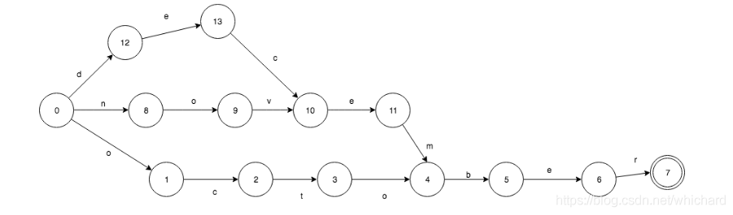
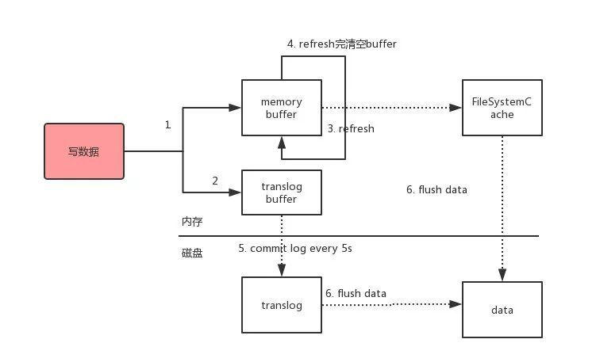
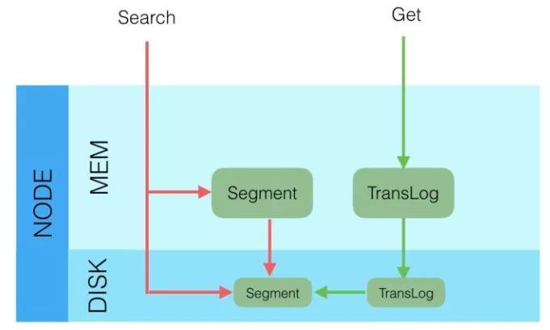

# 基本

+ 基本使用：https://www.cnblogs.com/ifme/p/12005026.html
+ [ES实现商品搜索](https://blog.csdn.net/m0_46690280/article/details/109016084)
+ [ES分页查询优化](https://blog.csdn.net/qq_36254699/article/details/112549418)

## 基本概念

+ Elasticsearch 是一个近实时的搜索平台。为什么是近实时？在传统的数据库中一旦我们插入了某条数据，则立刻可以搜索到它，这就是实时。反之在 Elasticsearch 中为某条数据构建了索引（插入数据的意思）之后，并不能立刻就搜索到，因为它在底层需要进行构建倒排索引、将数据同步到副本等等一系列操作，所以是近实时（通常一秒以内，无需过于担心）。
+ Cluster（集群）& Node（节点）：
  + 每一个单一的 Elasticsearch 服务器称之为一个 Node 节点，而一个或多个 Node 节点则组成了 Cluster 集群。Cluster 和 Node 一定是同时存在的，换句话说我们至少拥有一个由单一节点构成的集群，而在实际对外提供索引和搜索服务时，我们应该将 Cluster 集群视为一个基本单元。
  + Cluster 集群默认的名称就是 elasticsearch ，而 Node 节点默认的名称是一个随机的 UUID ，我们只要将不同 Node 节点的 cluster name 设置为同一个名称便构成了一个集群（不论这些节点是否在同一台服务器上，只要网络有效可达，Elasticsearch 本身会自己去搜索并发现这些节点并构成集群）。
+ Index（索引）& Type（类型）& Document（文档）:
  + Document（文档）是最基本的数据单元，我们可以将其理解为 mysql 中的具体的某一行数据。
  + Type（类型）在 6.0 版本之后被移除，它是一个逻辑分类，我们可以将其理解为 mysql 中的某一张表。
  + Index（索引）是具有类似特征的 Document 文档的集合，我们可以将其理解为 mysql 中的某一个数据库。
+ Shards（分片）& Replicas（副本）
  + 为了更有效的存储庞大体量的数据，Elasticsearch 有了 shard 分片的存在，在对数据进行存储便会将其分散到不同的 shard 分片中，这就如同在使用 mysql 时，如果一张表的数据量过于庞大时，我们将其水平拆分为多张表一样的道理。然而 shard 的分布方式以及如何将不同分片的文档聚合回搜索请求都是由 Elasticsearch 本身来完成，这些对用户而言是无感的。同时分片的数量一旦设置则在索引创建后便无法修改，默认为五个分片。
  + 对于副本，则是为了防止数据丢失、实现高可用，同时副本也是可以进行查询的，所以也有助于提高吞吐量。副本与分片一一对应，副本的数量可以随时调整，默认设置为每一个主分片有一个副本分片。副本分片和主分片一定不会被分配在同一个节点中，所以对于单节点集群而言，副本分片是无效的。

## 倒排索引
+ 倒排索引与正向索引不同，正向索引是通过ID值来定位到具体的某一行，然后取出数据。而倒排索引是基于分词，将文本中的数据分为各个词，然后建立索引。

## 数据结构

+ 在线演示：http://examples.mikemccandless.com/fst.py

+ FST（Finite State Transducer）：一种有限状态转移机。
  + 相较于字典树而言，字典树只是公用前缀，而FST是公用前缀和后缀

## 举例

+ 由“october”，“november”,”december”构成的FSA。

# 流程

## 写入流程

+ 在ES中写入一条数据具体是由ES集群中的一个节点来处理请求的。在集群中没一个节点都是一个协调节点（`coordinating node`），这个协调节点可以作为一个路由。并且根据哈系算法来计算请求由那个节点来进行处理，然后把请求路由到相应节点。
  + `shard = hash(document_id) % (num_of_primary_shards)`
+ 写入步骤：
  + 将数据写到内存缓存区
  + 然后将数据写到translog缓存区（先写日志）
  + 每隔**1s**数据从buffer中refresh到FileSystemCache中，生成segment文件，一旦生成segment文件，就能通过索引查询到了
  + refresh完，memory buffer就清空了。
  + 每隔**5s**中，translog 从buffer flush到磁盘中
  + 定期/定量从FileSystemCache中,结合translog内容`flush index`到磁盘中。
  + 等主分片写完了以后，会将数据并行发送到副本集节点上，等到所有的节点写入成功就返回**ack**给协调节点，协调节点返回**ack**给客户端，完成一次的写入。

+ 注意点：
  + Elasticsearch会把数据先写入内存缓冲区，然后每隔**1s**刷新到文件系统缓存区（当数据被刷新到文件系统缓冲区以后，数据才可以被检索到）。所以：Elasticsearch写入的数据需要**1s**才能查询到
  + 为了防止节点宕机，内存中的数据丢失，Elasticsearch会另写一份数据到**日志文件**上（如果节点挂了可以通过translog恢复数据），但最开始的还是写到内存缓冲区，每隔**5s**才会将缓冲区的刷到磁盘中。所以：Elasticsearch某个节点如果挂了，可能会造成有**5s**的数据丢失。
  + 等到磁盘上的translog文件大到一定程度或者超过了30分钟，会触发**commit**操作，将内存中的segement文件异步刷到磁盘中，完成持久化操作。
  + 由于每隔一秒会生成一个segement文件，所以后台会有一个`merge`线程来将多个segement文件合成一个segement文件。

## 更新和删除流程

+ ES的删除操作，会给对应的`doc`记录打上`.del`标识，如果是删除操作就打上`delete`状态，如果是更新操作就把原来的`doc`标志为`delete`，然后重新新写入一条数据。
+ 由于更新和删除的时候并不是真正的删除记录，所以在`merge`线程合并文件的时候，同时会把标识为`delete`状态的doc进行物理删除。

## 查找流程

+ ES的查找简单的来分可以分为两种查询：
  + 根据ID查询doc（GET查询），通过ID查询是实时的。
    + 检索内存的Translog文件
    + 检索硬盘的Translog文件
    + 检索硬盘的Segement文件
  + 根据query（搜索词）去查询匹配的doc（Query查询），通过Query查询是非实时的，因为Segement是每隔一秒才生成的。
    + 同时去查询内存和硬盘的Segement文件

+ ES的查询可以分为三个阶段：
  + QUERY_AND_FETCH（查询完就返回整个Doc内容）
  + QUERY_THEN_FETCH（先查询出对应的Doc id ，然后再根据Doc id 匹配去对应的文档）
    + 具体流程：
      + 客户端请求发送到集群的某个节点上。集群上的每个节点都是coordinate node（协调节点）
      + 然后协调节点将搜索的请求转发到**所有分片上**（主分片和副本分片都行）
      + 每个分片将自己搜索出的结果`(doc id)`返回给协调节点，由协调节点进行数据的合并、排序、分页等操作，产出最终结果。
      + 接着由协调节点根据 `doc id` 去各个节点上**拉取实际**的 `document` 数据，最终返回给客户端。
    + Query阶段：
      + 协调节点向目标分片发送查询的命令（转发请求到主分片或者副本分片上）
      + 数据节点（在每个分片内做过滤、排序等等操作），返回`doc id`给协调节点
    + Fetch阶段：
      + 协调节点得到数据节点返回的`doc id`，对这些`doc id`做聚合，然后将目标数据分片发送抓取命令（希望拿到整个Doc记录）
      + 数据节点按协调节点发送的`doc id`，拉取实际需要的数据返回给协调节点
  + DFS_QUERY_THEN_FETCH（先算分，再查询）
    + 「这里的分指的是 **词频率和文档的频率**（Term Frequency、Document Frequency）众所周知，出现频率越高，相关性就更强」

# Lucene

+ Lucene中存的就是一系列的二进制压缩文件和一些控制文件，它们位于计算机的硬盘上，这些内容统称为索引库，索引库有二部份组成：
  + **原始记录**：存入到索引库中的原始文本。
  + **词汇表**：按照一定的拆分策略（即分词器）将原始记录中的每个字符拆开后，存入一个供将来搜索的表

# DSL

## Bool Query

+ 类型：Bool查询对应Lucene中的BooleanQuery，它由一个或者多个子句组成，每个子句都有特定的类型。
  + must：返回的文档必须满足must子句的条件，并且参与计算分值
  + filter：返回的文档必须满足filter子句的条件。但是不会像Must一样，参与计算分值。
    + 由于filter会对结果进行缓存，同时会避免计算分值，所以会快一点。
  + should：返回的文档可能满足should子句的条件。在一个Bool查询中，如果没有must或者filter，有一个或者多个should子句，那么只要满足一个就可以返回。minimum_should_match参数定义了至少满足几个子句。
  + must_not：返回的文档必须不满足must_not定义的条件。

# 优化

## FileSysmtemCache

+ es 的搜索引擎严重依赖于底层的 `filesystem cache` ，你如果给 `filesystem cache` 更多的内存，尽量让内存可以容纳所有的 `idx segment file `索引数据文件，那么你搜索的时候就基本都是走内存的，性能会非常高。
+ 最佳的情况下，是仅仅在 es 中就存少量的数据，就是你要**用来搜索的那些索引**，如果内存留给 `filesystem cache` 的是 100G，那么你就将索引数据控制在 `100G` 以内，这样的话，你的数据几乎全部走内存来搜索，性能非常之高，一般可以在 1 秒以内。
  + 比如说你现在有一行数据。 `id,name,age ....` 30 个字段。但是你现在搜索，只需要根据 `id,name,age` 三个字段来搜索。如果你傻乎乎往 es 里写入一行数据所有的字段，就会导致说 `90%` 的数据是不用来搜索的，结果硬是占据了 es 机器上的 `filesystem cache` 的空间，单条数据的数据量越大，就会导致 `filesystem cahce` 能缓存的数据就越少。其实，仅仅写入 es 中要用来检索的**少数几个字段**就可以了，比如说就写入 es `id,name,age` 三个字段，然后你可以把其他的字段数据存在 mysql/hbase 里，我们一般是建议用 `es + hbase` 这么一个架构。
    + hbase 的特点是**适用于海量数据的在线存储**，就是对 hbase 可以写入海量数据，但是不要做复杂的搜索，做很简单的一些根据 id 或者范围进行查询的这么一个操作就可以了。从 es 中根据 name 和 age 去搜索，拿到的结果可能就 20 个 `doc id` ，然后根据 `doc id` 到 hbase 里去查询每个 `doc id` 对应的**完整的数据**，给查出来，再返回给前端。
    + 写入 es 的数据最好小于等于，或者是略微大于 es 的 filesystem cache 的内存容量。然后你从 es 检索可能就花费 20ms，然后再根据 es 返回的 id 去 hbase 里查询，查 20 条数据，可能也就耗费个 30ms，可能你原来那么玩儿，1T 数据都放 es，会每次查询都是 5~10s，现在可能性能就会很高，每次查询就是 50ms。

## 数据预热

+ 对于那些你觉得比较热的、经常会有人访问的数据，最好**做一个专门的缓存预热子系统**，就是对热数据每隔一段时间，就提前访问一下，让数据进入 `filesystem cache` 里面去。这样下次别人访问的时候，性能一定会好很多。

## 冷热分离

+ es 可以做类似于 mysql 的水平拆分，就是说将大量的访问很少、频率很低的数据，单独写一个索引，然后将访问很频繁的热数据单独写一个索引。最好是将**冷数据写入一个索引中，然后热数据写入另外一个索引中**，这样可以确保热数据在被预热之后，尽量都让他们留在 `filesystem os cache` 里，**别让冷数据给冲刷掉**。

## 分页优化

+ es 的分页是较坑的，假如你每页是 10 条数据，你现在要查询第 100 页，实际上是会把每个 shard 上存储的前 1000 条数据都查到一个协调节点上，如果你有个 5 个 shard，那么就有 5000 条数据，接着协调节点对这 5000 条数据进行一些合并、处理，再获取到最终第 100 页的 10 条数据。
+ 解决方法：使用 `scroll api`

#  踩坑注意

## Es term搜索

+ 在es中要避免对text类型的数据进行term搜索，默认情况下，Elasticsearch更改text字段的值，作为analysis的一部分。这会使查找text字段值的精确匹配变得困难。
+ 如要实现功能可以使用match进行查询或使用keyword
+ 文档参考：https://www.elastic.co/guide/en/elasticsearch/reference/7.4/query-dsl-term-query.html

## ES分页查询

+ 在ES中分页查询会导致每一个分片都查询`from + size`的数据，然后返回排序后的`size`个数据，由协调节点进行合并，重新排序然后返回给客户端。
  + 当`from`特别大的时候每一个分片都需要先查询前`from`行数据然后进行过滤
  + 每个节点都需要查询`from + size`条数据。
  + 注意：默认情况下`from + size`不能超过10000，可以通过参数`index.max_result_window`调整
+ 解决方案：通过`scroll`或``SearchAfter`解决。 