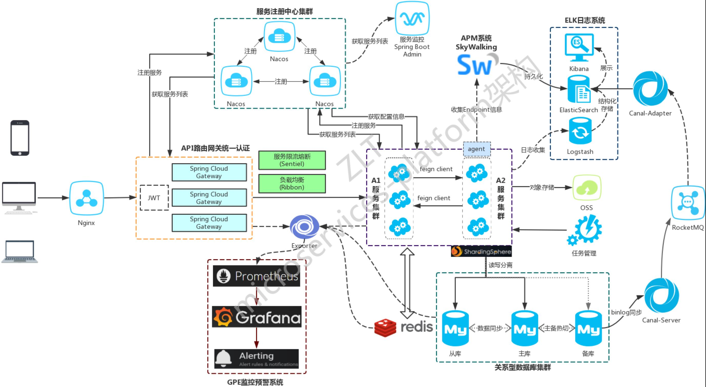
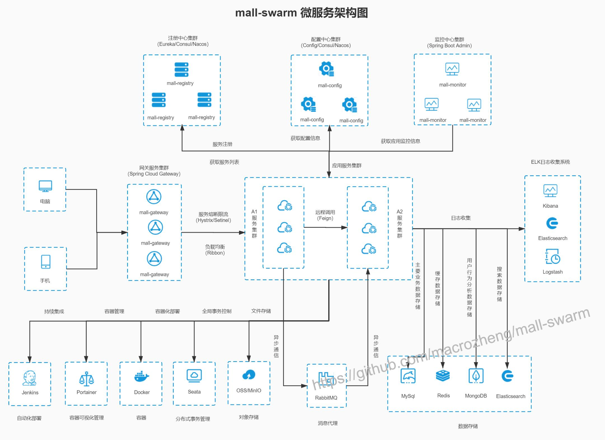
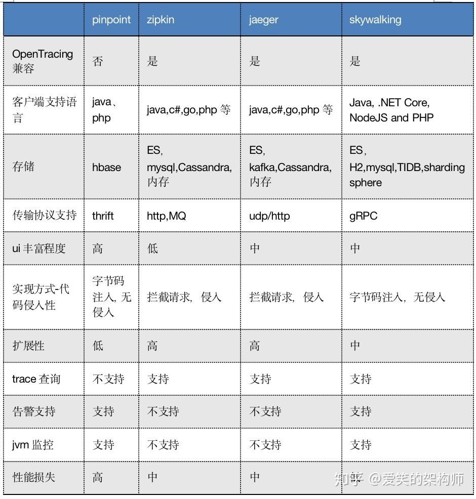

# 分布式基础

https://blog.csdn.net/lovexiaotaozi/article/details/89713937

+ 网络分区：分布式系统中，多个节点之前的网络本来是连通的，但是因为某些故障（比如部分节点网络出了问题）某些节点之间不连通了，整个网络就分成了几块区域，这就叫网络分区。
+ 一致性：
  + **强一致性** ：系统写入了什么，读出来的就是什么。
  + **弱一致性** ：不一定可以读取到最新写入的值，也不保证多少时间之后读取到的数据是最新的，只是会尽量保证某个时刻达到数据一致的状态。
  + **最终一致性** ：弱一致性的升级版，系统会保证在一定时间内达到数据一致的状态。

## CAP理论

+ **CAP** 也就是 **Consistency（一致性）**、**Availability（可用性）**、**Partition Tolerance（分区容错性）** 这三个单词首字母组合。
  + 一致性：所有节点访问同一份最新的数据副本
  + 可用性：非故障节点在合理时间内返回合理的响应
  + 分区容错性：分布式系统出现网络分区时，仍然能够对外提供服务。及分布式系统出现网络不连通的情况。
+ CAP理论中的P是一定要满足的，在决定了P之后才能在C和A中进行选择。
  + 举个例子：若系统出现“分区”，系统中的某个节点在进行写操作。为了保证 C， 必须要禁止其他节点的读写操作，这就和 A 发生冲突了。如果为了保证 A，其他节点的读写操作正常的话，那就和 C 发生冲突了。

## Base理论

+ **BASE** 是 **Basically Available（基本可用）** 、**Soft-state（软状态）** 和 **Eventually Consistent（最终一致性）** 三个短语的缩写。BASE 理论是对 CAP 中一致性 C 和可用性 A 权衡的结果，其来源于对大规模互联网系统分布式实践的总结，是基于 CAP 定理逐步演化而来的，它大大降低了我们对系统的要求。
  + 基本可用：基本可用是指分布式系统在出现不可预知故障的时候，允许损失部分可用性。但是，这绝不等价于系统不可用。
    + **响应时间上的损失**: 正常情况下，处理用户请求需要 0.5s 返回结果，但是由于系统出现故障，处理用户请求的时间变为 3 s。
    + **系统功能上的损失**：正常情况下，用户可以使用系统的全部功能，但是由于系统访问量突然剧增，系统的部分非核心功能无法使用。
  + 软状态指允许系统中的数据存在中间状态（**CAP 理论中的数据不一致**），并认为该中间状态的存在不会影响系统的整体可用性，即允许系统在不同节点的数据副本之间进行数据同步的过程存在延时。
  + 最终一致性强调的是系统中所有的数据副本，在经过一段时间的同步后，最终能够达到一个一致的状态。因此，最终一致性的本质是需要系统保证最终数据能够达到一致，而不需要实时保证系统数据的强一致性。

## 一致性哈希算法

+ 一致性哈希算法通过将哈希表抽象成一个环，对于每个节点，通过哈希函数进行计算，然后将节点部署到哈希表中的一个位置上，同时对于每一个数据，也对其进行哈希计算，并按照顺时针方向将其映射到其最近的节点上。
+ 当有节点添加或有节点宕机的情况都不需要重写对哈希进行计算。

## Paxos算法

+ [Paxos算法推导](https://www.cnblogs.com/linbingdong/p/6253479.html)、[Paxos详解](https://blog.csdn.net/wolf_love666/article/details/92832811)
+ Paxos算法解决了分布式系统如何就某个值达成一致。
+ 角色：在Paxos算法中有三种角色。Proposer（提出提案）、Acceptor（接收提案）、Learners（学习提案结果，不参与投票。一般来说学习者是数据备份节点）。具体实现中，一个进程可以充当多种角色。
+ 流程：Paxos算法分为两个阶段
  + 阶段一：Prepare阶段
    + Proposer选择一个**提案编号N**，然后向**半数以上**的Acceptor发送编号为N的**Prepare请求**。
    + 如果一个Acceptor收到一个编号为N的Prepare请求，且N**大于**该Acceptor已经**响应过的**所有**Prepare请求**的编号，那么它就会将它已经**接受过的编号最大的提案（如果有的话）**作为响应反馈给Proposer，同时该Acceptor承诺**不再接受**任何**编号小于N的提案**。
  + 阶段二：Accept阶段
    + 如果Proposer收到**半数以上**Acceptor对其发出的编号为N的Prepare请求的**响应**，那么它就会发送一个针对**[N,V]提案**的**Accept请求**给**半数以上**的Acceptor。注意：V就是收到的**响应**中**编号最大的提案的value**，如果响应中**不包含任何提案**，那么V就由Proposer**自己决定**。
    + 如果Acceptor收到一个针对编号为N的提案的Accept请求，只要该Acceptor**没有**对编号**大于N**的**Prepare请求**做出过**响应**，它就**接受该提案**，否则丢弃该提案。
  + 阶段三：Learn阶段
    + Acceptor 接收到 Accept 请求时，如果序号大于等于该 Acceptor 承诺的最小序号，那么就发送 Learn 提议给所有的 Learner。当 Learner 发现有大多数的 Acceptor 接收了某个提议，那么该提议的提议值就被 Paxos 选择出来。

## 微服务概念

+ 

## 分布式架构图





# 接口幂等

+ 幂等的意思是重复操作,接口的幂等性也就是接口被重复调用了,在前端不进行限制的情况下,同一个接口可能重复调用多次（如POST请求明显不幂等）,为了避免类似重复下单的问题,可以通过以下几种方式来解决幂等性问题：
  + 全局唯一ID,根据业务操作和内容生成全局唯一的ID,然后在执行操作前先判断是否已经存在该ID,如果不存在则将该ID进行持久化(存在数据库或者redis中),如果已经存在则证明该接口已经被调用过了.比如下单时可以生产一个流水号来作为该订单的唯一标识。
  + 可以使用select+insert来进行判断,因为一般订单的ID都是唯一索引,在高并发场景下不推荐。
  + 可以使用乐观锁解决,在表中可以添加一个version字段。
  + token机制,将token放在redis中。

# 分布式部署

## 主从模式（Master/Slaver）

+ 

## 哨兵模式（Sentinel）

## 集群模式（Cluster）


# 分布式锁

## RedLock算法

+ 加锁流程：
  + 获取当前时间戳，单位是毫秒；
  + 跟上面类似，轮流尝试在每个 master 节点上创建锁，超时时间较短，一般就几十毫秒（客户端为了获取锁而使用的超时时间比自动释放锁的总时间要小。例如，如果自动释放时间是 10 秒，那么超时时间可能在 `5~50` 毫秒范围内）；
  + 尝试在**大多数节点**上建立一个锁，比如 5 个节点就要求是 3 个节点 `n / 2 + 1` ；
  + 客户端计算建立好锁的时间，如果建立锁的时间小于超时时间，就算建立成功了；
  + 要是锁建立失败了，那么就依次之前建立过的锁删除；
  + 只要别人建立了一把分布式锁，你就得**不断轮询去尝试获取锁**。

## Redisson锁

+ Redisson提供了一个watch dog机制，如果一个拿到锁的分布式节点宕机过后，那么可能会导致锁死的情况。为了避免这种情况，redisson给锁设置了一个超时时间30s，并且提供了一个watch dog来不断的延迟锁的有效期。使得锁不会被超时释放。

## Zookeeper分布式锁

+ 某个节点尝试创建临时 znode，此时创建成功了就获取了这个锁；这个时候别的客户端来创建锁会失败，只能**注册个监听器**监听这个锁。释放锁就是删除这个 znode，一旦释放掉就会通知客户端，然后有一个等待着的客户端就可以再次重新加锁。

# 分布式事务

+ XA：2PC、3PC
  + XA是资源层面的分布式事务，强一致性，在两阶段提交的整个过程中，一直会持有资源的锁。
+ TCC
  + TCC是业务层面的分布式事务，最终一致性，不会一直持有资源的锁。

## 2pc（两阶段提交）

+ 两阶段指的是**请求阶段**和**提交阶段**
  + **请求阶段（表决）**：在请求阶段，协调者将通知事务参与者准备提交或取消事务，然后进入表决过程。在表决过程中，参与者将告知协调者自己的决策：同意（事务参与者本地作业执行成功）或取消（本地作业执行故障）。
  + **提交阶段（执行）**：在该阶段，协调者将基于第一个阶段的投票结果进行决策：提交或取消。 当且仅当所有的参与者同意提交事务协调者才通知所有的参与者提交事务，否则协调者将通知所有的参与者取消事务。参与者在接收到协调者发来的消息后将执行响应的操作。
+ 缺点：
  + 同步阻塞问题：执行过程中，所有参与节点都是事务阻塞型的。当参与者占有公共资源时，其他第三方节点访问公共资源不得不处于阻塞状态。
  + 单点故障：由于协调者的重要性，一旦协调者发生故障。参与者会一直阻塞下去。尤其在第二阶段，协调者发生故障，那么所有的参与者还都处于锁定事务资源的状态中，而无法继续完成事务操作。（如果是协调者挂掉，可以重新选举一个协调者，但是无法解决因为协调者宕机导致的参与者处于阻塞状态的问题）
  + 数据不一致：在二阶段提交的阶段二中，当协调者向参与者发送commit请求之后，发生了局部网络异常或者在发送commit请求过程中协调者发生了故障，这回导致只有一部分参与者接受到了commit请求。而在这部分参与者接到commit请求之后就会执行commit操作。但是其他部分未接到commit请求的机器则无法执行事务提交。于是整个分布式系统便出现了数据部一致性的现象。
  + 当协调者出错，同时参与者也出错时，两阶段无法保证事务执行的完整性。考虑协调者再发出commit消息之后宕机，而唯一接收到这条消息的参与者同时也宕机了。那么即使协调者通过选举协议产生了新的协调者，这条事务的状态也是不确定的，没人知道事务是否被已经提交。

## 3pc（三阶段提交）

+ 三阶段提交：三阶段提交将二阶段提交的请求阶段分为了两个阶段。
  + **CanCommit**：协调者向参与者发送commit请求，参与者如果可以提交就返回Yes响应，否则返回No响应。
  + **PreCommit**：协调者根据参与者的反应情况来决定是否可以记性事务的PreCommit操作。有两种情况
    + 假如协调者从所有的参与者获得的反馈都是Yes响应，那么就会执行事务的预执行。
      + 发送预提交请求 协调者向参与者发送PreCommit请求，并进入Prepared阶段。
      + 事务预提交 参与者接收到PreCommit请求后，会执行事务操作，并将undo和redo信息记录到事务日志中。
      + 响应反馈 如果参与者成功的执行了事务操作，则返回ACK响应，同时开始等待最终指令。
    + 假如有任何一个参与者向协调者发送了No响应，或者等待超时之后，协调者都没有接到参与者的响应，那么就执行事务的中断。
      + 发送中断请求 协调者向所有参与者发送abort请求。
      + 中断事务 参与者收到来自协调者的abort请求之后（或超时之后，仍未收到协调者的请求），执行事务的中断。
  + **DoCommit**：该阶段进行真正的事务提交。有两种情况。
    + 执行提交
      + 发送提交请求 协调接收到参与者发送的ACK响应，那么他将从预提交状态进入到提交状态。并向所有参与者发送doCommit请求。
      + 事务提交 参与者接收到doCommit请求之后，执行正式的事务提交。并在完成事务提交之后释放所有事务资源。
      + 响应反馈 事务提交完之后，向协调者发送Ack响应。
      + 完成事务 协调者接收到所有参与者的ack响应之后，完成事务。
    + 中断事务 协调者没有接收到参与者发送的ACK响应（可能是接受者发送的不是ACK响应，也可能响应超时），那么就会执行中断事务。
      + 发送中断请求 协调者向所有参与者发送abort请求
      + 事务回滚 参与者接收到abort请求之后，利用其在阶段二记录的undo信息来执行事务的回滚操作，并在完成回滚之后释放所有的事务资源。
      + 反馈结果 参与者完成事务回滚之后，向协调者发送ACK消息
      + 中断事务 协调者接收到参与者反馈的ACK消息之后，执行事务的中断。

## TCC（Try、Confirm、Cancel）

+ 分为Try阶段和Confirm/Cancel阶段。
  + Try阶段：会完成业务的检查（一致性），预留业务资源（准隔离性）
  + Confirm和Cancel
    + Confirm：确认执行业务操作，不做任何业务检查， 只使用Try阶段预留的业务资源。
    + Cancel：取消所有业务资源预留请求。

+ 优点：吞吐量高
+ 缺点：对应用的侵入性强。业务逻辑的每个分支都需要实现try、confirm、cancel三个操作，应用侵入性较强，改造成本高。

## 最大努力通知

+ 系统 A 本地事务执行完之后，发送个消息到 MQ；
+ 这里会有个专门消费 MQ 的**最大努力通知服务**，这个服务会消费 MQ 然后写入数据库中记录下来，或者是放入个内存队列也可以，接着调用系统 B 的接口；
+ 要是系统 B 执行成功就 ok 了；要是系统 B 执行失败了，那么最大努力通知服务就定时尝试重新调用系统 B，反复 N 次，最后还是不行就放弃。

## 本地消息表

+ A 系统在自己本地一个事务里操作同时，插入一条数据到消息表；
+ 接着 A 系统将这个消息发送到 MQ 中去；
+ B 系统接收到消息之后，在一个事务里，往自己本地消息表里插入一条数据，同时执行其他的业务操作，如果这个消息已经被处理过了，那么此时这个事务会回滚，这样**保证不会重复处理消息**；
+ B 系统执行成功之后，就会更新自己本地消息表的状态以及 A 系统消息表的状态；
+ 如果 B 系统处理失败了，那么就不会更新消息表状态，那么此时 A 系统会定时扫描自己的消息表，如果有未处理的消息，会再次发送到 MQ 中去，让 B 再次处理；
+ 这个方案保证了最终一致性，哪怕 B 事务失败了，但是 A 会不断重发消息，直到 B 那边成功为止。

## 半消息/最终一致性

+ A 系统先发送一个 prepared 消息到 mq，如果这个 prepared 消息发送失败那么就直接取消操作别执行了；
+ 如果这个消息发送成功过了，那么接着执行本地事务，如果成功就告诉 mq 发送确认消息，如果失败就告诉 mq 回滚消息；
+ 如果发送了确认消息，那么此时 B 系统会接收到确认消息，然后执行本地的事务；
+ mq 会自动**定时轮询**所有 prepared 消息回调你的接口，问你，这个消息是不是本地事务处理失败了，所有没发送确认的消息，是继续重试还是回滚？一般来说这里你就可以查下数据库看之前本地事务是否执行，如果回滚了，那么这里也回滚吧。这个就是避免可能本地事务执行成功了，而确认消息却发送失败了。
+ 这个方案里，要是系统 B 的事务失败了咋办？重试咯，自动不断重试直到成功，如果实在是不行，要么就是针对重要的资金类业务进行回滚，比如 B 系统本地回滚后，想办法通知系统 A 也回滚；或者是发送报警由人工来手工回滚和补偿。
+ 这个还是比较合适的，目前国内互联网公司大都是这么玩儿的，要不你就用 RocketMQ 支持的，要不你就自己基于类似 ActiveMQ？RabbitMQ？自己封装一套类似的逻辑出来，总之思路就是这样子的。

# 分布式ID

## 雪花ID算法 

+ SnowFlake 算法，是 Twitter 开源的分布式 id 生成算法。其核心思想就是：使用一个 64 bit 的 long 型的数字作为全局唯一 id。在分布式系统中的应用十分广泛，且ID 引入了时间戳，基本上保持自增的，后面的代码中有详细的注解。
+ 划分：
  + 第一个部分，是 1 个 bit：0，这个是无意义的。
    + 因为二进制里第一个 bit 为如果是 1，那么都是负数，但是我们生成的 id 都是正数，所以第一个 bit 统一都是 0。
  + 第二个部分是 41 个 bit：表示的是时间戳。
    + 41 bit 可以表示的数字多达 2^41 - 1，也就是可以标识 2 ^ 41 - 1 个毫秒值，换算成年就是表示 69 年的时间。
  + 第三个部分是 5 个 bit：表示的是机房 id。
    + 但是 10 bit 里 5 个 bit 代表机房 id，5 个 bit 代表机器 id。意思就是最多代表 2 ^ 5 个机房（32 个机房），每个机房里可以代表 2 ^ 5 个机器（32 台机器），也可以根据自己公司的实际情况确定。
  + 第四个部分是 5 个 bit：表示的是机器 id。
  + 第五个部分是 12 个 bit：表示的序号，就是某个机房某台机器上这一毫秒内同时生成的 id 的序号 。
    + 12 bit 可以代表的最大正整数是 2 ^ 12 - 1 = 4096，也就是说可以用这个 12 bit 代表的数字来区分同一个毫秒内的 4096 个不同的 id。

# 链路追踪

+ 基本术语：
  + Span：代表了一组基本的工作单元。为了统计各处理单元的延迟，当请求到达各个服务组件的时候，也通过一个唯一标识（SpanId 64位）来标记它的开始、具体过程和结束。通过SpanId的开始和结束时间戳，就能统计该span的调用时间，除此之外，我们还可以获取如事件的名称。请求信息等元数据。
  + Trace：由一组Trace Id相同的Span串联形成一个树状结构。为了实现请求跟踪，当请求到达分布式系统的入口端点时，只需要服务跟踪框架为该请求创建一个唯一的标识（即TraceId），同时在分布式系统内部流转的时候，框架始终保持传递该唯一值，直到整个请求的返回。那么我们就可以使用该唯 一标识将所有的请求串联起来，形成一条完整的请求链路。
  + annotation：用于用户自定义事件，用来辅助定位问题。
    + cs：Client Start，表示客户端发起请求
    + sr：ServerReceived，表示服务端收到请求
    + Server Send，表示服务端完成处理，并将结果发送给客户端
    + ClientReceived，表示客户端获取到服务端返回信息
+ 原理：
  + 请求到来生成一个全局TransactionId，通过TransactionId可以串联起整个调用链，一个TransactionId代表一次请求。
  + 除了TransactionId外，还需要SpanID用于记录调用父子关系。每个服务会记录下parent id和span id，通过他们可以组织一次完整调用链的父子关系。
  + 一个没有parent id的span成为root span，可以看成调用链入口。所有这些ID可用全局唯一的字符串表示；
  + 整个调用过程中每个请求都要透传TransactionId和SpanID。每个服务将该次请求附带的TransactionId和附带的SpanID作为parent id记录下，并且将自己生成的SpanID也记录下
  + 要查看某次完整的调用则 只要根据TransactionId查出所有调用记录，然后通过parent id和span id组织起整个调用父子关系。



# 消息队列

## 使用场景

+ 异步
  + 在基本的业务流程中，需要额外添加一些功能的场景。
    - 如订单流程中添加优惠券、添加积分
    - 如物流任务流程中通知船公司、铁路的场景
+ 削峰：对于大流量的请求，可以将请求放在消息队列。消息队列可以设置消息的效率频率，匹配服务器的服务能力，解决大流量请求发送服务器导致的服务器宕机问题。
+ 解耦：使用消息队列来实现，相当于流程操作完成，只要通知消息队列一个流程完成的消息就行了。其他业务流程订阅消息，接收到消息就会去处理对应的逻辑，降低整个流程的耦合性。
  + 额外功能的添加会导致业务流程处理的时间变长，可以使用异步如线程、线程池来实现。
    - 缺点：使用线程实现的话，每个流程都要try catch去处理异常场景，业务流程的耦合性太强，而且系统中会杂糅进调用其他系统的代码。不利于维护。
+ 缺点：系统复杂度增加、消息队列存在消息发送的重复消费、消息丢失等问题。

## 相关问题

https://www.jianshu.com/p/4491cba335d1

### 保证消息不丢失

+ 生产者端：不论是同步还是异步发送消息，同步和异步回调都需要做好try-catch，妥善的处理响应，如果Broker返回写入失败等错误消息，需要重试发送。当多次发送失败需要作报警，日志记录等。
+ 消息队列端：存储消息阶段需要在消息刷盘之后再给生产者响应，防止突然宕机导致消息丢失。
  - 如果Broker是集群部署，有多副本机制，即消息不仅仅要写入当前Broker,还需要写入副本机中。那配置成至少写入两台机子后再给生产者响应。
+ 消费端：消费者真正执行完业务逻辑之后，再发送给Broker消费成功

### 消息堆积

+ 主要原因 生产者的生产速度与消费者的消费速度不匹配
+ 解决方法：
  + 修复consumer的问题，定位消费慢的原因，优化逻辑，部分场景可以使用批量处理。
  + 增加Topic的队列数和消费者数量
+ 解决方案参考：
  + 先修复consumer的问题，确保其恢复消费速度，然后将现有cnosumer都停掉。
  + 新建一个topic，partition是原来的10倍，临时建立好原先10倍或者20倍的queue数量。
  + 然后写一个临时的分发数据的consumer程序，这个程序部署上去消费积压的数据，消费之后不做耗时的处理，直接均匀轮询写入临时建立好的10倍数量的queue。
  + 接着临时征用10倍的机器来部署consumer，每一批consumer消费一个临时queue的数据。
  + 这种做法相当于是临时将queue资源和consumer资源扩大10倍，以正常的10倍速度来消费数据。
  + 等快速消费完积压数据之后，得恢复原先部署架构，重新用原先的consumer机器来消费消息。

### 消息过期

+ 

### 消息重复消费

### 重试导致问题

+ 一般来说消息队列是会有重试机制的，如果下游业务发生异常了，会抛出异常并要求重新发送。
+ 通常分布式系统会有多个子服务，当一个服务发送异常，要求重新发送，而其他服务正常完成。如果此时重新发送，那么由于其他服务也在监听，会导致消息重复消费。


## RocketMQ

### 基本

+ 术语：
  + Producer：消息生产者，生产者的作用就是将消息发送到 MQ，生产者本身既可以产生消息，如读取文本信息等。也可以对外提供接口，由外部应用来调用接口，再由生产者将收到的消息发送到 MQ。
  + Producer Group：生产者组，简单来说就是多个发送同一类消息的生产者称之为一个生产者组。在这里可以不用关心，只要知道有这么一个概念即可。
  + Consumer：消息消费者，简单来说，消费 MQ 上的消息的应用程序就是消费者，至于消息是否进行逻辑处理，还是直接存储到数据库等取决于业务需要。
  + Consumer Group：消费者组，和生产者类似，消费同一类消息的多个 consumer 实例组成一个消费者组。
  + Topic：Topic 是一种消息的逻辑分类，比如说你有订单类的消息，也有库存类的消息，那么就需要进行分类，一个是订单 Topic 存放订单相关的消息，一个是库存 Topic 存储库存相关的消息。
  + Message：Message 是消息的载体。一个 Message 必须指定 topic，相当于寄信的地址。Message 还有一个可选的 tag 设置，以便消费端可以基于 tag 进行过滤消息。也可以添加额外的键值对，例如你需要一个业务 key 来查找 broker 上的消息，方便在开发过程中诊断问题。
  + Tag：标签可以被认为是对 Topic 进一步细化。一般在相同业务模块中通过引入标签来标记不同用途的消息。
  + Broker：Broker 是 RocketMQ 系统的主要角色，其实就是前面一直说的 MQ。Broker 接收来自生产者的消息，储存以及为消费者拉取消息的请求做好准备。
  + Name Server：Name Server 为 producer 和 consumer 提供路由信息。

# 分布式组件

## 注册中心

+ SpringCloud中的组件：`ZooKeeper`、`Eureka`、`Nacos`


# SpringCloud Alibaba

## Nacos

### 配置中心

+ 依赖：

  + ```xml
    <dependency>
        <groupId>com.alibaba.cloud</groupId>
        <artifactId>spring-cloud-starter-alibaba-nacos-config</artifactId>
    </dependency>
    ```

+ nacos的dataId由`${prefix}-${spring.profile.active}.${file-extension}`组成

  + `prefix`默认为`spring.application.name`的值,也可以通过配置项`spring.cloud.nacos.config.prefix`来配置。
  + `spring.profile.active`即为当前环境对应的profile。注意:当`spring.profile.active`为空时,对应的连接符-也将不存在,dataId的拼接格式变成`${prefix}.${file-extension}`
  + `file-extension`为配置内容的数据格式,可以通过配置项为`spring.cloud.nacos.config.file-extension`来配置。目前只支持properties和yaml类型。

+ 开启自动刷新：使用注解`@RefreshScope`

### 服务发现

## Sentinel 

