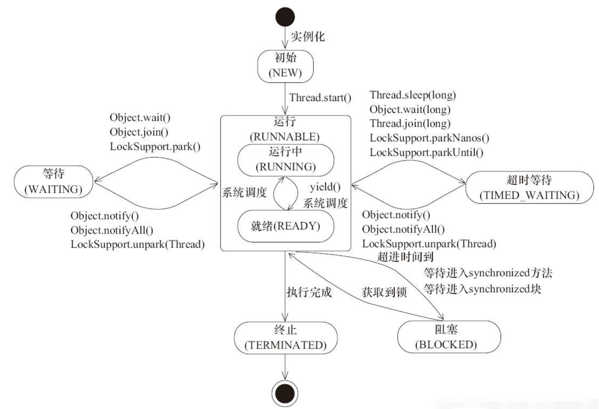
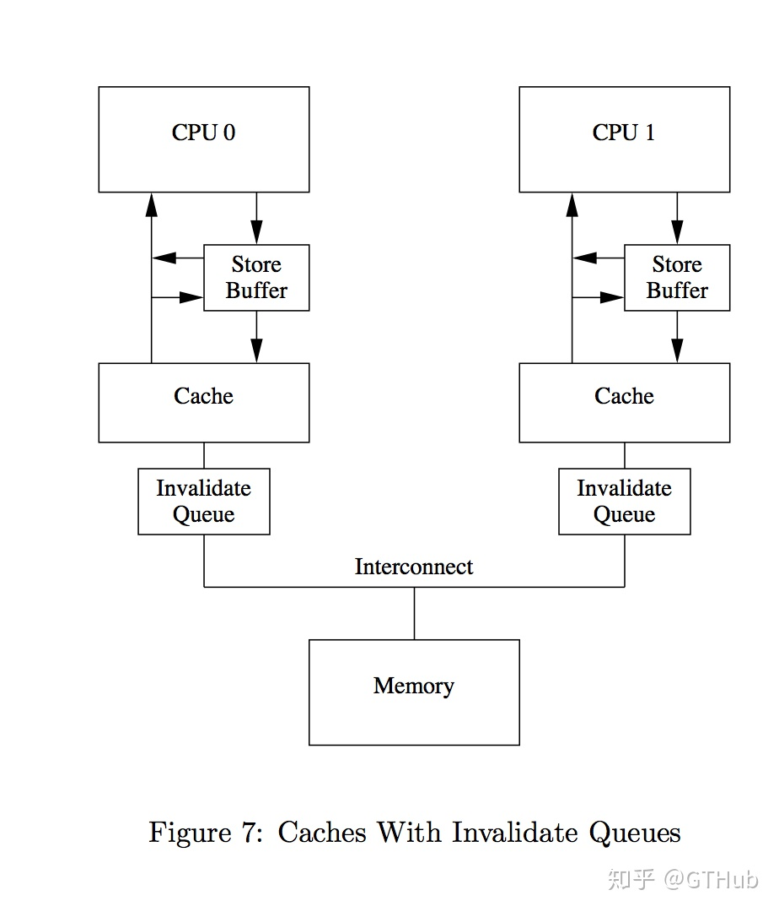
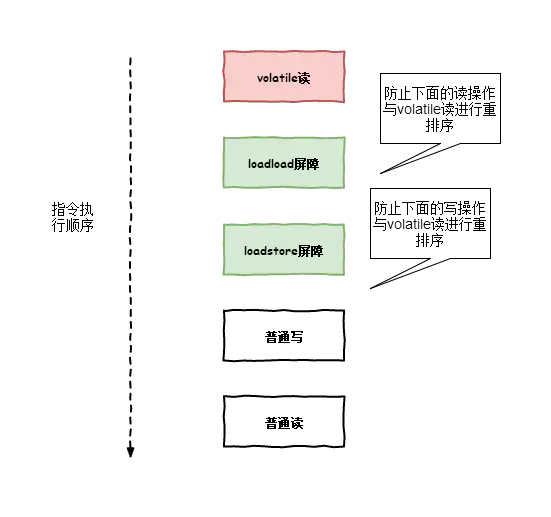
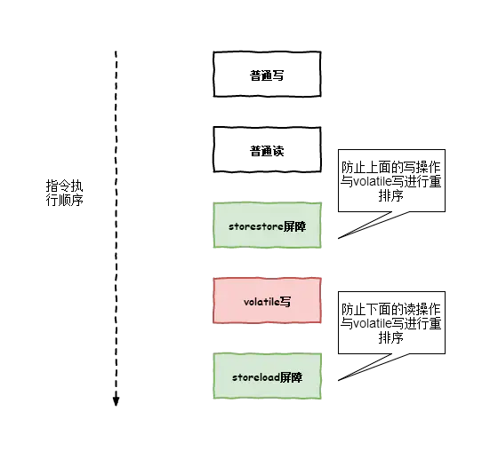
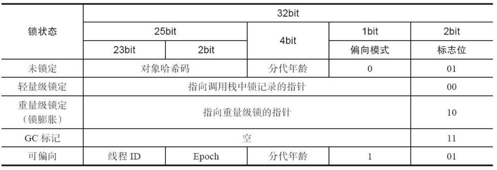
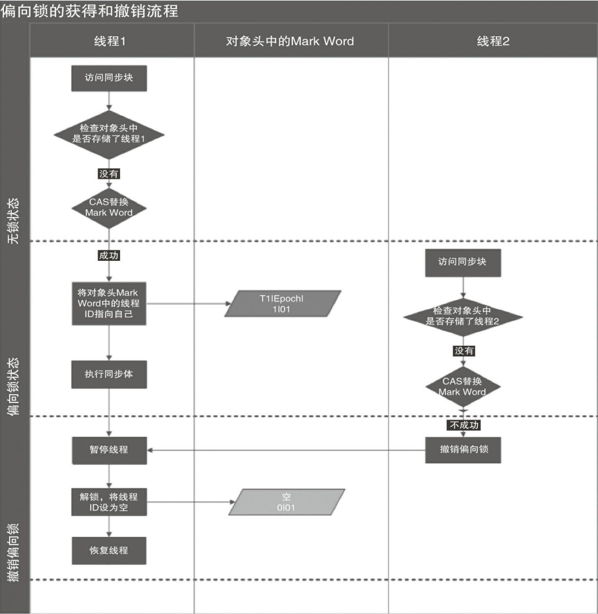
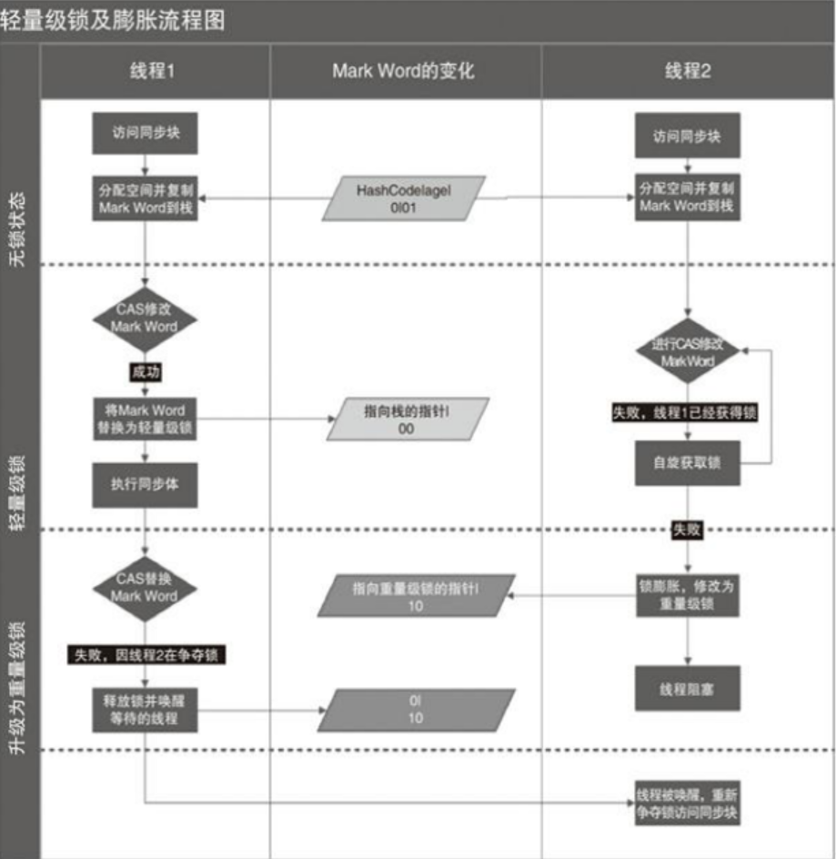

# 	线程

+ 线程同步：当有一个线程在对内存进行操作时，其他线程都不可以对这个内存地址进行操作，直到该线程完成操作。其他线程才能对该地址进行操作。而其他的线程处于等待状态
+ 协程：协程运行在线程之上，当一个协程执行完成后，可以选择主动让出，让另一个协程运行在当前线程之上。协程并没有增加线程数量，只是在线程的基础之上通过分时复用的方式运行多个协程，而且协程的切换在用户态完成，切换的代价比线程从用户态到内核态的代价小很多。

## 创建线程的过程

+ 它为一个线程栈分配内存，该栈为每个线程方法调用保存一个栈帧
+ 每一栈帧由一个局部变量数组、返回值、操作数堆栈和常量池组成
+ 一些支持本机方法的 jvm 也会分配一个本机堆栈
+ 每个线程获得一个程序计数器，告诉它当前处理器执行的指令是什么
+ 系统创建一个与Java线程对应的本机线程
  + 当new Thread的时候并不会创建，而是在调用`start`方法的时候，JVM才会通过调用`clone`来创建一个与其对应的系统线程。如果无法创建线程，会抛出`java.lang.OutOfMemoryError: unable to create new native thread`异常。
+ 将与线程相关的描述符添加到JVM内部数据结构中
+ 线程共享堆和方法区域

## 线程的状态



## 守护线程

+ 守护线程是一种特殊的线程，当线程中不存在非守护线程则守护线程自动销毁（如GC），当java虚拟机中没有非守护线程在运行的时候，java虚拟机会关闭。当所有常规线程运行完毕以后，守护线程不管运行到哪里，虚拟机都会退出运行。
+ 守护线程可以通过`thread.setDaemon()`方法来设置。

## 上下文切换

+ 概念：当多任务内核决定运行另外的任务时, 它保存正在运行任务的当前状态, 也就是CPU寄存器中的全部内容。这些内容被保存在任务自己的堆栈中, 入栈工作完成后就把下一个将要运行的任务的当前状况从该任务的栈中重新装入CPU寄存器, 并开始下一个任务的运行, 这一过程就是context switch。
+ 种类：
  + 线程切换：同一进程中的两个线程之间的切换
    进程切换：两个进程之间的切换
    模式切换：在给定线程中，用户模式和内核模式的切换
    地址空间切换：将虚拟内存切换到物理内存
+ 上下文切换发生时机：
  + 中断处理：中断分为硬件中断和软件中断，软件中断包括因为IO阻塞、未抢到资源或者用户代码等原因，线程被挂起
  + 多任务处理：每个程序都有相应的处理时间片，当前任务的时间片用完之后，系统CPU正常调度下一个任务
  + 用户态切换：这种情况下，上下文切换并非一定发生，只在特定操作系统才会发生上下文切换
+ 上下文切换步骤：
  + 保存进程A的状态（寄存器和操作系统数据）；
  + 更新PCB中的信息，对进程A的“运行态”做出相应更改；
  + 将进程A的PCB放入相关状态的队列；
  + 将进程B的PCB信息改为“运行态”，并执行进程B；
  + B执行完后，从队列中取出进程A的PCB，恢复进程A被切换时的上下文，继续执行A。

## Runnable

+ Runnable可以使用`Executors.callable`封装成一个Callable，具体实现是由适配器`RunnableAdapter`实现的。

## Callable

+ Callable类似Runnable，但是它任务主入口（call方法，相当于runnable的run）会返回一个值，并且可能会抛出一个异常。

## 线程中断

+ 当Java某个线程处于阻塞状态时，如果另外一个线程调用interrupt方法，则会导致当前线程离开阻塞状态（会重新抢夺时间片），并抛出一个异常。
+ 线程中断的原因可能是因为抛出了异常，也可能是因为调用了interrupt方法
+ 线程中断相关方法：
  + `interrupt()`：中断当前的线程，仅修改线程中的标志位
  + `isInterrupted()`：判断当前的线程是否中断
  + `Thread.interrupted()`：判断当前线程是否中断并且取消标志位


# 缓存一致性

+ 总线锁：
  + 总线锁就是使用处理器提供的一个LOCK#信号，当一个处理器在总线上输出此信号，其他处理器的请求将被阻塞，那么该处理器就可以独占共享锁。**在锁定期间，CPU不能操作其他内存地址中的数据**。
+ 缓存锁：
  + 缓存锁就是指内存区域如果被缓存在处理器的缓存行中，并且在LOCK#操作期间，那么当它执行操作回写到内存时，处理器不在总线上声言LOCK#信号，而是修改内部的内存地址，并允许它的缓存一致性机制来保证操作的原子性，因为缓存一致性机制会阻止同时修改由两个以上处理器缓存的内存区域数据，其他处理器回写已被锁定的缓存行的数据时，就会使缓存无效。
+ CPU缓存：
  + 当CPU要读取一个数据时，首先从一级缓存中查找，如果没有再从二级缓存中查找，如果还是没有再从三级缓存中或内存中查找。
    + 一级缓存：简称L1 Cache，位于CPU内核的旁边，是与CPU结合最为紧密的CPU缓存
    + 二级缓存：简称L2 Cache，分内部和外部两种芯片，内部芯片二级缓存运行速度与主频相同，外部芯片二级缓存运行速度则只有主频的一半
    + 三级缓存：简称L3 Cache，部分高端CPU才有
  + 每一级缓存中所存储的数据全部都是下一级缓存中的一部分，这三种缓存的技术难度和制造成本是相对递减的，所以其容量也相对递增。
  + 
+ 缓存一致性：
  + [缓存一致性问题](https://zhuanlan.zhihu.com/p/48157076)
  + [MESI协议](https://www.cnblogs.com/yanlong300/p/8986041.html?utm_source=so)
  + [MESI协议的优化与内存屏障](https://www.cnblogs.com/xiaoxiongcanguan/p/13184801.html)
  + 当CPU写数据时，如果发现操作的变量是共享变量，会发出信号通知其他CPU将该变量的缓存行设置为无效状态。其他CPU需要读取这个变量时候，发现变量的缓存行是无效的，那么就会从内存中重新获取。
    + 嗅探：
      + 每个处理器通过嗅探在总线上传播的数据来检查自己缓存的值是不是过期了。当处理器发现自己缓存行对应的内存地址被修改，就会将当前处理器的缓存行设置为无效状态。当处理器对这个数据进行修改操作时候，会重新从系统内存中把数据读取到处理器缓存中
      + volatile会不断的从主内存嗅探和CAS不断循环。会浪费性能
    + MESI协议中，每个缓存行有四个状态（**由于MESI引入了无效队列和存储缓存，所以MESI保证的是最终一致性**）：
      + M（Modified）：这行数据有效，数据被修改了，和内存中的数据不一致，数据只位于本Cache中
      + E（Exclusive）：这行数据有效，数据和内存中的数据一致，数据只位于本Cache中
      + S（Shared）：这行数据有效，数据和内存中的一致，数据存在于很多Cache中
      + I（Invaid）：这行数据无效。
    + CPU读写
      + 当缓存处于M、E、S的时候可以被读取，当处于I的时候必须从主存中读取数据
      + 当缓存处于M、E的时候可以被写入。对于 S 状 态的写，需要将其他 CPU 中缓存行置为无效才可写。
    + 当处理器想写某个缓存行时，如果它没有独占权，它必须先发送一条”我要独占权”的请求给总线，这会通知其它处理器把它们拥有的同一缓存段的拷贝失效（如果有）。只有在获得独占权后，处理器才能开始修改数据—-并且此时这个处理器知道，这个缓存行只有一份拷贝，在我自己的缓存里，所以不会有任何冲突。
    + 当CPU1想使用数据的时候，首先会先将数据拷贝到CPU1的缓存中，并将缓存设置成**独占状态（E）**，如果此时CPU2也使用了共享数据，两个CPU的缓存将会被设置成共享状态（S），此时如何CPU1想将数据写回主内存，首先会锁住缓存行，此时状态为修改状态（Modified），然后向总线发送消息主存变量已经被CPU1修改了，此时CPU2会将共享变量从共享状态（S）修改为无效状态（I），使缓存失效，然后重新从内存中读取变量。
  + MESI问题：[无效队列和存储缓存详解](https://juejin.cn/post/6844904143207792648)
    + CPU 缓存行的状态是通过消息传递来进行的，如果 CPU0 要对一个在缓存中共享的变量进行写入，首先发送一个失效的消息给到其他缓存了该数据的 CPU。并且要等到他们的确认回执。CPU0 在这段时间内都会处于阻塞状态。
    + 解决：
      + 为了避免阻塞带来的资源浪费。在 cpu 中引入 了 Store Bufferes（存储缓存） 和 Invalidate Queue（无效队列）。CPU0 写入共享数据时，直接把数据写入到 store bufferes 中，同时发送 invalidate 消息，然后继续去处理其他指令。当收到其他所有 CPU 发送了 invalidate ACK消息时，再将 store bufferes 中的数据数据存储至 cache 中。最后再从本地Cache同步到主内存。
        + 引入了 Store Bufferes 后，处理器会先尝试从 Store Bufferes 中读取值，如果 Store Bufferes 中有数据，则直接从Store Bufferes 中读取，否则就再从本地Cache中读取（snoop特性），从Store Bufferes读取数据存在脏读（需要手动插入内存屏障解决）。
      + 存储队列作用：
        + 避免CPU等待其他CPU的ACK，写数据直接写道store buffer中就行了，等待其他store buffer收到ack后将数据存储到cache中。
        + 如果写数据时，数据没在缓冲中可以直接写到store buffer中，等到数据加载后再写入Cache。
      + 无效队列的作用：
        + store buffer空间可能较小，如果满了（因为没收到其他CPU的ACK）可能就必须要排队，于是为每个cpu添加无效队列，无效队列收到请求后放入请求并立刻恢复ack。
      + 由于存储队列和无效队列的存在，可能会导致数据读取错误，所以需要插入内存屏障来解决。
      + 

# Volatile

+ **volatile修饰的变量仍然会有将变量从主内存拷贝到工作内存的步骤**
+ volatile通过内存屏障来保证数据的可见性。Java的四个内存屏障的特性由两个屏障组合，保证了数据依赖性，可以防止volatile修饰的数据指令重排。并且通过Store和Load关键字的特性，保证了volatile变量的可见性。
  + 在每个volatile写入之前，插入一个StoreStore，写入之后，插入一个StoreLoad
  + 在每个volatile读取之前，插入LoadLoad，之后插入LoadStore
+ volatile底层通过#lock前缀指令来实现（volatile修饰的变量汇编后会多出一个lock指令）。
  + 确保指令重排序时不会把其后面的指令排到内存屏障之前的位置，也不会把前面的指令排到内存屏障的后面；即在执行到内存屏障这句指令时，在它前面的操作已经全部完成；
  + 锁住总线或缓存，防止多个CPU同时修改一块区域。
  + 如果是写操作，它会导致其他CPU中对应的缓存行无效。
+ 三大特性：
  + [保证可见性](#Volatile保证可见性)：指线程之间的可见性，一个线程修改的状态对另一个线程是可见的。也就是一个线程修改的结果。另一个线程马上就能看到。
    + volatile的可见性是通过LOCK前缀指令实现的。
  + [**不保证原子性**](#Volatile不保证原子性)：解决原子性：使用原子类，使用synchronized
  + [禁止指令重排](#Volatile禁止指令重排)：
    + volatile禁止指令重排是通过在指令序列中插入特定的内存屏障来实现的。

## 指令重排

+ 指令重排：如果两个变量之间不存在数据依赖性，那么编译器就可以对其进行指令重排序。指令重排序保证了在单线程环境下程序的执行结果与代码顺序相同。
  + 源代码->编译器优化的重排->指令并行的重排->内存系统的重排
  + 单线程环境里面确保程序最终执行结果和代码顺序执行的结果一致
  + 处理器在进行重排序时必须要考虑指令之间的<u>**数据依赖性**</u>
  + 多线程环境中线程交替执行，由于编译器优化重排的存在，两个线程中使用的变量能否保证一致性是无法确定的，结果无法预测

## Volatile相关代码

+ [volatile和lock指令前缀](https://blog.csdn.net/qq_26222859/article/details/52235930)

```shell
instance=new Singleton();                 #instance是volatile变量
0x01a3deld:movb $0*0,0*1104800(%esi);0x01a3de24;lock addl $0*0,(%esp); # 汇编代码
```

+ 重点在`lock addl $0x0,(%rsp)`中，使用了一个lock前缀，后面的空操作只是触发lock的一个载体而已。

## Volatile和内存屏障

+ [java内存屏障的原理与应用](https://blog.csdn.net/breakout_alex/article/details/94379895)
+ [Volatile详解](https://www.jianshu.com/p/e34469924714)





+ 注意：上面的内存屏障只是抽象上的内存屏障，而具体在不同的架构上映射的指令是不一样的。https://zhuanlan.zhihu.com/p/71589870

## 相关问题


### 伪共享

+ 缓存一致性协议针对的是最小存取单元：缓存行。依照64字节的缓存行为例，内存中连续的64字节都会被加载到缓存行中，除了目标数据还会有其他数据。
  + 在Java中伪共享可以通过`@Contended`注解来填充解决。
  + 假如变量x和变量y共处在同一缓存行中，core1需要操作变量x，core2需要操作变量y
    + core1修改缓存行内的变量x后，按照缓存一致性协议，core2需将缓存行置为失效，core1将最新缓存行数据写回内存。
    + core2需重新从内存中加载包含变量y的缓存行数据，并放置缓存。如果core2修改变量y，需要core1将缓存行置为失效，core2将最新缓存写回内存。
    + core1或其他处理器如需操作同一缓存行内的其他数据，同上述步骤。
  + [Java伪共享](https://www.jianshu.com/p/a4358d39adac)

### 64位数据

+ 对于64位的long和double如果没有volatile修饰，就会两次读写，每次只操作32位，但是加了的话就不会分开，一次能操作64位
  + 在 JSR-133 之前的旧内存模型中，一个 64 位 long/double 型变量的读/写操作 可以被拆分为两个 32 位的读/写操作来执行。从 JSR-133 内存模型开始（即从 JDK5 开 始），仅仅只允许把一个 64 位 long/double 型变量的写操作拆分为两个 32 位的写操作来 执行，任意的读操作在 JSR-133 中都必须具有原子性（即任意读操作必须要在单个读事 务中执行）。

### DCL单例模式

+ DCL单例模式需要对单例的对象加volatile。`volatile Singleton instance= new Singleton()`来防止因为指令重排导致的非单例
  + 上面初始化对象会分为三步：
    + 分配内存空间：memory = allocate();
    + 初始化对象：instance(memory)
    + 设置instance指向刚分配的内存地址，此时instance != null：instance = memory
  + 其中步骤2和3**<u>不存在数据依赖关系</u>**，而且无论重排前还是重排后在执行结果在单线程中没有改变。所以这种重排优化是允许的（2步3步交换顺序）
  + 指令重排后，当一条线程访问instance不为null时，由于instance未必已经初始化完成，也就造成了线程安全的问题

### i++

+ volatile不保证原子性，对于i++此类的非原子操作是不能保证线程安全的
+ i++分为四步：
  +  获取当前 count 值，并且放入栈顶
  + 将常量 1 放入栈顶
  + 将当前栈顶中两个值相加，并把结果放入栈顶
  + 把栈顶的结果再赋值给 count
+ 可以使用原子类来解决

# Synchronized

## 基本点

+ 同步不具有继承性（子类不能继承父类的synchronized关键字）
+ synchronized有锁重入功能，当一个线程得到一个对象锁后，再次请求此对象锁是可以再次得到该对象的对象锁的（即在同步方法中调其他的同步方法是可以得到锁的）。同时也支持父子类继承环境中
+ synchronized不仅可以解决一个线程看到对象处于不一致的状态，还可以保证进入同步方法或同步代码块的每个线程都看到由同一个锁保护之前所有的修改效果

## 实现

+ [Synchronized分析](https://www.cnblogs.com/aspirant/p/11470858.html)

+ [Synchronized源码分析](https://www.jianshu.com/p/4adc71c00f87)

+ Synchronized是通过`monitorenter `和`monitorexit `实现的。
  + 其中`monitorenter`是插入到了同步代码块开始的位置，而`monitorexit`是插入到了同步代码块结束的位置。
  + 任何一个对象都会有一个monitor对象与之关联，当monitor被一个线程持有后，会处于锁定状态，Java虚拟机规范要求当线程执行到monitorenter指令时，会尝试获取对象对应的monitor的所有权，即对象的锁
  + synchronized维护了一个锁计数器，每当重入了一个方法，锁计数器就会+1，而退出的时候锁计数器就会-1，当锁计数器为0的时候就表示释放了锁。
  
+ 方法体出现ACC_SYNCHRONIZED 标识，该标识指明了该方法是一个同步方法，JVM 通过该 ACC_SYNCHRONIZED 访问标志来辨别一个方法是否声明为同步方法，从而执行相应的同步调用。

+ 在JDK1.6后synchronized引入了锁升级，分别为：偏向锁->轻量级锁->重量级锁。（不支持降级）以此来提高synchronized的性能。

+ 当线程进入同步代码块时，如果对象没有锁定，首先会在线程的栈中创建锁记录的空间，用于存储对象MarkWord的拷贝。每一个MarkWord都会和一个Lock Record关联。

  + | Lock Record | 描述                                                         |
    | ----------- | ------------------------------------------------------------ |
    | Owner       | 初始时为NULL表示当前没有任何线程拥有该monitor record，当线程成功拥有该锁后保存线程唯一标识，当锁被释放时又设置为NULL； |
    | EntryQ      | 关联一个系统互斥锁（semaphore），阻塞所有试图锁住monitor record失败的线程； |
    | RcThis      | 表示blocked或waiting在该monitor record上的所有线程的个数；   |
    | Nest        | 用来实现 重入锁的计数；                                      |
    | HashCode    | 保存从对象头拷贝过来的HashCode值（可能还包含GC age）。       |
    | Candidate   | 用来避免不必要的阻塞或等待线程唤醒，因为每一次只有一个线程能够成功拥有锁，如果每次前一个释放锁的线程唤醒所有正在阻塞或等待的线程，会引起不必要的上下文切换（从阻塞到就绪然后因为竞争锁失败又被阻塞）从而导致性能严重下降。Candidate只有两种可能的值0表示没有需要唤醒的线程1表示要唤醒一个继任线程来竞争锁。 |

+ ObjectMonitor源码：

  ```c
  ObjectMonitor() {
      _header       = NULL;
      _count        = 0; //记录个数
      _waiters      = 0,
      _recursions   = 0;
      _object       = NULL;
      _owner        = NULL;
      _WaitSet      = NULL; //处于wait状态的线程，会被加入到_WaitSet
      _WaitSetLock  = 0 ;
      _Responsible  = NULL ;
      _succ         = NULL ;
      _cxq          = NULL ;
      FreeNext      = NULL ;
      _EntryList    = NULL ; //处于等待锁block状态的线程，会被加入到该列表
      _SpinFreq     = 0 ;
      _SpinClock    = 0 ;
      OwnerIsThread = 0 ;
    }
  ```

  

## 加锁规则

+ 对对象synchronized，锁的是对象
+ 对类静态方法加锁，锁的是类
+ 对类的class加锁，锁的是类`synchronized(object.class)`
+ 对普通方法加锁，锁的是对象
+ 对静态方法加锁，锁的是类


# JMM（Java内存模型）

## 内存屏障

+ 内存屏障分为两种：Load Barrier 和 Store Barrier即读屏障和写屏障。

+ 内存屏障有两个作用：

  > 1.阻止屏障两侧的指令重排序；
  > 2.强制把写缓冲区/高速缓存中的脏数据等写回主内存，让缓存中相应的数据失效。

+ 对于Load Barrier来说，在指令前插入Load Barrier，<u>**可以让高速缓存中的数据失效，强制从新从主内存加载数据**</u>

+ 对于Store Barrier来说，在指令后插入Store Barrier，**<u>能让写入缓存中的最新数据更新写入主内存，让其他线程可见</u>**

+ java的内存屏障通常所谓的四种即LoadLoad,StoreStore,LoadStore,StoreLoad实际上也是上述两种的组合，完成一系列的屏障和数据同步功能。

  > **LoadLoad屏障：**对于这样的语句Load1; LoadLoad; Load2，在Load2及后续读取操作要读取的数据被访问前，保证Load1要读取的数据被读取完毕。
  >
  > **StoreStore屏障：**对于这样的语句Store1; StoreStore; Store2，在Store2及后续写入操作执行前，保证Store1的写入操作对其它处理器可见。
  >
  > **LoadStore屏障：**对于这样的语句Load1; LoadStore; Store2，在Store2及后续写入操作被刷出前，保证Load1要读取的数据被读取完毕。
  >
  > **StoreLoad屏障**：对于这样的语句Store1; StoreLoad; Load2，在Load2及后续所有读取操作执行前，保证Store1的写入对所有处理器可见。它的开销是四种屏障中最大的。在大多数处理器的实现中，这个屏障是个万能屏障，兼具其它三种内存屏障的功能。同时开销也是最大的。 

# 锁升级

+ 为了解决synchronized的效率底下，在1.6版本后引入了锁升级来提高synchronized的效率。

| 锁       | 优点                                                     | 缺点                                          | 适用场景                               |
| -------- | -------------------------------------------------------- | --------------------------------------------- | -------------------------------------- |
| 偏向锁   | 加锁和解锁不需要额外的消耗，和执行非同步方法相比差距不大 | 如果线程间存在锁竞争，会带来额外的锁撤销消耗  | 适用于只有一个线程访问同步块的场景     |
| 轻量级锁 | 竞争的线程不会阻塞，减少了上下文切换带来的消耗           | 如果始终得不到锁竞争的线程，自旋会消耗CPU资源 | 追求响应时间以及同步代码执行速度非常快 |
| 重量级锁 | 线程不使用自选，不会盲目消耗CPU资源                      | 线程阻塞，响应时间慢                          | 追求吞吐量以及同步块执行时间较长       |

## 对象头



## 锁升级

### 偏向锁

+ 偏向锁是指一段同步代码一直被一个线程所访问，那么该线程会自动获取锁。降低获取锁的代价。（**用于实现可重入**）
  + 当一个线程访问同步代码块并获取锁时，会在对象头和栈帧中的锁记录里存储锁偏向的线程ID，以后该线程进入和退出同步代码块时，不需要进行CAS操作来加锁和解锁，只需要测试一下对象头的Mark Word里是否存储指向当前线程的偏向锁。
  + 如果测试成功，则表示线程已经获得了锁;如果测试失败，则再测试一下MarkWord中偏向锁的标识是否设置成1（表示是偏向锁），如果没有设置，则使用CAS竞争锁，如果设置了，则尝试使用CAS将对象头的偏向锁指向当前线程
+ 撤销：当其他线程尝试竞争偏向锁时，持有偏向锁的线程才会释放锁。偏向锁的撤销需要等待全局安全点（没有正在执行的字节码）
  + 首先暂停拥有偏向锁的线程
  + 检查持有偏向锁的线程是否活着。
    + 如果不处于活动状态，则将对象头设置成无锁状态
    + 如果处于活动状态，拥有偏向锁的帧会被执行，遍历偏向对象的锁记录，栈中的锁记录和对象头的MarkWord要么重新偏向于其他线程，要么将其他线程恢复到无锁或标记对象不适合作为偏向锁，然后唤醒暂停的线程

+ 关闭偏向锁：偏向锁在java6和7是默认启用的，但是在应用程序启动几秒后才激活。可以使用参数：`-XX:BiasedLockingStartupDelay=0`来关闭。如果锁通常处于竞争状态，则可以使用`-XX:- UseBiasedLocking=false`关闭偏向锁。



### 轻量级锁

+ 轻量级锁是指当锁是偏向锁的时候，被另一个线程所访问，偏向锁就会升级为轻量级锁，其他线程会通过自旋的形式尝试获取锁，不会阻塞，提高性能。
  + JVM现在当前线程的栈帧中创建用于存储锁记录的空间，并将对象头中的MarkWord复制到锁记录中（Displaced Mark Word），然后尝试使用CAS将对象头中的MarkWord替换为指向锁记录的指针。如果成功，当前线程获得锁，如果失败表示其他线程竞争锁，当前线程尝试使用自旋的方式获取锁。



+ 自适应自旋锁：
  + 线程如果自旋成功了，那么下次自旋的次数会更加多，因为虚拟机认为既然上次成功了，那么此次自旋也很有可能会再次成功，那么它就会允许自旋等待持续的次数更多。反之，如果对于某个锁，很少有自旋能够成功，那么在以后要或者这个锁的时候自旋的次数会减少甚至省略掉自旋过程，以免浪费处理器资源。

### 重量级锁

+ 重量级锁是指当锁为轻量级锁的时候，另一个线程虽然是自旋，但自旋不会一直持续下去，当自旋一定次数的时候，还没有获取到锁，就会进入阻塞，该锁膨胀为重量级锁。重量级锁会让其他申请的线程进入阻塞，性能降低。
  + 轻量级解锁时，会使用原子的CAS操作将Displaced Mark Word替换会对象头，如果失败，则表示当前锁存在竞争，锁就会膨胀成重量级锁。
  + 自旋会消耗CPU资源，一旦升级成重量级锁就不会再恢复轻量级锁状态。当处于这个状态下，其他线程试图获取锁时，都会被阻塞住，当持有锁的线程释放锁之后会唤醒这些线程。

# Java中的锁


# Unsafe


## 内存操作

```java
//分配内存, 相当于C++的malloc函数
public native long allocateMemory(long bytes);
//扩充内存
public native long reallocateMemory(long address, long bytes);
//释放内存
public native void freeMemory(long address);
//在给定的内存块中设置值
public native void setMemory(Object o, long offset, long bytes, byte value);
//内存拷贝
public native void copyMemory(Object srcBase, long srcOffset, Object destBase, long destOffset, long bytes);
//获取给定地址值，忽略修饰限定符的访问限制。与此类似操作还有: getInt，getDouble，getLong，getChar等
public native Object getObject(Object o, long offset);
//为给定地址设置值，忽略修饰限定符的访问限制，与此类似操作还有: putInt,putDouble，putLong，putChar等
public native void putObject(Object o, long offset, Object x);
//获取给定地址的byte类型的值（当且仅当该内存地址为allocateMemory分配时，此方法结果为确定的）
public native byte getByte(long address);
//为给定地址设置byte类型的值（当且仅当该内存地址为allocateMemory分配时，此方法结果才是确定的）
public native void putByte(long address, byte x);
```

## CAS

```java
/**
	*  CAS
  * @param o         包含要修改field的对象
  * @param offset    对象中某field的偏移量
  * @param expected  期望值
  * @param update    更新值
  * @return          true | false
  */
public final native boolean compareAndSwapObject(Object o, long offset,  Object expected, Object update);

public final native boolean compareAndSwapInt(Object o, long offset, int expected,int update);
  
public final native boolean compareAndSwapLong(Object o, long offset, long expected, long update);
```

+ 应用：
  + 原子类

## 线程调度

```java
//取消阻塞线程
public native void unpark(Object thread);
//阻塞线程
public native void park(boolean isAbsolute, long time);
//获得对象锁（可重入锁）
@Deprecated
public native void monitorEnter(Object o);
//释放对象锁
@Deprecated
public native void monitorExit(Object o);
//尝试获取对象锁
@Deprecated
public native boolean tryMonitorEnter(Object o);
```

+ 应用LocalSupport

## Class相关

```java
//获取给定静态字段的内存地址偏移量，这个值对于给定的字段是唯一且固定不变的
public native long staticFieldOffset(Field f);
//获取一个静态类中给定字段的对象指针
public native Object staticFieldBase(Field f);
//判断是否需要初始化一个类，通常在获取一个类的静态属性的时候（因为一个类如果没初始化，它的静态属性也不会初始化）使用。 当且仅当ensureClassInitialized方法不生效时返回false。
public native boolean shouldBeInitialized(Class<?> c);
//检测给定的类是否已经初始化。通常在获取一个类的静态属性的时候（因为一个类如果没初始化，它的静态属性也不会初始化）使用。
public native void ensureClassInitialized(Class<?> c);
//定义一个类，此方法会跳过JVM的所有安全检查，默认情况下，ClassLoader（类加载器）和ProtectionDomain（保护域）实例来源于调用者
public native Class<?> defineClass(String name, byte[] b, int off, int len, ClassLoader loader, ProtectionDomain protectionDomain);
//定义一个匿名类
public native Class<?> defineAnonymousClass(Class<?> hostClass, byte[] data, Object[] cpPatches);
```

## 应用

+ Lambda表达式

## 对象操作

```java
//返回对象成员属性在内存地址相对于此对象的内存地址的偏移量
public native long objectFieldOffset(Field f);
//获得给定对象的指定地址偏移量的值，与此类似操作还有：getInt，getDouble，getLong，getChar等
public native Object getObject(Object o, long offset);
//给定对象的指定地址偏移量设值，与此类似操作还有：putInt，putDouble，putLong，putChar等
public native void putObject(Object o, long offset, Object x);
//从对象的指定偏移量处获取变量的引用，使用volatile的加载语义
public native Object getObjectVolatile(Object o, long offset);
//存储变量的引用到对象的指定的偏移量处，使用volatile的存储语义
public native void putObjectVolatile(Object o, long offset, Object x);
//有序、延迟版本的putObjectVolatile方法，不保证值的改变被其他线程立即看到。只有在field被volatile修饰符修饰时有效
public native void putOrderedObject(Object o, long offset, Object x);
//绕过构造方法、初始化代码来创建对象
public native Object allocateInstance(Class<?> cls) throws InstantiationException;
```

### 应用

+ **常规对象实例化方式**：我们通常所用到的创建对象的方式，从本质上来讲，都是通过new机制来实现对象的创建。但是，new机制有个特点就是当类只提供有参的构造函数且无显示声明无参构造函数时，则必须使用有参构造函数进行对象构造，而使用有参构造函数时，必须传递相应个数的参数才能完成对象实例化。
+ **非常规的实例化方式**：而Unsafe中提供allocateInstance方法，仅通过Class对象就可以创建此类的实例对象，而且**不需要调用其构造函数、初始化代码、JVM安全检查等。它抑制修饰符检测，也就是即使构造器是private修饰的也能通过此方法实例化，只需提类对象即可创建相应的对象**。由于这种特性，allocateInstance在java.lang.invoke、Objenesis（提供绕过类构造器的对象生成方式）、Gson（反序列化时用到）中都有相应的应用。

## 数组相关

```java
//返回数组中第一个元素的偏移地址
public native int arrayBaseOffset(Class<?> arrayClass);
//返回数组中一个元素占用的大小
public native int arrayIndexScale(Class<?> arrayClass);
```

## 内存屏障

```java
//内存屏障，禁止load操作重排序。屏障前的load操作不能被重排序到屏障后，屏障后的load操作不能被重排序到屏障前
public native void loadFence();
//内存屏障，禁止store操作重排序。屏障前的store操作不能被重排序到屏障后，屏障后的store操作不能被重排序到屏障前
public native void storeFence();
//内存屏障，禁止load、store操作重排序
public native void fullFence();
```

## 系统相关

```java
//返回系统指针的大小。返回值为4（32位系统）或 8（64位系统）。
public native int addressSize();  
//内存页的大小，此值为2的幂次方。
public native int pageSize();
```


# 活跃性问题

## 死锁

+ 出现死锁的条件：
  + 互斥条件：同一时间内，某资源只能被一个进程占用，如果此时还有其他进程请求该资源，则请求进程只能等待，直到该资源进程释放该资源（即释放锁）
  + 请求和保持：进程已经保持了至少一个资源，但又提出了新的资源请求，而该资源已经被其他进程占有，此时请求进程被阻塞，但对自己获得的资源保持不放
  + 不可抢占条件：进程已获得的资源在未使用完之前不能被抢占，只能在进程使用完时自己释放
  + 循环等待条件：发生死锁时，必然存在一个进程-资源的循环链
+ JDK自带检测死锁：
  + 进入bin，执行jps，查看运行当前线程的id
  + 使用jstack -l 线程id

### 避免死锁

+ 如果一个程序每次最多只能获取一个锁，那么不会产生锁顺序死锁
+ 如果必须获取多个锁，那么设计时，必须考虑锁的顺序；尽量减少潜在的加锁交互数量，将获取锁时需要遵循的协议写入正式文档，并遵循这些协议
  + 找出在什么地方将获取多个锁（使这个集合尽量小），然后对所有这些实例进行全局分析，从而确保它们在整个程序中获取锁的顺序都保持一致。
  + 尽可能使用开放调用
  + 显示使用Lock类中的tryLock定时锁代替内置锁（synchronized）
  + 使用定时锁来获取多个锁（内置锁），如果在获取锁时超时，可以释放这个锁，然后后退并且在一段时间后再尝试（只有在同时获取两个锁时才有效，如果在嵌套的方法调用请求多个锁，那么即使直到已经持有了外层的锁，也无法释放它）。

## 饥饿

+ 饥饿：线程无法访问到它所需要的资源而不能继续执行
+ 如果在Java程序中对线程的优先级使用不当，或在持有锁时执行一些无法结束的结构（例如无限循环，或无限制等待某个资源），那么也可能导致饥饿
+ 如果改变了线程的优先级，程序的行为会与平台相关，并且可能会导致饥饿问题。最好的方法是使用Thread.sleep或者Thread.yield
  + Java优先级Jvm会映射到操作系统的调度优先级。所以可能在不同的操作系统中，相同的Java优先级被映射成不同的优先级。当提高某个线程优先级时，可能不会起任何作用，也可能使得某个线程调度优先级高于其他线程，从而导致饥饿。

## 活锁

+ 活锁：活锁指的是任务或者执行者没有被阻塞，由于某些条件没有满足，导致一直重复尝试—失败—尝试—失败的过程。处于活锁的实体是在不断的改变状态，活锁有可能自行解开。
+ 当多个相互协作的线程都对彼此进行影响从而修改各自的状态，并使得任何一个线程都无法继续执行时，就发生了活锁
+ 解决活锁要在重试机制中引入随机性或约定重试机制避免再次冲突：如计算机网络碰撞检测算法

## 惊群效应

+ 简介：当你往一群鸽子中间扔一块食物，虽然最终只有一个鸽子抢到食物，但所有鸽子都会被惊动来争夺，没有抢到食物的鸽子只好回去继续睡觉， 等待下一块食物到来。这样，每扔一块食物，都会惊动所有的鸽子，即为惊群。
+ 在高并发系统下，当某一个资源可用时，多个线程或进程会被唤醒，导致资源的竞争。
+ 坏处：
  + 惊醒所有进程/线程，导致n-1个进程/线程做了无效的调度，上下文切换，cpu瞬时增高
  + 多个进程/线程争抢资源，所以涉及到同步问题，需对资源进行加锁保护，加解锁加大系统CPU开销

# 阻塞队列

+ 常用子类：

  + **<u>ArrayBlockingQueue</u>**：由数组结构组成的有界阻塞队列
  + **<u>LinkedBlockingQueue</u>**：由链表结构组成的<u>**有界阻塞队列**</u>（大小默认为Integer.MAX_VALUE）
  + PriorityBlockingQueue：支持优先级排序的无界阻塞队列
  + DelayQueue：使用优先级队列实现的延迟无界阻塞队列
  + **<u>SynchronousQueue</u>**：不存储元素的阻塞队列，即单个元素的队列。每一个put操作必须等待一个take操作，否则不能继续添加元素，反之亦然。
  + LinkedTransferQueue：由链表结构组成的无界阻塞队列
  + LinkedBlockingDeque：由链表结构组成的双向阻塞队列
+ 常用方法对比：

| 方法类型 | 抛出异常 | 特殊值 | 阻塞 | 超时  |
| -------- | -------- | ------ | ---- | ----- |
| 插入     | add      | offer  | put  | offer |
| 移除     | remove   | poll   | take | poll  |
| 检查     | element  | peek   | 无   | 无    |

# ThreadLocal

+ 使得每个线程可以绑定自己的值，也就是不同线程拥有自己的值，不同线程中的值可以放入ThreadLocal类中进行保存
+ ThreadLocal对象通常用于防止对可变的单例变量或全局变量进行共享
+ 如果想给ThreadLocal的get方法加上默认值，就需要继承ThreadLocal，并复写get方法

## 实现

+ ThreadLocal中的数据并不是由`ThreadLocal`类来进行维护的，而是通过`Thread`中的`ThreadLocalMap`维护的。
+ `ThreadLocalMap`是一个类似Map的结构，其中key为`ThreadLocal`，value为`Object`
+ 其中的`ThreadLocalMap`中的节点key是弱引用，因此如果不调用`remove`显示清楚可能会出现内存泄漏的问题

## 内存泄漏

+ `ThreadLocalMap`中使用的`Key`是`ThreadLocal`的弱引用。而`value`是强引用。如果`ThreadLocal`没有被外部进行强引用。则在垃圾回收的时候可能会导致`ThreadLocal`中的key被回收掉，这样就会存在`key`为null的Entry。如果不做任何措施，value将不会被GC回收导致内存泄漏。
+ 解决方案：
  + 在`ThreadLocal`使用完毕后调用`remove`方法手动回收

# 线程池

## 线程池的配置

+ CPU密集: CPU密集的意思是该任务需要大量的运算，而没有阻塞，CPU一直全速运行。
+ IO密集型，即该任务需要大量的IO，即大量的阻塞。在单线程上运行IO密集型的任务会导致浪费大量的CPU运算能力浪费在等待。所以在IO密集型任务中使用多线程可以大大的加速程序运行，即时在单核CPU上，这种加速主要就是利用了被浪费掉的阻塞时间。

### 常规配置

+ CPU密集型任务应配置尽可能小的线程，如配置CPU个数的线程数+1。比 CPU 核心数多出来的一个线程是为了防止线程偶发的缺页中断，或者其它原因导致的任务暂停而带来的影响。
  + 计算密（CPU）集型的线程恰好在某时因为发生一个页错误或者因其他原因而暂停，刚好有一个“额外”的线程，可以确保在这种情况下CPU周期不会中断工作。
+ IO密集型任务应配置尽可能多的线程，因为IO操作不占用CPU，不要让CPU闲下来，应加大线程数量，如配置两倍CPU个数+1，

### 配置参考


## Executor

+ 线程池的总接口

## ExecutorService

+ 继承自Executor，在Executor的基础上提供了一些用于关闭线程池之类的方法。

## Executors

+ Executor的一个静态工具类。
+ 用于创建线程池：
  + newCachedThreadPool：创建一个可缓存线程池，如果线程池长度超过处理需要，可灵活回收空闲线程，若无可回收，则新建线程。
    + 线程池最大大小为Integer.MAX_VALUE，基本大小为0
    + 创建的线程超时时间为1min
  + newFixedThreadPool：创建一个定长线程池，可控制线程最大并发数，超出的线程会在队列中等待。
    + 线程池基本大小和最大大小为参数中指定的值。
    + 线程池不会超时
  + newScheduledThreadPool：创建一个定长线程池，支持定时及周期性任务执行。
  + newSingleThreadExecutor：创建一个单线程化的线程池，它只会用唯一的工作线程来执行任务，保证所有任务按照指定顺序(FIFO, LIFO, 优先级)执行。（单线程的Executor提供了大量的内部同步机制，从而确保了任务执行的任何内存写入操作对于后续任务来说都是可见的，即使这个线程不时的会被另外一个线程替代，但对象总是可以安全地封闭在"任务线程"中）
+ 

## ThreadPoolExecutor

https://tech.meituan.com/2020/04/02/java-pooling-pratice-in-meituan.html

### 设置注意

+ 如果阻塞队列设置小了，在大于coreSize后每次线程执行都会创建一个新的线程。
+ 如果要内存常驻线程，需要将`allowCoreThreadTimeOut`设置为false，否者`getTask`的时候会一直轮询，浪费CPU
+ 触发拒绝策略时机：
  + 当前工作线程超过了线程池最大线程
  + 任务被添加到了阻塞队列后，在二次检测的时候因为关闭被从阻塞队列中移除。
+ worker销毁的时机：worker的runWorker方法会一直调用getTask()来从阻塞队列里获取任务，直到没有任务
  + 线程池已经shutdown并且阻塞队列为空
  + 线程池已经stop
  + woker超时等待，并且已经超时（结合`allowCoreThreadTimeOUt0`和`keepAliveTime`）
  + 当前的工作线程已经超过了最大的工作线程数。

### 调度

+ 首先检测线程池运行状态，如果不是RUNNING，则直接拒绝，线程池要保证在RUNNING的状态下执行任务。
+ 如果workerCount < corePoolSize，则创建并启动一个线程来执行新提交的任务。
+ 如果workerCount >= corePoolSize，且线程池内的阻塞队列未满，则将任务添加到该阻塞队列中。
+ 如果workerCount >= corePoolSize && workerCount < maximumPoolSize，且线程池内的阻塞队列已满，则创建并启动一个线程来执行新提交的任务。
+ 如果workerCount >= maximumPoolSize，并且线程池内的阻塞队列已满, 则根据拒绝策略来处理该任务, 默认的处理方式是直接抛异常。

### 拒绝策略

+ AbortPolicy（中止）：默认的饱和策略，抛出未检查的RejectedExecutionException。调用者可以捕获这个异常，然后编写处理的代码
+ DiscardPolicy（抛弃）：当新提交的任务无法保存到队列中等待执行时，抛弃策略会抛弃该任务。
+ DiscardOldestPolicy（抛弃最旧的）：会抛弃下一个将被执行的任务，然后尝试重新提交新的任务。（如果工作队列是一个优先队列，那么被抛弃的会是优先级最高的任务。所以**<u>抛弃最旧的饱和策略不要和优先级队列一起使用</u>**）
+ CallerRunsPolicy（调用者运行）：该策略不会抛弃任务也不会抛出异常。而是将某些任务回退到调用者，从而降低新任务的流量。它不会在线程池的某个线程中执行新提交的任务，而是**<u>在一个调用了execute的线程中执行该任务</u>**。

### 源码

+ 大概流程：
  + 调用submit方法，通过AbstractExecutorService的netTaskFor方法将Callable封装成一个FutureTask并返回。然后调用execute方法。具体实现在ThreadPoolExecutor中
  + execute方法首先判断当前workcount是否小于corePoolSize，小于则addWorker（core=true），如果成功就返回，否者继续判断当前状态，并且尝试添加到阻塞队列（二次校验，如果状态改变的话就移除并且触发拒绝策略。如果wc为0的话就`addWorker(null, false)`则创建一个非核心线程去执行它）。如果添加到阻塞队列失败后，在尝试`addWorker(firstTask, true)`添加一个新的线程（非核心线程）执行。失败则触发拒绝策略
  + addWorker方法
    + 首先轮询增加wc的值。同时进行状态的判断（两重循环，外层判断状态，内存cas替换wc的值。如果cas的过程中状态改变了，则需要break重新进入外层循环判断状态）。如果不是running或者shutdown并且有任务没有执行完毕。则返回false
    + 然后创建一个worker对象获取锁，将worker添加到workers里面，触发执行（start方法）。如果触发执行失败，则调用`addWorkerFailed`移除当前worker
  + start方法会触发调用worker的run方法（不是task的run方法，被封装了），worker的run方法会一直获取任务来执行，直到没有任务了。当`worker.task`不为null的时候直接执行，否者调用`getTask`方法从阻塞队列中获取方法执行
  + runTask方法如果是timed（关联allowCoreThreadTimeOut）来判断如何从阻塞队列中获取task，如果true，则调用`workQueue.poll(keepAliveTime, TimeUnit.NANOSECONDS)`否者调用`workQueue.take()`。如果poll没成功，则会继续轮询。当超过maxPoolSize的workers或者stop或者shutdown queue为空，或者等待任务超时并且超时的workers要被终止的话返回null。

#### 核心参数

+ corePoolSize：在线程池中存放的线程数量（即使空闲）。
+ maximumPoolSize：线程池中最大存放的线程数量。
+ keepAliveTime：当线程池中运行的线程数量大于corePoolSize，获取阻塞队列中的线程等待的时间。
+ unit：keepAliveTime的TimeUnit
+ workQueue：用于存放还未被执行的任务的队列。只会存放`execute`方法提交的任务。
+ threadFactory：用于创建新的线程的工厂
+ handler：拒绝策略，当队列满了并且工作线程大于等于线程池的最大线程数时，如何拒绝。
  + `AbortPolicy`（中止）：默认的拒绝策略，抛出未检查的RejectedExecutionException。调用者可以捕获这个异常，然后编写处理的代码
  + `DiscardPolicy`（抛弃）：当新提交的任务无法保存到队列中等待执行时，抛弃策略会抛弃该任务。
  + `DiscardOldestPolicy`（抛弃最旧的）：会抛弃下一个将被执行的任务，然后尝试重新提交新的任务。（如果工作队列是一个优先队列，那么被抛弃的会是优先级最高的任务。所以**<u>抛弃最旧的饱和策略不要和优先级队列一起使用</u>**）
  + `CallerRunsPolicy`（调用者运行）：该策略不会抛弃任务也不会抛出异常。而是将某些任务回退到调用者，从而降低新任务的流量。它不会在线程池的某个线程中执行新提交的任务，而是**<u>在一个调用了execute的线程中执行该任务</u>**。

#### 其他参数

+ ctl：线程池状态控制。包含两个变量
  + workerCount：工作的线程数，为（$$2^{29}-1$$）
    + 可能会和实际的工作线程数量有所不同，如线程创建失败
  + runState：线程池的状态
    + 包含状态：
      + running：接受新的任务，并执行阻塞队列中的任务
      + shutdown：不接受新的任务，但执行阻塞队列中的任务
      + Stop：不接受新的任务，也不执行阻塞队列中的任务
      + tidying：所有的任务都已经执行完毕。会在状态变为tidying之前执行钩子方法`terminated`
      + terminated：`terminated`方法执行完毕

#### 内部类

+ worker：实现了`Runnable`和`AbstractQueuedSynchronizer`。为一个`Runnable`的封装
+ worker是对firstTask的一个封装。worker里的thread里面封装的任务也不是传进来的firstTask，而是封装后的worker
+ 当调用`worker.thread.start()`方法的时候（即ThreadPoolExecutor的addWorker的t.start();），实际上是调用的`runWorker`方法，然后在`runWorker`中的`task.run()`才是真正的调用的是`firstTask`的方法
+ 构造方法：

```java
Worker(Runnable firstTask) {
    setState(-1); // inhibit interrupts until runWorker
    this.firstTask = firstTask;
    this.thread = getThreadFactory().newThread(this);
}
```


#### 方法源码

+ execute：执行一个`Runnable`的任务

```java
public void execute(Runnable command) {
    if (command == null)
        throw new NullPointerException();
    int c = ctl.get();
    // 小于coreSize，添加一个新的线程来执行任务。如果成功直接返回（可能因为线程池状态等失败），否者继续往后走
    if (workerCountOf(c) < corePoolSize) {
        if (addWorker(command, true))
            return;
        c = ctl.get();
    }
    // 当工作线程大于corePoolSize或者创建线程执行失败。则判断线程池状态并尝试添加到阻塞队列中。
    if (isRunning(c) && workQueue.offer(command)) {
        // 二次校验，防止在调用方法的时候线程池被关闭了。
        int recheck = ctl.get();
        // 如果不是running状态，并且将当前任务冲阻塞队列中移除，如果成功，执行拒绝策略
        if (! isRunning(recheck) && remove(command))
            reject(command);
        else if (workerCountOf(recheck) == 0)
            // 如果线程池为空，创建一个新的线程去处理。
            addWorker(null, false);
    }
    // 如果无法放入阻塞队列，则尝试添加一个新的线程执行，及当corePoolSize满了，缓存队列满了，创建一个新的线程来执行。
    else if (!addWorker(command, false))
        reject(command);
}
```

+ submit：位于`ThreadPoolExecutor`的父类`AbstractExecutorService`中，原理是生成一个`FutureTask`，并且委托`ThreadPoolExecutor`的`execute`方法执行。
+ addWorker：

```java
    /**
     * 将当前的任务添加到工作线程中。如果添加成功，就执行，并返回true。否者返回false
     *      addWorker(firstTask, core)，相当于提交新的任务，会初始化一个带有firstTask的worker，并且执行。
     *      addWorker(null， core)。如果当前状态为shutdown会初始化一个firstTask为null的worker，并且在调用runWorker的时候，如果firstTask为null，会从阻塞队列中获取一个任务来执行。
     * 以下状态返回false：
     *  为runnable，并且线程数超过了coreSize或者maximumPoolSize（core参数指定）
     *  为shutdown或者其他状态。（当为shutdown，firstTask == null，并且阻塞队列不为空的时候不会返回false）
     * @param firstTask
     * @param core
     * @return
     */
private boolean addWorker
    (Runnable firstTask, boolean core) {
        retry:
    	// cas轮询替换当前的workcount，如果替换成功则跳出两重循环。如果因为状态改变而cas失败，则跳出内部循环重新获取状态。
    	// 同时会检测条件，如果运行状态不为runnable（如果为关闭状态，并且阻塞队列还有任务没有完成，则不会返回false），或者工作线程数量大于corePoolSize或者maximumPoolSize，则返回false（core参数决定）
        for (;;) {
            int c = ctl.get();
            int rs = runStateOf(c);

            // Check if queue empty only if necessary.
            if (rs >= SHUTDOWN &&
                ! (rs == SHUTDOWN &&
                   firstTask == null &&
                   ! workQueue.isEmpty()))
                return false;

            for (;;) {
                int wc = workerCountOf(c);
                if (wc >= CAPACITY ||
                    wc >= (core ? corePoolSize : maximumPoolSize))
                    return false;
                if (compareAndIncrementWorkerCount(c))
                    break retry;
                c = ctl.get();  // Re-read ctl
                if (runStateOf(c) != rs)
                    continue retry;
                // else CAS failed due to workerCount change; retry inner loop
            }
        }

        boolean workerStarted = false;
        boolean workerAdded = false;
        Worker w = null;
    	// 将firstTask封装成一个worker，放在worker set里，然后触发执行。如果出发执行失败，则将当前worker移除
        try {
            // 初始化一个新的worker，如果为null的话，会从阻塞队列中获取一个任务执行。
            w = new Worker(firstTask);
            final Thread t = w.thread;
            if (t != null) {
                // 访问workers必须获取mainLock
                final ReentrantLock mainLock = this.mainLock;
                mainLock.lock();
                try {
                    int rs = runStateOf(ctl.get());

                    if (rs < SHUTDOWN ||
                        (rs == SHUTDOWN && firstTask == null)) {
                        // 如果当前线程已经开始运行抛出异常。
                        if (t.isAlive()) // precheck that t is startable
                            throw new IllegalThreadStateException();
                        // 将当前任务添加到worker set
                        workers.add(w);
                        int s = workers.size();
                        if (s > largestPoolSize)
                            largestPoolSize = s;
                        workerAdded = true;
                    }
                } finally {
                    mainLock.unlock();
                }
                if (workerAdded) {
                    // 开启当前的worker。注意，此处执行的并不是
                    t.start();
                    workerStarted = true;
                }
            }
        } finally {
            if (! workerStarted)
                // worker启动失败，则从worker队列中移除worker
                addWorkerFailed(w);
        }
        return workerStarted;
    }
```

+ runWorker：

```java
final void runWorker(Worker w) {
        Thread wt = Thread.currentThread();
        Runnable task = w.firstTask;
        w.firstTask = null;
        w.unlock(); // allow interrupts
        boolean completedAbruptly = true;
        try {
            // 如果能获得任务，则一直自旋获取并完成任务。如果获取不到则退出。
            while (task != null || (task = getTask()) != null) {
                w.lock();
                // If pool is stopping, ensure thread is interrupted;
                // if not, ensure thread is not interrupted.  This
                // requires a recheck in second case to deal with
                // shutdownNow race while clearing interrupt
                if ((runStateAtLeast(ctl.get(), STOP) ||
                     (Thread.interrupted() &&
                      runStateAtLeast(ctl.get(), STOP))) &&
                    !wt.isInterrupted())
                    wt.interrupt();
                try {
                    beforeExecute(wt, task);
                    Throwable thrown = null;
                    try {
                        // 此处并非是start，因为worker实际上是task的一个封装。此处相当于封装了实际的runnable。
                        task.run();
                    } catch (RuntimeException x) {
                        thrown = x; throw x;
                    } catch (Error x) {
                        thrown = x; throw x;
                    } catch (Throwable x) {
                        thrown = x; throw new Error(x);
                    } finally {
                        afterExecute(task, thrown);
                    }
                } finally {
                    task = null;
                    w.completedTasks++;
                    w.unlock();
                }
            }
            completedAbruptly = false;
        } finally {
            processWorkerExit(w, completedAbruptly);
        }
    }
```

+ getTask：返回一个等待队列中等待的任务

```java
    private Runnable getTask() {
        boolean timedOut = false; // Did the last poll() time out?

        for (;;) {
            int c = ctl.get();
            int rs = runStateOf(c);

            // 判断阻塞队列是否为空，为空返回null
            if (rs >= SHUTDOWN && (rs >= STOP || workQueue.isEmpty())) {
                decrementWorkerCount();
                return null;
            }

            int wc = workerCountOf(c);

            // Are workers subject to culling?
            boolean timed = allowCoreThreadTimeOut || wc > corePoolSize;

            if ((wc > maximumPoolSize || (timed && timedOut))
                && (wc > 1 || workQueue.isEmpty())) {
                if (compareAndDecrementWorkerCount(c))
                    return null;
                continue;
            }

            try {
                // 是否能超时，能超时就调用阻塞队列的poll方法，否者调用take方法。take方法会阻塞。
                Runnable r = timed ?
                    // 非阻塞获取
                    workQueue.poll(keepAliveTime, TimeUnit.NANOSECONDS) :
                	// 阻塞获取
                    workQueue.take();
                if (r != null)
                    return r;
                timedOut = true;
            } catch (InterruptedException retry) {
                timedOut = false;
            }
        }
    }
```

# AbstractQueuedSynchronizer

+ 队列同步器使用了CLH锁（基于单向链表的自旋锁，申请加锁的线程通过前驱节点的变量进行自旋。在前置节点解锁后，当前节点会结束自旋，并进行加锁）。AQS中的队列是CLH变体的虚拟双向队列（FIFO），AQS是通过将每条请求共享资源的线程封装成一个节点来实现锁的分配。
  + CLH 中的头节点是一个虚拟的头节点，获取了锁的线程是不在队列中的
    + 由于后续节点的唤醒需要前一个节点的ws为`singal`状态，但是第一个节点没有前置节点，所以需要一个虚拟节点来唤醒这个节点。
+ 队列同步器使用了模板方法模式，只需要重写指定的方法就可以实现同步的语义。AQS有两个内部类：ConditionObject和Node
+ 如果一个节点的前驱节点的状态被设置为了`signal`，那么下一个节点就能够被阻塞了，因为如果前驱节点为`signal`的时候，在其释放（`release`）的时候，会唤醒下一个节点。
+ 在AQS中，同步队列，如果一个线程获取到了同步状态，就会从同步队列中"移除"。（当前节点被设置为头节点，但是头节点的thread是为null的）
+ AQS存在着两个队列：一个是同步队列，一个是条件队列
  + 同步队列：双向队列
  + 条件队列：单向队列

## 源码


### 方法源码

#### 获取独占同步状态

+ 流程：
  + 调用`tryAcquire`方法获取同步状态，如果获取失败，则调用`addWaiter`生成一个新的节点，并将其放在同步队列中。
  + 同步队列中，如果当前节点的前驱节点是头节点，就尝试获取同步状态，如果获取成功就将当前节点设为头节点然后返回。如果失败，则调用`shouldParkAfterFailedAcquire`来查看当前节点是否需要阻塞，如果需要阻塞就调用`parkAndCheckInterrupt`阻塞当前节点，并且检查中断。
  + `shouldParkAfterFailedAcquire`中，如果前驱节点为single，表明前驱节点已经被阻塞了，则当前节点也可以放心的阻塞。返回true表明可以阻塞。如果前驱节点已经被取消了，则将前驱节点移出队列。否者将当前节点的状态设置为single。

+ acquire：获取资源，独占模式

```java
public final void acquire(int arg) {
    // 尝试获取，获取失败则生成一个生成一个新的节点添加到尾部，然后排他获取锁
    if (!tryAcquire(arg) &&
        acquireQueued(addWaiter(Node.EXCLUSIVE), arg))
        // 如果进入了if，则代表acquireQueued方法被中断了，于是恢复终端状态
        selfInterrupt();
}
```

+ acquireQueued：尝试获取同步状态。如果不被阻塞，则代表当前线程争抢不激烈，就CAS获取同步状态。如果阻塞，并且在阻塞的过程中（**如果是doAcquireInterruptibly的话，则在中断后会直接抛出异常。其他和acquireQueued差不多**）

```java
final boolean acquireQueued(final Node node, int arg) {
    boolean failed = true;
    try {
        boolean interrupted = false;
        for (;;) {
            // 获取前驱节点
            final Node p = node.predecessor();
            // 如果前驱节点为头节点，就尝试获取同步状态
            if (p == head && tryAcquire(arg)) {
                // 获取成功将当前节点设置为头节点然后返回。
                setHead(node);
                p.next = null; // help GC
                failed = false;
                return interrupted;
            }
            // 检测当前节点获取失败后是否应该阻塞，如果应该的话就阻塞并且检测中断状态。
            if (shouldParkAfterFailedAcquire(p, node) &&
                parkAndCheckInterrupt())
                interrupted = true;
        }
    } finally {
        // return前调用，进入此处则证明出现了异常。则取消当前尝试。
        if (failed)
            cancelAcquire(node);
    }
}
```

+ shouldParkAfterFailedAcquire：当获取同步状态失败的时候是否应该阻塞当前线程

```java
private static boolean shouldParkAfterFailedAcquire(Node pred, Node node) {
    int ws = pred.waitStatus;
    if (ws == Node.SIGNAL)
		// 如果前驱节点为Single，则表明前驱节点已经被阻塞了。则当前节点就能够安全的被阻塞了。
        return true;
    if (ws > 0) {
		// 如果前驱节点已经被取消了，则将被取消的节点移出队列。然后返回false
        do {
            node.prev = pred = pred.prev;
        } while (pred.waitStatus > 0);
        pred.next = node;
    } else {
        /*
             * waitStatus must be 0 or PROPAGATE.  Indicate that we
             * need a signal, but don't park yet.  Caller will need to
             * retry to make sure it cannot acquire before parking.
             */
        // 将前驱节点设置为Signal，然后返回false。因为前驱节点为signal的时候，在其release的时候会通知后续节点唤醒。
        compareAndSetWaitStatus(pred, ws, Node.SIGNAL);
    }
    return false;
}
```

+ addWaiter：添加一个指定模式的节点，通过mode指定，并将其添加到队尾，`Node.EXECUSIVE`或`Node.SHARED`

```java
private Node addWaiter(Node mode) {
    // 创建一个新的节点
    Node node = new Node(Thread.currentThread(), mode);
    Node pred = tail;
    // 尝试快速添加，如果失败则调用enq进行cas添加
    if (pred != null) {
        node.prev = pred;
        if (compareAndSetTail(pred, node)) {
            pred.next = node;
            return node;
        }
    }
    enq(node);
    return node;
}
```

+ Enq：cas添加到队尾，成功则返回当前节点的前驱节点

```java
private Node enq(final Node node) {
    // cas添加到队尾，成功则返回当前节点的前驱节点
    for (;;) {
        Node t = tail;
        if (t == null) { // 初始化，一开始的时候可能为空。当尾部为空的时候，则代表头也为空
            if (compareAndSetHead(new Node()))
                tail = head;
        } else {
            node.prev = t;
            if (compareAndSetTail(t, node)) {
                t.next = node;
                return t;
            }
        }
    }
}
```

#### 释放同步状态

+ release：释放同步状态

```java
public final boolean release(int arg) {
    if (tryRelease(arg)) {
        Node h = head;
        if (h != null && h.waitStatus != 0)
            // 唤醒一个阻塞的线程，如果存在的话。
            unparkSuccessor(h);
        return true;
    }
    return false;
}
```

+ unparkSuccesser：唤醒一个阻塞中的节点，如果存在的话。

```java
private void unparkSuccessor(Node node) {
    /*
         * If status is negative (i.e., possibly needing signal) try
         * to clear in anticipation of signalling.  It is OK if this
         * fails or if status is changed by waiting thread.
         */
    int ws = node.waitStatus;
    if (ws < 0)
        compareAndSetWaitStatus(node, ws, 0);

    Node s = node.next;
    // 默认唤醒下一个节点，如果下一个节点已经取消或者为空，则从尾部找到一个没有被取消的节点唤醒。
    if (s == null || s.waitStatus > 0) {
        s = null;
        for (Node t = tail; t != null && t != node; t = t.prev)
            if (t.waitStatus <= 0)
                s = t;
    }
    if (s != null)
        LockSupport.unpark(s.thread);
}

```

#### await等待

https://blog.csdn.net/kailuan2zhong/article/details/105391230

+ 大致流程：
  + 如果当前线程被中断了的话，就抛出异常。否则在条件队列中添加一个新的节点，添加新节点的同时去除非condition的节点，然后释放当前的同步状态。
  + 不断的轮询当前节点是否在同步队列中（判断同步队列是通过当前节点的状态和有没有前后节点来判断的），如果不在同步队列中就继续阻塞当前节点。同时还需要判断当前的线程是否中断。判断线程中断的时候同时还要判断是否调用了signal，如果调用了就恢复中断状态，否则抛出异常。（类似synchronized，如果在wait的时候中断线程是会抛出异常的）
  + 如果调用了signal将当前节点加入到了同步队列会跳出循环。
    + 如果当前线程因为中断而被加入到了同步队列中会跳出循环。
      + 在循环中线程被唤醒的原因有两个：1是因为调用了signal，在signal中调用了LockSupport的unpark方法导致线程被唤醒；2是因为在LockSupport的park途中线程被中断了，LockSupport会自动从阻塞状态中恢复过来。所以还需要额外的判断被唤醒的原因，来判断当前线程被中断的时机是在signal之前还是之后。
  + 跳出循环后则代表当前线程已经被添加到了同步队列中，于是调用acquireQueued重新抢夺同步状态。
  + 抢夺到同步状态后根据mode判断是否要抛出异常（在等待过程中被中断需要抛出异常）或恢复中断状态
  
+ await：等待，并释放资源。
  + 注意：此处为什么不是将当前的节点添加到条件队列，而是在条件队列里生成一个新的节点？
    + 因为调用await的时候已经获取到了同步状态，此时当前节点已经不算在同步队列中了。

```java
public final void await() throws InterruptedException {
    // 如果线程被中断了的话直接抛出异常
    if (Thread.interrupted())
        throw new InterruptedException();
    // 添加一个新的节点到等待队列。在addConditionWaiter中，如果发现尾节点的状态不对，则调用unlinkCancelledWaiters将等待队列中的非condition状态的节点移除。
    Node node = addConditionWaiter();
    // 释放所有资源。到此时，锁已经被释放了。
    int savedState = fullyRelease(node);
    int interruptMode = 0;
    /**
         * 不断轮询当前是否在同步队列中，如果不在同步队列中就继续阻塞（除非等待时候被中断了）。通过当前节点的状态来进行判断，如果当前节点的状态为condition或前驱节点为空，则代表还在条件队列中。如果后续节点不为空（next，同步队列的下一个是通过nextWaiter判断的，所以不冲突），则代表已经在同步队列中了。否则从尾节点找到前驱当前节点。
         * 如果在同步队列中那么就代表被唤醒了（调用了singal方法）
         */
    while (!isOnSyncQueue(node)) {
        LockSupport.park(this);
        // 此处线程已经被唤醒，唤醒的原因有两个：一是因为线程被中断，二是因为signal
        if ((interruptMode = checkInterruptWhileWaiting(node)) != 0)
            // 判断在等待过程中线程是否被中断，如果被中断了就跳出循环重新抢夺时间片，抢夺到了后然后报告中断状态。
            break;
    }
    // 重新竞争锁
    if (acquireQueued(node, savedState) && interruptMode != THROW_IE)
        interruptMode = REINTERRUPT;
    if (node.nextWaiter != null) // clean up if cancelled
        // 如果当前节点有后续节点，清除被取消的节点
        unlinkCancelledWaiters();
    if (interruptMode != 0)
        // 恢复中断状态
        reportInterruptAfterWait(interruptMode);
}
```

+ addConditionWaiter：在条件队列中添加一个节点。同时会清除非condition的节点

```java
private Node addConditionWaiter() {    
	Node t = lastWaiter; // 获取尾部指针，看来是采用尾插法    
	// If lastWaiter is cancelled, clean out.    
	if (t != null && t.waitStatus != Node.CONDITION) {        
		unlinkCancelledWaiters(); // 如果尾节点的状态不为condition，则遍历队列。清除非condition的节点。
		t = lastWaiter;    
	}    
	Node node = new Node(Thread.currentThread(), Node.CONDITION); // 创建一个新节点    
	if (t == null) // 尾结点为空，说明队列是空的        
		firstWaiter = node; // 初始化队列    
	else        
		t.nextWaiter = node; // 尾插    
	lastWaiter = node; // 调整尾指针指向    
	return node; // 返回新增节点对象
}
```

+ fullRelease：释放所有状态
+ isOnSyncQueue：判断节点是否在同步队列中

```java
    final boolean isOnSyncQueue(Node node) {
        if (node.waitStatus == Node.CONDITION || node.prev == null)
            // 如果当前节点的状态为condition，或前去节点为null，则当前节点是一个独立的节点，即不在同步队列中
            return false;
        if (node.next != null) // 如果当前节点的下一个不为null，则代表已经在同步队列中了（此处是同步队列的判断，条件队列的判断是通过nextWaiter来判断的）
            return true;
		// 前置节点不为空。此时不代表当前节点一定在同步队列中，因为CAS可能会失败，需要不断的从尾节点轮询来获取当前节点的确切状态
        return findNodeFromTail(node);
    }
```

+ checkInterruptWhileWaiting：判断在等待过程中线程是否中断，同时报告线程中断的原因

```java
// 判断当前线程在等待的过程中是否被中断
private int checkInterruptWhileWaiting(Node node) {
    return Thread.interrupted() ?
        (transferAfterCancelledWait(node) ? THROW_IE : REINTERRUPT) :
    0;
}

// 如果被中断了判断被中断的时候是否已经调用了signal。即判断被唤醒的原因。因为如果还在等待过程中被中断了的话需要抛出异常。
final boolean transferAfterCancelledWait(Node node) {

    if (node.compareAndSetWaitStatus(Node.CONDITION, 0)) {
        // 此时代表被唤醒的时候还没有调用signal，如果CAS替换成功，则表明当前线程被唤醒的原因是因为在阻塞的过程中调用了interrupt
        enq(node);
        return true;
    }
    // 此时代表由于signal被唤醒。
    while (!isOnSyncQueue(node))
        Thread.yield();
    return false;
}
```

#### signal通知

+ signal：通知

```java
// 从条件队列中获取一个等待时间最长的唤醒
public final void signal() {
    if (!isHeldExclusively()) //模板方法，判断是持有同步状态。
        throw new IllegalMonitorStateException();
    Node first = firstWaiter;
    if (first != null)
        doSignal(first); 
}
```

+ doSignal：

```java
private void doSignal(Node first) {
    do {
        
        if ( (firstWaiter = first.nextWaiter) == null)
            // 如果节点没有后续节点了，就将lastWaiter置为空
            lastWaiter = null;
        // 将first节点孤立出来（从条件队列中移除）
        first.nextWaiter = null;
        // 将其从条件队列中转换到同步队列
    } while (!transferForSignal(first) &&
             (first = firstWaiter) != null);
}

```

+ transferForSignal：将当前节点从条件队列中移交到同步队列

```java
final boolean transferForSignal(Node node) {
    /*
         *如果当前节点状态无法被替换，那么当前节点就被取消了
         */
    if (!node.compareAndSetWaitStatus(Node.CONDITION, 0))
        return false;

    /*
         * Splice onto queue and try to set waitStatus of predecessor to
         * indicate that thread is (probably) waiting. If cancelled or
         * attempt to set waitStatus fails, wake up to resync (in which
         * case the waitStatus can be transiently and harmlessly wrong).
         */
    // 将当前节点添加到同步队列并且返回前驱节点
    Node p = enq(node);
    int ws = p.waitStatus;
    // 如果当前节点的前驱节点被取消了或尝试替换等待状态失败就唤醒当前线程。
    // 前者：如果同步状态为取消，则唤醒线程，在await()逻辑中，被唤醒的线程会检查线程状态，此时的取消会导致在transferAfterCancelledWait()方法中，无法将node状态由CONDITION转为0，也就进而不停让出线程cpu时间，导致线程被取消。
    // 后者：无法更改等待状态的值，就说明有其他线程在操作该node。
    if (ws > 0 || !p.compareAndSetWaitStatus(ws, Node.SIGNAL))
        LockSupport.unpark(node.thread);
    return true;
}
```

### 内部类

#### ConditionObject

+ 成员变量：
  + `firstWaiter`：条件队列第一个节点
  + `lastWaiter`：条件队列最后一个节点
+ 参数：
  + `REINTERRUPT`：表示在退出的时候重新中断
  + `THROW_IE`：表示在退出的时候抛出InterruptedException

#### Node

+ CLH中的一个节点

+ 参数：
  + waitStatus：如果waitStatus非负表示节点不需要发信号。
    + cancelled：值为1，表明当前线程被取消了。
    + initial：值为0，初始状态
    + signal：值为-1，表明了当前节点已经被阻塞了，等待唤醒
    + condition：值为-2，表明当前节点在等待Condition。当其他线程对Condition调用了signal方法后，该节点会从等待队列中转移到同步队列中，加入到对同步状态的获取中
    + propagate：值为-3，表示下一次共享式同步状态获取将会无条件的被传播下去
  + prev：前结点的引用，如果前节点移除后会找到一个新的前节点。在队列中的线程是前节点永远存在
  + next：后节点的引用，后节点为空并不一定表示在队尾。
  + thread：当前节点绑定的线程
  + nextWaiter：下一个等待节点的链接，用于共享或者条件队列的时候。

# ReentrantLock

## 源码

#### 加锁

+ nonfairTryAcquire：申请非公平锁

```java
final boolean nonfairTryAcquire(int acquires) {
    final Thread current = Thread.currentThread();
    int c = getState();
    if (c == 0) {
        // 没有持有锁，则cas尝试获取锁
        if (compareAndSetState(0, acquires)) {
            // 设置当前线程为偏向线程
            setExclusiveOwnerThread(current);
            return true;
        }
    }
    // 此时代表已经获取了锁。
    else if (current == getExclusiveOwnerThread()) {
        // 锁计数器加1
        int nextc = c + acquires;
        if (nextc < 0) // overflow
            throw new Error("Maximum lock count exceeded");
        // 已经有锁了，不需要cas替换。
        setState(nextc);
        return true;
    }
    return false;
}
```

+ tryAcquire（FairSync）：申请公平锁，和上面类似，不过多了一个`hasQueuedPredecessors`判断是否有前驱节点。

```java
protected final boolean tryAcquire(int acquires) {
    final Thread current = Thread.currentThread();
    int c = getState();
    if (c == 0) {
        if (!hasQueuedPredecessors() &&
            compareAndSetState(0, acquires)) {
            setExclusiveOwnerThread(current);
            return true;
        }
    }
    else if (current == getExclusiveOwnerThread()) {
        int nextc = c + acquires;
        if (nextc < 0)
            throw new Error("Maximum lock count exceeded");
        setState(nextc);
        return true;
    }
    return false;
}
```


#### 释放锁

+ tryRelease：释放锁

```java
protected final boolean tryRelease(int releases) {
    // 减少锁计数器
    int c = getState() - releases;
    if (Thread.currentThread() != getExclusiveOwnerThread())
        throw new IllegalMonitorStateException();
    boolean free = false;
    // 锁计数器为0才能释放成功。
    if (c == 0) {
        free = true;
        // 设置偏向线程为null
        setExclusiveOwnerThread(null);
    }
    setState(c);
    return free;
}
```


### 内部类

#### Sync

+ 继承自AQS，ReentrantLock的核心。是一个抽象类，具体实现有`NonfairSync`（用于实现非公平锁）和`FairSync`（用于实现公平锁）

# ReentrantReadWriteLock

## 基本

+ 读写锁使用了一个int变量来代表读锁和写锁的数量。其中高16位表示读锁，低16位表示写锁。
+ 读写锁中有一个`ThreadLocalHoldCounter`的属性，其是`ThreadLocal<HoldCounter>`的子类。其中的`HoldCounter`用于记录线程实际的重入次数。区别于`ReentrentLock`实际上是使用`state`来记录重入次数。

## 源码分析

+ 读锁：

  

+ 写锁

# 原子类

+ 原子类主要基于CAS操作实现，同时使用 volatile 保证可见性。

## 实现自旋锁

```java
/**
 * 自旋锁：尝试获取锁的线程不会立即阻塞，而是采用循环的方式去尝试获取锁，这样的好处是减少线程上下文切换的消耗
 */
class SpinLock{
    AtomicReference<Thread> atomicReference = new AtomicReference<>();
    public void lock(){
        Thread thread  = Thread.currentThread();
        while (!atomicReference.compareAndSet(null,thread)){
            System.out.println("处于自旋锁中");
        }
    }
    public void unlock(){
        Thread thread = Thread.currentThread();
        while (!atomicReference.compareAndSet(thread,null)){
            System.out.println("还没有释放锁");
        }
    }
}
```

# 相关集合

## 并发集合

### ConcurrentHashMap

#### 基本

+ JDK1.7的CHM是基于分段锁实现的，JDK1.8的CHM和HashMap类似，基于哈希表链表红黑树实现。
  + jdk1.7中将数据分为一段一段的存储，并且给数据分配一把锁，当一个线程访问其中一个段的数据时，其他段的数据也能被其他线程访问。采用了Segment + HashEntry的方式实现。
    + Segment 是一种可重入的锁 ReentrantLock，每个 Segment 守护一个HashEntry 数组里得元素，当对 HashEntry 数组的数据进行修改时，必须首先获得对应的 Segment 锁。
    + 该类包含两个静态内部类 HashEntry 和 Segment ；前者用来封装映射表的键值对，后者用来充当锁的角色；
  + jdk8中使用Node + CAS + Synchronized来保证并发。Synchronized只锁定当前链表或红黑树的首节点，只要哈希不发生冲突，就不会发生冲突
+ hash函数：`(h ^ (h >>> 16)) & HASH_BITS`，**其在HashMap的基础上添加了一个与操作，能保证算出来的哈希值一定是个正数**。
+ ConcurrentHashMap的get方法不需要加锁，因为value和next使用volatile来修饰的，如果在多线程下节点被修改那么是可见的。
+ ConcurrentHashMap的迭代器是弱一致性的，在遍历的过程中，如果已经遍历的部分发生了变化，那么不会反应出来，如果没有遍历的部分发生了变化， 那么迭代器就会反应出来。
+ ConcurrentHashMap的size方法使用了`baseCount`和`counterCells`来进行计算，首先先获得`baseCount`然后循环遍历`counterCells`累加。
  + baseCount用于非竞争情况下的计数，counterCells用了缓存行填充。
  + 如果多线程环境下，那么会在countercells中计数。如果仍然发生冲突的话，那么重新计算一个countercells的位置计数。
+ ConcurrentHashMap在初始化容器大小的时候默认是`(1.5n)找最小的2次幂`，而HashMap是直接将传入的值找最小的2次幂。
+ sizectl：
  + 如果为0，表示数组还没有初始化。
  + 如果是正数，如果数组初始化了，记录的是阈值，如果没有初始化记录的是数组的初始容量
  + 如果为-1，表明数组正在初始化
  + 如果小于0，并且不为-1，表明数组正在扩容。

#### 大致流程

+ 插入：
  + 计算哈希函数，然后死循环，直到插入成功或者失败后退出
  
  + 如果哈希表还没有初始化，调用`initTable`进行哈希表的初始化，然后进入下一轮循环
  
  + 如果位置为空，调用cas替换，成功后返回，否则进入下一轮循环。
  
  + 如果当前位置正在扩容，则调用`helpTransfer`帮助扩容
  
  + 进行一次判断，如果第一个节点的key和要插入的节点的key一样，并且没有强制插入就直接返回（此处并不需要获取锁，用于提高并发）
  
  + 否则加锁插入节点，同时监控是否要进行红黑树的转换。然后`addCount`
  
  + ```java
       final V putVal(K key, V value, boolean onlyIfAbsent) {
            if (key == null || value == null) throw new NullPointerException();
            int hash = spread(key.hashCode());
            int binCount = 0;
            for (Node<K,V>[] tab = table;;) {
                Node<K,V> f; int n, i, fh; K fk; V fv;
                if (tab == null || (n = tab.length) == 0)
                    // 执行初始化。
                    tab = initTable();
                else if ((f = tabAt(tab, i = (n - 1) & hash)) == null) {
                    // 如果要插入的节点没有值，就cas进行插入。
                    if (casTabAt(tab, i, null, new Node<K,V>(hash, key, value)))
                        break;                   // no lock when adding to empty bin
                }
                else if ((fh = f.hash) == MOVED)
                    // 当前的节点为forword节点(哈希值为-1)，表明当前节点正在扩容。就协助扩容。
                    tab = helpTransfer(tab, f);
                else if (onlyIfAbsent // check first node without acquiring lock
                         && fh == hash
                         && ((fk = f.key) == key || (fk != null && key.equals(fk)))
                         && (fv = f.val) != null)
                    // 如果当前有元素，并且和要插入的值key相等，则会判断是否强制要插入。此处可以减少锁的争抢。
                    return fv;
                else {
                    // 加锁进行插入，锁的是当前节点，减少了锁的粒度。
                    V oldVal = null;
                    synchronized (f) {
                        if (tabAt(tab, i) == f) {
                            if (fh >= 0) {
                                binCount = 1;
                                for (Node<K,V> e = f;; ++binCount) {
                                    K ek;
                                    if (e.hash == hash &&
                                        ((ek = e.key) == key ||
                                         (ek != null && key.equals(ek)))) {
                                        oldVal = e.val;
                                        if (!onlyIfAbsent)
                                            e.val = value;
                                        break;
                                    }
                                    Node<K,V> pred = e;
                                    if ((e = e.next) == null) {
                                        pred.next = new Node<K,V>(hash, key, value);
                                        break;
                                    }
                                }
                            }
                            else if (f instanceof TreeBin) {
                                Node<K,V> p;
                                binCount = 2;
                                if ((p = ((TreeBin<K,V>)f).putTreeVal(hash, key,
                                                               value)) != null) {
                                    oldVal = p.val;
                                    if (!onlyIfAbsent)
                                        p.val = value;
                                }
                            }
                            else if (f instanceof ReservationNode)
                                throw new IllegalStateException("Recursive update");
                        }
                    }
                    if (binCount != 0) {
                        // 如果链表长度大于了阈值，将其变成红黑树。要想变为红黑树，同时数组大小必须得大于64，否则会优先进行扩容。
                        if (binCount >= TREEIFY_THRESHOLD)
                            treeifyBin(tab, i);
                        if (oldVal != null)
                            return oldVal;
                        break;
                    }
                }
            }
           // 添加集合长度。
            addCount(1L, binCount);
            return null;
        }
    ```
  
  + 
  
+ 扩容：

  + 在扩容的时候，会将哈希表分为多个小块，然后每一个线程负责其中的一块然后进行扩容操作。每个线程最少负责16块，具体计算是：`(n / >>> 3)/NCPU = (n / 8)/NCPU`。
  + 如果哈希表的一个桶正在进行迁移，会创建一个ForwardingNode节点表明当前的节点正在被迁移。那么在其他进行插入的时候，如果发现当前节点正在被迁移，那么就不会插入，而是先协助迁移。
  + 其中ForwardingNode节点中会保存一个新哈希表的一个引用，这样帮助扩容的线程就能直接通过ForwardingNode获取到新的哈希表。
  + 扩容的时候线程会不断的从尾部到头部获取一段哈希表来进行扩容，在扩容某个桶的时候会对一个桶进行加锁，以此来防止线程之间的问题。

+ 初始化：

  + 通过CAS来保证初始化，如果有其他的线程正在初始化，则让出时间片。否则将sizectl设置成-1然后执行初始化。

  + ```java
    private final Node<K,V>[] initTable() {
        Node<K,V>[] tab; int sc;
        while ((tab = table) == null || tab.length == 0) {
            // 如果当前正在初始化，则让出时间片。
            if ((sc = sizeCtl) < 0)
                Thread.yield(); // lost initialization race; just spin
            else if (U.compareAndSetInt(this, SIZECTL, sc, -1)) {
                // cas将当前的值设置成-1，然后开始执行初始化流程。
                try {
                    // 需要多一次校验，因为其他线程可能会已经初始化完成了。
                    if ((tab = table) == null || tab.length == 0) {
                        int n = (sc > 0) ? sc : DEFAULT_CAPACITY;
                        @SuppressWarnings("unchecked")
                        // 初始化哈希表。
                        Node<K,V>[] nt = (Node<K,V>[])new Node<?,?>[n];
                        table = tab = nt;
                        // 将sc设置成阈值。sc = n - n/4即0.75n
                        sc = n - (n >>> 2);
                    }
                } finally {
                    sizeCtl = sc;
                }
                break;
            }
        }
        return tab;
    }
    ```

+ 

#### 参数

+ sizeCtl：
  + -1：表示table正在初始化
  + N：表示有N-1个线程正在进行扩容操作。
  + 如果table为null的时候，表示table需要初始化的大小
  + 如果table初始化完成，表示table的容量。

#### 图片

+ JDK7的CHM


+ JDK8的CHM


### ConcurrentSkipListMap

+ https://my.oschina.net/u/3768341/blog/3135659
+ [ConcurrentSkipListMap源码分析](https://cloud.tencent.com/developer/article/1013646)
+ 

### CopyOnWriteArrayList

## 非阻塞队列

### ConcurrentLinkedQueue

### ConcurrentLinkedDeque

## 阻塞队列

### ArrayBlockingQueue

+ ArrayBlockingQueue 是 BlockingQueue 接口的有界队列实现类，底层采用数组来实现。ArrayBlockingQueue 一旦创建，容量不能改变。其并发控制采用可重入锁来控制，不管是插入操作还是读取操作，都需要获取到锁才能进行操作。
+ ArrayBlockingQueue 默认情况下不能保证线程访问队列的公平性。因为底层使用一个ReentrantLock，因此可以设置公平锁和非公平锁。

### LinkedBlockingQueue

+ LinkedBlockingQueue 底层基于单向链表实现的阻塞队列，可以当做**无界队列也可以当做有界队列**来使用，同样满足 FIFO 的特性。 而 LinkedBlockingQueue 之所以能够高效的处理并发数据，还因为其对于生产者端和消费者端分别采用了独立的锁来控制数据同步，这也意味着在高并发的情况下生产者和消费者可以并行地操作队列中的数据，以此来提高整个队列的并发性能。
+ **在不指定cap容量的情况下，默认长度是`Integer.MAX_VALUE`。特别是在使用`Executors.newFixedThreadPool`的时候要注意OOM**
+ 使用两个ReentrantLock，takeLock和putLock两把锁，分别用于阻塞队列的读写线程，也就是说，读线程和写线程可以同时运行，在多线程高并发场景，应该可以有更高的吞吐量，性能比单锁更高。

### PriorityBlockingQueue

+ PriorityBlockingQueue是一个支持优先级的无界阻塞队列。默认情况下元素采用自然顺序进行排序，也可以通过自定义类实现 compareTo() 方法来指定元素排序规则，或者初始化时通过构造器参数 Comparator 来指定排序规则。
+ PriorityBlockingQueue 并发控制采用的是 ReentrantLock，队列为**无界队列**
+ **在其用作线程池的阻塞队列的时候，不要和`DiscardOldestPolicy`拒绝策略一起使用，否则抛弃的永远是优先级最高的线程**

### SynchronousQueue

+ 是一个不存储元素的阻塞队列。每一个 put 操作必须等待一个 take 操作，否则不能继续添加元素。
+ 队列本身并不存储任何元素，非常适合于传递性场景,比如在一个线程中使用的数据，传递给另 外 一 个 线 程 使 用 ， SynchronousQueue 的 吞 吐 量 高 于 LinkedBlockingQueue 和ArrayBlockingQueue。

### DelayQueue

+ DelayQueue 延迟队列实现使用数据结构使用PriorityQueue，**线程安全协作**使用的是ReentrantLock 与 Condition 条件队列实现。关键的实现在take方法的 available.awaitNanos(delay);

## 并发工具类

### CountDownLatch

### CyclicBarrier

# 相关问题

## 为什么wait()和notify()必须在同步块内

+ 如果不放在同步块中会导致`lost wake up`的问题，
  + 如我们有两个线程，一个消费者线程，一个生产者线程。生产者线程的任务可以简化成将count加一，而后唤醒消费者；消费者则是将count减一，而后在减到0的时候陷入睡眠。但是由于消费者在检查count到调用wait()之间，count就可能被改掉了。所以可能会导致无法被唤醒。

# 相关代码

## 实现生产者消费者模式

```java
package other;

import java.util.LinkedList;
import java.util.Queue;
import java.util.Random;
import java.util.concurrent.locks.Condition;
import java.util.concurrent.locks.ReentrantLock;

public class 生产者消费者 {
    public static void main(String[] args) {
        BlockQueue<Integer> queue = new BlockQueue<>(10);
        Random random = new Random();
        Runnable customer = () -> {
            String name = Thread.currentThread().getName();
            while (true) {
                try {
                    System.out.printf("%s的线程消费了一个资源：%d，当前剩余资源为：%d\n", name, queue.take(), queue.size());
                } catch (InterruptedException e) {

                }

            }
        };
        Runnable producer = ()->{
            String name = Thread.currentThread().getName();
            while (true) {
                try {
                    int offer = random.nextInt();
                    queue.put(offer);
                    System.out.printf("%s的线程提供了一个资源：%d，当前剩余资源为：%d\n", name,offer , queue.size());
                } catch (InterruptedException e) {

                }

            }
        };
        for (int i = 0; i < 10; i++) {
            new Thread(producer).start();
             new Thread(customer).start();
        }
    }

    private static class BlockQueue<T> {
        private final ReentrantLock lock;
        private final Condition notFull;
        private final Condition notEmpty;
        private final int cap;
        private final Queue<T> queue;

        public BlockQueue(int cap) {
            this.cap = cap;
            this.lock = new ReentrantLock();
            this.notFull = lock.newCondition();
            this.notEmpty = lock.newCondition();
            this.queue = new LinkedList<T>();
        }

        public void put(T e) throws InterruptedException {
            final ReentrantLock lock = this.lock;
            lock.lock();
            try {
                while (queue.size() == cap) {
                    notFull.await();
                }
                queue.add(e);
                notEmpty.signal();
            } finally {
                lock.unlock();
            }
        }

        public T take() throws InterruptedException {
            final ReentrantLock lock = this.lock;
            lock.lock();
            try {
                while (queue.size() == 0) {
                    notEmpty.await();
                }
                T e = queue.poll();
                notFull.signal();
                return e;
            } finally {
                lock.unlock();
            }
        }

        public int size() {
            final ReentrantLock lock = this.lock;
            lock.lock();
            try {
                return queue.size();
            } finally {
                lock.unlock();
            }
        }


    }
}

```

## 双锁检测单例

```java
public  class DCL{
    private static volatile DCL dcl;
    private DCL(){}
    public static DCL getInstance(){
        if(dcl == null){
            synchronized (DCL.class){
                if(dcl == null){
                    dcl = new DCL();
                }
            }
        }
        return dcl;
    }

}
```

