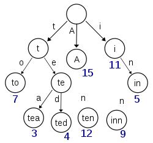

# 数据结构

## 链表

### 跳表

+ 跳表是一种随机化的数据结构，基于并联的链表，实现简单，并且插入、删除、查找的效率均为O(logN)。在链表的基础上添加了跳跃的功能，正是因为这个跳跃功能使得在查找元素时，能够达到O(logN)的时间复杂度

#### 操作

+ 插入：调表每一层的层数（level）是随机出来的，而且新插入一个节点不会影响其它节点的层数。因此，插入操作只需要修改插入节点前后的指针，而不需要对很多节点都进行调整。这就降低了插入操作的复杂度。

#### 优点

+ skiplist和各种平衡树（如AVL、红黑树等）的元素是有序排列的，而哈希表不是有序的。因此，在哈希表上只能做单个key的查找，不适宜做范围查找。所谓范围查找，指的是查找那些大小在指定的两个值之间的所有节点。
+ 在做范围查找的时候，平衡树比skiplist操作要复杂。在平衡树上，我们找到指定范围的小值之后，还需要以中序遍历的顺序继续寻找其它不超过大值的节点。如果不对平衡树进行一定的改造，这里的中序遍历并不容易实现。而在skiplist上进行范围查找就非常简单，只需要在找到小值之后，对第1层链表进行若干步的遍历就可以实现。
+ 平衡树的插入和删除操作可能引发子树的调整，逻辑复杂，而skiplist的插入和删除只需要修改相邻节点的指针，操作简单又快速。
  从内存占用上来说，skiplist比平衡树更灵活一些。一般来说，平衡树每个节点包含2个指针（分别指向左右子树），而skiplist每个节点包含的指针数目平均为1/(1-p)，具体取决于参数p的大小。如果像Redis里的实现一样，取p=1/4，那么平均每个节点包含1.33个指针，比平衡树更有优势。
+ 查找单个key，skiplist和平衡树的时间复杂度都为O(log n)，大体相当；而哈希表在保持较低的哈希值冲突概率的前提下，查找时间复杂度接近O(1)，性能更高一些。所以我们平常使用的各种Map或dictionary结构，大都是基于哈希表实现的。

### 单向环形链表

#### 相关问题

**约瑟夫问题**：有ｎ只猴子，按顺时针方向围成一圈选大王（编号从１到ｎ），从第１号开始报数，一直数到ｍ，数到ｍ的猴子退出圈外，剩下的猴子再接着从1开始报数。就这样，直到圈内只剩下一只猴子时，这个猴子就是猴王，编程求输入ｎ，ｍ后，输出最后猴王的编号。

提示：使用一个不带头节点的循环链表来处理：先构成一个有N个节点的单循环链表，然后由k节点起从1开始计数，计到m时，对应节点从链表中删除，然后再从被删除节点的下一个节点又从1开始计数，直到最后一个节点从链表中删除算法结束。

解法一：利用循环取模

```java
public class Josephu {
    public static void main(String[] args) {
        List<Integer> student = new ArrayList<>();
        Scanner in = new Scanner(System.in);
        int n = in.nextInt();
        int m = in.nextInt();
        for (int i = 0; i < n; i++) {
            student.add(i + 1);
        }
        Integer out = 0;
        while (student.size()>1){
            out = (out + m - 1)%student.size();
            Integer result = student.remove(out.intValue());
            System.out.println(result);
        }
        System.out.println(student.get(0));
    }
}
```

解法二：构建一个单向的环形链表

```java
import java.util.ArrayList;
import java.util.List;
import java.util.Scanner;

public class Josephu {
    public static void main(String[] args) {
        Node head = createCircleSingleLinkedList(5);
        System.out.println(head.next == head);
        outOrder(head, 2);
    }

    /**
     * 创建一个环形的单向链表
     */
    public static Node createCircleSingleLinkedList(int nums) {
        Node first = new Node(1);
        Node head = first;
        for (int i = 2; i <= nums; i++) {
            Node tem = new Node(i);
            first.next = tem;
            first = tem;
        }
        first.next = head;
        return head;
    }

    /**
     * @param head  头节点
     * @param count 表示数几下
     */
    public static void outOrder(Node head, int count) {
        if (head.next == head) {
            // 结束条件
            return;
        } else {
            Node first = head;
            Node tem = head;
            // 将tem指向末尾
            while (tem.next != head){
                tem = tem.next;
            }
            for (int i = 0; i < count-1; i++) {
                first = first.next;
                tem = tem.next;
            }
            System.out.println(first.getId());
            tem.next = first.next;
            outOrder(tem.next,count);
        }

    }
}


/**
 * 构建单向环形链表思路：
 * 先创建一个节点，让first指向该节点，并形成环形
 * 后面当我们每创建一个新的节点，就把该节点，加入到已有的环形链表中
 * <p>
 * 遍历环形链表：
 * 先让一个辅助变量指向first节点，然后通过一个while循环遍历链表。
 */


class Node {
    // 编号
    private int id;
    // 指向下一个节点
    public Node next;

    public Node(int id) {
        this.id = id;
    }

    public int getId() {
        return id;
    }

    public void setId(int id) {
        this.id = id;
    }

    public Node getNext() {
        return next;
    }

    public void setNext(Node next) {
        this.next = next;
    }
}

```

## 栈

### 介绍

+ 栈是一个先进后出的有序列表
+ 栈只能在线性表的一段进行操作的特殊线性表，允许插入和删除的一端，为变化的一端，称为栈顶，另一固定的一端，称为栈底


### 相关问题

<u>**使用栈完成的计算器**：</u>

提示：定义一个index，如果发现是数字，入数栈，如果是一个符号，如果符号栈为空就直接入栈；如果符号栈有操作符就比较，如果当前操作符的优先级小于或者等于栈中的操作符就从数栈pop出两个数，再从符号栈pop出符号，将运算的结果入数栈。再将当前的操作符入符号栈

```java
import java.util.Stack;

/**
 * 用栈实现的计算器
 */
public class Calculator {
    public static void main(String[] args) {
        System.out.println(count("1+4+5*2+6*7"));
    }

    public static int count(String expression) {
        Stack<Integer> numStack = new Stack<>();
        Stack<Character> operatorStack = new Stack<>();
        char[] chars = expression.toCharArray();
        for (int i = 0; i < chars.length; i++) {
            if (Character.isDigit(chars[i])) {
                // 如果是数字
                numStack.push(Integer.valueOf(chars[i] + ""));
            } else if (operatorStack.empty()) {
                // 如果不是数字
                operatorStack.push(chars[i]);
            } else {
                // 如果不是数字并且栈不为空
                Character peek = operatorStack.peek();
                if (getOrder(chars[i]) > getOrder(peek)){
                    // 如果当前的优先级比栈中的优先级高
                    numStack.push(operate(numStack.pop(),Integer.valueOf(chars[i+1]+""),chars[i]));
                    i++;
                } else {
                    operatorStack.push(chars[i]);
                }
            }
        }
        while (numStack.size() > 1){
            numStack.push(operate(numStack.pop(),numStack.pop(),operatorStack.pop()));
        }
        return numStack.pop();
    }
    public static int operate(Integer num1, Integer num2,Character operator){
        Integer value = null;
        if(operator == '*'){
            value = num1 * num2;
        } else if(operator == '/'){
            value = num1 / num2;
        } else if(operator == '+'){
            value = num1 + num2;
        } else {
            value = num1 - num2;
        }
        return value;
    }
    public static int getOrder(char operator) {
        if (operator == '*' || operator == '/') {
            return 1;
        } else {
            return 0;
        }
    }
}

```


## 哈希表

+ 哈希表是根据关键码值直接进行访问的数据结构，也就是说它通过把关键码映射到表中一个位置来访问记录，以加快查找的速度，这个映射函数叫做散列函数
+ 插入时取模找到在数组中的位置
+ 哈希函数：关键字通过哈希函数来获取存储的位置，一个哈希函数的好坏会影响到哈希表的性能
+ 哈希冲突：两个不同的函数通过哈希函数得出了同一个存储地址。
  + 解决方式：
    + 开放地址方法
    + 链式地址法（HashMap使用方式）
    + 建立公共溢出区：建立公共溢出区存储所有哈希冲突的数据。
    + 再哈希法：对于冲突的哈希值再次进行哈希处理，直至没有哈希冲突。

## 树

### 基本概念

+ 节点的度：节点拥有的子树
+ 度为0的节点成为叶子或终端节点
+ 度不为0的称为非终端节点或分支节点
+ 树的度是树内各节点度的最大值
+ 节点的子数为孩子，该节点为双亲，同个节点的子树为兄弟，根的子树任意结点为子孙，同一层节点为堂兄弟
+ 节点最大层次为树的深度
+ 左右有次序为有序树否则为无序树
+ 森林是m颗互不相交的树的集合
+ 路径长度是从树根到每一结点路径长度之和
+ 度为m，深度为k的树最多有$$m^k-1$$个结点


### 二叉树

#### 特点

+ 每个节点至多有两颗子树。
+ 第i层上至多有$$2^i-1$$个节点
+ 深度为k的二叉树最多有$$2^k-1$$个节点
+ 对任意二叉树，如果终端节点数为$$n_0$$，度为2的结点数为$$n_2$$，则$$n_0=n_2+1$$
+ 深度为k且有$$2^k-1$$个结点的二叉树为满二叉树
+ 如果一棵树与和满二叉树从左到右的编号一一对应(不一定为满二叉树)，则被称为完全二叉树
+ 有n个节点的二叉树深度有$$[log_2n]+1$$
+ 对于完全二叉树，对任意结点i
  + 如果i=1则i是二叉树的根，如果i>1，则双亲为结点[i/2]
  + 如果2i>n，则结点无左孩子或者左孩子是2i
  + 2i+1>n，则结点无右孩子，否则右孩子是2i+1

#### 遍历

+ 二叉树的遍历：递归实现

  + 前序遍历：中间节点-左节点-右节点
  + 中序遍历：左节点-中间节点-右节点
  + 后续遍历：左节点-右节点-中间节点

  ```java
      public void preorderTraversal(){
          System.out.println(this.data);
          if(this.left != null){
              this.left.preorderTraversal();
          }
          if(this.right != null){
              this.right.preorderTraversal();
          }
      }
  
      /**
       * 中序遍历
       */
      public void inorderTraversal(){
          if(this.left != null){
              this.left.inorderTraversal();
          }
          System.out.println(this.data);
          if(this.right != null){
              this.right.inorderTraversal();
          }
      }
  
      /**
       * 后续遍历
       */
      public void postorderTraversal(){
          if(this.left != null){
              this.left.postorderTraversal();
          }
          if(this.right != null){
              this.right.postorderTraversal();
          }
          System.out.println(this.data);
  
      }
  ```

  #### 查找

  + 前序查找：
    + 判断当前节点是否是要查找的
    + 如果不是，判断当前节点的子节点是否为空，如果不为空则向左递归前序查找
    + 如果左递归前序查找找到节点就返回，否则继续判断右子节点是否为空，如果不空，则继续向右递归排序查找

  ```java
      /**
       * 前序查找
       * @param data
       */
      public Node preorderTraversalSearch(Object data){
          if(this.data.equals(data)){
              return this;
          }
          Node search = null;
          if(this.left != null){
              search = this.left.preorderTraversalSearch(data);
          }
          // 如果左子树没找到向右查找
          if(search == null){
              search = this.right.preorderTraversalSearch(data);
          }
          return search;
      }
  ```

  #### 删除

  + 规定：
    + 如果删除的是叶子节点，则删除该节点
    + 如果删除的是非叶子节点，则删除该子树
  + 思路：
    + 因为二叉树是单向的，所有我们判断当前节点的子节点是否是需要删除节点，而不能去判断当前这个节点是不是要删除的节点
    + 如果当前节点的左子节点不为空，并且左子节点就是要删除的节点，就将当前节点删除，并返回。
    + 否则判断当前节点的右子节点不为空，并且右子节点就是要删除的节点，就将当前节点删除，并返回。
    + 如果2、3步没有删除节点，那么向左子树递归删除
    + 如果4步没删除就向右子树进行递归删除

### 二叉查找树

+ 二叉查找树（Binary Search Tree，简称BST）是一棵二叉树，它的左子节点的值比父节点的值要小，右节点的值要比父节点的值大。它的高度决定了它的查找效率。
+ 在理想的情况下，二叉查找树增删查改的时间复杂度为O(logN)（其中N为节点数），最坏的情况下为O(N)。当它的高度为logN+1时，我们就说二叉查找树是平衡的。

### B树（多路平衡查找树）

+ 在线测试：https://www.cs.usfca.edu/~galles/visualization/BTree.html


#### 特点：

+ 每一个节点最多有m个节点
+ 每一个节点（除了叶子节点和根节点）最少有(m/2)个子节点
+ 如果根节点不是叶子节点，那么最少有两个节点
+ 有k个子节点的非叶子节点有k-1个键值
+ 所有的叶子节点在同一层
+ 一个含有N个节点的B树高度为：$$log_{\frac{m}{2}}\frac{N+1}{2}+1$$

#### 操作

+ 插入：
  + 如果当前节点的元素小于m-1个，直接插入
  + 如果当前节点的元素等于m-1个，引起节点分裂：以该节点的中间元素（偶数个数随机一个）插入到父节点中
  + 重复上面动作，直到所有节点符合B树的规则；最坏的情况一直分裂到根节点，生成新的根节点，高度增加1；

+ 删除：
  + 某结点中元素数目小于（m/2）-1,(m/2)向上取整，则需要看其某相邻兄弟结点是否丰满；
  + 如果丰满（结点中元素个数大于(m/2)-1），则向父节点借一个元素来满足条件；
  + 如果其相邻兄弟都不丰满，即其结点数目等于(m/2)-1，则该结点与其相邻的某一兄弟结点进行“合并”成一个结点；

### B+树

+ B+树是应文件系统所需而产生的B树的变形树


#### 特点

+ 有m个子树的中间节点包含有m个元素（B树中是k-1个元素），每个元素不保存数据，只用来索引；
+ 所有的叶子结点中包含了全部关键字的信息，及指向含有这些关键字记录的指针，且叶子结点本身依关键字的大小自小而大的顺序链接。 (而B 树的叶子节点并没有包括全部需要查找的信息)；
+ 所有的非终端结点可以看成是索引部分，结点中仅含有其子树根结点中最大（或最小）关键字。 (而B 树的非终节点也包含需要查找的有效信息)；

#### 优点

+ B+树磁盘读写代价低：B+树的内部结点并没有指向关键字具体信息的指针。因此其内部结点相对B 树更小。如果把所有同一内部结点的关键字存放在同一盘块中，那么盘块所能容纳的关键字数量也越多。一次性读入内存中的需要查找的关键字也就越多。相对来说IO读写次数也就降低了；
+ B+树查询效率更加稳定：由于非终结点并不是最终指向文件内容的结点，而只是叶子结点中关键字的索引。所以任何关键字的查找必须走一条从根结点到叶子结点的路。所有关键字查询的路径长度相同，导致每一个数据的查询效率相当；
+ B+树便于范围查询（最重要的原因，范围查找是数据库的常态）：B树在提高了IO性能的同时并没有解决元素遍历的我效率低下的问题，正是为了解决这个问题，B+树应用而生。B+树只需要去遍历叶子节点就可以实现整棵树的遍历。而且在数据库中基于范围的查询是非常频繁的，而B树不支持这样的操作或者说效率太低
+ B+树能够充分的利用数据预读。

### 红黑树

+ 在线测试：https://www.cs.usfca.edu/~galles/visualization/RedBlack.html
+ 红黑树是一种自平衡二叉查找树
+ 从根到叶子的最长的可能路径不多于最短的可能路径的两倍长。结果是这个树大致上是平衡的。因为操作比如插入、删除和查找某个值的最坏情况时间都要求与树的高度成比例，这个在高度上的理论上限允许红黑树在最坏情况下都是高效的，而不同于普通的二叉查找树。
+ 它可以在O(log n)时间复杂度内实现查找，插入和删除，任何不平衡都会在三次旋转内解决。


#### 特性

+ 节点是红色的或黑色的
+ 根节点是黑色的
+ 所有叶子都是黑色
+ 每个红色节点的两个子节点都是黑色
+ 从任意节点到每个叶子节点的所有路径都包含相同数目的黑色节点

#### 操作

+ 旋转
  + 左旋：待旋转的节点从右边上升到父节点
  + 
  + 右旋：待选装节点从左边上升到父节点
  + 
+ 

### 字典树

+ trie，又称前缀树或字典树，是一种有序树，用于保存关联数组，其中的键通常是字符串。与二叉查找树不同，键不是直接保存在节点中，而是由节点在树中的位置决定。一个节点的所有子孙都有相同的前缀，也就是这个节点对应的字符串，而根节点对应空字符串。



## 图

### 基本概念

+ 图中的元素叫做顶点
+ <v,w>∈VR，表示一条弧，v为弧尾，w为弧头，为有向图；(v,w)，表示v到w的一条边，为无向图。
+ 有很少边或弧的图称为稀疏图，反之为稠密图。
+ 带权的图叫做网
+ 有n个顶点，e条边或弧的图，满足下列关系：$$e=\frac{1}{2}\sum_{i=1}^nTD(V_i)$$$（TD为度）
+ 路径长度为路径上边或弧的数目。第一个顶点和最后一个顶点相同的路径称为回路或环。不重复出现的路径称为简单路径。除第一个和最后一个以外，其余顶点不重复出现的路称为简单回路或环
+ 有n个顶点的图，如果边小于n-1则为非连通图，如果边大于n-1，则必定有环。

### 无向图

#### 概念

+ 有$$\frac{1}{2}n(n-1)$$条边的无向图为完全图
+ 边(v,v’)∈E，则为邻接点。边依附于顶点，边与顶点相关联
+ 和v相关联的边的数目叫v的度
+ 任意两个顶点都是连通的无向图叫连通图，极大连通子图为连通分量

### 有向图

#### 概念

+ 有n(n-1)条弧的有向图为有向完全图
+ 弧<v,v’>∈A，则顶点v邻接到v’，v’邻接自v，弧与顶点相关联
+ 以v为头的弧数为出度，v为尾的弧数叫入度。度为入度+出度
+ 在有向图G中，如果对于每一对vi、vj，vi≠vj，从vi到vj和从vj到vi都存在路径，则称G是强连通图。有向图中的极大强连通子图称做有向图的强连通分量

### 生成数

+ 是一个极小连通子图，有图的全部顶点和n-1条边，并且加上一条边必定构成一个环。有n-1条边的图不一定是生成树。如果有向图恰好有一个顶点的入度为0，其余顶点的入度为1，则是一颗有向树

### 存储结构

#### 数组（邻接矩阵）

+ 邻接矩阵需要为每个顶点都分配n个边的空间,其实有很多边都是不存在会造成空间的一定损失


#### 邻接表

+ 邻接表的实现只关心存在的边,不关心不存在的边。因此没有空间浪费,邻接表由数组+链表组成


#### 十字链表

#### 邻接多重表

### 遍历

#### 深度优先DFS

+ 深度优先遍历,从初始访问结点出发,初始访问结点可能有多个邻接结点,深度优先遍历的策略就是首先访问第一个邻接结点,然后再以个被访问的邻接结点作为初始结点,访问它的第一个邻接结点,可以这样理解:**<u>每次都在访问完当前结点后首先访问当前结点的第一个邻接结点</u>**。
+ 步骤：
  + 访问初始结点v,并标记结点v为已访问。
  + 查找结点v的第一个邻接结点w
  + 若w存在,则继续执行4,如果w不存在,则回到第1步,将从v的下一个结点继续。
  + 若w未被访问,对w进行深度优先遍历递归(即把w当做另一个v,然后进行步骤123)
  + 查找结点v的w邻接结点的下一个邻接结点,转到步骤3。
+ 代码

```java
package structure.graph.undigraph;
/**
 * 邻接矩阵实现的无向图
 */
public class AdjacencyMatrix {
    // 存储Map
    private int[][] map;
    // 存储当前节点是否被访问过
    private boolean vis[];
    public void printMap(){
        for (int i = 0; i < this.map.length; i++) {
            for (int j = 0; j < this.map[0].length; j++) {
                System.out.print(this.map[i][j] + " ");
            }
            System.out.println();
        }
    }
    public AdjacencyMatrix(int n){
        this.map = new int[n][n];
        this.vis = new boolean[n];
    }
    /**
     * 添加边
     * @param v1
     * @param v2
     */
    public void addEdge(int v1,int v2){
        this.map[v1][v2] = 1;
        this.map[v2][v1] = 1;
    }
    /**
     * dfs遍历
     * @param n 代表第几个节点
     */
    public void dfs(int n){
        // 打印当前节点
        System.out.println(" " + (n+1) + "->");
        // 标记当前节点被访问过
        vis[n] = true;
        for (int i = 0; i < map.length; i++) {
            if(this.map[n][i] != 0 && this.vis[i] == false){
                // 如果存在边，并且没有被访问过
                this.dfs(i);
            }
        }
    }
    public static void main(String[] args) {
        AdjacencyMatrix adjacencyMatrix = new AdjacencyMatrix(8);
        adjacencyMatrix.addEdge(0,1); // v1 v2
        adjacencyMatrix.addEdge(0,2);// v1 v3
        adjacencyMatrix.addEdge(1,3); // v2 v4
        adjacencyMatrix.addEdge(1,4); // v2 v5
        adjacencyMatrix.addEdge(3,7); // v4 v8
        adjacencyMatrix.addEdge(4,7); // v5 v8
        adjacencyMatrix.addEdge(2,5); // v3 v6
        adjacencyMatrix.addEdge(2,6); // v3 v7
        adjacencyMatrix.printMap();
        adjacencyMatrix.dfs(0);
    }
}

```

#### 广度优先BFS

+ 类似于一个分层搜索的过程,广度优先遍历需要使用一个列以保持访问过的结点的顺序,以便按这个顺序来访问这些结点的邻接结点
+ 步骤
  + 访问初始结点v并标记结点v为已访问。
  + 结点v入队列
  + 当队列非空时,继续执行,否则算法结束。
  + 出队列,取得队头结点u。
  + 查找结点u的第一个邻接结点w。
  + 若结点u的邻接结点w不存在,则转到步骤3;否则循环执行以下三个步骤:
  + 若结点W尚未被访问,则访问结点w并标记为已访问。
    结点w入队列
  + 查找结点u的继w邻接结点后的下一个邻接结点w,转到步骤6。
+ 代码

```java
    public void bfs(int n){
        Queue<Integer> queue = new LinkedList<>();
        queue.offer(n);
        // 首先访问当前节点
        System.out.print(n+1+"->");
        vis[n] = true;
        while (!queue.isEmpty()){
            // 从当前节点开始查找
            int start = queue.poll();
            for (int i = 0; i < map[0].length; i++) {
                // 如果有边，并且没被访问过
                if(map[start][i] != 0 && vis[i] == false){
                    vis[i] = true;
                    queue.offer(i);
                    System.out.print(i+1 + "->");
                }
            }
        }
    }
```

# 算法

## 排序算法


- In-place: 内部排序
- out-place: 外部排序

### Arrays.sort

+ https://cloud.tencent.com/developer/article/1604632
+ Java中`Arrays.sort`是并不只是单单的利用一种排序，而是三种排序算法的集合。插入排序，快速排序，归并排序。
  + 数量非常小的情况下（少于47的），插入排序等可能会比快速排序更快。 所以数组少于47的会进入插入排序。
  + 快排数据越无序越快（加入随机化后基本不会退化），平均常数最小，不需要额外空间，不稳定排序。
  + 归排速度稳定，常数比快排略大，需要额外空间，稳定排序。
+ 判断是否具有结构：
  + 扫一遍数组，记录升序降序的变化次数是否大于`MAX_RUN_COUNT  = 67`，如果大于那么证明当前的数组不是基本排序的，就是用快排，否则继续使用归并排序。


### 插入排序

+ 插入排序是一种稳定的排序，平均时间复杂度为：O(n2)，最好情况为O(n)，空间复杂度为：O(1)
+ 插入排序类似斗地主的时候整牌。将左边的序列看作已经排序好的序列，将当前元素插入到相应位置。


### 快排

+ 步骤：
  + 从数列中随机选出一个元素作为基准值
  + 把比基准值小的值放在基准值的左边，把比基准值大的值放在基准值的右边。
  + 然后递归的对基准值的左边进行排序，同时对基准值的右边进行排序

+ 图解


+ 优化
  + 当排序数列长度分割到一定程度后使用插入排序。在子序列比较小的时候，直接插入排序性能较好，因为对于有序的序列，插排可以达到O(n)的复杂度，如果序列比较小，使用插排效率要比快排高。可以设置一个阈值n，之后使用插排。
  + 三路划分。如果待排序列中重复元素过多，也会大大影响排序的性能，这是因为大量相同元素参与快排时，**左右序列规模相差极大**，快排将退化为冒泡排序，时间复杂度接近O(n2)。

```java
public static void quickSort(int[] arr, int start, int end) {
    if (start> end){
        return;
    }
    int i = start;
    int j = end;
    // 设定基准值
    int tmp = arr[i];
    // 将比基准值小的放在左边，比基准值大的放在右边
    while (i<j){
        while (i<j && arr[j] >= tmp) {
            // 在右边找比基准值小的
            j--;
        }
        arr[i] = arr[j];
        while (i< j && arr[i] <= tmp) {
            // 在左边找比基准值大的
            i++;
        }
        arr[j] = arr[i];
    }
    // 归位基准值
    arr[i] = tmp;
    // 对基准值的左边继续快排
    quickSort(arr,start, i-1);
    // 对基准值的右边继续排序
    quickSort(arr, i+1, end);
}
```

### 归并排序

+ 归并排序是一种稳定的排序算法，时间复杂度为：O(nlogn)，空间复杂度为：O(n)
+ 步骤：
  + 申请空间，使其大小为两个已经排序序列之和，该空间用来存放合并后的序列；
  + 设定两个指针，最初位置分别为两个已经排序序列的起始位置；
  + 比较两个指针所指向的元素，选择相对小的元素放入到合并空间，并移动指针到下一位置；
  + 重复步骤 3 直到某一指针达到序列尾；
  + 将另一序列剩下的所有元素直接复制到合并序列尾。


```java
   /**
     * 递归归并排序
     * @param nums
     * @param start
     * @param end
     * @return
     */
    public static int[] mergeSort1(int[] nums, int start, int end){
        // 退出条件
        if (start == end){
            return new int[]{nums[start]};
        }
        // 找到一个中间值
        int mid = start + (end - start)/2;
        // 对左边进行归并排序，出来时，左边是有序的。
        int[]left = mergeSort1(nums, start, mid);
        // 对右边进行归并排序，出来时，右边是有序的。
        int[]right = mergeSort1(nums,mid+1, end);
        int[] result = new int[left.length +right.length];
        int index = 0, i = 0,j=0;
        while (index<result.length && i<left.length && j<right.length){
            result[index++] = left[i]<right[j] ? left[i++]:right[j++];
        }
        while (i < left.length){
            result[index++] = left[i++];
        }
        while (j < right.length){
            result[index++] = right[j++];
        }
        return result;
    }

    /**
     * 非递归归并
     * @param array
     * @return
     */
    public static  int[] mergeSort2(int[] array) {
        int len = array.length;
        int[] result = new int[len];
        int block, start;
        for ( block = 1; block < len*2; block*=2) {
            for ( start = 0; start < len; start+=block*2) {
                int low = start;
                int mid = (start + block) < len?  (start+block): len;
                int end = (start + block*2)<len? (start+block*2): len;
                int start1 = low, end1 = mid;
                int start2 = mid, end2 = end;
                while (start1< end1 && start2< end2) {
                    result[low++] = array[start1]<array[start2]? array[start1++]: array[start2++];
                }
                while (start1 < end1){
                    result[low++] = array[start1++];
                }
                while (start2 < end2){
                    result[low++] = array[start2++];
                }
            }
            int [] temp = array;
            array = result;
            result = temp;
        }
        result = array;
        return result;
    }
```

### 冒泡排序

+ 步骤：
  + 比较相邻的元素。如果第一个比第二个大，就交换他们两个。
  + 对每一对相邻元素作同样的工作，从开始第一对到结尾的最后一对。这步做完后，最后的元素会是最大的数。
  + 针对所有的元素重复以上的步骤，除了最后一个。
  + 持续每次对越来越少的元素重复上面的步骤，直到没有任何一对数字需要比较。

+ 时间复杂度：最好：O(n) 最坏：O(n^2) 平均：O(n^2)
+ 空间复杂度：O(1)

### 堆排序

+ 堆排序是一种不稳定的排序算法，最好情况下时间复杂度为：nlogn，最坏情况下时间复杂度为：nlog2n【调整nlogn，取出n】，空间复杂度为：O(1)
+ 堆：
  + 大顶堆：每个节点的值都大于等于其左右孩子的值
    + `arr[i] >= arr[2i+1] && arr[i] >= arr[2i+2] `
  + 小顶堆：每个节点的值都小于等于其左右孩子的值
    + `arr[i] <= arr[2i+1] && arr[i] <= arr[2i+2]`
+ 对于一颗完全二叉树，对于其中一个节点i有如下公式：
  + i的父节点：$\frac{i-1}{2}$
  + i的左子节点：$2 * i + 1$
  + i的右子节点：`2 * i + 2`
+ 步骤：
  + 将待排序序列构建成一个堆 H[0……n-1]，根据（升序降序需求）选择大顶堆或小顶堆；
  + 把堆首（最大值）和堆尾互换；
  + 把堆的尺寸缩小 1，并调用 shift_down(0)，目的是把新的数组顶端数据调整到相应位置；
  + 重复步骤 2，直到堆的尺寸为 1。

## 递归

+ 递归需要遵守的规则：
  + 执行一个方法时，就会创建一个新的受保护的独立空间（栈空间）
  + 方法的局部变量是独立的不会相互影响，如果方法中使用的是引用类型的变量（比如数组），就会共享该引用类型的数据。
  + 递归必须向退出递归的条件逼近
  + 当一个方法执行完毕，或者遇到return就会返回到调用的地方

### 相关问题

#### 迷宫问题：

+ 只找路版本：

```Java
import java.util.ArrayList;
import java.util.Arrays;

/**
 * 迷宫问题：使用1表示墙
 */
public class Maze {
    private static int count = 0;
    private static int hight = 8;
    private static int wight = 7;

    public static void main(String[] args) {

        int[][] map = new int[hight][wight];
        /**
         * 设置地图边缘
         */
        for (int i = 0; i < wight; i++) {
            map[0][i] = 1;
            map[wight][i] = 1;
        }
        for (int i = 0; i < hight; i++) {
            map[i][0] = 1;
            map[i][hight - 2] = 1;
        }
        /**
         * 设置挡板
         */
        map[3][1] = 1;
        map[3][2] = 1;
        // 输出原来的地图
        for (int i = 0; i < hight; i++) {
            for (int j = 0; j < wight; j++) {
                System.out.print(map[i][j]);
            }
            System.out.println();
        }
        System.out.println(find(map, 1, 1));
        // 输出新的地图
        for (int i = 0; i < hight; i++) {
            for (int j = 0; j < wight; j++) {
                System.out.print(map[i][j]);
            }
            System.out.println();
        }
    }

    /**
     * 出发点为(1,1)，如果小球能到(6,5)则找到
     * 约定：当map[i][j]为0表示还没走过，当为1表示墙，2表示通路可以走，3表示该点已经走过但是走不通
     * 在走迷宫时，需要制定一个策略。下->右->上->左
     * 非最短路径
     *
     * @param map
     * @param i   起始位置横坐标
     * @param j   起始位置纵坐标
     * @return 找到返回true否则返回false
     */
    public static boolean find(int[][] map, int i, int j) {
        count++;
        if (map[6][5] == 2) {
            // 路已经找到
            return true;
        } else {
            if (map[i][j] == 0) {
                // 如果当前这个点还没走过，假定该点是可以走通的
                map[i][j] = 2;
                if (find(map, i + 1, j)) {
                    // 如果能向下走
                    return true;
                } else if (find(map, i, j + 1)) {
                    // 向右走
                    return true;
                } else if (find(map, i - 1, j)) {
                    // 向下走
                    return true;
                } else if (find(map, i, j - 1)) {
                    return true;
                } else {
                    // 如果上下左右都不能走，则该点是死路
                    map[i][j] = 3;
                    return false;
                }
            } else {
                // 如果map[i][j] != 0，可能是1，2，3
                return false;
            }
        }
    }
}

```

带最短路径版本：待优化

```java
import sun.security.util.Length;

import java.nio.file.Path;
import java.util.ArrayList;
import java.util.List;
import java.util.Map;

/**
 * 迷宫问题最短路径
 */
public class MazeBest {

    static int[] dX = {1, 0, -1, 0};
    static int[] dY = {0, 1, 0, -1};
    static long count = 0;

    public static void main(String[] args) {
        long start = System.currentTimeMillis();
        System.out.println("开始时间：" + start);
        int x = 7;
        int y = 7;
        int[][] map = setMap(x, y);
        setBarrier(map);
//        setBarrier(30,map);
        printMap(map);
        findWay(new Location(1, 1), new Location(x-2, y-2), map, map);
        long end = System.currentTimeMillis();
        System.out.println("结束时间：" + end);
        System.out.println("耗时：" + (end-start));

    }

    /**
     * 找到路径
     *
     * @param now    现在的路径
     * @param end    结束的位置
     * @param map    地图
     * @param temMap 记录变化后的Map防止兜圈子
     */
    static void findWay(Location now, Location end, int[][] map, int[][] temMap) {
        count++;
        if (now.x == end.x && now.y == end.y) {
            System.out.println("找到了路");
            printPath(temMap);
            return;
        }
        for (int i = 0; i < 4; i++) {
            // 没有找到路径，向4个方向试探
            Location temNow = new Location(now.x + dX[i], now.y + dY[i]);
            if (check(temNow, temMap)) {
                // 复制一个临时的map用于存放走过了路径，防止兜圈子
                int[][] mytemMap = new int[map.length][map[0].length];
                for (int j = 0; j < mytemMap.length; j++) {
                    mytemMap[j] = temMap[j].clone();
                }
                mytemMap[now.x][now.y] = 5;
//                printMap(mytemMap);
                // 如果下一个路径可以走
//                printMap(mytemMap);
                findWay(temNow, end, map, mytemMap);
            }
        }
    }

    /**
     * 判断路径是否可以通
     *
     * @param now
     * @return
     */
    static boolean check(Location now, int[][] map) {
        // 如果到了边界
        if (now.x == map.length || now.y == map[0].length) {
            return false;
        }
        if (map[now.x][now.y] == 0) {
            // 如果为0则可以走
            return true;
        } else {
            return false;
        }
    }

    /**
     * 设置地图
     *
     * @param x
     * @param y
     * @return
     */
    static int[][] setMap(int x, int y) {
        int[][] map = new int[x][y];
        for (int i = 0; i < map.length; i++) {
            map[i][0] = 1;
            map[i][y-1] = 1;
        }
        for (int i = 1; i < map[0].length-1; i++) {
            map[0][i] = 1;
            map[x-1][i] = 1;
        }
        return map;
    }

    /**
     * 打印Map
     *
     * @param map
     */
    static void printMap(int[][] map) {
        for (int i = 0; i < map.length; i++) {
            for (int j = 0; j < map[0].length; j++) {
                System.out.print(map[i][j] + " ");
            }
            System.out.println();
        }
    }

    /**
     * 随机设置障碍物
     *
     * @param count
     */
    static void setBarrier(int count, int[][] map) {
        for (int i = 0; i < count; i++) {
            map[(int) (Math.random() * (map.length - 2) + 1)][(int) (Math.random() * (map[0].length - 2) + 1)] = 1;
        }
    }

    /**
     * 设置默认的障碍
     *
     * @param map
     */
    static void setBarrier(int[][] map) {
        map[1][3] = 1;
        map[3][2] = 1;
        map[3][4] = 1;
        map[3][5] = 1;
        map[5][2] = 1;
        map[5][3] = 1;

        map[3][1] = 1;
        map[2][4] = 1;
        map[4][5] = 1;
    }
    static void printPath(int[][] map){
        List<Location> path = new ArrayList<>();
        for (int i = 0; i < map.length; i++) {
            for (int j = 0; j < map[0].length; j++) {
                if(map[i][j] == 5){
                    path.add(new Location(i,j));
                }
            }
        }

        System.out.println("路径为：" + path.toString());
        System.out.println("长度为：" + path.size());
    }
}

class Location {
    public int x;
    public int y;

    Location(int x, int y) {
        this.x = x;
        this.y = y;
    }

    @Override
    public String toString() {
        return "(" + x + "," + y + ")";
    }
}
```


#### 八皇后问题：

任意两个皇后都不能处于同一行、同一列或同一斜线上，问有多少种摆法

思路：

+ 第一个皇后先放第一行第一列
+ 第二个皇后放在第二行第一列、然后判断是否OK,如果不OK,继续放在第二列、第三列、依次把所有列都放完,找到一个合适
+ 继续第三个皇后,还是第一列、第二列……直到第8个皇后也能放在一个不冲突的位置,算是找到了一个正确解
+ 当得到一个正确解时,在栈回退到上一个栈时,就会开始回溯,即：将第一个皇后,放到第一列的所有正确解,全部得到
+ 然后回头继续第一个皇后放第二列,后面继续循环执行12,3的步骤

```java

public class EightQueens {
    // 表示有多少个皇后
    static int MAX_QUEEN_COUNT = 8;
    // 保存皇后放置的位置
    static int[] location = new int[MAX_QUEEN_COUNT];
    // 计算一共有多少种摆法
    static int total = 0;

    public static void main(String[] args) {
        placeChess(0);
        System.out.println("一共有" + total + "种摆法");
    }
    /**
     * 输出皇后摆放的位置
     */
    static void printLocation() {
        total++;
        for (int i = 0; i < location.length; i++) {
            System.out.print(location[i] + " ");
        }
        System.out.println();
    }
    /**
     * 放置棋子
     * @param n 第n个
     */
    static void placeChess(int n) {
        if (n == MAX_QUEEN_COUNT) {
            // 如果==MAX_QUEEN_COUNT就证明已经放完了
            printLocation();
            return;
        }
        // 对每一列进行测试
        for (int i = 0; i < MAX_QUEEN_COUNT; i++) {
            location[n] = i;
            if (checkConflict(n)) {
                // 如果不冲突的话继续寻找下一个
                placeChess(n + 1);
            }
        }
    }

    /**
     * 判断是否冲突
     * @param n 代表第n个皇后
     * @return
     */
    static boolean checkConflict(int n) {
        for (int i = 0; i < n; i++) {
            // 检测n前面的皇后0
            if (location[i] == location[n] || Math.abs(n - i) == Math.abs(location[n] - location[i])) {
                // 判断是同一列，同一斜线
                return false;
            }
        }
        return true;
    }
}

```

## 查找算法

### 二分查找

+ 二分查找算法只能在有序数组中进行查找。

+ $$
  mid = \frac{(low+high)}{2}=low+\frac{1}{2}(high-low)
  $$

  

+ 思路：
  + 首先确定数组的中间下标，mid = (left + right) / 2
  + 然后让查找的数和arr[mid]比较，如果大于就在右边查找，如果小于就在左边查找。使用递归。
  + 查找的数=arr[mid]说明找到了。返回
  + 结束递归条件：找到就结束递归、left > right
  + 如果要返回所有下标：需要在找到后，再在mid的左右进行查找

+ 代码

```java
package search;

import java.util.ArrayList;
import java.util.List;

/**
 * 二分查找，使用二分查找的前提是该数组是有序的
 */
public class BinarySearch {
    public static void main(String[] args) {
        int[] arr = {1,5,6,9,10,16,26,46};
        System.out.println(binarySearch(arr,0,arr.length-1,5));
        int[] arr1 = {1,2,3,5,6,40,100,100,100,200,313};
        System.out.println(binarySearchAll(arr1,0,arr.length-1,100));

    }

    /**
     * 二分查找
     * @param arr 数组
     * @param left 查找时左边的索引
     * @param right 查找时右边的索引
     * @param value 查找的值
     * @return 如果找到就返回下标，如果没找到就返回-1
     */
    static int binarySearch(int[] arr,int left,int right,int value){
        int mid = (left + right)/2;
        int midVal = arr[mid];
        // 当left > right说明递归了整个数组没有找到
        if(left > right){
            return -1;
        }
        if(value > midVal){
            // 如果大于中间的数就向右递归
            return binarySearch(arr,mid+1,right,value);
        } else if(value < midVal){
            // 如果小于中间的数向左递归
            return binarySearch(arr,left,mid-1,value);
        } else {
            // 如果找到了
            return mid;
        }
    }
    /**
     * 二分查找，查找所有符合的下标
     * @param arr 数组
     * @param left 查找时左边的索引
     * @param right 查找时右边的索引
     * @param value 查找的值
     * @return 如果找到就返回下标，如果没找到就返回-1
     */
    static List<Integer> binarySearchAll(int[] arr,int left,int right,int value){
        int mid = (left + right)/2;
        int midVal = arr[mid];
        // 当left > right说明递归了整个数组没有找到
        if(left > right){
            return new ArrayList<>();
        }
        if(value > midVal){
            // 如果大于中间的数就向右递归
            return binarySearchAll(arr,mid+1,right,value);
        } else if(value < midVal){
            // 如果小于中间的数向左递归
            return binarySearchAll(arr,left,mid-1,value);
        } else {
            // 如果找到了
            List<Integer> resultList = new ArrayList<>();
            resultList.add(mid);
            // 继续向左向右查找
            int temp = mid -1;
            while (true){
                if(temp < 0 || arr[temp] != value ){
                    // 如果已经是最左边那个了，或者当前值左边的那个不为查找值
                    break;
                }
                resultList.add(temp);
                temp -= 1;
            }
            temp = mid + 1;
            while (true){
                if(temp > arr.length-1 || arr[temp] != value){
                    // 如果已经是最右边那个了，或者当前值右边那个不为查找值
                    break;
                }
                resultList.add(temp);
                temp += 1;
            }
            return resultList;
        }

    }
}

```

非递归形式

```java
package algorithm;

/**
 * 二分查找算法，非递归实现
 */
public class BinarySearch {
    public static void main(String[] args) {
        int[] arr = {1,2,3,6,9,11,16,59};
        System.out.println(binarySearch(arr,3));
    }

    /**
     *
     * @param arr 待查找的数组
     * @param target 待查找的值
     */
    public static int binarySearch(int[] arr,int target){
        int left = 0;
        int right = arr.length - 1;
        while(left <= right){
//            int mid = (left + right)/2;
            int mid = left + ((target - arr[left])/(arr[right] - arr[left]))*(right - left);
            if(arr[mid] == target){
                return mid;
            }
            if(arr[mid] < target){
                left = mid + 1;
            } else {
                right = mid - 1;
            }
        }
        return -1;

    }
}
`
```


### 插值查找

+ 插值查找原理和二分查找类似，只是对mid的计算进行了优化
+ $low + \frac{key-arr[low]}{a[high]-a[low]}(high-low)$

+ 代码：

```java
package search;

/**
 * 插值查找算法
 */
public class InsertSearch {
    public static void main(String[] args) {
        int[] arr = new int[100];
        for (int i = 0; i < 100; i++) {
            arr[i] = i + 1;
        }
        for (int i = 0; i < arr.length; i++) {
            System.out.print(arr[i] + " ");
        }
        System.out.println();
        System.out.println(insertSearch(arr, 0, arr.length - 1, 10));
    }

    /**
     * 插值查找算法
     *
     * @param arr
     * @param left
     * @param right
     * @param value
     */
    public static int insertSearch(int[] arr, int left, int right, int value) {
        // 必须需要后面两个条件，否则可能越界
        if (left > right || value < arr[0] || value > arr[arr.length - 1]) {
            return -1;
        }
        int mid = left + ((value - arr[left]) / (arr[right] - arr[left])) * (right - left);
        int midVal = arr[mid];
        if (value > midVal) {
            return insertSearch(arr, mid + 1, right, value);
        } else if (value < midVal) {
            return insertSearch(arr, left, mid - 1, value);
        } else {
            return mid;
        }
    }
}
```


### 斐波那契查找

## 分治算法

+ 把一个复杂的问题分解成两个或更多相似的子问题，再把子问题分成更小的子问题。直到最后子问题可以简单的直接求解。原问题的解即子问题的解的合并。这个技巧是很多高效算法的基础：快排、归并排序、傅里叶变换
+ 基本步骤：
  + 分解：将原问题分解为若干个规模小的，相互独立，与原问题相同的子问题
  + 解决：若子问题规模较小而容易被解决则直接解决，否则递归求解各个子问题
  + 合并：将各个zz子问题的解合并成原问题的解

### 相关题目

#### 汉诺塔问题

+ 思路分析：
  + 如果有一个盘：A->C
  + 如果有多个盘，总是可以看作是两个盘：最下面的盘和上面的盘
    + 先把上面的盘：A->B
    + 把最下面的盘：A->C
    + 把B塔所有的盘：B->C
+ 代码：

```java
package question;

/**
 * 汉诺塔问题，使用分治算法
 */
public class HanoiTower {
    public static void main(String[] args) {
        hanoiTower(5,'A','B','C');
    }

    /**
     * a为原来的盘，b为借助的盘，c为最后移动到的盘
     * @param num 盘的数量
     * @param a 第一个塔
     * @param b 第二个塔
     * @param c 第三个塔
     */
    public static void hanoiTower(int num, char a, char b, char c){
        if(num == 1){
            System.out.println("将第1个盘从" + a + "移动到" + c);
        } else {
            // 先把上面的所有盘移动到B
            hanoiTower(num-1,a,c,b);
            // 把下面的盘从A移动到C
            System.out.println("把第" + num + "个盘从" + a + "移动到" + c);
            // 把B塔的所有盘从B移动到C
            hanoiTower(num-1,b,a,c);

        }
    }
}
```


## 动态规划

+ 将大问题划分为小问题进行解决，从而一步步获取最优的处理算法
+ 与分治算法不同的是，适用于动态规划求解的问题，经分解得到子问题往往不是相互独立的。（即下一个子阶段的求解是建立在上一个子阶段的解的基础上，进一步进行求解）
+ 概念：
  + 阶段：对于一个完整的问题过程，适当的切分为若干个相互联系的子问题，每次在求解一个子问题，则对应一个阶段，整个问题的求解转化为按照阶段次序去求解。
  + 状态：状态表示每个阶段开始时所处的客观条件，即在求解子问题时的已知条件。状态描述了研究的问题过程中的状况。
  + 决策：决策表示当求解过程处于某一阶段的某一状态时，可以根据当前条件作出不同的选择，从而确定下一个阶段的状态，这种选择称为决策。
  + 策略：由所有阶段的决策组成的决策序列称为全过程策略，简称策略。
  + 最优策略：在所有的策略中，找到代价最小，性能最优的策略，此策略称为最优策略。
  + 状态转移方程：状态转移方程是确定两个相邻阶段状态的演变过程，描述了状态之间是如何演变的。
+ 解题步骤：
  + 问题拆解，找到问题之间的具体联系
  + 状态定义
  + 递推方程推导
  + 实现

### 相关问题

#### 背包问题

+ 背包问题主要是指一个给定容量的包，若干具有一定价值和重量的物品，如何选择物品放入背包使物品的价值最大，其中又分01背包和完全背包（完全背包是值每种物品都有无限件可用）
+ 思路：
  + 每次遍历到第i个物品，根据w[i]和v[i]来确定是否要将该物品放入背包中。即对于给定的n个物品，设v[i]、w[i]分别为放入背包物品的价值和重量，c为背包的容量。再令v\[i][i]表示在前i个物品中能装入容量为j的背包中的最大价值，则有下面的结果

#### 最长公共子序列

给定两个字符串 text1 和 text2，返回这两个字符串的最长公共子序列的长度。

一个字符串的 子序列 是指这样一个新的字符串：它是由原字符串在不改变字符的相对顺序的情况下删除某些字符（也可以不删除任何字符）后组成的新字符串。
例如，"ace" 是 "abcde" 的子序列，但 "aec" 不是 "abcde" 的子序列。两个字符串的「公共子序列」是这两个字符串所共同拥有的子序列。

若这两个字符串没有公共子序列，则返回 0。

```code
输入：text1 = "abcde", text2 = "ace" 
输出：3  
解释：最长公共子序列是 "ace"，它的长度为 3。
```

```code
输入：text1 = "abc", text2 = "abc"
输出：3
解释：最长公共子序列是 "abc"，它的长度为 3。
```

```code
输入：text1 = "abc", text2 = "def"
输出：0
解释：两个字符串没有公共子序列，返回 0。
```

+ 题解：https://leetcode-cn.com/problems/longest-common-subsequence/solution/dong-tai-gui-hua-tu-wen-jie-xi-by-yijiaoqian/


## KMP算法

## 贪心算法

+ 贪婪算法(贪心算法)是指在对问题进行求解时,在每一步选择中都采取最好或者最优(即最有利)的选择,从而希望能够导致结果是最好或者最优的算法
+ 贪婪算法所得到的结果不一定是最优的结果(有时候会是最优解),但是都是相对近似(接近最优解的结果

### 相关问题

#### 广播覆盖

+ 假设存在如下表的需要付费的广播台,以及广播台信号可以覆盖的地区。如何选择最少的广播台,让所有的地区都可以接收到信号
  广播台							覆盖地区
  k1									北京""上海",天津”
  k2									广州,北京",深圳
  k3									"成都","上海",“杭州
  k4									"上海""天津
  k5									杭州","大连”

+ 思路
  + 遍历所有电台，找到一个覆盖了最多未覆盖地区的电台（这个电台可能包含一些已覆盖的地区）
  + 将这个电台加入到一个集合中，想办法把该电台覆盖的地区在下一次比较时去掉
  + 重复第一步，直到覆盖了全部地区

## 迪杰斯特拉算法

+ 迪杰斯特拉 Dijkstra)算法是典型最短路径算法,用于计算一个点到其他节点的最短路径。它的主要特点是以起始点为中心向外层层扩展(广度优先搜索思想),直到扩展到终点为止。

## 最短路径算法

```java
import java.lang.reflect.Array;
import java.util.Arrays;
import java.util.LinkedList;
import java.util.List;
import java.util.Queue;

public class Leetcode {
    // https://leetcode-cn.com/problems/count-all-possible-routes/
    public static void main(String[] args) {
//        int[][] map = {{0,5,7,0,0,0,2},{5,0,0,9,0,0,3},{7,0,0,0,8,0,0},{0,9,0,0,0,4,0},{0,0,8,0,0,5,4},{0,0,0,4,5,0,6},{2,3,0,0,4,6,0}};
        int[][] map = {{0,5,2,6,0},{5,0,1,0,1},{2,1,0,3,5},{6,0,3,0,2},{0,1,5,2,0}};
        print(map);
        replace(map);
        System.out.println(shortestPath(0,2,map));

    }
    public static void replace(int[][] map){
        for (int i = 0; i < map.length; i++) {
            for (int j = 0; j < map[0].length; j++) {
                if(map[i][j] == 0){
                    map[i][j] = Integer.MAX_VALUE;
                }
            }
        }
    }
    public static int shortestPath(int start,int end,int[][] map){
        int length = map.length;
        // 用于存放访问过的节点
        boolean[] vis = new boolean[length];
        // 用于存放到当前节点最短的开销
        int[] cost = new int[length];
        Arrays.fill(cost,Integer.MAX_VALUE);
        // 用于存放前驱节点
        int[] pre = new int[length];
        Queue<Integer> queue = new LinkedList<>();
        queue.offer(start);
        // 默认起始点到起始点的消费为0
        cost[start] = 0;
        // 默认起始点访问过
        vis[start] = true;
        while (!queue.isEmpty()){
            int now = queue.poll();
//            System.out.println("---------新的循环开始----------");
//            System.out.println("当前尝试的节点为：" + now + "\n每个点的前驱节点为：" + Arrays.toString(pre) + "\n每个点的花费为：" + Arrays.toString(cost) + "\n------------");
            // 开始节点为end，那么就找到了最短路径
            for (int i = 0; i < length; i++) {
/*                // 如果没有被访问过并且到now到这个节点的距离小于保存的距离
                if(!vis[i] && cost[i] > map[now][i]){
                    if(map[now][i] == Integer.MAX_VALUE){
                        // 如果等于最大值，则证明当前节点还没有前驱节点
                        cost[i] = map[now][i];
                        // 将当前节点的前驱节点定义为当前扫描的节点
                        pre[i] = now;
                    } else {
                        // 如果不等于最大值，则证明当前节点有前驱节点
                        cost[i] =
                    }
                }*/
                if(vis[i]){
                    // 如果访问过就不访问了
                    continue;
                }

                if(map[now][i] != Integer.MAX_VALUE && cost[now] + map[now][i] < cost[i]){
                    // 如果存在边，对于每个点，如果记录的值大于了到当前路径+到当前点的消费的值，则更新，并且记录前驱节点
                    cost[i] = cost[now] + map[now][i];
/*                    if(cost[i] < 0){
                        System.out.println("出错了，出错在：" + cost[now] + "和" + map[now][i] + "进行操作时");
                    }*/
                    pre[i] = now;
                }
            }
            // 找到还没有作为起始点的节点的cost最小的那个，将其作为下一个轮回的起始点
            int newNow = 0;
            int min = Integer.MAX_VALUE;
            for (int j = 0; j < length; j++) {
                if(vis[j]){
                    continue;
                }
                if(cost[j] < min){
                    min = cost[j];
                    newNow = j;
//                    System.out.println("当前最小值为：" + min + "对应下标为：" + newNow);
                }
            }
//            System.out.println("下标为：" + newNow);
            vis[newNow] = true;
            // 如果找到的最小起始节点不是最后的节点则继续循环
            if(newNow != start){
                /**
                 * 理论上这里不应该找完所有节点的最短路径，但是却找完了
                 */
                queue.offer(newNow);
            } else {
                System.out.println("为True的点为最终消费：" + Arrays.toString(vis));
                System.out.println("消费为：" + Arrays.toString(cost));

            }
        }
        return cost[end];
    }
    public static void print(int[][] map){
        for (int i = 0; i < map.length; i++) {
            for (int j = 0; j < map[0].length; j++) {
                System.out.print(map[i][j] + " ");
            }
            System.out.println();
        }
    }
}


```

# Java集合类

## HashMap

### 基本

[HashMap详解](https://sowhat.blog.csdn.net/article/details/105000051)


https://blog.csdn.net/QGhurt/article/details/107323702

+ HashMap基本特性：
+ HashMap的Key和Value均允许为null
+ HashMap的存取是没有顺序的
  
  + JDK8的底层是数组 + 链表 + 红黑树，JDK7是数组 + 链表
+ 初始容量和装载因子会决定性能。
  + HashMap的table数组是**懒汉式创建的，只有在put数据的时候才会创建**
  + HashMap转换成红黑树的时候会先变化成双向链表最终转化为红黑树
  + 链表转换为红黑树后会将红黑树的root节点和链表的头节点和table[i]节点融合成同一个
  + 在删除的时候会先判断删除节点的红黑树是否需要转化成链表，如果不转链表就找个合适的节点来填充删除的节点
  + 红黑树的根节点不一定和table[i]也就是链表的头节点是同一个，三者的同步是靠MoveRootToFront实现的。而HashIterator.remove()会在调用removeNode的时候movable=false。
+ **计算下标是通过`(n - 1) & hash`来计算的，在n为2的N次幂的情况下，等同于`hash % n`**其中n为哈希表的长度
+ hash函数：`hashcode ^ (hashcode >>> 16)`
  + hash函数主要是从减少哈希碰撞的概率和效率上来考虑的
    + 高位变化的较少，使用右移动可以把高位利用起来，减少哈希冲突的碰撞
    + 使用异或，只要有一位不一样，最终的hash值就不一样，减少哈希冲突的碰撞
+ resize通过`(e.hash & oldCap) == 0 ? 原来位置 : 原来位置+原来哈希表大小 `来计算新位置。
  + 扩容时，当哈希表长度小的时候默认是将哈希表的大小翻倍。
  + 扩容的时机：
    + 当hashMap中元素的个数超过了阈值的时候会进行扩容。
  + hashMap的扩容是进行翻倍，每次只多了一个bit位，所以节点要么是原来的位置，要么就在原位置+旧容量的位置。可以省去重新计算hash值的时间，同时保证了resize后每个桶上的节点数一定小于等于原来桶上的节点数，保证了resize之后不会出现更严重的hash冲突，均匀的把之前的冲突的节点分散到了新的桶中了。
  + 
  + 
+ 转换红黑树：
  + 当调用了`treeifyBin`时候，如果当前的数组长度没有达到64那么也是不会转换成红黑树的，而是会先对哈希表进行扩容。
  + 使用红黑树：
    + 红黑树是在二叉查找树和平衡二叉树之间进行的一个取舍。
+ 哈希表容量是2的次幂的原因
  + capacity 为 2的整数次幂的话，计算桶的位置 h&(length-1) 就相当于对 length 取模，提升了计算效率
  + capacity 为 2 的整数次幂的话，便保证了 h&(capacity-1) 的结果可能是0也可能是1，保证了散列的均匀性
  + capacity 为 2 的整数次幂可以使得在resize的时候不用重新计算hash值。而通过`(e.hash & oldCap) == 0 ? 原来位置 : 原来位置+原来哈希表大小 `就能算出在新哈希表的正确位置（能通过`(n - 1) & hash`正确获取元素）
  + 哈希表的长度不能是奇数，奇数-1为偶数，偶数的二进制最后一位永远是0，进行与运算的时候最后一个永远是0，将会导致下标为奇数的桶永远不会存放数据。
+ 线程问题：
  + jdk7：多线程环境下，扩容会导致死链或者数据丢失
  + jdk8：可能会发生数据覆盖
+ 哈希表桶的长度保证为2的n次方，可以保证取模的时候直接位运算提高效率，同时可以使数据均匀减少冲突。
+ 解决哈希冲突的方法
  + 开放定址法：从发生冲突的那个单元起，按照一定的次序，从哈希表中找到一个空闲的单元。然后把发生冲突的元素存入到该单元的一种方法。开放定址法需要的表长度要大于等于所需要存放的元素。开放定址法的缺点在于删除元素的时候不能真的删除，否则会引起查找错误，只能做一个特殊标记。只到有下个元素插入才能真正删除该元素。
    + 线性探查法：线行探查法是开放定址法中最简单的冲突处理方法，它从发生冲突的单元起，依次判断下一个单元是否为空，当达到最后一个单元时，再从表首依次判断。直到碰到空闲的单元或者探查完全部单元为止。
    + 平方探查法：平方探查法即是发生冲突时，用发生冲突的单元d[i], 加上 1²、 2²等。即d[i] + 1²，d[i] + 2², d[i] + 3²...直到找到空闲单元。
    + 双散列函数探查法
  + 链地址法
  + 再哈希法
  + 建立公共溢出区

### 大致流程

+ put方法：
  + 首先判断当前table是否为null或者长度为0，如果是，则调用resize触发初始化
  + 计算要插入的值在哈希表中的位置`(n-1) & hash`，如果为null，就直接插入。
  + 如果不为空就执行插入，如果是红黑树节点就调用`putTreeVal`插入红黑树节点，如果是链表节点就插入链表节点（链表节点在插入的时候还要根据阈值判断是否需要转换成红黑树节点）。在插入的同时同时会查找有没有和当前节点key相同的值，如果有的话就通过一个变量e来保存当前节点，并且退出插入操作
  + 如果e的值不为空的话那么证明已经存在相同的key的节点了，根据传入的`onlyIfAbsent`参数来判断是要插入还是舍弃。
  + ++modCount，用于快速失败，同时判断当前的大小是否已经大于了阈值，如果大于了阈值就进行resize操作。（其中还会调用`afterNodeAccess`和`afterNodeInsertion`，用于LinkedHashMap的回调）
+ get方法：
+ resize方法：
  + 如果原来的哈希表的长度大于了哈希表的最大长度就不进行扩容返回，如果哈希表的大小比初始大小大并且扩充后小于哈希表最大长度就进行翻倍扩充。
  + 如果哈希表的长度不大于0，但是阈值大于0，则代表哈希表还没初始化，则执行初始化哈希表。（初始化HashMap指定了初始大小，并且第一次调用resize）
  + 否则新哈希表的长度就为16 * 0.75 = 12（初始化HashMap没有指定初始大小，并且第一次调用resize）
  + 然后更具生成的新阈值大小生成一个等大的新哈希表，并且转移元素。
  + 由于每次扩容都是翻倍，因此，新位置与原来的位置相比只是多了一个比特位。所以节点要么在原来的位置要么在"原位置 + 旧容量"这个位置

### 节点

+ HashMap中的节点

  + `java.util.Map.Entry`：定义了一些比较接口的方法。

  + `java.util.HashMap.Node`：一个kv节点。链表节点

    + ```java
      static class Node<K,V> implements Map.Entry<K,V> {
         final int hash;	// key的hash值，防止重复计算
         final K key;
         V value;
         Node<K,V> next;	// 单链表，指向下一个节点
      ```

  + `java.util.LinkedHashMap.Enrty`：LinkedHashMap的一个静态内部类

    + ```java
      static class Entry<K,V> extends HashMap.Node<K,V> {
          Entry<K,V> before, after;
          Entry(int hash, K key, V value, Node<K,V> next) {
              super(hash, key, value, next);
          }
      }
      ```

  + `java.util.HashMap.TreeNode`：继承了LinkedHashMap的Entry，红黑树节点。

    + ```java
      static final class TreeNode<K,V> extends LinkedHashMap.Entry<K,V> {
          TreeNode<K,V> parent;  // red-black tree links
          TreeNode<K,V> left;
          TreeNode<K,V> right;
          TreeNode<K,V> prev;    // needed to unlink next upon deletion
          boolean red;
          TreeNode(int hash, K key, V val, Node<K,V> next) {
              super(hash, key, val, next);
          }
      }
      ```

### 参数

+ 静态参数：
  + `static final int DEFAULT_INITIAL_CAPACITY = 1 << 4`：初始容量，默认为16。如果太少会很容易触发扩容，如果太多会导致遍历哈希表比较慢
  + `static final int MAXIMUM_CAPACITY = 1 << 30`：数组的最大容量
  + `static final float DEFAULT_LOAD_FACTOR = 0.75f`：默认的负载因子。当存储的节点数大于了 `初始容量 * 负载因子`就会触发扩容。较高的值可以降低空间开销，但是会提高查找成本。
  + `static final int TREEIFY_THRESHOLD = 8`：转换树阈值，表示当某个桶的数据的数量大于了这个值时，可能会转化为红黑树。
  + `static final int UNTREEIFY_THRESHOLD = 6`：退化树阈值，在哈希表扩容时，如果发现链表长度<=6，会由红黑树重新退化成链表
  + `static final int MIN_TREEIFY_CAPACITY = 64`：链表转换树最小大小，在变换成红黑树之前还会有一次判断。只有数组长度大于64才会转换。这是为了避免在哈希表建立初期，多个键值对恰好被放入了同一个链表中而导致不必要的转化。
+ 动态参数：

  + `transient Node<K,V>[] table`：HashMap的链表数组，扩容的时候总是2的次幂
  + `transient Set<Map.Entry<K,V>> entrySet`：表示HashMap中的Entry的Set集合
  + `transient int size`：表示HashMap中存放的键值对的个数
  + `transient int modCount`：凡是我们做的增删改都会引发modCount值的变化，跟版本控制功能类似，可以理解成version，在特定的操作下需要对version进行检查。
    + 在java的集合类中存在一种Fail-Fast的错误检测机制，当多个线程对同一集合的内容进行操作时，可能就会产生此类异常。比如当A通过iterator去遍历某集合的过程中，其他线程修改了此集合，此时会抛出ConcurrentModificationException异常。此类机制就是通过modCount实现的，在迭代器初始化时，会赋值expectedModCount，在迭代过程中判断modCount和expectedModCount是否一致。
  + `int threshold`：扩容阈值，`初始容量 * 负载因子`。这个是在resize改变的，构造方法只会赋个初始容量。
+ `final float loadFactor`：自定义负载因子。一般都是用的自带的0.75

### 构造方法

+ 构造方法：其中使用了tableSizeFor将initialCapacity调整为离initialCapacity最小的2次幂

  + ```java
    public HashMap() {
        this.loadFactor = DEFAULT_LOAD_FACTOR; // 只设置负载因子为0.75，阈值（threshold）将会在第一次put resize的时候初始化为12
    }
    public HashMap(int initialCapacity, float loadFactor) {
        if (initialCapacity < 0)
            throw new IllegalArgumentException("Illegal initial capacity: " +
                                               initialCapacity);
        if (initialCapacity > MAXIMUM_CAPACITY)
            initialCapacity = MAXIMUM_CAPACITY;
        if (loadFactor <= 0 || Float.isNaN(loadFactor))
            throw new IllegalArgumentException("Illegal load factor: " +
                                               loadFactor);
        // 前面是进行参数检查
        this.loadFactor = loadFactor;
        // 调整阈值，将当前阈值为输入阈值的最小的2的次幂，并且此处相当于初始化容量，在第一次put resize的时候会初始化为 当前值 * 负载因子
        this.threshold = tableSizeFor(initialCapacity);
    }
    
    // jdk8版本，让最高位1后面的位全部变为1，然后让结果+1。得到2的整数次幂
    // 减一是为了让找到的目标值大于或等于原值。否则如果输入为8不减一的话得到的结果就是16了
    static final int tableSizeFor(int c) {
        int n = c - 1;
        n |= n >>> 1;
        n |= n >>> 2;
        n |= n >>> 4;
        n |= n >>> 8;
        n |= n >>> 16;
        return (n < 0) ? 1 : (n >= MAXIMUM_CAPACITY) ? MAXIMUM_CAPACITY : n + 1;
    }
    
    // jdk11版本
    static final int tableSizeFor(int cap) {
        int n = -1 >>> Integer.numberOfLeadingZeros(cap - 1);
        return (n < 0) ? 1 : (n >= MAXIMUM_CAPACITY) ? MAXIMUM_CAPACITY : n + 1;
    }
    
    // 通过Map集合来构造HashMap
    public HashMap(Map<? extends K, ? extends V> m) {
        this.loadFactor = DEFAULT_LOAD_FACTOR;
        putMapEntries(m, false);
    }
    
    final void putMapEntries(Map<? extends K, ? extends V> m, boolean evict) {
        int s = m.size();
        if (s > 0) {
            if (table == null) { // pre-size
                float ft = ((float)s / loadFactor) + 1.0F; // 向上取整反推容器的大小
                int t = ((ft < (float)MAXIMUM_CAPACITY) ? // 如果推断出来的容器大小大于最大容量就设置成最大容量。
                         (int)ft : MAXIMUM_CAPACITY);
                if (t > threshold) // 重新计算扩容阈值
                    threshold = tableSizeFor(t);
            }
            else if (s > threshold)
                resize();
            for (Map.Entry<? extends K, ? extends V> e : m.entrySet()) {
                K key = e.getKey();
                V value = e.getValue();
                putVal(hash(key), key, value, false, evict);
            }
        }
    }
    ```

### Hash函数

+ Hash值：

  + 计算：
  
    + 首先获得key对应的hash值
    + 将hash值和无符号右移16位后的结果异或（扰动，低位相同概率较大，将数据均匀分布）
    
  + ```java
    // jdk7和8有变化
    static final int hash(Object key) {
        int h;
        return (key == null) ? 0 : (h = key.hashCode()) ^ (h >>> 16);
    }
    ```

### get方法

+ get思路：

  + 获得key的hash然后根据hash和key按照插入时候的思路去查找get。
  + 如果数组位置为NULL则直接返回 NULL。
  + 如果数组位置不为NULL则先直接看数组位置是否符合。
  + 如果数组位置有类型说红黑树类型，则按照红黑树类型查找返回。
  + 如果数组有next，则按照遍历链表的方式查找返回。

+ ```java
  final HashMap.Node<K, V> getNode(int hash, Object key) {
      HashMap.Node<K, V>[] tab;
      HashMap.Node<K, V> first, e;
      int n;
      K k;
      // 如果table不为空并且有长度。即有数据
      if ((tab = table) != null && (n = tab.length) > 0 &&
          (first = tab[(n - 1) & hash]) != null) {	// 根据hash函数获取头节点，头节点不为null
          if (first.hash == hash && // 检测第一个节点的hash
              ((k = first.key) == key || (key != null && key.equals(k))))	// 先判断第一个是否为要获取的值，先等于判断，然后再equals判断
              return first;
          if ((e = first.next) != null) {	
              if (first instanceof HashMap.TreeNode)	// 如果下一个节点还有值，并且是红黑树节点就按照红黑树查找
                  return ((HashMap.TreeNode<K, V>) first).getTreeNode(hash, key);
              do { // 链表查找
                  if (e.hash == hash &&
                      ((k = e.key) == key || (key != null && key.equals(k))))
                      return e;
              } while ((e = e.next) != null);
          }
      }
      return null;
  }
  ```

+ 红黑树查找思路（find方法）：

  + 先比较当前节点的hash值和要查找节点的hash值。如果的当前节点的值大，则向左查找，当前节点的值小，则向右查找。否则两个哈希值相等。在判断两个的key是否相等相等**直接返回**

  + 如果两个的key不相等，看左右节点是否为null，那边为null就向另一边查找。

  + 如果两边都不为null，判断当前节点是否可以比较的（继承了Comparable<当前节点类型>接口），然后标识向那边查找

  + 如果不能比较，递归调用往右边查找，查找到了**直接返回**

  + 否则向左边查找
  
  + 如果查找到了最后的位置都没查找到，**返回null**
  
  + ```java
    final TreeNode<K,V> getTreeNode(int h, Object k) {
        return ((parent != null) ? root() : this).find(h, k, null);
    }
    
    
    final TreeNode<K,V> find(int h, Object k, Class<?> kc) {
        TreeNode<K,V> p = this;	// 根节点
        do {
            int ph, dir; K pk;
            TreeNode<K,V> pl = p.left, pr = p.right, q;
            if ((ph = p.hash) > h)	// 根据hash值来判断是在左边找还是在右边找
                p = pl;
            else if (ph < h)
                p = pr;
            else if ((pk = p.key) == k || (k != null && k.equals(pk)))
                return p;	// 找到了直接返回
            // 到此处的方法查找的哈希和根节点的hash相同
            else if (pl == null)	// 左边为null遍历右边
                p = pr;
            else if (pr == null)	// 右边为null遍历左边
                p = pl;
            else if ((kc != null ||
                      (kc = comparableClassFor(k)) != null) &&	// 查看key是否可以比较，kc为key的Class类型
                     (dir = compareComparables(kc, k, pk)) != 0)	// 如果可以比较，则将key（k）和根节点的key（pk）比较
                p = (dir < 0) ? pl : pr;
            else if ((q = pr.find(h, k, kc)) != null)	// 如果不能比较，尝试找右节点
                return q;
          else
                p = pl;	// 找左节点
        } while (p != null);
        return null;
    }
    ```
    
  + ```java
    // 如果x是String类型或者实现了Comparable<C>就返回，否则返回null
    static Class<?> comparableClassFor(Object x) {
        if (x instanceof Comparable) {
            Class<?> c; Type[] ts, as; ParameterizedType p;
            if ((c = x.getClass()) == String.class) // 如果key是个字符串，直接返回String.class
                return c;
            // 如果不是字符串类型，遍历实现的接口
            if ((ts = c.getGenericInterfaces()) != null) {
                for (Type t : ts) {	// 遍历接口数组，
                    if ((t instanceof ParameterizedType) &&	// 如果当前接口是一个泛型接口
                        ((p = (ParameterizedType) t).getRawType() ==
                         Comparable.class) &&	// 如果当前接口是Comparable接口
                        (as = p.getActualTypeArguments()) != null &&	// 如果定义了泛型参数，并且泛型参数只有一个
                        as.length == 1 && as[0] == c) // 如果泛型参数x的Class那么就返沪x的Class
                        return c;
                }
            }
        }
        return null;
    }
    ```
  
  + ```java
    /**
     * kc是key对应的class，k为目标值，x为当前值
     * 如果x和k是一个类型的并且不为null就比较。否则返回0
     */
    static int compareComparables(Class<?> kc, Object k, Object x) {
        return (x == null || x.getClass() != kc ? 0 :
                ((Comparable)k).compareTo(x));
    }
    ```
  
  + https://sowhat.blog.csdn.net/article/details/105000051#2__put_212

### put方法

+ put思路：

  + 如果哈希表为空或者哈希表的长度为0，调用resize方法建立哈希表

  + 根据hash值计算位置，如果计算出来的位置为空（没有hash冲突），直接插入

  + 如果发生了hash冲突，并且第一个节点的key和要插入的key相等，则用e做个标记

  + 如果不相等，则判断当前节点类型，如果是链表，则按照链表方式查找，如果是红黑树，按照红黑树方式查找。如果查找到了节点用e做个标记

  + 在查找的过程中，如果没有查找到值，则会创建一个新的节点，然后插入数据（如果为链表方式插入时候还会判断是否要转换成红黑树）

  + 如果查找到了相等的值的话e为查找到的值，否则为空，然后就可以根据e来替换值了。并且返回旧值

  + ```java
    final V putVal(int hash, K key, V value, boolean onlyIfAbsent,
                   boolean evict) {
        Node<K,V>[] tab; Node<K,V> p; int n, i;
        if ((tab = table) == null || (n = tab.length) == 0)	// 如果没有初始化table或者长度为0，则调用resize初始化
            n = (tab = resize()).length;
        if ((p = tab[i = (n - 1) & hash]) == null)
            tab[i] = newNode(hash, key, value, null);	// 如果目标位置为空直接放入数据
        else {
            Node<K,V> e; K k;
            if (p.hash == hash &&
                ((k = p.key) == key || (key != null && key.equals(k))))
                e = p;	// 存在和当前插入的节点key相同的节点
            else if (p instanceof TreeNode)	// 如果节点是红黑树节点，按照红黑树方式查找
                e = ((TreeNode<K,V>)p).putTreeVal(this, tab, hash, key, value);
            else {
              	// 链表方式查找
                for (int binCount = 0; ; ++binCount) {
                    if ((e = p.next) == null) {	// 如果到尾都没找到相同的元素，则创造一个新节点
                        p.next = newNode(hash, key, value, null);
                        if (binCount >= TREEIFY_THRESHOLD - 1) // -1 for 1st
                            treeifyBin(tab, hash);	// 如果大于了转换树阈值（8），则转换成红黑树
                        break;
                    }
                    if (e.hash == hash &&	// 存在和当前插入的节点key相同的节点
                        ((k = e.key) == key || (key != null && key.equals(k))))
                        break;
                    p = e;
                }
            }
            if (e != null) { // 如果e不为null则表明存在key相同的节点，替换value并返回原来的数据
                V oldValue = e.value;
                if (!onlyIfAbsent || oldValue == null)
                    e.value = value;
                afterNodeAccess(e);
                return oldValue;
            }
        }	
        ++modCount;	// 更新版本，当版本不匹时候抛出异常
        if (++size > threshold)	// 当前大小+1，执行到此处还没返回证明是被插入值的。
            resize();	// 如果当前大小大于了扩容阈值，则进行扩容
        afterNodeInsertion(evict);	// 用于LinkedHashMap
        return null;
    }
    ```

  + ```java
    /**
         * 当存在Hash碰撞的元素大于8个时，会用红黑树将这些元素组织起来
         * @param map 当前节点所在的hashMap对象
         * @param tab Hashmap的table数组
         * @param h 指定key的hash值
         * @param k 指定的key
         * @param v 要写入的值
         * @return
         */
    final HashMap.TreeNode<K,V> putTreeVal(HashMap<K,V> map, HashMap.Node<K,V>[] tab,
                                           int h, K k, V v) {
        Class<?> kc = null;	// key的class对象
        boolean searched = false;	// 标识是否已经遍历过一次树
        HashMap.TreeNode<K,V> root = (parent != null) ? root() : this;	// 获取根节点（如果父节点不为空，则当前节点不是根节点）
        for (HashMap.TreeNode<K,V> p = root;;) {	// 从根节点开始遍历
            int dir, ph; K pk;	// 方向，当前节点的hash值，当前节点的key
            if ((ph = p.hash) > h)	// 如果当前节点的hash值大于指定key的hash值
                dir = -1;	// 指定的key将会被放在左边
            else if (ph < h)	// 如果当前节点的hash值小于指定key的hash值
                dir = 1;	// 指定的key会被放在右边
            else if ((pk = p.key) == k || (k != null && k.equals(pk)))
                return p;	// 如果当前节点的key和要插入节点的key相等，那么返回当前节点，将在外层被替换
            else if ((kc == null &&	// 如果key可以比较
                      (kc = comparableClassFor(k)) == null) ||
                     (dir = compareComparables(kc, k, pk)) == 0) {
                if (!searched) {	// 如果还没遍历过二叉树开始搜索
                    HashMap.TreeNode<K,V> q, ch;
                    searched = true;
                    if (((ch = p.left) != null &&	// 分别向左和向右搜索
                         (q = ch.find(h, k, kc)) != null) ||
                        ((ch = p.right) != null &&
                         (q = ch.find(h, k, kc)) != null))
                        return q;	// 搜索到了节点就返回
                }
                dir = tieBreakOrder(k, pk);	// 重新判断一下两个对象的大小（通过identityHashCode计算）
            }
    		// 目前p还是当前节点，xp也是当前节点
            HashMap.TreeNode<K,V> xp = p;
            // 根据dir判断插入的数据在当前节点的那一边，并且只有为null的时候才执行插入
            // 此处创造了一个新节点，然后将新节点插入到了当前节点和当前节点的下一个之间(对于双向链表而言)，并且将新节点插入到了当前节点的孩子节点（对于红黑树而言，具体是左孩子还是右孩子取决于dir）
            if ((p = (dir <= 0) ? p.left : p.right) == null) {
                // p为当前节点的左边节点或右边节点（p为null）
                HashMap.Node<K,V> xpn = xp.next;
                HashMap.TreeNode<K,V> x = map.newTreeNode(h, k, v, xpn); 
                if (dir <= 0)	
                    xp.left = x;
                else
                    xp.right = x;
                xp.next = x;
                x.parent = x.prev = xp;
                if (xpn != null)
                    ((HashMap.TreeNode<K,V>)xpn).prev = x;
                // 将root节点移动到双向链表的最前面
                moveRootToFront(tab, balanceInsertion(root, x));
                return null;
          }
        }
    }
    ```
    
  + ```java
    /**
         * 根据阈值（大于64）来判断是否将链表转换为红黑树，首先将单向链表转换为双向链表，再调用treeify以头节点构造红黑树
         * @param tab 元素数组
         * @param hash  要增加的key的hash值
         */
    final void treeifyBin(Node<K,V>[] tab, int hash) {
        int n, index; Node<K,V> e;
        if (tab == null || (n = tab.length) < MIN_TREEIFY_CAPACITY)	// 如果元素数组为空或数组容量<64，则进行扩容，否则进行红黑树转换（在此方法之前还要判断哈希冲突的节点>8）
            resize();
        else if ((e = tab[index = (n - 1) & hash]) != null) {
            TreeNode<K,V> hd = null, tl = null;
            do {
                TreeNode<K,V> p = replacementTreeNode(e, null);
                if (tl == null)
                    hd = p;
                else {
                    p.prev = tl;
                    tl.next = p;
                }
                tl = p;
            } while ((e = e.next) != null);
            if ((tab[index] = hd) != null)
                hd.treeify(tab);
        }
    }
    
    // 构造红黑树
    final void treeify(Node<K,V>[] tab) {
        TreeNode<K,V> root = null;
        for (TreeNode<K,V> x = this, next; x != null; x = next) {
            next = (TreeNode<K,V>)x.next;
            x.left = x.right = null;
            if (root == null) {
                x.parent = null;
                x.red = false;
                root = x;
            }
            else {
                K k = x.key;
                int h = x.hash;
                Class<?> kc = null;
                for (TreeNode<K,V> p = root;;) {
                    int dir, ph;
                    K pk = p.key;
                    if ((ph = p.hash) > h)
                        dir = -1;
                    else if (ph < h)
                        dir = 1;
                    else if ((kc == null &&
                              (kc = comparableClassFor(k)) == null) ||
                             (dir = compareComparables(kc, k, pk)) == 0)
                        dir = tieBreakOrder(k, pk);
    
                    TreeNode<K,V> xp = p;
                    if ((p = (dir <= 0) ? p.left : p.right) == null) {
                        x.parent = xp;
                        if (dir <= 0)
                            xp.left = x;
                        else
                            xp.right = x;
                        root = balanceInsertion(root, x);
                        break;
                    }
                }
            }
        }
        moveRootToFront(tab, root);
    }
    // 将红黑树的root节点移动到table的first节点
    static <K,V> void moveRootToFront(Node<K,V>[] tab, TreeNode<K,V> root) {
        int n;
        if (root != null && tab != null && (n = tab.length) > 0) {
            int index = (n - 1) & root.hash;
            TreeNode<K,V> first = (TreeNode<K,V>)tab[index];
            if (root != first) {
                Node<K,V> rn;
                tab[index] = root;
                TreeNode<K,V> rp = root.prev;
                if ((rn = root.next) != null)
                    ((TreeNode<K,V>)rn).prev = rp;
                if (rp != null)
                    rp.next = rn;
                if (first != null)
                    first.prev = root;
                root.next = first;
                root.prev = null;
            }
            assert checkInvariants(root);
        }
    }
    ```

### resize方法

+ resize思路：

  + 首先获取当前哈希表的长度和当前的阈值

  + 如果当前哈希表的大于0 ，并且长度大于最大允许长度了，就直接返回当前哈希表。

  + 如果当前哈希表长度大于0，则新哈希表长度为当前的两倍，如果新哈希表的长度在16-最大值之间，新阈值是扩大为原来的两倍

  + 如果哈希表长度小于等于0，但是当前阈值大于0（证明初始化的时候设置了初始容量，并且是第一次resize），则新的哈希表长度为当前的阈值

  + 否则哈希表的长度为默认值（16），新的阈值为`默认容量 * 默认负载因子`（12）

  + 如果新的阈值等于0（当前哈希表数组大小为1-15之间的值，或者初始化的时候设置了初始容量，并且是第一次resize）。将新阈值设置成 `新哈希表容量 * 加载因子`。（如果新的哈希表大小或者阈值超过了限制值，则新阈值为int的最大值）

  + 根据新阈值和新哈希表长度重建哈希表。

    + `(e.hash & oldCap)`：如果为0，则当前元素在新数组位置不会变化；如果不为0 ，则在新数组的位置是原下标 + 原数组长度。**<u>保证这个方式计算新位置正确的前提是：哈希表的大小为2的次幂</u>**

      > 示例1：
      > e.hash= 10 0000 1010
      > oldCap=16 0001 0000
      > & =0 0000 0000 比较高位的第一位 0
      > 结论：元素位置在扩容后数组中的位置没有发生改变
      > 示例2：
      > e.hash= 17 0001 0001
      > oldCap=16 0001 0000
      > & =1 0001 0000 比较高位的第一位 1
      > 结论：元素位置在扩容后数组中的位置发生了改变，新的下标位置是原下标位置+原数组长度

+   ```java
  final Node<K,V>[] resize() {
      Node<K,V>[] oldTab = table;
      int oldCap = (oldTab == null) ? 0 : oldTab.length;	// 原来数组的长度
      int oldThr = threshold;	// 原来的阈值
      int newCap, newThr = 0;
      if (oldCap > 0) {	// 如果原来的数组长度大于0
          if (oldCap >= MAXIMUM_CAPACITY) {	// 如果原来的数组长度已经超过了最大长度，则指改变阈值
              threshold = Integer.MAX_VALUE;
              return oldTab;
          }
          else if ((newCap = oldCap << 1) < MAXIMUM_CAPACITY &&	// 将数组的大小扩大为原来的两倍
                   oldCap >= DEFAULT_INITIAL_CAPACITY)
              newThr = oldThr << 1; // double threshold	// 如果以前数组的大小大于默认初始容量（16）则将阈值也扩大为原来的两倍
      }
      else if (oldThr > 0) // 如果原来的阈值大于0（当初始化完hashMap，并且初始化时候设置了默认初始容量，就会进入此处）
          newCap = oldThr;	// 新数组长度为原来的阈值大小
      else {               // 当原来数组长度和阈值都为0的时候（当初始化完hashMap，并且初始化时候没有设置默认初始容量，就会进入此处）
          newCap = DEFAULT_INITIAL_CAPACITY;
          newThr = (int)(DEFAULT_LOAD_FACTOR * DEFAULT_INITIAL_CAPACITY);	// 大小为初始容量 * 负载因子
      }
      if (newThr == 0) {	// 当哈希表数组大小为1-15任意值 或者 初始化hashmap时候设置了默认容量。无论如何此时newCap是有值的
          // 注：当哈希表数组大小为536870912时也可能进入此方法，但是条件太苛刻，不讨论此情况
          float ft = (float)newCap * loadFactor;
          newThr = (newCap < MAXIMUM_CAPACITY && ft < (float)MAXIMUM_CAPACITY ?
                    (int)ft : Integer.MAX_VALUE);
      }
      threshold = newThr;
      @SuppressWarnings({"rawtypes","unchecked"})
      Node<K,V>[] newTab = (Node<K,V>[])new Node[newCap];	// 初始化新的哈希表
      table = newTab;
      // 重建哈希表
      if (oldTab != null) {
          for (int j = 0; j < oldCap; ++j) {	// 遍历哈希表的每个节点
              Node<K,V> e;
              if ((e = oldTab[j]) != null) {
                  oldTab[j] = null;
                  if (e.next == null)	// 对于没有哈希冲突的节点直接放入新的哈希表的对应位置中
                      newTab[e.hash & (newCap - 1)] = e;
                  else if (e instanceof TreeNode)	// 如果当前节点是树节点，按照树的方式重建
                      ((TreeNode<K,V>)e).split(this, newTab, j, oldCap);
                  else { // preserve order	// 否则按照链表方式重建
                      // e为哈希表当前位置头节点
                      Node<K,V> loHead = null, loTail = null;
                      Node<K,V> hiHead = null, hiTail = null;
                      Node<K,V> next;
                      do {
                          next = e.next;
                          /**
                           * 如果等于0，则该头节点放到新数组时的索引位置等于其在旧数组时的索引位置
                           * 如果不等于0，则该头节点放到新数组时的索引位置等于其在旧数组时的索引位置再加上旧数组的长度
                           * https://www.pianshen.com/article/51361404471/
                           */
                          if ((e.hash & oldCap) == 0) {	// 在新数组中索引位置不变的节点
                              if (loTail == null)
                                  loHead = e;
                              else
                                  loTail.next = e;
                              loTail = e;
                          }
                          else {	// 在新数组中索引位置变化的节点
                              if (hiTail == null)
                                  hiHead = e;
                              else
                                  hiTail.next = e;
                              hiTail = e;
                          }
                      } while ((e = next) != null);
                      if (loTail != null) {
                          loTail.next = null;
                          newTab[j] = loHead;
                      }
                      if (hiTail != null) {
                          hiTail.next = null;
                          newTab[j + oldCap] = hiHead;
                      }
                  }
              }
          }
    }
      return newTab;
  }
  ```
  
+ 验证JDK8 resize改进后，不需要重新计算hash值，resize后的新位置通过`hash & (tabCap - 1)`也能正确获取

  + ```java
    public static void main(String[] args){
    
        int before = 4;
        int after = 8;
        Random r = new Random();
        for (int i = 0; i < 100; i++) {
            // 随机哈希值
            int hashCode = r.nextInt(1000000000) + 1000000000;
            System.out.println("获取的哈希值为：" + hashCode);
            // 在原来哈希表中的位置
            int beforeIndex = hashCode & (before - 1);
            System.out.println("原来该放的位置为：" + beforeIndex);
            // resize后转移到哈希表中的新位置
            int resizeIndex = (hashCode & before) == 0 ? beforeIndex : before + beforeIndex;
            System.out.println("Resize位置为：" + resizeIndex);
            int afterIndex = (hashCode & (after - 1));
            System.out.println("新放的位置为：" + afterIndex);
            if(afterIndex != resizeIndex){
                System.out.println("resize后导致无法正确获取位置");
            }
        }
    }
    ```

  + 

### remove方法

+ 删除思路：

  + 首先判断哈希表不为空，并且判断要删除的节点在哈希表的位置不为null，如果为null则直接返回null
  + 否则判断第一个节点的键和要删除的键是否相等。如果相等，用node记录当前节点。
  + 如果不相等判断是否是红黑树节点，如果是红黑树节点按照红黑树方式查找，否则按照链表方式查找。如果找到了使用node记录当前节点
  + 如果找到了节点，然后看是否还要匹配value，如果都通过匹配了那么就开始删除了
  + 如果是红黑树节点，按照红黑树方式删除节点，如果是第一个节点，直接将下一个作为头节点，否则链表删除。然后更新版本号和大小

+ ```java
  /**
       * 移除节点，不能被复写，子类可以通过复写afterNodeRemoval来增加逻辑
       * @param hash  要移除的key的hash
       * @param key 要删除的key
       * @param value 要删除的value，只有当matchValue为true的时候才有用
       * @param matchValue 是否要将value也作为删除判断的依据
       * @param movable 删除之后是否移动节点，如果为false则不移动
       * @return 如果删除了返回被删除对象，否则返回null
       */
  final HashMap.Node<K,V> removeNode(int hash, Object key, Object value,
                                     boolean matchValue, boolean movable) {
      HashMap.Node<K,V>[] tab; HashMap.Node<K,V> p; int n, index;
      if ((tab = table) != null && (n = tab.length) > 0 &&
          (p = tab[index = (n - 1) & hash]) != null) {	// 确保哈希表不为空，并且通过哈希表获取得到值。否则直接返回
          HashMap.Node<K,V> node = null, e; K k; V v;
          if (p.hash == hash &&
              ((k = p.key) == key || (key != null && key.equals(k))))
              node = p;	// 如果头节点（或根节点）的键和查找的键相等
          else if ((e = p.next) != null) {	// 如果有哈希冲突的节点
              if (p instanceof HashMap.TreeNode)	// 如果是一个红黑树的节点，按照红黑树的方式获取节点
                  node = ((HashMap.TreeNode<K,V>)p).getTreeNode(hash, key);
              else {	// 否则按照链表的方式查找节点
                  do {
                      if (e.hash == hash &&
                          ((k = e.key) == key ||
                           (key != null && key.equals(k)))) {
                          node = e;
                          break;
                      }
                      p = e;
                  } while ((e = e.next) != null);
              }
          }
          if (node != null && (!matchValue || (v = node.value) == value ||	// 如果查找到了节点，再判断一下是否还需要通过value判断
                               (value != null && value.equals(v)))) {
              // 进入此处的节点，那么这个节点就确定是要删除的了
              if (node instanceof HashMap.TreeNode)	// 如果是红黑树节点，按照红黑树的方式删除
                  ((HashMap.TreeNode<K,V>)node).removeTreeNode(this, tab, movable);
              else if (node == p)	// 如果node == p，则证明要删除的节点是头节点（不是根节点，根节点会进入上一个if）
                  tab[index] = node.next;
              else	// 否则链表方式删除节点
                  p.next = node.next;
              ++modCount;	// 更新版本号，便于后续抛出异常
              --size;	// 减小大小
              afterNodeRemoval(node);
              return node;	// 返回删除的节点
          }
      }
      // 如果没有查找到节点的话就返回null
      return null;
  }
  ```

### HashMap死环

+ jdk7中定位新位置的transfer方法。使用头插法

  + ```java
    void transfer(Entry[] newTable, boolean rehash) {
        //新数组的长度
        int newCapacity = newTable.length;
        //遍历旧数组
        for (Entry<K,V> e : table) {
            while(null != e) {
                Entry<K,V> next = e.next;
                if (rehash) {
                    //重新计算hash值
                    e.hash = null == e.key ? 0 : hash(e.key);
                }
                //这里根据刚刚得到的新hash重新调用indexFor方法计算下标索引
                int i = indexFor(e.hash, newCapacity);
                //假设当前数组中某个位置的链表结构为a->b->c;women 
                //（1）当为原链表中的第一个结点的时候：e.next=null;newTable[i]=e;e=e.next
                //（2）当遍历到原链表中的后续节点的时候：e.next=head;newTable[i]=e（这里将头节点设置为新插入的结点，即头插法）;e=e.next
                //（3）这里也是导致扩容后，链表顺序反转的原理（代码就是这样写的，链表反转，当然前提是计算的新下标还是相同的）
                e.next = newTable[i]; 
                newTable[i] = e;
                e = next;
            }
        }
    }
    ```

+ 在jdk7中使用头插法可能会导致出现死环（a.next = b，b.next = a）。导致在put的时候一直获取不到数据。

  + 两个线程同时对一个hashMap resize。线程a执行到`Entry<K,V> next = e.next;`被阻塞了，线程b执行完了resize，此时a再继续执行时，可能会导致死环。因为如果是头插法最后会导致链表的反转

## ConcurrentHashMap(JUC)
### 基本

### 参数

+ 常量
  + `private static final int MAXIMUM_CAPACITY = 1 << 30`：哈希表最大容量。同HashMap
  + `private static final int DEFAULT_CAPACITY = 16`：哈希表默认初始容量。同HashMap
  + `static final int MAX_ARRAY_SIZE = Integer.MAX_VALUE - 8`：最大数组容量。ConcurrentHashMap的主体代码中是不使用这个的，主要用在Collection.toArray两个方法中。
  + `private static final float LOAD_FACTOR = 0.75f`：默认负载因子，同HashMap
  + `static final int TREEIFY_THRESHOLD = 8`：链表转换红黑树阈值，同HashMap
  + `static final int UNTREEIFY_THRESHOLD = 6`：红黑树转换链表阈值。同HashMap
  + `static final int MIN_TREEIFY_CAPACITY = 64`：链表转红黑树最小哈希表长度。如果大于了`TREEIFY_THRESHOLD`还需要大于此值才会转换红黑树。同HashMap
  + `private static final int MIN_TRANSFER_STRIDE = 16`：CHM在扩容`transfer`时是允许多线程的。`MIN_TRANSFER_STRIDE`表示在`transfer`时，一个线程最少要对16个桶进行操作
  + `private static final int RESIZE_STAMP_BITS = 16`：用于生成生成戳的bit数
  + `private static final int MAX_RESIZERS = (1 << (32 - RESIZE_STAMP_BITS)) - 1`：最大用于扩容的线程数
  + `private static final int RESIZE_STAMP_SHIFT = 32 - RESIZE_STAMP_BITS`：移位量，把生成戳移位后保存在sizeCtl中当做扩容线程计数的基数，相反方向移位后能够反解出生成戳
  + `static final int MOVED     = -1`：ForwardingNode的hash值，ForwardingNode是一种临时节点，在扩进行中才会出现，并且它不存储实际的数据，如果旧数组的一个hash桶中全部的节点都迁移到新数组中，旧数组就在这个hash桶中放置一个ForwardingNode，读操作或者迭代读时碰到ForwardingNode时，将操作转发到扩容后的新的table数组上去执行，写操作碰见它时，则尝试 帮助扩容
  + `static final int TREEBIN   = -2`：TreeBin的hash值，TreeBin是ConcurrentHashMap中用于代理操作TreeNode的特殊节点，持有存储实际数据的红黑树的根节点，因为红黑树进行写入操作，整个树的结构可能会有很大的变化，这个对读线程有很大的影响， 所以TreeBin还要维护一个简单读写锁，这是相对HashMap，这个类新引入这种特殊节点的重要原因
  + `static final int RESERVED  = -3`：ReservationNode的hash值，ReservationNode是一个保留节点，就是个占位符，不会保存实际的数据，正常情况是不会出现的，在jdk1.8新的函数式有关的两个方法computeIfAbsent和compute中才会出现
  + `static final int HASH_BITS = 0x7fffffff`：用于和负数hash值进行 & 运算，将其转化为正数（绝对值不相等），Hashtable中定位hash桶也有使用这种方式来进行负数转正数
  + `static final int NCPU = Runtime.getRuntime().availableProcessors()`：当前CPU的核心数目
  + `private static final ObjectStreamField[] serialPersistentFields`：在序列化时使用，这是为了兼容以前的版本
+ 变量
  + `transient volatile Node<K,V>[] table`：table数组。同HashMap
  + `private transient volatile Node<K,V>[] nextTable`：扩容后的新的table数组，只有在扩容时才有用
  + `private transient volatile long baseCount`： 计数器基本值，主要在没有碰到多线程竞争时使用，需要通过CAS进行更新
  + `private transient volatile int transferIndex`：下一个transfer任务的起始下标index 加上1 之后的值，transfer时下标index从length - 1开始往0走transfer时方向是倒过来的，迭代时是下标从小往大，二者方向相反，尽量减少扩容时transefer和迭代两者同时处理一个hash桶的情况，顺序相反时，二者相遇过后，迭代没处理的都是已经transfer的hash桶，transfer没处理的，都是已经迭代的hash桶，冲突会变少下标在[nextIndex - 实际的stride （下界要 >= 0）, nextIndex - 1]内的hash桶，就是每个transfer的任务区间每次接受一个transfer任务，都要CAS执行 transferIndex = transferIndex - 实际的stride，保证一个transfer任务不会被几个线程同时获取（相当于任务队列的size减1）当没有线程正在执行transfer任务时，一定有transferIndex <= 0，这是判断是否需要帮助扩容的重要条件（相当于任务队列为空）
  + `private transient volatile int cellsBusy`：CAS自旋锁标志位，用于初始化，或者counterCells扩容时
  + `private transient volatile CounterCell[] counterCells`：用于高并发的计数单元，如果初始化了这些计数单元，那么跟table数组一样，长度必须是2^n的形式
  + `private transient volatile int sizeCtl`：
    + sizeCtl = -1，表示有线程正在进行真正的初始化操作
    + sizeCtl = -(1 + nThreads)，表示有nThreads个线程正在进行扩容操作
    + sizeCtl > 0，表示接下来的真正的初始化操作中使用的容量，或者初始化/扩容完成后的threshold
    + sizeCtl = 0，默认值，此时在真正的初始化操作中使用默认容量

### 构造方法

+ ```java
  /**
       *
       * @param initialCapacity 初始容量
       * @param loadFactor 负载因子
       * @param concurrencyLevel 预计用于并发更新的线程的数目
       */
  public ConcurrentHashMap(int initialCapacity,
                           float loadFactor, int concurrencyLevel) {
      if (!(loadFactor > 0.0f) || initialCapacity < 0 || concurrencyLevel <= 0)
          throw new IllegalArgumentException();
      if (initialCapacity < concurrencyLevel)   
          initialCapacity = concurrencyLevel;   // 使得哈希表的容量至少等于用于并发更新的线程数目。
      long size = (long)(1.0 + (long)initialCapacity / loadFactor);
      int cap = (size >= (long)MAXIMUM_CAPACITY) ?	// 如果初始化大小大于了最大哈希表大小，则设置成哈希表大小。否则调用tableSizeFor转成比当前值大的最小的2次幂值
          MAXIMUM_CAPACITY : tableSizeFor((int)size);
      this.sizeCtl = cap;
  }
  ```


## ConcurrentLinkedQueue (JUC)

## ConcurrentLinkedDeque (JUC)

## ConcurrentSkipListMap (JUC)

## ConcurrentSkipListSet (JUC)


# 待看

50-76 排序算法

83-85 斐波那契查找

100-145 树

