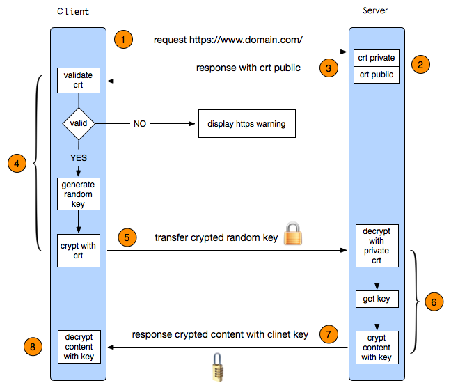
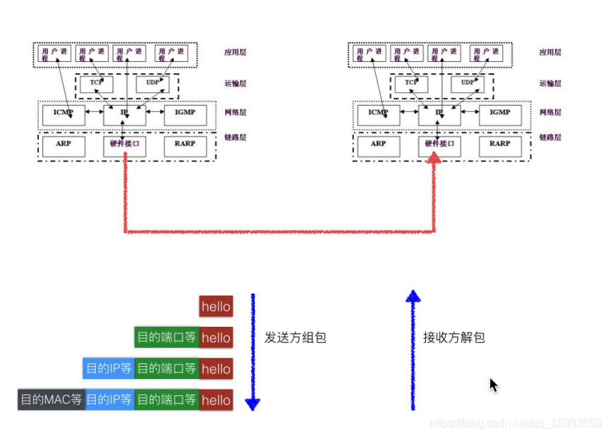
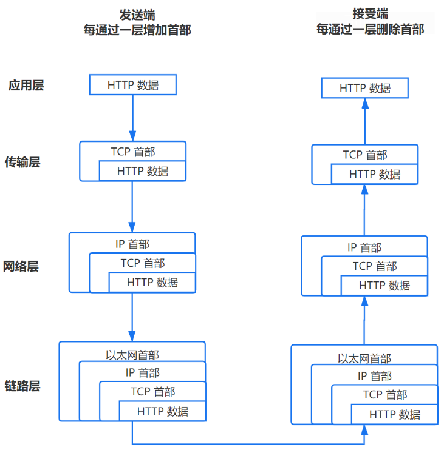
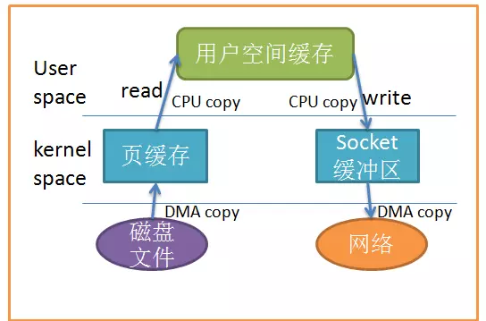

# 计算机网络

## 体系

+ OSI体系：
  + 物理层：物理层的主要功能是利用物理传输介质为数据链路层提供物理连接，以透明地传送比特流。
    + pdu：比特（bit）
    + 相关设备：网卡，网线，集线器，中继器，调制解调器
  + 数据链路层：数据链路层在物理层提供比特流传输服务的基础上，在通信实体之间建立数据链路连接，传送以帧为单位的数据，通过差错控制、流量控制方法，变有差错的物理线路为无差错的数据链路。
    + pdu：数据帧（frame）
    + 相关设备：网桥，交换机
  + 网络层：网络层主要任务是通过执行路由选择算法，为报文分组通过通信子网选择最适当的路径。
    + pdu：数据包（packet）
    + 相关设备：路由器
  + 传输层：传输层是向用户提供可靠的端到端服务，透明地传送报文。
    + pdu：报文段（segment）
  + 会话层：会话层的主要目的是组织同步的两个会话用户之间的对话，并管理数据的交换。
    + pdu：会话层协议数据单元（SPDU）
  + 表示层：表示层主要用于处理两个通信系统间信息交换的表示方式，它包括数据格式变换、数据加密与解密、数据压缩与恢复等功能。
    + pdu：表示层协议数据单元（PPDU）
  + 应用层：应用层是OSI参考模型的最高层。应用层不仅要提供应用进程所需要信息交换和远程操作，而且还要作为应用进程的用户代理，完成一些为进行语义上有意义的信息交换所必须的功能。
    + pdu：应用层协议数据单元（APDU）
+ TCP/IP体系
  + 网络接口层：对应物理层、数据链路层
  + 网际层IP：对应网络层
  + 运输层：对应传输层
  + 应用层：对应绘画层、表示层、应用层
+ 五层体系：
  + 物理层
  + 数据链路层
  + 网络层
  + 传输层
  + 应用层


## 应用层

### DNS

+ DNS 的全称是 Domain Name System 或者 Domain Name Service，它主要的作用就是将人们所熟悉的网址 (域名) “翻译”成电脑可以理解的 IP 地址，这个过程叫做 DNS 域名解析。

## HTTP

https://baijiahao.baidu.com/s?id=1677802258258817086&wfr=spider&for=pc

### 基本

+ HTTP端口80，HTTPS端口443
+ 在OSI 网络模型中，HTTP工作于应用层，而HTTPS 的安全传输机制工作在传输层
+ URI和URL的区别
  + URI，是uniform resource identifier，统一资源标识符，用来唯一的标识一个资源。
    + 在Java类库中，URI类不包含任何访问资源的方法，它唯一的作用就是解析。
  + URL是uniform resource locator，统一资源定位器，它是一种具体的URI，即URL可以用来标识一个资源，而且还指明了如何locate这个资源。
    + 在Java类库中，URL类可以打开一个到达资源的流。
+ HTTP队头阻塞：由于HTTP引入了管道，会导致队头阻塞，在HTTP2中得以解决，但是仍然会出现TCP队头阻塞

### 请求方法

+ HTTP1.0定义了三种请求方法： GET, POST 和 HEAD方法。HTTP1.1新增了五种请求方法：OPTIONS, PUT, DELETE, TRACE 和 CONNECT
+ 作用：
  + GET: 通常用于请求服务器发送某些资源
  + HEAD: 请求资源的头部信息, 并且这些头部与 HTTP GET 方法请求时返回的一致. 该请求方法的一个使用场景是在下载一个大文件前先获取其大小再决定是否要下载, 以此可以节约带宽资源
  + OPTIONS: 用于获取目的资源所支持的通信选项
  + POST: 发送数据给服务器
  + PUT: 用于新增资源或者使用请求中的有效负载替换目标资源的表现形式
  + DELETE: 用于删除指定的资源
  + PATCH: 用于对资源进行部分修改
  + CONNECT: HTTP/1.1协议中预留给能够将连接改为管道方式的代理服务器
  + TRACE: 回显服务器收到的请求，主要用于测试或诊断

### 状态码

+ 2xx 成功：
  + **200** OK，表示从客户端发来的请求在服务器端被正确处理
  + 201 Created 请求已经被实现，而且有一个新的资源已经依据请求的需要而建立
  + 202 Accepted 请求已接受，但是还没执行，不保证完成请求
  + 204 No content，表示请求成功，但响应报文不含实体的主体部分
  + 206 Partial Content，进行范围请求
+ 3xx重定向：
  + **301** moved permanently，永久性重定向，表示资源已被分配了新的 URL
  + **302** found，临时性重定向，表示资源临时被分配了新的 URL
  + 303 see other，表示资源存在着另一个 URL，应使用 GET 方法定向获取资源
  + 304 not modified，表示服务器允许访问资源，但因发生请求未满足条件的情况
  + 307 temporary redirect，临时重定向，和302含义相同
+ 4xx客户端错误：
  + **400** bad request，请求报文存在语法错误
  + **401** unauthorized，表示发送的请求需要有通过 HTTP 认证的认证信息
  + **403** forbidden，表示对请求资源的访问被服务器拒绝
  + **404** not found，表示在服务器上没有找到请求的资源
  + 408 Request timeout, 客户端请求超时
  + 409 Confict, 请求的资源可能引起冲突
+ 5xx服务器错误：
  + **500** internal sever error，表示服务器端在执行请求时发生了错误
  + **501** Not Implemented 请求超出服务器能力范围，例如服务器不支持当前请求所需要的某个功能，或者请求是服务器不支持的某个方法
  + **502** Bad GateWay：服务器（不一定是Web服务器）作为网关或代理，从上游服务器收到的响应是无效的。
  + **503** service unavailable，表明服务器暂时处于超负载或正在停机维护，无法处理请求
  + 504 GateWay TimeOut，表明服务器作为网关或代理，从上游服务器获取响应超时。
  + 505 http version not supported 服务器不支持，或者拒绝支持在请求中使用的 HTTP 版本

#### 相关问题

+ 301和302区别：
  + 301表示永久重定向，302表示临时重定向。
  + 301重定向是可以缓存的。
  + 301搜索引擎在抓取的时候会抓取新跳转的地方，而302抓取的是原来的地方。

### HTTPS

+ HTTPS通信与验证的过程中同时使用到了非对称加密与对称加密。其中非对称加密使用的是RSA加密算法，对称加密使用的是AES128算法。其中非对称加密可以公钥加密私钥解密，同时可以私钥签名公钥验签
+ 证书包含内容：
  + 颁发机构信息
  + 公钥
  + 公司信息
  + 域名
  + 有效期
  + 指纹
+ 验证证书的合法性
  + 验证域名、有效期等信息是否正确：证书上都有包含这些信息，比较容易完成验证；
  + 判断证书来源是否合法：每份签发证书都可以根据验证链查找到对应的根证书，操作系统、浏览器会在本地存储权威机构的根证书，利用本地根证书可以对对应机构签发证书完成来源验证
    + 各大浏览器和操作系统已经维护了所有的权威证书机构的名称和公钥。客户端只需要知道是哪个权威机构发的证书，使用对应的机构公钥，就可以解密出证书签名；接下来，客户端使用同样的规则，生成自己的证书签名，如果两个签名是一致的，说明证书是有效的；
      签名验证成功后，客户端就可以再次利用机构的公钥，解密出 服务端的公钥 key1;接下来的操作，就是和之前一样的流程了；
  + 判断证书是否被篡改：需要与 CA 服务器进行校验
  + 判断证书是否已吊销：通过CRL（Certificate Revocation List 证书注销列表）和 OCSP（Online Certificate Status Protocol 在线证书状态协议）实现，其中 OCSP 可用于第3步中以减少与 CA 服务器的交互，提高验证效率
    + CRL即证书吊销列表。证书被吊销后会被记录在CRL中，CA会定期发布CRL。应用程序可以依靠CRL来检查证书是否被吊销了。
    + OCSP是在线证书状态检查协议。应用按照标准发送一个请求，对某张证书进行查询，之后服务器返回证书状态。
+ HTTPS的中间人攻击


+ TLS握手流程：


+ 工作流程：
  + 首先HTTP请求服务端生成证书，客户端对证书的有效期、合法性、域名是否与请求的域名一致、证书的公钥（RSA加密）等进行校验
  + 客户端如果校验通过后，就根据证书的公钥的有效， 生成随机数，随机数使用公钥进行加密（RSA加密）；
  + 消息体产生的后，对它的摘要进行MD5（或者SHA1）算法加密，此时就得到了RSA签名；
  + 发送给服务端，此时只有服务端（RSA私钥）能解密。
  + 解密得到的随机数，再用AES加密，作为密钥（此时的密钥只有客户端和服务端知道）
  + 
+ http和https区别：
  + 端口http为80，https为443
  + http是应用层协议，https在应用层之上添加了ssl安全协议，ssl是运输层协议，所以https是应用层和传输层的结合
  + 

### WebSockect

+ WebSocket是双向的，在客户端-服务器通信的场景中使用的全双工协议，与HTTP不同，它以ws://或wss://开头。它是一个有状态协议，这意味着客户端和服务器之间的连接将保持活动状态，直到被任何一方（客户端或服务器）终止。在通过客户端和服务器中的任何一方关闭连接之后，连接将从两端终止。

### HTTP版本

#### HTTP1.1

+ 队头阻塞：
  + 在HTTP1.1中由于引入了管道，可以是的请求并发发送，但是接受的时候必须按照顺序接收。这样如果中途一个响应慢了，会导致后续的响应阻塞。
    + 管道化缺点：
      + 管道化要求严格按照请求发送顺序返回响应。因为HTTP请求并没有序号标识，无法将乱序的请求和响应关联起来。
      + 客户端需要保持未收到响应的请求，当连接意外中断时，需要重新发送这一部分请求。
      + 只有幂等的请求才能进行管道化，也就是只有GET和Head请求才能管道化，否则会出现意料之外的结果。

#### HTTP2

##### 特性

+ 使用二进制形式传输而非文本格式：
  + 比起http1的文本传输，二进制解析起来更为高效.
  + http2将请求和响应分割为更小的帧，并对其采用二进制编码。
  + HTTP2不使用管道化的方式，而是引入了帧、消息和数据流等概念，每个请求/响应被称为消息，每个消息都被拆分成若干个帧进行传输，每个帧都分配一个序号。每个帧在传输是属于一个数据流，而一个连接上可以存在多个流，各个帧在流和连接上独立传输，到达之后在组装成消息，这样就避免了**请求/响应阻塞**。
+ 使用了报头压缩
  + 压缩策略：
    + HTTP/2在客户端和服务器端使用“首部表”来跟踪和存储之前发送的键－值对，对于相同的数据，不再通过每次请求和响应发送；
    + 首部表在HTTP/2的连接存续期内始终存在，由客户端和服务器共同渐进地更新;
    + 每个新的首部键－值对要么被追加到当前表的末尾，要么替换表中之前的值。
+ 多路复用：
  + 特性：
    + 同域名下所有通信都在单个连接上完成。
    + 单个连接可以承载任意数量的双向数据流。
    + 数据流以消息的形式发送，而消息又由一个或多个帧组成，多个帧之间可以乱序发送，因为根据帧首部的流标识可以重新组装。
  + 优点：
    + 同个域名只需要占用一个 TCP 连接，消除了因多个 TCP 连接而带来的延时和内存消耗。
    + 单个连接上可以并行交错的请求和响应，之间互不干扰。
    + 在HTTP/2中，每个请求都可以带一个31bit的优先值，0表示最高优先级， 数值越大优先级越低。有了这个优先值，客户端和服务器就可以在处理不同的流时采取不同的策略，以最优的方式发送流、消息和帧。
+ Server Push：
  + 服务器不再是完全被动地响应请求，也可以新建“流”主动向客户端发送消息。比如，在浏览器刚请求HTML的时候就提前把可能会用到的JS、CSS文件发给客户端，减少等待的延迟，这被称为"服务器推送"（ Server Push，也叫 Cache push）
    + 服务端可以主动推送，客户端也有权利选择是否接收。如果服务端推送的资源已经被浏览器缓存过，浏览器可以通过发送RST_STREAM帧来拒收。主动推送也遵守同源策略，换句话说，服务器不能随便将第三方资源推送给客户端，而必须是经过双方确认才行。

#### HTTP3

+ 相比与HTTP2使用的TCP协议，HTTP3使用了UDP协议，并且通过QUIC协议来保证连接的可靠性。

##### QUIC

+ https://cloud.tencent.com/developer/article/1155289

+ 特性：
  + **链接耗时更短**
    + 基于TCP的HTTPS在建立连接的时候首先会进行三次握手，然后执行TLS握手。而QUIC通过客户端发送 SYN 包的同时将 ClientHello 一起发给服务端，服务端响应 SYN/ACK 包时也带上相关 TLS 握手包来减少多出来的TLS握手。
  + **拥塞控制更出色**
    + QUIC默认采用Cubic拥塞控制算法来实现拥塞控制，就这点来看和TCP采用的是一套机制（譬如我们熟知的慢开始、拥塞避免、快重传、快恢复策略），但QUIC的这套拥塞控制策略还是与TCP有一些明显的区别和改进。
  + **更好的多路复用**
    + QUIC引入了Connection和Stream的概念。一个Connection可以承载多个Stream，可以同时发起多个请求，并且请求间是完全独立的。（HTTP2多路复用）
  + **前向纠错特性**
    + 谷歌在QUIC早期采用了前向纠错码（Forward-Error Correction）来减少包丢失现象。在一个Group中带上一个额外的fec包（N+1个包），分组中任意一个包丢失，都可以用其余N个包来恢复。这种做法同时也带来了冗余，可能没10个包中就要额外传输1个冗余包，在网络状况好的时候是一种浪费，目前谷歌已经废弃了QUIC的FEC功能。
    + 对于一些非常重要的包，QUIC在发送后的短时间内如果没收到回包，便会重发请求，以确保重要的节点不被Delay。因此抓包时你可能会看到有5个CHLO包在100ms内相继被发送。
  + **链接迁移特性**
    + 当客户端IP或端口发生变化时（这在移动端比较常见），TCP连接基于两端的ip:port四元组标示，因此会重新握手，而UDP不面向连接，不用握手。其上层的QUIC链路由于使用了64位Connection id作为唯一标识，四元组变化不影响链路的标示，也不用重新握手。因此网络链接状态变化时不会增加额外的握手重连耗时。

## TCP

+ 传输控制协议，TCP提供面向链接的服务，在传送数据之前必须先建立链接，数据传送结束后要释放链接，运输协议数据单元是TCP报文

### TCP首部


+ **序号** ：用于对字节流进行编号，例如序号为 301，表示第一个字节的编号为 301，如果携带的数据长度为 100 字节，那么下一个报文段的序号应为 401。
+ **确认号** ：期望收到的下一个报文段的序号。例如 B 正确收到 A 发送来的一个报文段，序号为 501，携带的数据长度为 200 字节，因此 B 期望下一个报文段的序号为 701，B 发送给 A 的确认报文段中确认号就为 701。
+ **数据偏移** ：指的是数据部分距离报文段起始处的偏移量，实际上指的是首部的长度。
+ **确认 ACK** ：当 ACK=1 时确认号字段有效，否则无效。TCP 规定，在连接建立后所有传送的报文段都必须把 ACK 置 1。
+ **同步 SYN** ：在连接建立时用来同步序号。当 SYN=1，ACK=0 时表示这是一个连接请求报文段。若对方同意建立连接，则响应报文中 SYN=1，ACK=1。
+ **终止 FIN** ：用来释放一个连接，当 FIN=1 时，表示此报文段的发送方的数据已发送完毕，并要求释放连接。
+ 紧急URG：表明有紧急字段，优先发送 =1，会把本报文段放在数据的最前面
+ 复位RST：=1,表明出现错误必须释放连接，可以用于拒绝非法报文段，或拒绝打开一个
+ **窗口** ：窗口值作为接收方让发送方设置其发送窗口的依据。之所以要有这个限制，是因为接收方的数据缓存空间是有限的。

### 心跳机制

+ 它像心跳一样每隔固定时间发一次，以此来告诉服务器，这个客户端还活着。事实上这是为了保持长连接，至于这个包的内容，是没有什么特别规定的，不过一般都是很小的包，或者只包含包头的一个空包。
+ 如果一个给定的连接在**两小时内没有任何的动作**，则服务器就向客户发一个探测报文段，客户主机必须处于以下4个状态之一：
  + 客户主机依然正常运行，并从服务器可达。客户的TCP响应正常，而服务器也知道对方是正常的，服务器在两小时后将保活定时器复位。
  + 客户主机已经崩溃，并且关闭或者正在重新启动。在任何一种情况下，客户的TCP都没有响应。服务端将不能收到对探测的响应，并在75秒后超时。服务器总共**发送10个这样的探测 ，每个间隔75秒**。如果服务器没有收到一个响应，它就认为客户主机已经关闭并终止连接。
  + 客户主机崩溃并已经重新启动。服务器将收到一个对其保活探测的响应，这个响应是一个复位，使得服务器终止这个连接。
  + 客户机正常运行，但是服务器不可达，这种情况与2类似，TCP能发现的就是没有收到探查的响应。

### reset报文

+ 当本次TCP接收到不正确的TCP报文（即端口号与IP地址为本机，但对方的IP地址本机不认识，或是对应端口上没有TCP连接）时，会发送reset报文通知对方放弃连接。
+ 在如下情况会发送reset报文：
  + 发送连接请求到没有进程监听（处于LISTEN状态）的端口
  + 客户端和服务器的某一方在交互的过程中发生异常（如程序崩溃等），该方系统将向对端发送TCP reset报文，告之对方释放相关的TCP连接，当应用程序想要发送reset报文时，会将还未处理的本次TCP连接的报文全部丢弃，然后发送reset报文，接收方TCP会通知应用程序直接放弃本次连接，同时不会发送ACK。
  + 接收端收到TCP报文，但是发现该TCP的报文，并不在其已建立的TCP连接列表内，则其直接向对端发送reset报文
  + 在交互的双方中的某一方长期未收到来自对方的确认报文，则其在超出一定的重传次数或时间后，会主动向对端发送reset报文释放该TCP连接
  + 有些应用开发者在设计应用系统时，会利用reset报文快速释放已经完成数据交互的TCP连接，以提高业务交互的效率
  + 检测半关闭连接
+ 由于发送reset报文不会有ACK，若reset报文丢失，且半开放方一直未发送报文，是否意味着TCP会一直处于半关闭的状态？
  + 不会，TCP有一个存活计数器，用于判断对方是否还与自己建立连接，若在规定时间里未接受到对方的报文，则会reset本次连接。
+ 发送完reset报文后，若建立socket相同的连接，之前连接的在网络上的延迟报文会不会被误认为是新建立连接的报文？
  + 不会，如果序列号与确认号不同，则不会接收相应的报文，在RFC754中规定，ISN每隔4ms ISN的值就会递增，在32位的情况下，从0开始增长到最大值需要4.5小时，所以之前连接的报文与当前连接ack相等的概率很低，基本可以忽略。

### 三次握手


+ 在三次握手的时候会存在半连接队列和全连接队列，当服务端收到客户端发起的SYNC请求后，内核会把连接存储到半连接队列，然后向客户端发送响应，接着客户端会返回确认，服务端在三次握手完毕后会将连接从半连接队列中移除，然后创建一个全新的连接，添加到全连接队列（accept队列）里，并等待进程调用`accept`函数时把连接取出来。
  + 无论是半连接队列还是全连接队列满了，内核都会直接丢弃或者返回RST包。
+ 为什么要三次握手：
  + 如果使用的是两次握手建立连接，假设有这样一种场景，客户端发送了第一个请求连接并且没有丢失，只是因为在网络结点中滞留的时间太长了，由于TCP的客户端迟迟没有收到确认报文，以为服务器没有收到，此时重新向服务器发送这条报文，此后客户端和服务器经过两次握手完成连接，传输数据，然后关闭连接。此时此前滞留的那一次请求连接，网络通畅了到达了服务器，这个报文本该是失效的，但是，两次握手的机制将会让客户端和服务器再次建立连接，这将导致不必要的错误和资源的浪费。
+ 为什么要传回SYN：
  + SYN 是 TCP/IP 建立连接时使用的握手信号。在客户机和服务器之间建立正常的 TCP 网络 连接时,客户机首先发出一个 SYN 消息,服务器使用 SYN-ACK 应答表示接收到了这个消 息,最后客户机再以 ACK(Acknowledgement[汉译:确认字符 ,在数据通信传输中,接收站 发给发送站的一种传输控制字符。它表示确认发来的数据已经接受无误。 ])消息响应。这 样在客户机和服务器之间才能建立起可靠的TCP连接,数据才可以在客户机和服务器之间传 递。
+ 三次握手丢包：Linux默认情况下，如果发送了丢包，那么会进行重传。默认是五次，每次重传的时间间隔翻倍增大。1s，2s，4s，8s，16s。
  + 第一次SYN丢失：客户端会重传SYN。默认次数是5次。
  + 第二次SYN + ACK丢失：客户端会重传SYN、服务端会重传ACK。默认次数是5次。
  + 第三次SYN丢失：如果第三次握手ACK服务端没有收到，那么客户端会处于`ESTABLISHED`状态，而服务端会处于`SYN_RECV`状态。
    + 对于服务端：在重传次数超过`tcp_synack_retries`的值后，服务器会主动断开TCP连接
    + 对于客户端：
      + 如果有发送数据：如果一直没有收到服务端的确认报文，会进行重传，默认15次。如果还没有回应就会断开连接。
      + 如果没有发送数据：会一直处于`ESTABLISHED`状态，然后触发心跳机制。
  + 相关参数：
    + 第一次SYN丢失重传次数：位于`/proc/sys/net/ipv4/tcp_syn_retries`
    + 第二次ACK丢失重传次数：位于`/proc/sys/net/ipv4/tcp_synack_retries`
    + 第三次SYN丢失重传次数：位于`/proc/sys/net/ipv4/tcp_retries2`

### 攻击

#### 半连接攻击

+ 通过将主机的资源消耗殆尽，从而导致应用层的程序无资源可用，导致无法运行。在正常情况下，客户端连接服务端需要通过三次握手，首先客户端构造一个SYN连接数据包发送至服务端，自身进入SYN_SEND状态，当服务端收到客户端的SYN包之后，为其分配内存核心内存，并将其放置在半连接队列中，服务端接收客户SYN包并会向客户端发送一个SYN包和ACK包，此刻服务端进入SYN_RECV态。客户端收到包之后，再次向服务端发送ACK确认包。至此连接建立完成，双方都进入ESTABLSHEDZ状态。半连接就是通过不断地构造客户端的SYN连接数据包发向服务端，等到服务端的半连接队列满的时候，后续的正常用户的连接请求将会被丢弃，从而无法连接到服务端。此为半连接攻击方式。根据服务端的半连接队列的大小，不同主机的抵抗这种SYN攻击的能力也是不一样。
+ 

#### 全连接攻击

+ 全连接攻击是通过消费服务端进程数和连接数，只连接而不进行发送数据的一种攻击方式。当客户端连接到服务端，仅仅只是连接，此时服务端会为每一个连接创建一个进程来处理客户端发送的数据。但是客户端只是连接而不发送数据，此时服务端会一直阻塞在recv或者read的状态，如此一来，多个连接，服务端的每个连接都是出于阻塞状态从而导致服务端的崩溃。

### 四次挥手


+ 为什么要等待2MSL：
  + 保证客户端发送的最后一个ACK确认报文能够顺利到达服务器。如果丢失了的话，服务器可以重新发送一次结束报文，客户端能够在这2MSL内重传这个报文，并重启计时器
  + 防止类似与“三次握手”中提到了的“已经失效的连接请求报文段”出现在本连接中。客户端发送完最后一个确认报文后，在这个2MSL时间中，就可以使本连接持续的时间内所产生的所有报文段都从网络中消失。这样新的连接中不会出现旧连接的请求报文。
+ MSL：MSL指报文最大生存时间，RFC793中规定MSL时间是2分钟，Linux实际实现是30s。
+ 在四次挥手的过程中，先发送FIN包的一方是主动关闭，后发送FIN包的一方是被动关闭。主动关闭的一方会进入Time_wait状态。并且在此停留两倍MSL时长。
  + https://cloud.tencent.com/developer/article/1589962
  
  + https://www.freesion.com/article/77601100863/
  
  + TIme_Wait危害（等待2MSL危害）：
    + 在socket的TIME_WAIT状态结束之前，该socket所占用的本地端口号将一直无法释放，端口号只有65535个，如果端口耗尽了就无法发起新的连接了。
    + 高并发（每秒几万qps）并且采用短连接方式进行交互的系统中运行一段时间后，系统中就会存在大量的time_wait状态，如果time_wait状态把系统所有可用端口都占完了且尚未被系统回收时，就会出现无法向服务端创建新的socket连接的情况。此时系统几乎停转，任何链接都不能建立。
    + 大量的time_wait状态也会系统一定的fd，内存和cpu资源，当然这个量一般比较小，并不是主要危害
    
  + TimeWait会占用文件描述符，文件描述符从TimeWait转换到close的时候才会被系统回收。
  
  + 解决方案：
    + 调整内核参数
    + 调整短链接为长链接
    
  + 内核参数调整：
  
    + 编辑内核文件/etc/sysctl.conf
  
      + ```conf
        net.ipv4.tcp_syncookies = 1 表示开启SYN Cookies。当出现SYN等待队列溢出时，启用cookies来处理，可防范少量SYN攻击，默认为0，表示关闭；
        net.ipv4.tcp_tw_reuse = 1 表示开启重用。允许将TIME-WAIT sockets重新用于新的TCP连接，默认为0，表示关闭；
        net.ipv4.tcp_tw_recycle = 1 表示开启TCP连接中TIME-WAIT sockets的快速回收，默认为0，表示关闭。
        net.ipv4.tcp_fin_timeout 修改系默认的 TIMEOUT 时间
        
        net.ipv4.tcp_keepalive_time = 1200 
        #表示当keepalive起用的时候，TCP发送keepalive消息的频度。缺省是2小时，改为20分钟。
        net.ipv4.ip_local_port_range = 1024 65000 
        #表示用于向外连接的端口范围。缺省情况下很小：32768到61000，改为1024到65000。
        net.ipv4.tcp_max_syn_backlog = 8192 
        #表示SYN队列的长度，默认为1024，加大队列长度为8192，可以容纳更多等待连接的网络连接数。
        net.ipv4.tcp_max_tw_buckets = 5000 
        #表示系统同时保持TIME_WAIT套接字的最大数量，如果超过这个数字，TIME_WAIT套接字将立刻被清除并打印警告信息。
        默认为180000，改为5000。对于Apache、Nginx等服务器，上几行的参数可以很好地减少TIME_WAIT套接字数量，但是对于 Squid，效果却不大。此项参数可以控制TIME_WAIT套接字的最大数量，避免Squid服务器被大量的TIME_WAIT套接字拖死。
        ```
+ Close_wait：如果一直保持在CLOSE_WAIT状态，那么只有一种情况，就是在对方关闭连接之后服务器程序自己没有进一步发出ack信号。换句话说，就是在对方连接关闭之后，程序里没有检测到，或者程序压根就忘记了这个时候需要关闭连接，于是这个资源就一直被程序占着。


### 保证可靠传输

+ 应用数据被分割成 TCP 认为最适合发送的数据块。
+ TCP 给发送的每一个包进行编号,接收方对数据包进行排序,把有序数据传送给应用层。
+ 校验和: TCP 将保持它首部和数据的检验和。这是一个端到端的检验和,目的是检测数据 在传输过程中的任何变化。如果收到段的检验和有差错,TCP 将丢弃这个报文段和不确认收 到此报文段。
+ TCP 的接收端会丢弃重复的数据。
+ 流量控制: TCP 连接的每一方都有固定大小的缓冲空间,TCP的接收端只允许发送端发送 接收端缓冲区能接纳的数据。当接收方来不及处理发送方的数据,能提示发送方降低发送的 速率,防止包丢失。TCP 使用的流量控制协议是可变大小的滑动窗口协议。 (TCP 利用滑 动窗口实现流量控制)
+ 拥塞控制: 当网络拥塞时,减少数据的发送。
+ ARQ协议（自动重传请求）: 也是为了实现可靠传输的,它的基本原理就是每发完一个分组就停止发送,等待对方确认。在收到确认后再发下一个分组。
+ 超时重传: 当 TCP 发出一个段后,它启动一个定时器,等待目的端确认收到这个报文段。如果不能及时收到一个确认,将重发这个报文段。

### ARQ协议

+ 它通过使用**确认和超时**这两个机制,在不可靠服务的基础上实现可靠的信息传输。如果发送方在发送后一段时间之内没有收到确认帧,它通常会重新发送。ARQ包括停止等待ARQ协议和连续ARQ协议。

#### 停止等待ARQ协议

+ 停止等待协议是为了实现可靠传输的,它的基本原理就是每发完一个分组就停止发送,等待对方确认(回复ACK)。如果过了一段时间(超时时间后),还是没有收到 ACK 确认,说明没有发送成功,需要重新发送,直到收到确认后再发下一个分组。在停止等待协议中,若接收方收到重复分组,就丢弃该分组,但同时还要发送确认。
  + 缺点：效率低、信道利用率低、等待时间长

+ 超时重传：发送方过了一段时间仍然没有收到确认，就认为发送的分组丢失了，主动重传前面发送过的分组
  + 发送方发送完一个分组后，必须暂时保留已发送分组的副本
  + 分组和确认分组都必须进行编号（编号位数有限，同一个号码会重复使用，有时并不能保证可靠传输）
  + 超时计时器设置的重传时间应比数据在分组传输的平均往返时间长一点
+ 确认丢失和确认迟到
  + 确认丢失：确认消息在传输过程丢失。当A发送M1消息,B收到后,B向A发送了一个M1确 认消息,但却在传输过程中丢失。而A并不知道,在超时计时过后,A重传M1消息,B再次 收到该消息后采取以下两点措施:1. 丢弃这个重复的M1消息,不向上层交付。 2. 向A发送 确认消息。(不会认为已经发送过了,就不再发送。A能重传,就证明B的确认消息丢 失)。
  + 确认迟到：确认消息在传输过程中迟到。A发送M1消息,B收到并发送确认。在超时时间内 没有收到确认消息,A重传M1消息,B仍然收到并继续发送确认消息(B收到了2份M1)。 此时A收到了B第二次发送的确认消息。接着发送其他数据。过了一会,A收到了B第一次发 送的对M1的确认消息(A也收到了2份确认消息)。处理如下:1. A收到重复的确认后,直接丢弃。2. B收到重复的M1后,也直接丢弃重复的M1。

#### 连续ARQ协议

+ 连续 ARQ 协议可提高信道利用率。发送方维持一个发送窗口,凡位于发送窗口内的分组可以连 续发送出去,而不需要等待对方确认。接收方一般采用累计确认,对按序到达的最后一个分组发 送确认,表明到这个分组为止的所有分组都已经正确收到了。
  + 优点：信道利用率高,容易实现,即使确认丢失,也不必重传。
  + 缺点：不能向发送方反映出接收方已经正确收到的所有分组的信息。 比如:发送方发送了 5条 消息,中间第三条丢失(3号),这时接收方只能对前两个发送确认。发送方无法知道后三个分 组的下落,而只好把后三个全部重传一次。这也叫 Go-Back-N(回退 N),表示需要退回来重传 已经发送过的 N 个消息。
  
+ 回退N重传：

  + 接收点丢弃从第一个没有收到的数据包开始的所有数据包。
  + 发送点收到NACK后，从NACK中指明的数据包开始重新发送。
  + 缺点：会导致回退N

+ 选择重传（SACK）：

  + 发送点连续发送数据包但对每个数据包都设有个一个计时器。
  + 当在一定时间内没有收到某个数据包的ACK时，发送点只重新发送那个没有ACK的数据包。

  + 缺点：会照成队头阻塞，如果一个包没有到达的话，接收端必须维持后续到达的包直到丢失的包全部到达。

#### 流量控制

+ 双方在通信的时候，发送方的速率与接收方的速率是不一定相等，如果发送方的发送速率太快，会导致接收方处理不过来，这时候接收方只能把处理不过来的数据存在缓存区里（失序的数据包也会被存放在缓存区里）。
+ 接受方向发送方发送`rwnd`报文来表明窗口大小。
+ 如果接收方的rwnd报文在传输过程丢失了。发送方会一直等待接收方发送的非零窗口的通知，而接收方也一直等待发送方的发送数据就会造成死锁。
  + TCP为每个连接设置一个连续计时器，一方收到对方的零窗口通知就启动计时器，如果计时器的时间到期就发送一个零窗口探测报文段

+ **糊涂窗口综合证**：TCP接收方的缓存已满，而交互式的应用进程一次只从接收缓存中读取1字节（这样就使接收缓存空间仅腾出1字节），然后向发送方发送确认，并把窗口设置为1个字节（但发送的数据报为40字节的的话）。接收，发送方又发来1个字节的数据（发送方的IP数据报是41字节）。接收方发回确认，仍然将窗口设置为1个字节。这样，网络的效率很低。要解决这个问题，可让接收方等待一段时间，使得或者接收缓存已有足够空间容纳一个最长的报文段，或者等到接收方缓存已有一半空闲的空间。只要出现这两种情况，接收方就发回确认报文，并向发送方通知当前的窗口大小。此外，发送方也不要发送太小的报文段，而是把数据报积累成足够大的报文段，或达到接收方缓存的空间的一半大小。

#### 拥塞控制

+ 即对资源的需求超过了可用的资源。若网络中许多资源同时供应不足，网络的性能就要明显变坏，整个网络的吞吐量随之负荷的增大而下降。
+ 为了进行拥塞控制,TCP 发送方要维持一个 拥塞窗口(cwnd) 的状态变量。拥塞控制窗口的大小 取决于网络的拥塞程度,并且动态变化。发送方让自己的发送窗口取为拥塞窗口和接收方的接受 窗口中较小的一个。
+ 网络吞吐量在饱和之前应该等于提供的负载，但实际情况下当网络吞吐量明显小于理想吞吐量时，就进入了轻度拥塞的状态，提供负载达到某一数值时，网络吞吐量反而会随着提供的负载增大而下降，网络会进入拥塞状态，当吞吐量下降到0时，就产生了死锁
+ 为了防止拥塞窗口增长过大，设置了一个慢开始门限（ssthresh）
  + cwnd<ssthresh：使用慢开始算法
  + cwnd>ssthresh：使用拥塞避免算法
  + cwnd=ssthresh：两种都可以
+ 控制方法：
  + 慢开始：先探测一下,即由小到大逐渐增大发送窗口,也就是由小到大逐渐增大拥塞窗口数值。cwnd初始值为1,每经过一个传播轮次,cwnd加倍。
  + 拥塞避免：拥塞避免算法的思路是让拥塞窗口cwnd缓慢增大,即每经过一个往返时间RTT就把发送放的cwnd加1。
  + 快重传：快重传算法首先要求接收方每收到一个失序的报文段就立即发出重复确认（为的是使发送方及早的知道有报文段没有到达对方）而不要等到自己发送数据时才捎带确认。快重传算法规定，发送方只要一连收到三个重复确认就应当立即重传对方尚未收到的报文段，而不必继续等待为其设置的重传计时器到期。
  + 快恢复：当发送方连续收到三个重复确认时，就执行“乘法减小”算法，把慢开始门限减半。这是为了预防网络发生拥塞，但不执行慢开始算法。
+ 


#### 主动管理队列（AQM）

+ 主动管理队列AQM：不要等到路由器队列长度已经到达最大值才不得不丢弃后面到达的分组，而是到达某个警惕值的时候就提醒发送方降低发送速率	

### 粘包和拆包

+ https://blog.csdn.net/J080624/article/details/87209637
+ https://www.cnblogs.com/AIPAOJIAO/p/10631551.html
+ 粘包：如果通讯的一端一次性连续发送多条数据包，tcp协议会将多个数据包打包成一个tcp报文发送出去
  + 原因：
    + 要发送的数据小于TCP发送缓冲区的大小，TCP将多次写入缓冲区的数据一次发送出去；
    + 接收数据端的应用层没有及时读取接收缓冲区中的数据；
    + 数据发送过快，数据包堆积导致缓冲区积压多个数据后才一次性发送出去(如果客户端每发送一条数据就睡眠一段时间就不会发生粘包)；
  + 解决：
    + 使用带消息头的协议：消息头存储信息开始表示及消息长度信息，服务端获取消息头后解析出消息长度然后读取该长度的内容。对应Netty`LengthFieldBasedFrameDecoder`和`LengthFieldPrepender`
    + 使用定长消息：服务端每次读取指定长度的内容作为一条完整的消息，当消息不够长时空位不上固定字符。对应Netty的`FixedLengthFrameDecoder`
    + 设置消息边界：服务端从网络流中按消息边界分离出消息的内容。对应Netty的`LineBasedFrameDecoder`和`DelimiterBasedFrameDecoder`
    + 使用更复杂的网络协议。
+ 拆包：如果通讯的一端发送的数据包超过一次tcp报文所能传输的最大值时，就会将一个数据包拆成多个最大tcp长度的tcp报文分开传输


## UDP

+ 用户数据报协议，UDP在传送数据之前不需要先建立链接，运输协议数据单元是UDP报文或用户数据报

### UDP首部


## TCP和UDP

| UDP                                      | TCP                                                      |
| ---------------------------------------- | -------------------------------------------------------- |
| 无连接                                   | 面向连接                                                 |
| 不可靠，没有确认机制、流量控制、拥塞控制 | 可靠，有确认机制、流量控制、拥塞控制                     |
| 支持一对一，一对多，多对一，多对多       | 只支持一对一                                             |
| 面向报文传输                             | 面向字节流                                               |
| 首部开销小，固定8个字节                  | 首部开销大，最小20字节，最大60字节                       |
| 使用场景：IP电话、视频会议、直播         | 适用于要求可靠传输的应用，如文件传输等                   |
| BOOTP、DHCP、NTP、TFTP、SNMP             | HTTP、FTP、SMTP（邮件）、POP3（邮件）、TENET（远程登录） |



## 一台机器建立的连接数

### socket数据结构

```c
struct inet_sock {
	/* sk and pinet6 has to be the first two members of inet_sock */
	struct sock		sk;
#if defined(CONFIG_IPV6) || defined(CONFIG_IPV6_MODULE)
	struct ipv6_pinfo	*pinet6;
#endif
	/* Socket demultiplex comparisons on incoming packets. */
	__be32			daddr;         // IPv4的目的地址
	__be32			rcv_saddr;     // IPv4的本地地址
	__be16			dport;         // 目的端口
	__u16			num;           // 本地端口
	__be32			saddr;        

	……
}; 
```

### 客户端

+ 对于客户端来说，建立一个链接需要唯一分配一个端口号。所以对于客户端来说能建立的连接数理论值为：65535个

### 服务端

+ 对于服务端来说：`本地IP、本地端口、远端IP、远端端口`构成了四元组（可能还有TCP和UDP进行区分构成五元组），底层根据数据包里的这四项就知道将数据包交给哪个socket句柄去处理。

## 网络层

### ICMP

+ ICMP为因特网信报控制协议
+ ICMP报文的种类有两种：
  + ICMP差错报告报文
  + ICMP询问报文
+ ICMP通过一个整数数字来表示不同的报文类型，双方通过该类型值来识别报文的目的，并作出不同的反应。

## IO模型

### 五种IO模型

#### 阻塞式IO

+ 应用进程被阻塞，直到数据从内核缓冲区复制到应用进程缓冲区中才返回。
+ 

#### 非阻塞式IO

+ 应用进程执行系统调用之后，内核返回一个错误码。应用进程可以继续执行，但是需要不断的执行系统调用来获知 I/O 是否完成，这种方式称为轮询（polling）。
+ 

#### IO复用（select和poll）

+ 使用 select 或者 poll 等待数据，并且可以等待多个套接字中的任何一个变为可读。这一过程会被阻塞，当某一个套接字可读时返回，之后再使用 recvfrom 把数据从内核复制到进程中。
+ 它可以让单个进程具有处理多个 I/O 事件的能力。又被称为 Event Driven I/O，即事件驱动 I/O。
+ 如果一个 Web 服务器没有 I/O 复用，那么每一个 Socket 连接都需要创建一个线程去处理。如果同时有几万个连接，那么就需要创建相同数量的线程。相比于多进程和多线程技术，I/O 复用不需要进程线程创建和切换的开销，系统开销更小。
+ 

#### 信号驱动式IO

+ 应用进程使用 sigaction 系统调用，内核立即返回，应用进程可以继续执行，也就是说等待数据阶段应用进程是非阻塞的。内核在数据到达时向应用进程发送 SIGIO 信号，应用进程收到之后在信号处理程序中调用 recvfrom 将数据从内核复制到应用进程中。
+ 

#### 异步IO（AIO）

+ 应用进程执行 aio_read 系统调用会立即返回，应用进程可以继续执行，不会被阻塞，内核会在所有操作完成之后向应用进程发送信号。
+ 异步 I/O 与信号驱动 I/O 的区别在于，异步 I/O 的信号是通知应用进程 I/O 完成，而信号驱动 I/O 的信号是通知应用进程可以开始 I/O。
+ 

#### 对比

+ 


### IO复用

## 输入URL到显示过程

+ URL 解析
+ DNS 查询
+ TCP 连接
+ 处理请求
+ 接受响应
+ 渲染页面

### URL解析

+ 地址解析：
  + 首先判断你输入的是一个合法的 URL 还是一个待搜索的关键词，并且根据你输入的内容进行自动完成、字符编码等操作。
+ HSTS
  + 由于安全隐患，会使用 HSTS 强制客户端使用 HTTPS 访问页面。
+ 其他操作
  + 浏览器还会进行一些额外的操作，比如安全检查、访问限制。
+ 检查缓存


### DNS查询

+ 浏览器缓存：浏览器会先检查是否在缓存中，没有则调用系统库函数进行查询。
+ 操作系统缓存：操作系统也有自己的 DNS缓存，但在这之前，会向检查域名是否存在本地的 Hosts 文件里，没有则向 DNS 服务器发送查询请求。
+ 路由器缓存
+ LSP DNS缓存：ISP DNS 就是在客户端电脑上设置的首选 DNS 服务器，它们在大多数情况下都会有缓存。
+ 根域名服务查询：在前面所有步骤没有缓存的情况下，本地 DNS 服务器会将请求转发到互联网上的根域。
  + 首先在根域名服务上查询，然后到顶级域名服务器上查询，然后到权限域名服务器上查询

### 建立连接




## Ping

+ ping属于一个通信协议，利用“ping”命令可以检查网络是否通畅或者网络连接速度，很好地分析和判定网络故障。
+ ping通过发送一个ICMP（因特网信报控制协议）数据包，通过对方回复的数据包来确定两台网络机器是否连接相通，时延是多少。

## 面试题

+ 浏览器输入URL到返回页面的全过程：
  + 根据域名，解析域名
  + 拿到解析的IP地址，建立TCP连接
  + 向IP地址发送HTTP连接
  + 服务器处理请求
  + 服务器返回响应请求
  + 关闭TCP连接
  + 浏览器解析HTML
  + 浏览器渲染
+ POST和GET请求的区别：
  + 数据传输方式不同：GET请求通过URL传输数据，而POST的数据通过请求体传输。
  + 安全性不同：POST的数据因为在请求主体内，所以有一定的安全性保证，而GET的数据在URL中，通过历史记录，缓存很容易查到数据信息。
  + 数据类型不同：GET只允许 ASCII 字符，而POST无限制
  + GET无害： 刷新、后退等浏览器操作GET请求是无害的，POST可能重复提交表单
  + 特性不同：GET是安全（这里的安全是指只读特性，就是使用这个方法不会引起服务器状态变化）且幂等（幂等的概念是指同一个请求方法执行多次和仅执行一次的效果完全相同），而POST是非安全非幂等
    + POST的两次提交对应的是新增两个内容，不是幂等的
+ 一个 TCP 连接可以对应几个 HTTP 请求？(提示，这在问你HTTP1.0和1.1的区别)
  + 如果keep-alive的话可以发送多个请求。
+ 一个 TCP 连接中 HTTP 请求发送可以一起发送么（比如一起发三个请求，再三个响应一起接收）？(提示，这就是在问你HTTP2.0和HTTP1.1协议的区别)
  + 在 HTTP/1.1 存在 Pipelining 技术可以完成这个多个请求同时发送，但是由于浏览器默认关闭，所以可以认为这是不可行的。在 HTTP2 中由于 Multiplexing 特点的存在，多个 HTTP 请求可以在同一个 TCP 连接中并行进行。
+ 浏览器对同一Host建立TCP连接到数量有没有限制？
  + 不同浏览器支持不同
+ Cookie 被禁用怎么办
  + 最常用的就是利用 URL 重写把 Session ID 直接附加在URL路径的后面。
+ HTTP 1.0和HTTP 1.1的主要区别是什么
  + ⻓连接 : 在HTTP/1.0中,默认使用的是短连接,也就是说每次请求都要重新建立一次连接。 HTTP 是基于TCP/IP协议的,每一次建立或者断开连接都需要三次握手四次挥手的开销,如 果每次请求都要这样的话,开销会比较大。因此最好能维持一个⻓连接,可以用个⻓连接来发多个请求。HTTP 1.1起,默认使用⻓连接 ,默认开启Connection: keep-alive。 HTTP/1.1 的持续连接有非流水线方式和流水线方式 。流水线方式是客户在收到HTTP的响应报文之前 就能接着发送新的请求报文。与之相对应的非流水线方式是客户在收到前一个响应后才能发 送下一个请求。
  + 错误状态响应码 :在HTTP1.1中新增了24个错误状态响应码,如409(Conflict)表示请求的 资源与资源的当前状态发生冲突;410(Gone)表示服务器上的某个资源被永久性的删除。
  + 缓存处理 :在HTTP1.0中主要使用header里的If-Modified-Since,Expires来做为缓存判断的标 准,HTTP1.1则引入了更多的缓存控制策略例如Entity tag,If-Unmodified-Since, If-Match, If-None-Match等更多可供选择的缓存头来控制缓存策略。
  + 带宽优化及网络连接的使用 :HTTP1.0中,存在一些浪费带宽的现象,例如客户端只是需要 某个对象的一部分,而服务器却将整个对象送过来了,并且不支持断点续传功能,HTTP1.1 则在请求头引入了range头域,它允许只请求资源的某个部分,即返回码是206(Partial Content),这样就方便了开发者自由的选择以便于充分利用带宽和连接。
+ 连不上网排查：
  + 通过ping dns服务器，如果能ping通说明到互联网的路由没有问题
    + 相关协议：ICMP
  + 使用nslookup 域名，查看是否能够获取到ip地址，如果不能则是dns问题（应用层）
  + 使用telnet 域名 端口，如果不能则是TCP问题（传输层）

# 计算机组成原理

# 操作系统

+ https://blog.csdn.net/pcwl1206/article/details/89221550

## 基本

+ 一切皆文件：对所有文件（目录、字符设备、块设备、 套接字、打印机等）操作，读写都可用fopen()/fclose()/fwrite()/fread()等函数进行处理。屏蔽了硬件的区别，所有设备都抽象成文件，提供统一的接口给用户。这就是“一切皆是文件”的思想。

## 功能

+ 设备管理。完成设备的请求或释放,以及设备启动等功能。
+ 文件管理。完成文件的读、写、创建及删除等功能
+ 进程控制。完成进程的创建、撤销、阻塞及唤醒等功能
+ 进程通信。完成进程之间的消息传递或信号传递等功能
+ 内存管理。完成內存的分配、回收以及获取作业占用内存区大小及地址等功能。

## 用户态和内核态

+ 用户态：进程运行在用户空间。用户态进程没有能力直接操作硬件，也没有能力访问任意的内存地址空间。用户态进程只能通过操作系统内核提供的系统调用受限地使用硬件资源。并且用户态进程不能执行一些 CPU 特权指令。
+ 内核态：进程运行在内核空间。内核态的操作系统内核对于硬件有不受限制的使用权限，并且可以执行任何 CPU 指令以及访问任意的内存地址。
+ 当进程运行在 Ring3 级别时被称为运行在用户态，而运行在 Ring0 级别时被称为运行在内核态。Linux和Windows只使用了Ring0-Ring3三个级别。
+ 应用程序是无法直接操作内核态的，而是通过内核提供的接口来完成相应的任务，通过一个指令让进程从用户态进入到内核态，在内核空间中，CPU可以执行任何指令。如读取数据：首先通过指令将进程从用户态进入到内核态，然后将数据读取到内核空间中，然后把数据拷贝到用户空间，并从内核态切换到用户态。

## 零拷贝

https://guodong.plus/2020/0802-153558/

https://blog.csdn.net/qq_31833457/article/details/78512945

+ DMA（Direct Memory Access，DMA）：直接存储器存取用来提供在外设和存储器之间或者存储器和存储器之间的高速数据传输。无须CPU的干预，通过DMA数据可以快速地移动。这就节省了CPU的资源来做其他操作。
  + DMA read过程：
    + 用户进程调用 read 方法，向操作系统发出 I/O 请求，请求读取数据到自己的内存缓冲区中，进程进入阻塞状态；
    + 操作系统收到请求后，进一步将 I/O 请求发送 DMA，然后让 CPU 执行其他任务；
    + DMA 进一步将 I/O 请求发送给磁盘；
    + 磁盘收到 DMA 的 I/O 请求，把数据从磁盘读取到磁盘控制器的缓冲区中，当磁盘控制器的缓冲区被读满后，向 DMA 发起中断信号，告知自己缓冲区已满；
    + **DMA 收到磁盘的信号，将磁盘控制器缓冲区中的数据拷贝到内核缓冲区中，此时不占用 CPU，CPU 可以执行其他任务**；
    + 当 DMA 读取了足够多的数据，就会发送中断信号给 CPU；
    + CPU 收到 DMA 的信号，知道数据已经准备好，于是将数据从内核拷贝到用户空间，系统调用返回；
+ 传统的Read/Write方式进行网络传输实际上是进行了四次copy操作。（read和write）
  + 用户程序调用read，进入内核态，上下文切换由用户空间切换为内核空间，由DMA(Direct Memory Access)加载文件数据到内核空间。
  + CPU把数据从内核空间复制到用户空间，转换为用户态，上下文由内核空间切换为用户空间。
  + 用户程序调用write，再次进入内核态，CPU把数据从用户空间复制到socket关联的内核空间。
  + 最后通过DMA 将内核模式下的socket缓冲区中的数据复制到网卡设备中传送，进而返回用户空间进入用户态。
  + 
+ 零拷贝：零拷贝主要的任务就是避免CPU将数据从一块存储拷贝到另外一块存储，主要就是利用各种零拷贝技术，避免让CPU做大量的数据拷贝任务，减少不必要的拷贝，或者让别的组件来做这一类简单的数据传输任务，让CPU解脱出来专注于别的任务。这样就可以让系统资源的利用更加有效。
  + 使用了零拷贝技术后，数据只会有三次拷贝（传统IO是四次拷贝），直接将数据从页缓存拷贝到Socket缓存（如果硬件支持 scatter-n-gather，那么这一步也可以省略），然后复制到网卡设备中。减少了一次到用户缓存的拷贝以及CPU的上下文切换。
  + **mmap系统调用**：可以将内核中的读缓冲区与用户空间的缓冲区进行映射，省去了将数据从内核缓冲区拷贝到用户缓冲区的过程
    + mmap会进行三次拷贝，四次上下文切换。
      + 四次上下文切换：调用mmap时、mmap返回时、调用write时、write返回时
      + 三次拷贝：DMA拷贝到内核缓存（DMA拷贝）、内核缓存拷贝到socket缓存（CPU拷贝）、socket缓存拷贝到网卡（DMA拷贝）
    + 使用mmap操作文件，首先会先创建新的虚拟内存区域和并且建立文件磁盘地址和虚拟内存区域的映射。此时并没有文件拷贝操作，而在之后访问数据的时候，如果发现内存中并没有数据会引发缺页中断，这时通过已经建立好的映射关系，只需要一次拷贝就可以将数据传入内存的用户空间中，供进程使用。
    + 细节：
      + mmap映射区域的大小必须是物理页大小的整数倍。内存的最小粒度是页，进程虚拟地址空间和内存映射也是以页为单位的。
      + 映射建立后即使文件关闭，映射依然存在。
      + 只要在映射区域范围内的数据，进程都可以合法得到，这和映射建立时文件的大小无关。
  + **sendfile系统调用**：在两个文件描述符间传递数据，且完全在内核中操作，避免了数据从内核缓冲区和用户缓冲区之间的拷贝操作。
    + 两次上下文切换：sendfile调用时、sendfile返回时
    + 三次拷贝（或两次）：DMA拷贝到内核缓存（DMA拷贝）、内核缓存拷贝到socket缓存（CPU拷贝）、socket缓存拷贝到网卡
      + Linux 2.4对sendfile进行了改进，如果硬件支持可以省去拷贝到socket缓存的步骤。
  + 对于大文件来说使用零拷贝的意义不是很大，因为大文件很少会用到程序预读和局部性原理。针对大文件的传输应该使用：异步 + 直接IO来代替零拷贝技术。而在传输小文件的时候一般才会使用到零拷贝。

## PageCache

+ PageCache指的是磁盘高速缓存，使用PageCache来缓存最近被访问的数据。当磁盘读取数据时，会有限在磁盘高速缓存中读取。如果找到的话可以直接返回，否则从磁盘中读取。
+ 局部性原理：
  + 时间局部性：如果一个信息正在被访问，那么在近期它很有可能被再次访问
  + 空间局部性：在最近的将来将用到的信息很可能与现在正在使用的信息在空间地址上是临近的。
  + 顺序局部性：在典型程序中，除转移类指令外，大部分指令是顺序进行的。顺序执行和非顺序执行的比例大致是5:1。此外，对大型数组访问也是顺序的。
+ 磁盘预读：
  + 为了减少IO操作，一般操作系统会对磁盘采用预读，预读的长度一般为页的整数倍。当程序要读取的数据不存在的时候，会触发一个缺页异常，此时系统会向磁盘发出读信号，磁盘会找到数据的起始位置并向后连续读取一页或几页载入内存中，然后异常返回，程序继续运行。

## 上下文切换

+ 当多任务内核决定运行另外的任务时, 它保存正在运行任务的当前状态, 也就是CPU寄存器中的全部内容。这些内容被保存在任务自己的堆栈中, 入栈工作完成后就把下一个将要运行的任务的当前状况从该任务的栈中重新装入CPU寄存器, 并开始下一个任务的运行。

+ 流程：
  + 挂起一个进程，将这个进程在CPU中的状态（上下文信息）存储于内存的PCB中。
  + 在PCB中检索下一个进程的上下文并将其在CPU的寄存器中恢复。
  + 跳转到程序计数器所指向的位置（即跳转到进程被中断时的代码行）并恢复该进程。
+ 上下文切换原因：
  + 当前正在执行的任务完成，系统的CPU正常调度下一个任务。
  + 当前正在执行的任务遇到I/O等阻塞操作，调度器挂起此任务，继续调度下一个任务。
  + 多个任务并发抢占锁资源，当前任务没有抢到锁资源，被调度器挂起，继续调度下一个任务。
  + 用户的代码挂起当前任务，比如线程执行yield()方法，让出CPU。
  + 硬件中断。

## 系统调用

+ 从用户态到内核态或从内核态到用户态的转变需要通过系统调用来完成。如`open()`、`read()`等方法，此时CPU会从用户态切换到核心态，以便CPU访问收到保护的内核内存，而当系统调用完成后，CPU又会从核心态切换到用户态。同时系统调用是通过中断机制实现的，并且一个操作系统的所有系统调用，都通过同一个中断入口来实现的。
+ 在进行系统调用的时候会发生CPU的上下文切换。

## 中断

### 中断分类

https://blog.csdn.net/imilano/article/details/83690133

https://blog.csdn.net/zhangskd/article/details/21992933


## 进程和线程

+ 进程和线程的区别：进程是资源分配的最小单位，线程是CPU调度的最小单位
+ 进程：计算机中的程序关于某数据集合上的一次运行活动，是系统进行资源分配和调度的基本单位，是操作系统结构的基础。 在当代面向线程设计的计算机结构中，进程是线程的容器。程序是指令、数据及其组织形式的描述，进程是程序的实体。是计算机中的程序关于某数据集合上的一次运行活动，是系统进行资源分配和调度的基本单位，是操作系统结构的基础。程序是指令、数据及其组织形式的描述，进程是程序的实体。
+ 线程：操作系统能够进行运算调度的最小单位。它被包含在进程之中，是进程中的实际运作单位。一条线程指的是进程中一个单一顺序的控制流，一个进程中可以并发多个线程，每条线程并行执行不同的任务。

### TCB和PCB

+ PCB：进程控制块
  + 包含内容：
    + 进程标识符（内部，外部）
      + 外部标识符：用于用户对进程的访问，通常由字母数字组成。
      + 内部标识符：用于系统堆进程的使用。通常是一个进程的序号。
    + 处理机信息（通用寄存器，指令计数器，PSW，用户栈指针）
      + 通用寄存器：用于暂存信息。
      + 指令计数器：存放了要访问的下一条指令的地址。
      + 程序状态字：其中含有在状态信息，如条件码，执行方式、中断屏蔽标志等。
      + 用户栈指针
    + 进程调度信息（进程状态，进程优先级，进程调度所需要的其他信息，事件）
      + 事件：进程由执行状态变为阻塞状态所等待发生的事件，即阻塞的原因。
    + 进程控制信息（程序的数据的地址，资源清单，进程同步和通信机制，链接指针）

### 僵尸进程和孤儿进程

https://blog.csdn.net/qq_41880190/article/details/84197233

子进程的结束和父进程的运行是一个异步过程，即父进程永远无法预测子进程到底什么时候结束，在unix中，当子进程走完了生命周期后，会执行exit()系统调用，内核会释放掉子进程所有的资源，括打开的文件，占用 的内存等。但是仍然为其保留一定的信息（包括进程号the process ID，退出码exit code，退出状态the terminationstatus of the process，运行时间the amount of CPU time taken by the process等），这些数据会一直保留到系统将它传递给它的父进程为止，直到父进程通过wait / waitpid来取时才释放。

+ 僵尸进程：一个进程使用 fork 创建子进程，如果子进程退出而父进程并没有调用 wait() 或者 waitpid() 获取子进程信息，
  那么子进程的描述符仍然保存在系统中。这种进程就被称为僵尸进程
  + 一个进程会定期的产生一些子进程，这些子进程由于处理的事情很少并且处理完后会退出，即生命周期短。但是这些子进程退出之后，它们的状态信息还会保留在系统中，它们的父进程只管生成新的子进程，并没有去调用 wait() 或者 waitpid() 去获取子进程的状态信息，系统运行一段时间之后就会有大量的僵死进程，用 ps 命令来查看的话就会看到许多状态为 z 的进程。
  + 危害：占用资源不放，正常进程可能无法进行创建
  + 解决方法：找到大量产生僵尸进程的父进程，然后杀掉父进程。 (通过 kill 发送 SIGTERM 或 SIGKILL) ，被杀掉父进程的僵尸进程会变成孤儿进程，被init进程接管，init进程wait掉这些孤儿进程并释放他们在系统中占用的资源。
+ 孤儿进程：如果父进程退出而它的一个或多个子进程还在运行，那么这些子进程就被称为孤儿进程孤儿进程最终将被 init 进程 (进程号为 1 的 init进程) 所收养并由 init 进程完成对它们的状态收集工作。

### 进程和线程的创建

#### 进程的创建过程

+ 创建步骤：
  + 申请空白PCB，获取唯一标识符
  + 分配资源
  + 初始化进程控制块
  + 新进程插入就绪队列
+ 进程终止：
  + 根据标识符，检索出PCB，读出状态
  + 如果正在执行，立即终止，并设置调度标志为真，用于指示该进程被终止后应重新调度
  + 若有子进程，终止所有的子进程
  + 归还资源给父进程或者操作系统
  + 将终止进程移除队列

#### 线程的创建过程

+ 通常一个进程中可用的内存空间有2G，一个线程默认会预留1M的内存空间，因此理论上一个进程中可以开2048个线程。

### 线程实现

https://blog.csdn.net/gatieme/article/details/51892437

https://zhuanlan.zhihu.com/p/87272557

+ Java的线程具体是依赖于操作系统的线程的，所以基于内核线程还是用户线程是取决于操作系统的。

#### 用户级线程

+ 有关线程管理的所有工作都由应用程序完成，内核意识不到线程的存在. 应用程序可以通过使用线程库设计成多线程程序。用户级线程仅存在于用户空间中，此类线程的创建、撤销、线程之间的同步与通信功能，都无须利用系统调用来实现。用户进程利用线程库来控制用户线程。由于线程在进程内切换的规则远比进程调度和切换的规则简单，不需要用户态/核心态切换，所以切换速度快。
+ 用户级线程驻留在用户空间或模式。运行时库管理这些线程，它也位于用户空间。它们对于操作系统是不可见的，因此无法被调度到处理器内核。每个线程并不具有自身的线程上下文。因此，就线程的同时执行而言，任意给定时刻每个进程只能够有一个线程在运行，而且只有一个处理器内核会被分配给该进程。
+ 优点：
  + 可以在不支持线程的操作系统中实现。
  + 创建和销毁线程、线程切换代价等线程管理的代价比内核线程少得多, 因为保存线程状态的过程和调用程序都只是本地过程
  + 允许每个进程定制自己的调度算法，线程管理比较灵活。这就是必须自己写管理程序，与内核线程的区别
  + 线程能够利用的表空间和堆栈空间比内核级线程多
  + 不需要陷阱，不需要上下文切换，也不需要对内存高速缓存进行刷新，使得线程调用非常快捷
  + 线程的调度不需要内核直接参与，控制简单。
+ 缺点：
  + 线程发生I/O或页面故障引起的阻塞时，如果调用阻塞系统调用则内核由于不知道有多线程的存在，而会阻塞整个进程从而阻塞所有线程, 因此同一进程中只能同时有一个线程在运行
  + 页面失效也会产生类似的问题。
  + 一个单独的进程内部，没有时钟中断，所以不可能用轮转调度的方式调度线程
  + 资源调度按照进程进行，多个处理机下，同一个进程中的线程只能在同一个处理机下分时复用


#### 内核级线程

+ 内核线程建立和销毁都是由操作系统负责、通过系统调用完成的。在内核的支持下运行，无论是用户进程的线程，或者是系统进程的线程，他们的创建、撤销、切换都是依靠内核实现的。
+ 线程管理的所有工作由内核完成，应用程序没有进行线程管理的代码，只有一个到内核级线程的编程接口. 内核为进程及其内部的每个线程维护上下文信息，调度也是在内核基于线程架构的基础上完成。
+ 优点：
  + 多处理器系统中，内核能够并行执行同一进程内的多个线程
  + 如果进程中的一个线程被阻塞，能够切换同一进程内的其他线程继续执行（用户级线程的一个缺点）
  + 所有能够阻塞线程的调用都以系统调用的形式实现，代价可观
  + 当一个线程阻塞时，内核根据选择可以运行另一个进程的线程，而用户空间实现的线程中，运行时系统始终运行自己进程中的线程
  + 信号是发给进程而不是线程的，当一个信号到达时，应该由哪一个线程处理它？线程可以“注册”它们感兴趣的信号


#### 组合方式


### 进程间的通信

+ 每个进程都各自拥有不同的用户地址空间，任何一个进程的全局变量在另一个进程中都看不到，所以进程之间要交换数据必须通过内核，在内核中开辟一块缓冲区，进程A把数据从用户空间拷到内核缓冲区，进程B再从内核缓冲区把数据读走，内核提供的这种机制称为进程间通信。

#### 管道

+ 管道是一种半双工的通信方式，数据只能单向流动，而且只能在具有亲缘关系的进程间使用。进程的亲缘关系通常是指父子进程关系。【是由内核管理的一个缓冲区，速度慢，容量有限】

#### 命名管道

+ POSIX标准中的FIFO又名有名管道或命名管道。FIFO最大的特性就是每个FIFO都有一个路径名与之相关联，从而允许无亲缘关系的任意两个进程间通过FIFO进行通信。

#### 消息队列

+ 消息队列是由消息组成的链表，存放在内核中并由消息队列标识符标识。消息队列克服了信号传递信息少、管道只能承载无格式字节流以及缓冲区大小受限等缺点。
+ 首先在一个进程中创建一个消息队列，然后再往消息队列中写数据，而另一个进程则从那个消息队列中取数据。需要注意的是，消息队列是用创建文件的方式建立的，如果一个进程向某个消息队列中写入了数据之后，另一个进程并没有取出数据，即使向消息队列中写数据的进程已经结束，保存在消息队列中的数据并没有消失，也就是说下次再从这个消息队列读数据的时候，就是上次的数据。

#### 信号量

+ 信号量是一个计数器，可以用来控制多个进程对共享资源的访问。
+ 它常作为一种锁机制，防止某进程正在访问共享资源时，其他进程也访问该资源。因此，主要作为进程间以及同一进程内不同线程之间的同步手段。
+ 信号量分为PV操作，P操作使得信号量-1，V操作使得信号量+1

#### 信号

+ 信号是一种比较复杂的通信方式，用于通知接收进程某个事件已经发生。

#### 共享内存

+ 共享内存由一个进程创建，但多个进程都可以访问。【两个不同进程 A、B 共享内存的意思是：同一块物理内存被映射到进程 A、B 各自的进程地址空间。进程 A 可以即时看到进程 B 对共享内存中数据的更新，反之亦然】
+ 共享内存是最快的 IPC(进程间通信) 方式，它是针对其他进程间通信方式运行效率低而专门设计的。它往往与其他通信机制，如信号量，配合使用，来实现进程间的同步和通信。

#### 套接字

+ 套接字也是一种进程间通信机制，与其他通信机制不同的是，它可用于不同机器间的进程通信。

### 线程之间的通信

+ 互斥量：采用互斥对象的机制，只有拥有互斥对象的线程才能访问公共资源。比如Java中的Lock
+ 信号量：允许同一个时刻多个线程访问同一个资源，但是要控制同一时刻访问此资源的最大线程的数量
+ 事件：通过通知的方式来保持多线程的同步。比如Java中的wait和notify

## 进程调度算法

+ 先来先服务调度算法：先来先去服务调度算法是一种最简单的调度算法，也称为先进先出或严格排队方案。当每个进程就绪后，它加入就绪队列。当前正运行的进程停止执行，选择在就绪队列中存在时间最长的进程运行。该算法既可以用于作业调度，也可以用于进程调度。先来先去服务比较适合于常作业（进程），而不利于段作业（进程）。
+ 时间片轮转调度算法：轮转法是基于适中的抢占策略的，以一个周期性间隔产生时钟中断，当中断发生后，当前正在运行的进程被置于就绪队列中，然后基于先来先去服务策略选择下一个就绪作业的运行。这种技术也称为时间片，因为每个进程再被抢占之前都给定一片时间。
+ 短作业优先调度算法：最短进程优先是一个非抢占策略，他的原则是下一次选择预计处理时间最短的进程，因此短进程将会越过长作业，跳至队列头。该算法即可用于作业调度，也可用于进程调度。但是他对长作业不利，不能保证紧迫性作业（进程）被及时处理，作业的长短只是被估算出来的。
+ 最短时间优先调度算法：最短剩余时间是针对最短进程优先增加了抢占机制的版本。在这种情况下，进程调度总是选择预期剩余时间最短的进程。当一个进程加入到就绪队列时，他可能比当前运行的进程具有更短的剩余时间，因此只要新进程就绪，调度程序就能可能抢占当前正在运行的进程。像最短进程优先一样，调度程序正在执行选择函数是必须有关于处理时间的估计，并且存在长进程饥饿的危险。
+ 最高响应比优先调度算法：如果该进程被立即调用，则R值等于归一化周转时间（周转时间和服务时间的比率）。R最小值为1.0，只有第一个进入系统的进程才能达到该值。调度规则为：当前进程完成或被阻塞时，选择R值最大的就绪进程，它说明了进程的年龄。当偏向短作业时，长进程由于得不到服务，等待时间不断增加，从而增加比值，最终在竞争中赢了短进程。根据比率：R=(w+s)/s （R为响应比，w为等待处理的时间，s为预计的服务时间）
+ 多级反馈队列调度算法：系统中设置多个队列，每个队列不同的优先级。队列优先级逐个降低，优先级越高的队列时间片越小。每个队列采用FCFS算法（如果时间片没完成，放入下层队列），并且按照队列优先级调度（使用抢占式优先调度算法，当上层队列空闲时下层队列才会运行）。
+ 优先级调度算法

## 死锁

+ 活锁和死锁的区别：
  + 
+ 死锁产生条件：
  + 互斥条件：一个资源只能被一个进程使用
  + 请求和保持：进程已经保持了至少一个资源，但又提出新的资源请求，该资源已经被其他进程占有。此时请求进程被阻塞，但是对自己已经获得的资源保持不放
  + 不可抢占
  + 循环等待

## 存储管理

+ 物理地址：加载到内存地址寄存器中的地址，内存单元的真正地址。在前端总线上传输的内存地址都是物理内存地址，编号从0开始一直到可用物理内存的最高端。
+ 逻辑地址：CPU所生成的地址。逻辑地址是内部和编程使用的、并不唯一。

### 分页存储

+ 将逻辑地址划分为固定大小的页，物理内存划分为同样大小的页框，程序加载时，可以将任意一页放入内存中任意一个页框，这些页框不必连续，从而实现了离散分离。页式存储管理的优点是：没有外碎片（因为页的大小固定），但会产生内碎片（一个页可能填充不满）
+ 在请求分页系统中，只需要将当前需要的一部分页面装入内容，便可启动作业运行，在作业执行过程中，当所要访问的页面不在内存中时，再通过调页功能将其调入，同时还可以通过置换功能将暂时不需要的页面换出到外存上，腾出内存空间。
+ 页的大小是固定的，由操作系统决定。

### 分段存储

+  在段式存储管理中，将程序的地址空间划分为若干段（segment），如代码段，数据段，堆栈段；这样每个进程有一个二维地址空间，相互独立，互不干扰。段式管理的优点是：没有内碎片（因为段大小可变，改变段大小来消除内碎片）。但段换入换出时，会产生外碎片（比如4k的段换5k的段，会产生1k的外碎片）
+ 段的大小是不确定的，由用户程序确定。

### 段页存储

+  段页式管理机制结合了段式管理和页式管理的优点。简单来说段页式管理机制就是把主存先分成若干段，每个段⼜分成若干页，也就是说 段页式管理机制 中段与段之间以及段的内部的都是离散的。

### 页面置换算法

+ 最佳置换算法：淘汰的页面是将来不会使用到的，但是该算法无法实现
+ 先进先出页面置换算法
+ 最近最久未使用页面置换算法（LRU算法）：选择最近最久未使用的页面淘汰
+ 最少使用页面置换算法（LFU算法）
+ Clock置换算法：LRU算法的升级版，只需要一个访问位，然后将页面形成一个循环链表。当页面被访问时，访问位置1。要淘汰时，访问位为0 的直接淘汰，访问位为1的设置为0.

## 面试题

### 操作系统的启动过程

https://www.jianshu.com/p/8c1c3cb04bb7

https://blog.51cto.com/guodayong/1168731
https://blog.51cto.com/mrxiong2017/2084767

https://blog.csdn.net/qq_34834193/article/details/53236855

+ 加电自检POST(Power-on self test)：在CPU的控制下，将RAM芯片中的某个程序映射到ROM地址空间，并执其中的指令完成系统硬件健康状况检查
+ 读取MBR：按照BIOS所设定的系统启动流程，根据引导次序(Boot Sequence)自上而下的寻找对应存储设备上操作系统的MBR，如果MBR存在，则会读取MBR中的bootloader
+ bootloader引导：通过bootloader进行内核的加载
  + 因此BIOS被载入内存以后，当它实现将控制权限转交给bootloader以后，bootloader接收整个系统的控制权限，而后根据用户的选择去读取相应操作系统中的内核，并将内核装载入内存的某个空间位置，解压缩，这时kernel就可以在内存中活动，并根据kernel本身功能在内存当中探索硬件并加载硬件驱动程序并完成内核初始化，bootloader会将控制权限转交给内核。
+ kernel去initrd中加载根文件系统所需要的驱动程序，并以读写的方式挂载根文件系统，并让执行用户当中第一个进程init。此后将系统的控制权全部交给/sbin/init进程。 
+ init根据/etc/inittab文件来设定运行级别
+ init进程执行rc.sysinit
+ 启动内核模块，具体是依据/etc/modules.conf文件或/etc/modules.d目录下的文件来装载内核模块。
+ 执行不同运行级别的脚本程序，根据运行级别的不同，系统会运行rc0.d到rc6.d中的相应的脚本程序，来完成相应的初始化工作和启动相应的服务
+ 执行/etc/rc.d/rc.local，rc.local就是在一切初始化工作后，Linux留给用户进行个性化的地方。你可以把你想设置和启动的东西放到这里。
+ 执行/bin/login程序，启动mingetty,进入登录状态

### 缓冲区溢出

+ 缓冲区溢出是指计算机向缓冲区填充数据时超出了缓冲区本身的容量，导致了溢出的数据被覆盖在有效的数据上。
  + 危害：程序崩溃，拒绝访问；被执行恶意代码

# 常见系统调用

## fork系统调用

+ 写时复制：
  + 当调用fork()系统调用创建一个子进程时，Linux并不会为子进程创建新的物理内存空间，而是公用父进程的物理内存。因为调用者调用fork()系统调用后会立刻调用exec()系统调用执行新的程序，这样旧的物理内存内容就没有什么作用了（因为新的程序与旧的程序完全没有关联），所以为子进程复制父进程的物理内存内容是一件徒劳无功的事情。
  + 在fork之后exec之前两个进程 用的是相同的物理空间（内存区），子进程的代码段、数据段、堆栈都是指向父进程的物理空间，也就是说，两者的虚拟空间不同，但其对应的 物理空间是同一个。
  + 当父子进程中有更改相应段的行为发生时，再为子进程相应的段分配物理空间。
  + 实现原理：
    + fork()之后，kernel把父进程中所有的内存页的权限都设为read-only，然后子进程的地址空间指向父进程。当父子进程都只读内存时，相安无事。当其中某个进程写内存时，CPU硬件检测到内存页是read-only的，于是触发页异常中断（page-fault），陷入kernel的一个中断例程。中断例程中，kernel就会 把触发的异常的页复制一份，于是父子进程各自持有独立的一份。


## clone系统调用

+ clone系统调用类似fork系统调用，但是在fork系统调用的基础上提供了一些额外的功能。